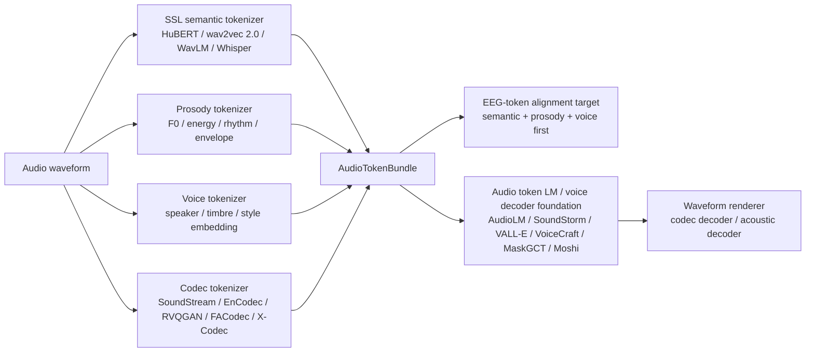

# Audio Decoder and Audio Token Foundation Roadmap（0512 重整版）

## 1. 研究口径

这份文档不再把 audio decoder 简单理解为最后一步的 waveform generator。对当前项目来说，更关键的问题是 audio 如何先被离散化、分层化，再成为 EEG token 的对齐目标。audio decoder 的位置因此被重新写成一条 token-first 链路：

```text
audio waveform
-> audio tokenizer / codec encoder
-> semantic / prosody / voice / codec tokens
-> EEG-token alignment target
-> audio token LM / voice decoder foundation model
-> waveform renderer
```

这个口径只保留 EEG 作为接口背景。V1 侧已经有 EEG token 和 voice token 的设计，这里关注 audio 侧：什么样的 audio token 值得被 EEG 对齐，什么样的 token 只适合留给后续 audio decoder 补全，哪些 foundation model 可以作为 V2/V3 的 decoder 参照。

严格按 CCF-A 收集会漏掉一些事实上的基础组件，例如 AudioLM、VALL-E、AudioPaLM、Moshi、SoundStream、EnCodec。文档因此采用两层标注：一层标出论文或系统的功能位置，另一层标出 status，包括 `CCF-A / Nature`、`journal / TASLP`、`industry or arXiv foundation reference`。这些 reference 的学术分量不同，但在 audio-token decoder 路线上承担的结构作用不同，不能简单用会议等级替代。

## 2. 总体框架




这张图的重点在左半边。audio waveform 先被拆成四类 token：semantic、prosody、voice、codec。EEG token 不直接对齐完整 codec residual token，也就是不把 full codec residual token 当作主要监督目标，因为低层 codec code 携带大量相位、细粒度谱纹理、录音条件和残差噪声；这些信息对 waveform fidelity 很重要，但通常不是非侵入式 EEG 能稳定恢复的神经信息。V2 更应该先证明 EEG token 能否对齐 semantic、prosody 和 voice token；V3 再把这些可解释 token 交给 audio token LM 或 codec decoder 补全波形。

## 3. Audio Token Bundle

V2 的 audio 侧最好形成一个统一的 `AudioTokenBundle`，而不是为每个 decoder 论文各写一套接口。

```text
AudioTokenBundle
  waveform_id
  sample_rate
  frame_times
  content_units        # HuBERT / wav2vec / Whisper / SpeechTokenizer semantic units
  prosody_tokens       # F0, energy, rhythm, envelope, voicing
  voice_tokens         # speaker, timbre, style, prompt-level voice identity
  codec_codes          # SoundStream / EnCodec / RVQGAN / FACodec / X-Codec codes
  codec_group_names
  valid_mask
  voiced_mask
```

这组 token 的用途并不相同。semantic token 更像内容标签，适合和 EEG content code 对齐；prosody token 更像连续语音动态，适合和 pitch、energy、rhythm head 对齐；voice token 更适合 retrieval 和 speaker / timbre alignment；codec token 则是 decoder 的物理接口。完整 codec stack 不应该被当成 EEG 的直接监督目标，尤其是 residual codebook。更稳妥的做法是只把 coarse codec、semantic codec 或 factorized codec 的可解释部分放入 alignment loss，把低层 residual 留给 decoder completion。

| Audio token 类别 | 主要来源 | 表达内容 | EEG alignment 角色 |
| --- | --- | --- | --- |
| semantic / content token | HuBERT, wav2vec 2.0, WavLM, Whisper, SpeechTokenizer | phoneme、syllable、word-like unit、speech content | content head、CTC/CE、contrastive semantic alignment |
| prosody token | F0, energy, duration, rhythm, envelope, voicing | pitch、intensity、speaking rate、stress、intonation | prosody head、F0/energy bin、temporal correlation |
| voice token | ECAPA, WavLM speaker embedding, FACodec timbre code, prompt encoder | speaker identity、timbre、style、vocal quality | speaker/voice retrieval、style/timbre contrastive loss |
| codec token | SoundStream, EnCodec, RVQGAN, FACodec, X-Codec, ESC | waveform reconstruction code、acoustic detail、residual detail | V3 decoder input；只把 coarse/factorized subset 作为 V2 alignment target |

## 4. Audio Tokenizer Foundation

这一层回答的问题是：不训练新 decoder 时，audio 可以先被投到什么 token 空间。这里的模型多数不是 TTS decoder，而是后续所有 voice decoder 的底层坐标系。

### wav2vec 2.0 - NeurIPS 2020

- **Status**：CCF-A。
- **Link**：[NeurIPS](https://proceedings.neurips.cc/paper/2020/hash/92d1e1eb1cd6f9fba3227870bb6d7f07-Abstract.html) | [PDF](https://proceedings.neurips.cc/paper_files/paper/2020/file/92d1e1eb1cd6f9fba3227870bb6d7f07-Paper.pdf)
- **位置**：speech SSL semantic representation。
- **价值**：wav2vec 2.0 不是 decoder，但它给出 raw speech 到 contextual speech representation 的基础路线。它的量化训练思想可以作为 audio semantic unit 和 EEG content token 对齐的早期参照。

### HuBERT - IEEE/ACM TASLP 2021

- **Status**：journal / TASLP。
- **Link**：[arXiv](https://arxiv.org/abs/2106.07447) | [IEEE](https://ieeexplore.ieee.org/document/9585401)
- **位置**：hidden-unit based semantic tokenizer。
- **价值**：HuBERT 用 offline clustering 提供 hidden-unit target，本质上已经把 speech content 离散成可预测单元。对 EEG alignment 来说，HuBERT units 比 full codec token 更接近可恢复的 phonetic / syllabic structure。

### WavLM - IEEE JSTSP 2022

- **Status**：journal / JSTSP。
- **Link**：[arXiv](https://arxiv.org/abs/2110.13900)
- **位置**：full-stack speech representation。
- **价值**：WavLM 不只服务 ASR，也常被用于 speaker、emotion、speech separation 等任务。它适合同时提供 content embedding 和 voice/speaker embedding 的候选空间。

### BEATs - ICML 2023

- **Status**：CCF-A。
- **Link**：[Microsoft Research](https://www.microsoft.com/en-us/research/publication/beats-audio-pre-training-with-acoustic-tokenizers/)
- **位置**：general audio acoustic tokenizer。
- **价值**：BEATs 的重要性在于它不把 audio tokenizer 限定在 speech。对于 OpenMIIR、MUSIN-G、MAD-EEG 这类 auditory proxy 数据，它提供了非语音声音 token 的思路。

### Whisper - ICML 2023

- **Status**：CCF-A。
- **Link**：[ICML](https://proceedings.mlr.press/v202/radford23a.html) | [PDF](https://cdn.openai.com/papers/whisper.pdf)
- **位置**：large-scale weakly supervised speech encoder。
- **价值**：Whisper 的强项是鲁棒 content 和 language signal。它不是 codec tokenizer，但可作为 content target、language control 或 alignment sanity check，尤其适合跨数据集 audio 质量不统一时使用。

### SpeechT5 - ACL 2022

- **Status**：CCF-A。
- **Link**：[ACL Anthology](https://aclanthology.org/2022.acl-long.393/) | [PDF](https://aclanthology.org/2022.acl-long.393.pdf)
- **位置**：speech/text shared interface。
- **价值**：SpeechT5 仍然值得保留，但它不应再被视为唯一的 bridge。它适合解释 speech/text shared latent space，而不是替代 audio codec token。

## 5. Neural Codec and Acoustic Token Layer

这一层回答的是 waveform 如何被压缩成可由 decoder 还原的 acoustic code。它们是 V3 waveform decoder 的基础，但其中只有部分 token 适合在 V2 直接和 EEG 对齐。

### SoundStream - IEEE/ACM TASLP 2022

- **Status**：journal / TASLP; industry foundation reference。
- **Link**：[arXiv](https://arxiv.org/abs/2107.03312) | [Google Research](https://research.google/blog/soundstream-an-end-to-end-neural-audio-codec/)
- **位置**：end-to-end neural audio codec。
- **价值**：SoundStream 把 audio compression 写成 encoder、RVQ、decoder 的统一系统。它是 AudioLM、SoundStorm 等路线背后的基础思想之一，也说明 codec token 可以成为 audio generation 的语言建模对象。

### EnCodec / High Fidelity Neural Audio Compression

- **Status**：journal / industry foundation reference。
- **Link**：[OpenReview](https://openreview.net/forum?id=ivCd8z8zR2) | [AudioCraft docs](https://facebookresearch.github.io/audiocraft/docs/ENCODEC.html)
- **位置**：neural codec backend。
- **价值**：EnCodec 是 VALL-E、VoiceCraft 等 neural codec LM 常见的 token backend。它对项目的价值不在于让 EEG 预测全部 codebook，而在于给 V3 提供可复用的 token-to-waveform renderer。

### SpeechTokenizer - arXiv 2023

- **Status**：industry / arXiv foundation reference。
- **Link**：[arXiv](https://arxiv.org/abs/2308.16692) | [GitHub](https://github.com/ZhangXInFD/SpeechTokenizer)
- **位置**：unified speech tokenizer。
- **价值**：SpeechTokenizer 明确区分 semantic token 和 acoustic token，并通过 RVQ 层级组织二者。这一点和 EEGVoiceTokenV1 的 grouped RVQ 很接近：前几层更适合对齐 content，后几层更适合交给 decoder 补全。

### X-Codec - AAAI 2025

- **Status**：CCF-A。
- **Link**：[arXiv](https://arxiv.org/abs/2408.17175) | [GitHub](https://github.com/zhenye234/xcodec)
- **位置**：semantic-enhanced neural codec。
- **价值**：X-Codec 把 HuBERT/WavLM 语义信息融入 codec quantization。它比普通 codec 更适合作为 EEG-to-audio 的桥，因为它降低了 semantic token 和 acoustic reconstruction token 之间的断裂。

### NaturalSpeech 3 / FACodec - ICML 2024

- **Status**：CCF-A。
- **Link**：[PMLR](https://proceedings.mlr.press/v235/ju24b.html) | [PDF](https://arxiv.org/pdf/2403.03100)
- **位置**：factorized speech codec。
- **价值**：FACodec 把 speech 拆为 content、prosody、timbre 和 acoustic detail。对当前项目，这是最重要的 codec 结构参照之一，因为它自然对应 EEG token 的 content / prosody / voice 分组。

### RVQGAN - NeurIPS 2023

- **Status**：CCF-A。
- **Link**：[NeurIPS](https://proceedings.neurips.cc/paper_files/paper/2023/hash/58d0e78cf042af5876e12661087bea12-Abstract.html) | [PDF](https://arxiv.org/pdf/2306.06546)
- **位置**：high-fidelity audio codec renderer。
- **价值**：RVQGAN 适合作为 high-fidelity waveform renderer 参考。它的 residual codebook 对重构很重要，但不宜全部作为 EEG supervision。

### ESC - EMNLP 2024

- **Status**：CCF-A。
- **Link**：[ACL Anthology](https://aclanthology.org/2024.emnlp-main.562/) | [PDF](https://aclanthology.org/2024.emnlp-main.562.pdf)
- **位置**：efficient speech codec。
- **价值**：ESC 关注低比特率高保真重建。对 EEG 项目来说，它说明在信息密度有限时，decoder 可以通过跨尺度结构补全声学细节。

## 6. Audio Token LM and Voice Decoder Foundation Models

这一层不再问 audio 如何被编码，而是问离散 token 如何被生成、补全、编辑和渲染。它是 V3 真正接 waveform decoder 时最重要的文献组。

### AudioLM - arXiv / Google Research 2022

- **Status**：industry / arXiv foundation reference。
- **Link**：[arXiv](https://arxiv.org/abs/2209.03143) | [Google Research](https://research.google/blog/audiolm-a-language-modeling-approach-to-audio-generation/)
- **位置**：semantic + acoustic token language modeling。
- **价值**：AudioLM 的核心贡献是把 audio generation 改写成 discrete token language modeling。它的 semantic-token-to-acoustic-token 结构正适合 V3：EEG 预测粗粒度 semantic/prosody/voice token，AudioLM-style decoder 再补齐 acoustic token。

### SoundStorm - arXiv / Google Research 2023

- **Status**：industry / arXiv foundation reference。
- **Link**：[arXiv](https://arxiv.org/abs/2305.09636)
- **位置**：parallel audio token generation。
- **价值**：SoundStorm 解决的是自回归 audio token 生成太慢的问题。若后续要做长语音或在线脑信号场景，它比纯 AR codec LM 更实际。

### VALL-E / VALL-E 2 - arXiv / Microsoft Research

- **Status**：industry / arXiv foundation reference。
- **Link**：[VALL-E](https://arxiv.org/abs/2301.02111) | [VALL-E 2](https://arxiv.org/abs/2406.05370)
- **位置**：neural codec language model for zero-shot TTS。
- **价值**：VALL-E 把 TTS 写成 neural codec token prediction，并用 acoustic prompt 控制 speaker。对当前项目，它是 `content token + voice prompt/token -> codec token` 的代表路线。

### Voicebox - NeurIPS 2023

- **Status**：CCF-A。
- **Link**：[NeurIPS](https://papers.nips.cc/paper_files/paper/2023/hash/2d8911db9ecedf866015091b28946e15-Abstract-Conference.html) | [PDF](https://proceedings.neurips.cc/paper_files/paper/2023/file/2d8911db9ecedf866015091b28946e15-Paper-Conference.pdf)
- **位置**：text-guided multilingual universal speech generation。
- **价值**：Voicebox 是更接近 foundation model 的 speech generator。它证明同一个模型可以做 speech infilling、editing、generation 和 multilingual transfer，对 V3 的 decoder controller 很有参考价值。

### VoiceCraft / VoiceCraft-X - ACL 2024 / EMNLP 2025

- **Status**：CCF-A。
- **Link**：[VoiceCraft ACL](https://aclanthology.org/2024.acl-long.673/) | [VoiceCraft-X EMNLP](https://aclanthology.org/2025.emnlp-main.137/)
- **位置**：codec token infilling and voice cloning。
- **价值**：VoiceCraft 系列适合承接不完整上游 token。EEG token 往往不会给出完整语音细节，因此 codec infilling 比端到端 waveform regression 更符合数据现实。

### AudioPaLM - arXiv / Google Research 2023

- **Status**：industry / arXiv foundation reference。
- **Link**：[arXiv](https://arxiv.org/abs/2306.12925)
- **位置**：speech-language foundation model that can speak and listen。
- **价值**：AudioPaLM 把 text LLM 和 speech token generation 融合起来。它不是第一版 decoder 的直接实现目标，但说明 audio token 可以进入更大的 language-model controller。

### Moshi + Mimi - arXiv / Kyutai 2024

- **Status**：industry / arXiv foundation reference。
- **Link**：[arXiv](https://arxiv.org/abs/2410.00037) | [GitHub](https://github.com/kyutai-labs/moshi)
- **位置**：real-time speech-text foundation model and streaming codec。
- **价值**：Moshi 使用 neural codec residual quantizer 的 speech token，并用 Mimi 做低延迟 streaming codec。它适合 V3/V4 讨论实时、交互式 voice decoder，而不是 V2 的静态 alignment。

### MaskGCT - arXiv 2024

- **Status**：industry / arXiv foundation reference。
- **Link**：[arXiv](https://arxiv.org/abs/2409.00750)
- **位置**：masked generative codec transformer。
- **价值**：MaskGCT 的两阶段结构非常适合当前路线：第一阶段生成 semantic token，第二阶段在 semantic token 条件下生成 acoustic token。它明确把语义和声学 token generation 拆开。

### E2 TTS / F5-TTS / Mega-TTS 2

- **Status**：industry / arXiv and CCF-A-adjacent foundation reference。
- **Link**：[E2 TTS](https://arxiv.org/abs/2406.18009) | [F5-TTS](https://arxiv.org/abs/2410.06885) | [Mega-TTS 2](https://arxiv.org/abs/2307.07218)
- **位置**：zero-shot / flow-matching voice decoder。
- **价值**：这组论文不应放在 V2 token alignment 主链路 P0，但适合 V3 比较不同 decoder family：codec LM、masked token generation、flow matching acoustic generation。它们对 prompt-based voice identity 和自然度很有参考价值。

### UniAudio / UniAudio 1.5 - ICML 2024 / ACM MM 2024

- **Status**：CCF-A。
- **Link**：[UniAudio PMLR](https://proceedings.mlr.press/v235/yang24x.html) | [UniAudio 1.5 ACM DL](https://dl.acm.org/doi/10.1145/3664647.3681078)
- **位置**：universal audio token generation。
- **价值**：UniAudio 证明 speech、sound、music、singing 可以放在统一 audio generation 框架下。对当前项目，它适合放在 auditory proxy 和跨声音类型泛化，而不是英文语音主链路的唯一 decoder。

### StreamSpeech - ACL 2024

- **Status**：CCF-A。
- **Link**：[ACL Anthology](https://aclanthology.org/2024.acl-long.485/)
- **位置**：streaming speech-to-speech token generation。
- **价值**：StreamSpeech 对在线链路有价值。若 V3 需要低延迟，它提供了 content path 和 unit path 分离的工程参照。

## 7. Voice Control and Acoustic Realization

这一层保留原文档中的 TTS / style / acoustic decoder 论文，但它们的位置需要下移：它们不是 audio token alignment 的起点，而是 token 已经存在后的声音实现层。

### StyleTTS 2 - NeurIPS 2023

- **Status**：CCF-A。
- **Link**：[NeurIPS](https://proceedings.neurips.cc/paper_files/paper/2023/hash/3eaad2a0b62b5ed7a2e66c2188bb1449-Abstract-Conference.html) | [PDF](https://arxiv.org/pdf/2306.07691)
- **位置**：style diffusion and voice control。
- **价值**：StyleTTS 2 对 timbre、style、prosody latent 的建模仍然重要，但它更适合 V3 的 voice control module，而不是 V2 的 audio token extractor。

### P-Flow - NeurIPS 2023

- **Status**：CCF-A。
- **Link**：[NeurIPS](https://proceedings.neurips.cc/paper_files/paper/2023/hash/eb0965da1d2cb3fbbbb8dbbad5fa0bfc-Abstract-Conference.html)
- **位置**：prompt-conditioned flow decoder。
- **价值**：P-Flow 说明 speaker prompt 可以通过 flow matching 进入 fast zero-shot TTS。它适合 `voice token / speaker prompt -> acoustic realization`。

### CoMoSpeech - ACM MM 2023

- **Status**：CCF-A。
- **Link**：[Project](https://comospeech.github.io/) | [PDF](https://arxiv.org/pdf/2305.06908)
- **位置**：consistency-based fast speech synthesis。
- **价值**：CoMoSpeech 的价值在生成速度。若早期只需要展示低延迟 demo，它比重型 diffusion 更容易作为 renderer 候选。

### DASpeech - NeurIPS 2023

- **Status**：CCF-A。
- **Link**：[NeurIPS](https://proceedings.neurips.cc/paper_files/paper/2023/hash/e5b1c0d4866f72393c522c8a00eed4eb-Abstract-Conference.html)
- **位置**：content-acoustic two-stage decoder。
- **价值**：DASpeech 的结构意义仍然很强：content path 和 acoustic path 应该分开。这一点与 EEG token 的 content / voice / prosody routing 一致。

## 8. Nature and High-Impact Boundary References

### SEAMLESSM4T / Joint speech and text machine translation for up to 100 languages - Nature 2025

- **Status**：Nature。
- **Link**：[Nature](https://www.nature.com/articles/s41586-024-08359-z)
- **位置**：speech-to-speech / speech-to-text / text-to-speech unified foundation model。
- **价值**：SEAMLESSM4T 是高影响 speech foundation system。它不是专门为 EEG 或 voice reconstruction 设计，但它展示了 speech input、text representation、speech output、multilingual transfer 和 text-free speech evaluation 如何统一到一个大系统里。V3/V4 可以参考它的 speech-to-speech system boundary 和 evaluation protocol。

### A neural speech decoding framework leveraging deep learning and speech synthesis - Nature Machine Intelligence 2024

- **Status**：Nature Machine Intelligence。
- **Link**：[Nature Machine Intelligence](https://www.nature.com/articles/s42256-024-00824-8)
- **位置**：neural decoding with speech synthesizer。
- **价值**：这篇不是 audio foundation 主线，也不应混入 audio tokenizer 表格的 P0。它适合作为边界参考：当 neural signal 数据不足时，可以先训练 speech auto-encoder / synthesizer，再把 neural decoder 对齐到可解释 speech parameters。

目前没有必要为了“Science”标签强行加入弱相关论文。对 audio decoder foundation 来说，Nature 2025 的 SEAMLESSM4T 比多数泛化的 multimodal foundation discussion 更贴近 speech-to-speech decoder。

## 9. V2 / V3 Roadmap

### V2: Audio Token Alignment，不做 waveform generation

V2 的目标是冻结或半冻结 audio tokenizer，把所有可用 audio 样本转成统一的 `AudioTokenBundle`，再让 EEG token 对齐其中可解释、可恢复的部分。

```text
EEG token q0-q1  <-> audio envelope / onset / broad auditory response
EEG token q2-q3  <-> HuBERT / wav2vec / Whisper / SpeechTokenizer semantic units
EEG token q4     <-> F0 / energy / rhythm / prosody token
EEG token q5-q6  <-> speaker / timbre / style / voice embedding
EEG token q7     <-> no audio alignment; residual nuisance only
```

训练目标可以从 retrieval 和 probe 开始：semantic unit prediction、F0/energy bin prediction、speaker retrieval、voice embedding contrastive alignment、coarse codec token sanity check。完整 waveform quality 不应成为 V2 指标。

### V3: Audio Token Completion and Decoder

V3 才进入真正的 audio decoder：

```text
EEG tokens
-> predicted semantic / prosody / voice tokens
-> audio token LM or voice decoder foundation model
-> codec / acoustic tokens
-> waveform renderer
```

这时 AudioLM、SoundStorm、VALL-E、VoiceCraft、MaskGCT、Moshi 才成为核心候选。V3 的关键不是让 EEG 预测所有 codec codes，而是让 EEG 提供足够好的 high-level conditions，再由 audio foundation decoder 完成 acoustic detail。

## 10. 优先级

| 优先级 | 论文 / 系统 | 主作用 | 为什么优先 |
| --- | --- | --- | --- |
| P0 | HuBERT | semantic content token | 最直接的离散 content target |
| P0 | wav2vec 2.0 | speech SSL representation | speech semantic alignment 基础 |
| P0 | Whisper | robust speech content encoder | 跨数据集音频质量不稳时更可靠 |
| P0 | SoundStream | neural codec foundation | codec token / waveform renderer 基础 |
| P0 | EnCodec | neural codec backend | VoiceCraft / VALL-E 类路线的常用 backend |
| P0 | NaturalSpeech 3 / FACodec | factorized codec | content / prosody / timbre / detail 拆分最贴近本项目 |
| P0 | X-Codec | semantic-enhanced codec | semantic token 和 acoustic code 的桥 |
| P0 | AudioLM | audio token LM | semantic + acoustic token generation 主线 |
| P0 | SoundStorm | parallel token generation | 长音频和在线 decoder 更实际 |
| P0 | VALL-E | prompt-based neural codec LM | content + voice prompt 到 codec token |
| P0 | Voicebox | speech generation foundation | CCF-A foundation voice generation 代表 |
| P0 | SEAMLESSM4T | speech-to-speech foundation system | Nature 级系统边界和 evaluation 参考 |
| P1 | SpeechTokenizer | unified speech tokenizer | 层级 RVQ 与 semantic/acoustic 分层 |
| P1 | VoiceCraft | codec token infilling | 不完整上游 token 的补全路线 |
| P1 | MaskGCT | semantic-to-acoustic token decoder | 两阶段 token generation 清晰 |
| P1 | WavLM | full-stack speech representation | speaker / content 双用途 |
| P1 | BEATs | general audio tokenizer | auditory proxy 和非语音声音 |
| P1 | Moshi + Mimi | real-time speech foundation | streaming codec token 和实时链路 |
| P2 | StyleTTS 2 / P-Flow / CoMoSpeech | voice control / fast renderer | V3 voice realization 候选 |
| P2 | E2 TTS / F5-TTS / Mega-TTS 2 | flow / prompt TTS | decoder family 对照 |
| P2 | DASpeech / StreamSpeech / UniAudio | two-stage / streaming / universal audio generation | 结构补充和 ablation |

## 11. 文献总表

| Paper / system | Status | Year | Primary role | Token type | 对项目的直接用途 | Link |
| --- | --- | --- | --- | --- | --- | --- |
| wav2vec 2.0 | NeurIPS | 2020 | semantic representation | semantic | content alignment baseline | [NeurIPS](https://proceedings.neurips.cc/paper/2020/hash/92d1e1eb1cd6f9fba3227870bb6d7f07-Abstract.html) |
| HuBERT | IEEE/ACM TASLP | 2021 | hidden-unit tokenizer | semantic | discrete content units | [arXiv](https://arxiv.org/abs/2106.07447) |
| WavLM | IEEE JSTSP | 2022 | full-stack speech SSL | semantic / voice | content + speaker features | [arXiv](https://arxiv.org/abs/2110.13900) |
| BEATs | ICML | 2023 | acoustic tokenizer | semantic / audio | auditory proxy token | [Microsoft](https://www.microsoft.com/en-us/research/publication/beats-audio-pre-training-with-acoustic-tokenizers/) |
| Whisper | ICML | 2023 | robust speech encoder | semantic | content/language target | [PMLR](https://proceedings.mlr.press/v202/radford23a.html) |
| SpeechT5 | ACL | 2022 | speech-text bridge | semantic | shared speech/text space | [ACL](https://aclanthology.org/2022.acl-long.393/) |
| SoundStream | IEEE/ACM TASLP | 2022 | neural codec | codec | codec token foundation | [arXiv](https://arxiv.org/abs/2107.03312) |
| EnCodec | journal / industry reference | 2023 | neural codec backend | codec | V3 renderer backend | [OpenReview](https://openreview.net/forum?id=ivCd8z8zR2) |
| SpeechTokenizer | arXiv reference | 2023 | unified speech tokenizer | semantic / codec | layered semantic-acoustic token | [arXiv](https://arxiv.org/abs/2308.16692) |
| X-Codec | AAAI | 2025 | semantic-enhanced codec | semantic / codec | semantic-to-codec bridge | [arXiv](https://arxiv.org/abs/2408.17175) |
| NaturalSpeech 3 / FACodec | ICML | 2024 | factorized codec | semantic / prosody / voice / codec | factorized alignment target | [PMLR](https://proceedings.mlr.press/v235/ju24b.html) |
| RVQGAN | NeurIPS | 2023 | high-fidelity codec | codec | waveform renderer | [NeurIPS](https://proceedings.neurips.cc/paper_files/paper/2023/hash/58d0e78cf042af5876e12661087bea12-Abstract.html) |
| ESC | EMNLP | 2024 | efficient speech codec | codec | low-bitrate renderer | [ACL](https://aclanthology.org/2024.emnlp-main.562/) |
| AudioLM | arXiv / Google | 2022 | audio token LM | semantic / codec | semantic-to-acoustic generation | [arXiv](https://arxiv.org/abs/2209.03143) |
| SoundStorm | arXiv / Google | 2023 | parallel token LM | codec | fast audio token completion | [arXiv](https://arxiv.org/abs/2305.09636) |
| VALL-E | arXiv / Microsoft | 2023 | neural codec LM | codec / voice | prompt-based voice decoder | [arXiv](https://arxiv.org/abs/2301.02111) |
| VALL-E 2 | arXiv / Microsoft | 2024 | neural codec LM | codec / voice | stronger zero-shot TTS reference | [arXiv](https://arxiv.org/abs/2406.05370) |
| Voicebox | NeurIPS | 2023 | universal speech generation | voice / codec | foundation voice generator | [NeurIPS](https://papers.nips.cc/paper_files/paper/2023/hash/2d8911db9ecedf866015091b28946e15-Abstract-Conference.html) |
| VoiceCraft | ACL | 2024 | codec token infilling | codec / voice | incomplete token completion | [ACL](https://aclanthology.org/2024.acl-long.673/) |
| VoiceCraft-X | EMNLP | 2025 | multilingual voice cloning | codec / voice | multilingual prompt decoder | [ACL](https://aclanthology.org/2025.emnlp-main.137/) |
| AudioPaLM | arXiv / Google | 2023 | speech-language foundation | semantic / codec | listen-and-speak controller | [arXiv](https://arxiv.org/abs/2306.12925) |
| Moshi + Mimi | arXiv / Kyutai | 2024 | real-time speech foundation | codec / voice | streaming decoder reference | [arXiv](https://arxiv.org/abs/2410.00037) |
| MaskGCT | arXiv reference | 2024 | masked codec transformer | semantic / codec | semantic-to-acoustic decoder | [arXiv](https://arxiv.org/abs/2409.00750) |
| E2 TTS | arXiv / Microsoft | 2024 | flow TTS | voice / acoustic | decoder family comparison | [arXiv](https://arxiv.org/abs/2406.18009) |
| F5-TTS | ACL / arXiv | 2025 | flow TTS | voice / acoustic | open voice decoder reference | [arXiv](https://arxiv.org/abs/2410.06885) |
| Mega-TTS 2 | arXiv reference | 2023 | zero-shot TTS prompt model | voice / prosody | prompt and timbre control | [arXiv](https://arxiv.org/abs/2307.07218) |
| UniAudio | ICML | 2024 | universal audio generation | codec / audio | multi-audio generation reference | [PMLR](https://proceedings.mlr.press/v235/yang24x.html) |
| UniAudio 1.5 | ACM MM | 2024 | LLM-driven codec decoder | codec | few-shot audio task learner | [ACM DL](https://dl.acm.org/doi/10.1145/3664647.3681078) |
| StreamSpeech | ACL | 2024 | streaming S2ST decoder | semantic / unit | online token path reference | [ACL](https://aclanthology.org/2024.acl-long.485/) |
| StyleTTS 2 | NeurIPS | 2023 | style diffusion | voice / prosody | voice control module | [NeurIPS](https://proceedings.neurips.cc/paper_files/paper/2023/hash/3eaad2a0b62b5ed7a2e66c2188bb1449-Abstract-Conference.html) |
| P-Flow | NeurIPS | 2023 | prompt-conditioned flow | voice / acoustic | fast zero-shot realization | [NeurIPS](https://proceedings.neurips.cc/paper_files/paper/2023/hash/eb0965da1d2cb3fbbbb8dbbad5fa0bfc-Abstract-Conference.html) |
| CoMoSpeech | ACM MM | 2023 | consistency synthesis | voice / acoustic | low-step renderer | [Project](https://comospeech.github.io/) |
| DASpeech | NeurIPS | 2023 | content-acoustic decoder | semantic / acoustic | two-stage decoder design | [NeurIPS](https://proceedings.neurips.cc/paper_files/paper/2023/hash/e5b1c0d4866f72393c522c8a00eed4eb-Abstract-Conference.html) |
| SEAMLESSM4T / Joint speech and text machine translation | Nature | 2025 | speech-to-speech foundation system | semantic / speech | system boundary and evaluation | [Nature](https://www.nature.com/articles/s41586-024-08359-z) |
| Neural speech decoding with speech synthesis | Nature Machine Intelligence | 2024 | neural decoding boundary reference | speech parameters | synthesizer-assisted decoding reference | [Nature](https://www.nature.com/articles/s42256-024-00824-8) |

## 12. 结论

V2 的核心不是把 EEG token 直接推到 waveform，而是建立一套可靠的 audio token target。audio token 至少要分成 semantic、prosody、voice 和 codec 四类；前三类是 EEG alignment 的主对象，codec token 是后续 decoder 的物理接口。完整 residual codec code 不应被当作 EEG 必须恢复的信息。

因此，当前 audio decoder roadmap 可以压成一句话：

```text
先把 audio 拆成可解释 token，
再让 EEG token 对齐 semantic / prosody / voice，
最后用 audio foundation decoder 补全 codec detail 并渲染 waveform。
```
