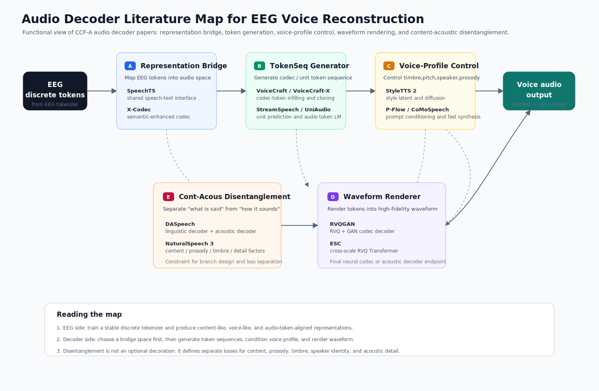
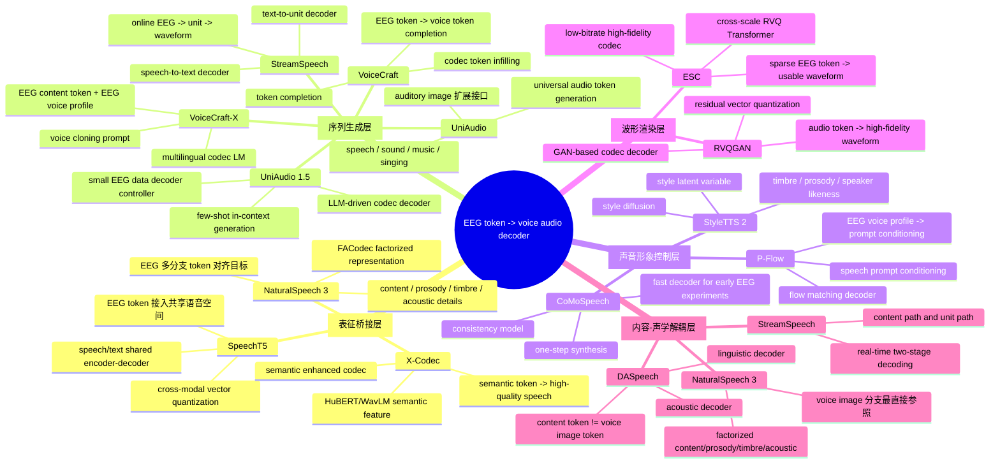

## CCF-A Audio Decoder 文献方法地图（0512）

## 1. 研究口径

- **主题范围**：speech/audio generation、neural codec decoder、acoustic decoder、speech-to-speech decoder、voice conversion decoder。
- **使用目标**：服务于 `EEG -> token -> voice representation -> audio decoder` 主链路。
- **筛选范围**：近五年 CCF-A 会议，主要覆盖 ACL、EMNLP、NeurIPS、ICML、AAAI、ACM MM。
- **组织原则**：不按论文平铺，也不按会议分类；按 audio decoder 在系统中的**功能位置**分类。

## 2. 总体框架

这批文献可以归纳成一个四层 decoder stack：

```text
EEG token
  |
  v
[A. 表征桥接层]
  把 EEG token 接到 speech/text/audio token 空间
  |
  v
[B. 序列生成层]
  生成或补全 codec token / unit token / acoustic token
  |
  v
[C. 声音形象控制层]
  注入 speaker / timbre / pitch / prosody / style
  |
  v
[D. 波形渲染层]
  token / acoustic feature -> high-fidelity waveform
```

对应到当前项目，audio decoder 不是一个单独模块，而是一组可组合部件：

| 层级               | 核心问题                           | 代表论文                                                       | 对 EEG 项目的位置                                         |
| ------------------ | ---------------------------------- | -------------------------------------------------------------- | --------------------------------------------------------- |
| A. 表征桥接层      | EEG token 要接到什么语音表征空间   | SpeechT5, X-Codec, NaturalSpeech 3                             | 定义 EEG token 与 audio token / semantic token 的对齐目标 |
| B. 序列生成层      | 给定 EEG 表征后如何生成 token 序列 | VoiceCraft, VoiceCraft-X, UniAudio, UniAudio 1.5, StreamSpeech | 做 token completion、token LM、few-shot audio generation  |
| C. 声音形象控制层  | 如何控制音色、音调、speaker、韵律  | StyleTTS 2, P-Flow, CoMoSpeech, NaturalSpeech 3                | 承接 voice image 分支                                     |
| D. 波形渲染层      | 如何从 token 还原高质量波形        | RVQGAN, ESC, CoMoSpeech                                        | 最后一步 waveform decoder / codec decoder                 |
| E. 内容-声学解耦层 | 如何把“说什么”和“怎么说”拆开   | DASpeech, StreamSpeech, NaturalSpeech 3, SpeechT5              | 让 EEG 内容表征与声音形象表征分开训练                     |

## 3. 文献到模型的思维导图





这张图的读法是：EEG 侧不直接承担完整波形生成，而是先产出可解释的 discrete token；audio 侧再按功能分层承接这些 token。`SpeechT5 / X-Codec / NaturalSpeech 3` 定义表征空间，`VoiceCraft / UniAudio` 负责 token 序列生成，`StyleTTS 2 / P-Flow / CoMoSpeech` 负责声音形象控制，`RVQGAN / ESC` 负责最终波形渲染，`DASpeech` 提供内容与声学实现分离的结构参照。

## 4. A 类：表征桥接层

**核心问题**：EEG token 不能直接变成波形，第一步要确定它进入哪种语音表征空间。这里的关键是 shared latent space、semantic token、audio token、factorized token。

### SpeechT5 — ACL 2022

- **链接**：[ACL Anthology](https://aclanthology.org/2022.acl-long.393/) | [PDF](https://aclanthology.org/2022.acl-long.393.pdf)
- **定位**：统一 speech/text 的 encoder-decoder 预训练框架。
- **核心方法**：shared encoder-decoder backbone；speech/text 共享预训练空间；cross-modal vector quantization 作为跨模态接口。
- **项目价值**：最适合定义 `EEG token` 的第一层语义角色：EEG 不直接回归声音，而是先对齐到可被语音 decoder 使用的共享中间空间。

### X-Codec — AAAI 2025

- **链接**：[arXiv](https://arxiv.org/abs/2408.17175) | [GitHub](https://github.com/zhenye234/xcodec) | [PDF](https://arxiv.org/pdf/2408.17175)
- **定位**：语义增强 neural codec。
- **核心方法**：RVQ 量化前融合 HuBERT/WavLM 语义特征；联合量化声学与语义；加入语义重建损失。
- **项目价值**：EEG 解出的 token 更可能先接近 semantic / phonetic representation，而不是完整声学细节。X-Codec 提供 `semantic token -> high-quality speech` 的桥接思路。

### NaturalSpeech 3 — ICML 2024

- **链接**：[PMLR](https://proceedings.mlr.press/v235/ju24b.html) | [PDF](https://arxiv.org/pdf/2403.03100)
- **定位**：factorized speech codec。
- **核心方法**：FACodec 将语音拆成 content、prosody、timbre、acoustic details 四个子空间，再用 factorized diffusion model 分别生成。
- **项目价值**：这是最适合当前 voice image 目标的表征拆分方式。EEG 侧可以分别学习内容 token、音高/韵律 token、音色 token，而不是把所有信息压进一个黑盒 embedding。

## 5. B 类：序列生成层

**核心问题**：EEG token 对齐到语音表征后，decoder 仍要生成一个连续 token 序列。这一类方法解决的是 token LM、token infilling、unit prediction、few-shot generation。

### VoiceCraft — ACL 2024

- **链接**：[ACL Anthology](https://aclanthology.org/2024.acl-long.673/) | [PDF](https://aclanthology.org/2024.acl-long.673.pdf)
- **定位**：codec token infilling language model。
- **核心方法**：Transformer decoder 在 neural codec token 空间中做 infilling 和生成；支持 zero-shot speech editing 与 TTS。
- **项目价值**：适合后续做 `EEG token -> voice token completion`。它比普通 TTS 更贴近“从不完整脑信号补出声音片段”的任务。

### VoiceCraft-X — EMNLP 2025

- **链接**：[ACL Anthology](https://aclanthology.org/2025.emnlp-main.137/) | [PDF](https://aclanthology.org/2025.emnlp-main.137.pdf)
- **定位**：多语言 voice cloning codec LM。
- **核心方法**：VoiceCraft 扩展到多语言场景；自回归 neural codec language model；voice cloning prompt 控制 speaker identity。
- **项目价值**：它说明 codec-token decoder 可以把语言内容和 speaker prompt 分开处理。这个结构可以迁移到 `EEG content token + EEG voice profile`。

### StreamSpeech — ACL 2024

- **链接**：[ACL Anthology](https://aclanthology.org/2024.acl-long.485/) | [PDF](https://aclanthology.org/2024.acl-long.485.pdf)
- **定位**：实时 speech-to-speech token generation。
- **核心方法**：两阶段结构，先自回归 speech-to-text decoder，再非自回归 text-to-unit decoder，最后用 unit vocoder 合成语音。
- **项目价值**：提供清楚的实时链路：`EEG -> content token -> unit token -> waveform`。如果后续关注在线 EEG decoding，这篇比离线 TTS 更有参考价值。

### UniAudio — ICML 2024

- **链接**：[PMLR](https://proceedings.mlr.press/v235/yang24x.html) | [PDF](https://arxiv.org/pdf/2310.00704)
- **定位**：universal audio token generation。
- **核心方法**：离散 tokenization；next-token prediction；统一 speech、sound、music、singing generation。
- **项目价值**：适合后期把 EEG token 从 speech 扩展到更广义 auditory / voice image 表征。

### UniAudio 1.5 — ACM MM 2024

- **链接**：[ACM DL](https://dl.acm.org/doi/10.1145/3664647.3681078) | [PDF](https://arxiv.org/pdf/2406.10056)
- **定位**：LLM-driven audio codec decoder。
- **核心方法**：用 LLM 驱动 audio codec decoder；few-shot in-context learning 适配多种 audio generation 任务。
- **项目价值**：EEG 数据量有限，few-shot decoder controller 比完全端到端训练更现实。它适合做 `EEG token -> prompt/context -> audio decoder` 的上层控制器。

## 6. C 类：声音形象控制层

**核心问题**：当前项目不是只恢复内容，而是恢复 voice image。这里的 decoder 必须能显式处理 speaker、timbre、pitch、prosody、style。

### StyleTTS 2 — NeurIPS 2023

- **链接**：[NeurIPS](https://proceedings.neurips.cc/paper_files/paper/2023/hash/3eaad2a0b62b5ed7a2e66c2188bb1449-Abstract-Conference.html) | [PDF](https://arxiv.org/pdf/2306.07691)
- **定位**：style diffusion decoder。
- **核心方法**：style latent variable；diffusion-based style modeling；结合 speech language model feature 的 adversarial training。
- **项目价值**：适合承接 `EEG token -> style / timbre / prosody branch`。它给的是声音形象建模方式，不只是 TTS pipeline。

### P-Flow — NeurIPS 2023

- **链接**：[NeurIPS](https://proceedings.neurips.cc/paper_files/paper/2023/hash/eb0965da1d2cb3fbbbb8dbbad5fa0bfc-Abstract-Conference.html) | [PDF](https://proceedings.neurips.cc/paper_files/paper/2023/file/eb0965da1d2cb3fbbbb8dbbad5fa0bfc-Paper-Conference.pdf)
- **定位**：prompt-conditioned flow decoder。
- **核心方法**：speech prompt 做 speaker adaptation；flow matching generative decoder；fast zero-shot TTS。
- **项目价值**：适合轻量路线：`EEG voice profile -> prompt conditioning -> acoustic decoder`。当 EEG 只能稳定恢复粗粒度声音形象时，这条路线更实用。

### CoMoSpeech — ACM MM 2023

- **链接**：[项目页](https://comospeech.github.io/) | [PDF](https://arxiv.org/pdf/2305.06908)
- **定位**：consistency-based fast synthesis decoder。
- **核心方法**：consistency model；one-step speech / singing synthesis；兼顾生成速度和质量。
- **项目价值**：对 EEG 早期实验有用，因为它强调快速合成和少步生成。慢 diffusion 在 EEG 小数据设定下通常不适合作为第一版 decoder。

## 7. D 类：波形渲染层

**核心问题**：不管上游是 semantic token、unit token 还是 voice profile，最后都需要一个稳定的 waveform renderer。这个层级关注 fidelity、bitrate、token rate、decoder 质量。

### RVQGAN — NeurIPS 2023

- **链接**：[NeurIPS](https://proceedings.neurips.cc/paper_files/paper/2023/hash/58d0e78cf042af5876e12661087bea12-Abstract.html) | [PDF](https://arxiv.org/pdf/2306.06546)
- **定位**：high-fidelity neural audio codec。
- **核心方法**：residual vector quantization；GAN-based decoder；高保真 codec 重建。
- **项目价值**：如果走 `EEG token -> audio token -> waveform` 主路径，这篇是最基础的 codec decoder 参考。

### ESC — EMNLP 2024

- **链接**：[ACL Anthology](https://aclanthology.org/2024.emnlp-main.562/) | [PDF](https://aclanthology.org/2024.emnlp-main.562.pdf)
- **定位**：efficient speech codec。
- **核心方法**：跨尺度 RVQ Transformer；decoder 侧跨尺度注意力融合；低比特率高保真重建。
- **项目价值**：EEG 侧可恢复的信息密度有限。ESC 的价值在于说明“少量 token 也能恢复可用语音质量”，适合作为低比特率 decoder 参考。

## 8. E 类：内容-声学解耦层

**核心问题**：EEG 中“听懂了什么”和“听到的声音形象是什么”很可能对应不同神经表征。decoder 侧也需要分层：content decoder 与 acoustic/style decoder 不应混在一起。

### DASpeech — NeurIPS 2023

- **链接**：[NeurIPS](https://proceedings.neurips.cc/paper_files/paper/2023/hash/e5b1c0d4866f72393c522c8a00eed4eb-Abstract-Conference.html) | [PDF](https://arxiv.org/pdf/2310.07403)
- **定位**：two-stage content/acoustic decoder。
- **核心方法**：先 linguistic decoder，再 acoustic decoder；directed acyclic transformer 提升速度。
- **项目价值**：可以直接映射到 `EEG -> content-like token / voice-like token -> acoustic decoder`。这是当前项目最该吸收的结构思想之一。

## 9. 方法演进主线

这批文献可以压成四条主线：

```text
1. 从文本条件到离散 token 条件
   SpeechT5 -> RVQGAN -> VoiceCraft -> UniAudio

2. 从内容生成到声音形象生成
   StyleTTS 2 -> P-Flow -> NaturalSpeech 3

3. 从单体 decoder 到分层 decoder
   DASpeech -> StreamSpeech -> NaturalSpeech 3

4. 从重型离线生成到可控/快速/少样本生成
   CoMoSpeech -> P-Flow -> UniAudio 1.5
```

## 10. 对当前模型的直接映射

```text
EEG encoder / tokenizer
  |
  v
discrete EEG tokens
  |
  |-- content alignment head
  |     -> SpeechT5 / DASpeech / StreamSpeech
  |
  |-- voice image alignment head
  |     -> StyleTTS 2 / NaturalSpeech 3 / P-Flow
  |
  |-- audio token prediction head
  |     -> VoiceCraft / UniAudio / X-Codec
  |
  v
waveform renderer
        -> RVQGAN / ESC / CoMoSpeech
```

## 11. 优先阅读顺序

| 优先级 | 论文            | 主作用                          | 阅读目的                                               |
| ------ | --------------- | ------------------------------- | ------------------------------------------------------ |
| P0     | SpeechT5        | 表征桥接                        | 理解 EEG token 应该接到什么共享空间                    |
| P0     | NaturalSpeech 3 | factorized voice representation | 学 content / prosody / timbre / acoustic detail 怎么拆 |
| P0     | VoiceCraft      | token sequence generation       | 学 codec-token infilling 与 voice token completion     |
| P0     | RVQGAN          | waveform renderer               | 学 token-to-waveform codec decoder                     |
| P0     | StyleTTS 2      | voice image control             | 学 style/prosody/speaker latent 怎么建模               |
| P1     | DASpeech        | content-acoustic 解耦           | 学两阶段 content -> acoustic decoder                   |
| P1     | X-Codec         | semantic codec                  | 学语义增强 codec token                                 |
| P1     | UniAudio 1.5    | few-shot decoder controller     | 学少样本 audio generation 控制                         |
| P2     | StreamSpeech    | streaming unit decoder          | 学实时 unit generation                                 |
| P2     | ESC             | efficient codec                 | 学低比特率重建                                         |
| P2     | P-Flow          | prompt-conditioned decoder      | 学轻量 speaker/style conditioning                      |
| P2     | CoMoSpeech      | fast synthesis                  | 学少步生成                                             |
| P2     | UniAudio        | universal audio generation      | 学多任务 audio token generation                        |
| P2     | VoiceCraft-X    | multilingual voice cloning      | 学多语言 voice cloning prompt                          |

## 12. 全部论文汇总

| 论文                                                                                                                              | 会议    | 年份 | 主归属          | 核心贡献                                         | PDF                                                                                                                  |
| --------------------------------------------------------------------------------------------------------------------------------- | ------- | ---- | --------------- | ------------------------------------------------ | -------------------------------------------------------------------------------------------------------------------- |
| SpeechT5: Unified-Modal Encoder-Decoder Pre-Training for Spoken Language Processing                                               | ACL     | 2022 | 表征桥接层      | speech/text 共享预训练空间，跨模态 VQ 接口       | [PDF](https://aclanthology.org/2022.acl-long.393.pdf)                                                                   |
| X-Codec: Learning a Unified Codec Representing Quantized Speech and Audio Semantics                                               | AAAI    | 2025 | 表征桥接层      | 语义增强 codec，解决内容信息不足                 | [PDF](https://arxiv.org/pdf/2408.17175)                                                                                 |
| NaturalSpeech 3: Zero-Shot Speech Synthesis with Factorized Codec and Diffusion Models                                            | ICML    | 2024 | 表征桥接层      | FACodec 四路解耦 content/prosody/timbre/acoustic | [PDF](https://arxiv.org/pdf/2403.03100)                                                                                 |
| VoiceCraft: Zero-Shot Speech Editing and Text-to-Speech in the Wild                                                               | ACL     | 2024 | 序列生成层      | codec token infilling，zero-shot editing         | [PDF](https://aclanthology.org/2024.acl-long.673.pdf)                                                                   |
| VoiceCraft-X: Multilingual Speech Editing and Voice Cloning                                                                       | EMNLP   | 2025 | 序列生成层      | 多语言 voice cloning，prompt 控制 speaker        | [PDF](https://aclanthology.org/2025.emnlp-main.137.pdf)                                                                 |
| StreamSpeech: Simultaneous Speech-to-Speech Translation with Multi-task Learning                                                  | ACL     | 2024 | 序列生成层      | 两阶段 S2ST，非自回归 unit decoder               | [PDF](https://aclanthology.org/2024.acl-long.485.pdf)                                                                   |
| UniAudio: Towards Universal Audio Generation with Large Language Models                                                           | ICML    | 2024 | 序列生成层      | 统一 speech/sound/music 生成                     | [PDF](https://arxiv.org/pdf/2310.00704)                                                                                 |
| UniAudio 1.5: Large Language Model-Driven Audio Codec Is a Few-Shot Audio Task Learner                                            | ACM MM  | 2024 | 序列生成层      | LLM-driven codec，few-shot 学习                  | [PDF](https://arxiv.org/pdf/2406.10056)                                                                                 |
| StyleTTS 2: Towards Human-Level Text-to-Speech through Style Diffusion and Adversarial Training with Large Speech Language Models | NeurIPS | 2023 | 声音形象控制层  | style diffusion，adversarial training            | [PDF](https://arxiv.org/pdf/2306.07691)                                                                                 |
| P-Flow: A Fast and Data-Efficient Zero-Shot TTS through Speech Prompting                                                          | NeurIPS | 2023 | 声音形象控制层  | flow matching，fast zero-shot TTS                | [PDF](https://proceedings.neurips.cc/paper_files/paper/2023/file/eb0965da1d2cb3fbbbb8dbbad5fa0bfc-Paper-Conference.pdf) |
| CoMoSpeech: One-Step Speech and Singing Voice Synthesis via Consistency Model                                                     | ACM MM  | 2023 | 声音形象控制层  | consistency model，one-step synthesis            | [PDF](https://arxiv.org/pdf/2305.06908)                                                                                 |
| High-Fidelity Audio Compression with Improved RVQGAN                                                                              | NeurIPS | 2023 | 波形渲染层      | RVQ + GAN decoder，高保真重建                    | [PDF](https://arxiv.org/pdf/2306.06546)                                                                                 |
| ESC: Efficient Speech Coding with Cross-Scale Residual Vector Quantized Transformers                                              | EMNLP   | 2024 | 波形渲染层      | 跨尺度 RVQ，低比特率高保真                       | [PDF](https://aclanthology.org/2024.emnlp-main.562.pdf)                                                                 |
| DASpeech: Directed Acyclic Transformer for Fast and High-quality Speech-to-Speech Translation                                     | NeurIPS | 2023 | 内容-声学解耦层 | 两阶段 linguistic + acoustic decoder             | [PDF](https://arxiv.org/pdf/2310.07403)                                                                                 |

## 13. 一句话结论

这份文献的总领分类不是“有哪些 decoder”，而是：

```text
先选 EEG token 要进入的表征空间，
再决定 token 序列如何生成，
再控制音色 / 音调 / speaker / prosody，
最后用 codec 或 acoustic decoder 渲染成波形。
```

因此当前模型路线应当保持分层：`EEG tokenizer` 负责稳定离散化，audio decoder 侧按 `表征桥接 -> 序列生成 -> 声音形象控制 -> 波形渲染` 组合。
