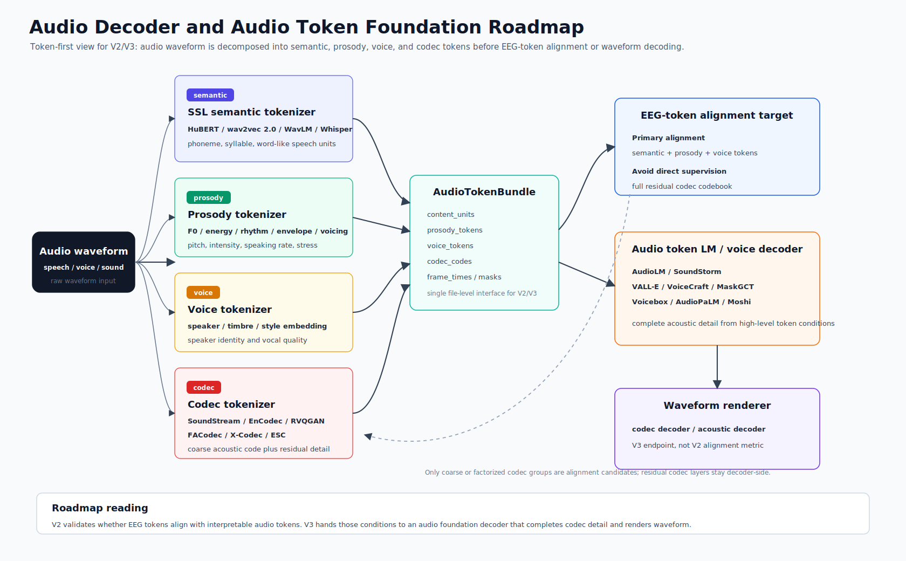
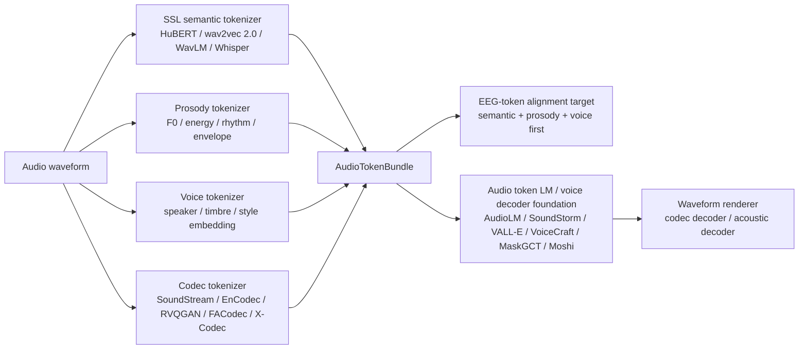

# Audio Decoder and Audio Token Foundation Roadmap（0520）

## 1. 研究视角

这份文档只讨论 audio 侧。EEG 和 voice token 已经在其他文档中展开，这里保留它们作为接口背景：audio waveform 先被转成一组可解释的离散或半离散 token，然后这些 token 才成为 EEG token 的对齐对象。真正的 waveform decoder 放在更后面，它并不是这条路线的起点。

```text
audio waveform
-> audio tokenizer / codec encoder
-> semantic / prosody / voice / codec tokens
-> EEG-token alignment target
-> audio token LM / voice decoder foundation model
-> waveform renderer
```

这个视角把问题从“选哪个 decoder”改成“先选什么 audio token 空间”。严格按 CCF-A 会议筛选会漏掉 AudioLM、VALL-E、AudioPaLM、Moshi、SoundStream、EnCodec 这类事实上的基础组件；但如果只看产业或 arXiv 系统，又容易忽略 Voicebox、NaturalSpeech 3、UniAudio、RVQGAN、DASpeech、SEAMLESSM4T 这些在结构和评估上更完整的论文。因此文档同时保留 venue/status 和功能位置，不把两者混为一谈。

## 2. 四类 audio token





audio waveform 在这里被拆成四个层面。semantic token 描述“说了什么”，prosody token 描述音高、能量、节奏和语调，voice token 描述说话人、音色和风格，codec token 则服务于波形重建。前三类更接近非侵入式 EEG 可能稳定捕获的声音结构，codec token 更接近 audio decoder 的工程接口。

这个区分很重要。完整 codec residual token，也就是 full codec residual token，携带大量相位、细粒度谱纹理、录音条件和残差细节。它们对高保真 waveform 很有用，但很难被 EEG 直接稳定恢复。V2 更合理的目标是让 EEG token 对齐 semantic、prosody 和 voice token；V3 再把这些高层条件交给 audio token LM 或 codec decoder 补齐声学细节。

| Audio token 类别 | 主要来源 | 表达内容 | 和 EEG token 的关系 |
| --- | --- | --- | --- |
| semantic / content token | HuBERT, wav2vec 2.0, WavLM, Whisper, SpeechTokenizer | phoneme、syllable、word-like unit、speech content | content head、CTC/CE、contrastive semantic alignment |
| prosody token | F0, energy, duration, rhythm, envelope, voicing | pitch、intensity、speaking rate、stress、intonation | prosody head、F0/energy bin、temporal correlation |
| voice token | ECAPA, WavLM speaker embedding, FACodec timbre code, prompt encoder | speaker identity、timbre、style、vocal quality | speaker/voice retrieval、style/timbre contrastive loss |
| codec token | SoundStream, EnCodec, RVQGAN, FACodec, X-Codec, ESC | waveform reconstruction code、acoustic detail、residual detail | V3 decoder input；V2 只取 coarse 或 factorized subset |

## 3. AudioTokenBundle

V2 可以把每段音频预处理成一个统一的 `AudioTokenBundle`。这个对象不是某个单一模型的输出，而是一个文件级接口，用来把不同 audio foundation model 的结果整理到同一时间轴上。

```text
AudioTokenBundle
  waveform_id
  sample_rate
  frame_times
  content_units        # HuBERT / wav2vec / Whisper / SpeechTokenizer semantic units
  prosody_tokens       # F0, energy, rhythm, envelope, voicing
  voice_tokens         # speaker, timbre, style, prompt-level voice identity
  codec_codes          # SoundStream / EnCodec / RVQGAN / FACodec / X-Codec codes
  codec_group_names
  valid_mask
  voiced_mask
```

semantic token 更像内容标签，prosody token 更像时间连续的声音动态，voice token 更像说话人和音色条件，codec token 则承担 decoder 侧的物理重建。这样组织之后，EEG alignment 可以先关注前面三类，codec code 只作为后续 decoder completion 的材料。

## 4. Audio Tokenizer Foundation

这一组文献构成 audio token 的底层坐标系。它们并不都生成声音，但决定了“音频被离散化成什么”。

| Paper / system | Status | Year | 主要位置 | 在本项目中的读法 |
| --- | --- | --- | --- | --- |
| wav2vec 2.0 | NeurIPS | 2020 | speech SSL representation | raw speech 到 contextual representation 的基础路线，量化训练思想可作为 semantic unit 参照 |
| HuBERT | IEEE/ACM TASLP | 2021 | hidden-unit tokenizer | hidden-unit prediction 天然适合作为离散 content target |
| WavLM | IEEE JSTSP | 2022 | full-stack speech representation | content、speaker、emotion、separation 等任务都可利用，适合同时给出 content 和 voice feature |
| BEATs | ICML | 2023 | general audio acoustic tokenizer | 非语音 auditory proxy 的 token 参照，补足 speech-only tokenizer 的范围 |
| Whisper | ICML | 2023 | robust weakly supervised speech encoder | 跨录音质量、跨语言、跨数据集时的 content/language sanity check |
| SpeechT5 | ACL | 2022 | speech-text shared interface | speech/text 共享空间的参照，不替代 neural codec token |

HuBERT 和 wav2vec 2.0 是最直接的 content token 起点。它们的输出不追求波形重建，而是保留 speech content 中可被下游任务利用的结构。Whisper 的地位稍微不同，它更像一个鲁棒的 speech encoder 和 language-aware reference；当数据集中的音频质量、语种和转录条件不统一时，Whisper 的特征可以作为内容侧的稳定参照。WavLM 则更靠近 voice/speaker 侧，因为它在多种 speech processing task 上都有较好的迁移性。

BEATs 值得单独保留。当前项目虽然以 speech/voice 为主，但数据池里有 OpenMIIR、MUSIN-G、MAD-EEG 等 auditory proxy。BEATs 的 acoustic tokenizer 思想为这些非语音声音提供了一条可比的 token 路线。

## 5. Neural Codec and Acoustic Token Layer

这一层把 waveform 压缩成可被 decoder 还原的 acoustic code。它们是 V3 waveform decoder 的基础，但不等于 V2 的直接监督目标。

| Paper / system | Status | Year | 主要位置 | 在本项目中的读法 |
| --- | --- | --- | --- | --- |
| SoundStream | IEEE/ACM TASLP | 2022 | end-to-end neural audio codec | encoder、RVQ、decoder 的完整 codec 原型，AudioLM / SoundStorm 路线的重要基础 |
| EnCodec | journal / industry reference | 2023 | neural codec backend | VALL-E、VoiceCraft 类 neural codec LM 常见 backend，适合做 V3 renderer |
| SpeechTokenizer | arXiv reference | 2023 | unified speech tokenizer | 把 semantic token 和 acoustic token 放进层级 RVQ，和 EEG grouped RVQ 思路接近 |
| X-Codec | AAAI | 2025 | semantic-enhanced neural codec | 把 HuBERT/WavLM 语义信息融入 codec quantization，降低 semantic 和 acoustic 之间的断裂 |
| NaturalSpeech 3 / FACodec | ICML | 2024 | factorized speech codec | content、prosody、timbre、acoustic detail 四路拆分，最贴近当前 alignment 目标 |
| RVQGAN | NeurIPS | 2023 | high-fidelity audio codec | 高保真 token-to-waveform renderer 参考 |
| ESC | EMNLP | 2024 | efficient speech codec | 低比特率高保真重建，说明有限 token 下仍可补齐声学细节 |

SoundStream 和 EnCodec 定义了现代 neural codec 的基本工程形态。它们的 codebook 可以驱动高质量重建，但 full residual codebook 不宜直接作为 EEG 的目标。SpeechTokenizer、X-Codec 和 NaturalSpeech 3 更接近当前项目的需求，因为它们在 codec 内部引入了语义或因子化结构。尤其是 FACodec，把 content、prosody、timbre 和 acoustic detail 拆开，几乎直接对应 EEG token 的 content/prosody/voice/residual 分组。

RVQGAN 和 ESC 更偏 renderer。它们说明 decoder 端如何从离散 code 恢复高质量 waveform，也说明低比特率场景下可以依赖 decoder 结构补齐细节，而不是把所有细节压给 EEG。

## 6. Audio Token LM and Voice Decoder Foundation Models

这一组文献把 audio generation 写成 token generation、token infilling 或 prompt-conditioned voice generation。它们是 V3 真正进入 waveform decoder 时的核心参考。

| Paper / system | Status | Year | 主要位置 | 在本项目中的读法 |
| --- | --- | --- | --- | --- |
| AudioLM | arXiv / Google | 2022 | semantic + acoustic token LM | 把 audio generation 改写成 semantic token 到 acoustic token 的语言建模 |
| SoundStorm | arXiv / Google | 2023 | parallel audio token generation | 非自回归或并行 token generation，适合长音频和低延迟场景 |
| VALL-E / VALL-E 2 | arXiv / Microsoft | 2023/2024 | neural codec LM zero-shot TTS | `content token + acoustic prompt` 到 codec token 的典型路线 |
| Voicebox | NeurIPS | 2023 | universal speech generation | speech infilling、editing、generation 和 multilingual transfer 的 foundation generator |
| VoiceCraft / VoiceCraft-X | ACL / EMNLP | 2024/2025 | codec token infilling and voice cloning | 适合承接不完整上游 token，和 EEG token 的不完备性匹配 |
| AudioPaLM | arXiv / Google | 2023 | listen-and-speak speech-language model | audio token 进入更大 language-model controller 的参考 |
| Moshi + Mimi | arXiv / Kyutai | 2024 | real-time speech-text foundation model | streaming codec token 和实时 spoken dialogue decoder |
| MaskGCT | arXiv reference | 2024 | masked generative codec transformer | 两阶段 semantic token 到 acoustic token 的清晰结构 |
| E2 TTS / F5-TTS / Mega-TTS 2 | arXiv / ACL-adjacent | 2023-2025 | zero-shot / flow-matching TTS | prompt voice、flow decoder、speaker similarity 的 decoder family 对照 |
| UniAudio / UniAudio 1.5 | ICML / ACM MM | 2024 | universal audio generation | speech、sound、music、singing 的统一 audio token generation |
| StreamSpeech | ACL | 2024 | streaming speech-to-speech token generation | online token path 和实时 unit decoder 的结构参照 |

AudioLM 是这条线的早期核心，因为它清楚地区分 semantic token 和 acoustic token。VALL-E 把这个想法推进到 zero-shot TTS，把 text/content condition 和 acoustic prompt 结合起来生成 neural codec code。VoiceCraft 更强调 codec token infilling，这一点和 EEG 场景很契合：EEG 侧很难给出完整声学细节，但可以提供内容、韵律或声音身份的部分条件。

Voicebox 更像 foundation generator，覆盖 speech generation、editing 和 multilingual transfer。AudioPaLM、Moshi 和 UniAudio 则把 audio token 放进更大的 multimodal 或 speech-language system 里。它们不一定是第一版 decoder 的实现目标，但很适合作为 V3/V4 的系统边界参照。

MaskGCT 的结构尤其值得保留。它先生成 semantic token，再在 semantic token 条件下生成 acoustic token。这种两阶段设计与当前项目的自然分工一致：EEG token 先提供高层声音结构，audio foundation decoder 再补全声学细节。

## 7. Voice Control and Acoustic Realization

StyleTTS 2、P-Flow、CoMoSpeech 和 DASpeech 在文档中被放在声音实现层，而不是 audio token extraction 的起点。它们描述的是 token 或 prompt 已经存在之后，模型如何控制音色、风格、韵律和声学实现。

| Paper / system | Status | Year | 主要位置 | 在本项目中的读法 |
| --- | --- | --- | --- | --- |
| StyleTTS 2 | NeurIPS | 2023 | style diffusion and voice control | timbre、style、prosody latent 的生成式建模 |
| P-Flow | NeurIPS | 2023 | prompt-conditioned flow decoder | speaker prompt 进入 fast zero-shot TTS 的路线 |
| CoMoSpeech | ACM MM | 2023 | consistency-based fast synthesis | 少步生成和低延迟 renderer 候选 |
| DASpeech | NeurIPS | 2023 | content-acoustic two-stage decoder | content path 和 acoustic path 分离的结构参照 |

这组文献不直接决定 audio token 的定义，但决定 token 如何被使用。DASpeech 的两阶段结构尤其有用，因为它把 linguistic decoder 和 acoustic decoder 分开，和 EEG token 的 content/voice/prosody 分工保持一致。

## 8. Nature and High-Impact Boundary References

SEAMLESSM4T / `Joint speech and text machine translation for up to 100 languages` 是目前最贴近 audio foundation system 的 Nature 级参考。它不是为 EEG reconstruction 设计的，但它把 speech-to-speech、speech-to-text、text-to-speech、text-to-text 和 ASR 放进同一个系统，并提供了大规模 multilingual speech evaluation 的范式。对 V3/V4 来说，它的意义在系统边界和评价协议，而不是某个单独模块。

`A neural speech decoding framework leveraging deep learning and speech synthesis` 发表在 Nature Machine Intelligence。它不属于 audio foundation 主线，但可以作为边界参考：在神经信号数据有限时，先训练 speech auto-encoder / synthesizer，再把 neural decoder 对齐到可解释 speech parameters，是一种现实的折中结构。

目前没有强行加入 Science 论文的必要。与其为了期刊标签放入弱相关文章，不如保留 SEAMLESSM4T 这类真正贴近 speech-to-speech decoder 的高影响工作。

## 9. V2 / V3 路线

V2 的中心是 audio token alignment，而不是 waveform generation。音频先被离线或半离线地转成 `AudioTokenBundle`，EEG token 再分别对齐其中可解释的部分。

```text
EEG token q0-q1  <-> audio envelope / onset / broad auditory response
EEG token q2-q3  <-> HuBERT / wav2vec / Whisper / SpeechTokenizer semantic units
EEG token q4     <-> F0 / energy / rhythm / prosody token
EEG token q5-q6  <-> speaker / timbre / style / voice embedding
EEG token q7     <-> no audio alignment; residual nuisance only
```

这一阶段的实验可以自然落在 semantic unit prediction、F0/energy bin prediction、speaker retrieval、voice embedding contrastive alignment 和 coarse codec token sanity check 上。waveform quality 暂时不作为主指标，因为它更容易反映 decoder 的能力，而不一定反映 EEG token 的质量。

V3 再进入 audio token completion 和 waveform decoding：

```text
EEG tokens
-> predicted semantic / prosody / voice tokens
-> audio token LM or voice decoder foundation model
-> codec / acoustic tokens
-> waveform renderer
```

在这个阶段，AudioLM、SoundStorm、VALL-E、VoiceCraft、MaskGCT、Moshi 和 Voicebox 才成为核心候选。EEG 侧提供高层条件，audio foundation decoder 负责补全 codec detail 和最终 waveform。

## 10. 优先级

| 优先级 | 论文 / 系统 | 主作用 | 读法 |
| --- | --- | --- | --- |
| P0 | HuBERT | semantic content token | 最直接的离散 content target |
| P0 | wav2vec 2.0 | speech SSL representation | speech semantic alignment 基础 |
| P0 | Whisper | robust speech content encoder | 跨数据集音频质量不稳时更可靠 |
| P0 | SoundStream | neural codec foundation | codec token / waveform renderer 基础 |
| P0 | EnCodec | neural codec backend | VoiceCraft / VALL-E 类路线的常用 backend |
| P0 | NaturalSpeech 3 / FACodec | factorized codec | content / prosody / timbre / detail 拆分最贴近本项目 |
| P0 | X-Codec | semantic-enhanced codec | semantic token 和 acoustic code 的桥 |
| P0 | AudioLM | audio token LM | semantic + acoustic token generation 主线 |
| P0 | SoundStorm | parallel token generation | 长音频和在线 decoder 更实际 |
| P0 | VALL-E | prompt-based neural codec LM | content + voice prompt 到 codec token |
| P0 | Voicebox | speech generation foundation | CCF-A foundation voice generation 代表 |
| P0 | SEAMLESSM4T | speech-to-speech foundation system | Nature 级系统边界和 evaluation 参考 |
| P1 | SpeechTokenizer | unified speech tokenizer | 层级 RVQ 与 semantic/acoustic 分层 |
| P1 | VoiceCraft | codec token infilling | 不完整上游 token 的补全路线 |
| P1 | MaskGCT | semantic-to-acoustic token decoder | 两阶段 token generation 清晰 |
| P1 | WavLM | full-stack speech representation | speaker / content 双用途 |
| P1 | BEATs | general audio tokenizer | auditory proxy 和非语音声音 |
| P1 | Moshi + Mimi | real-time speech foundation | streaming codec token 和实时链路 |
| P2 | StyleTTS 2 / P-Flow / CoMoSpeech | voice control / fast renderer | V3 voice realization 候选 |
| P2 | E2 TTS / F5-TTS / Mega-TTS 2 | flow / prompt TTS | decoder family 对照 |
| P2 | DASpeech / StreamSpeech / UniAudio | two-stage / streaming / universal audio generation | 结构补充和 ablation |

## 11. 文献总表

| Paper / system | Status | Year | Primary role | Token type | 直接用途 | Link |
| --- | --- | --- | --- | --- | --- | --- |
| wav2vec 2.0 | NeurIPS | 2020 | semantic representation | semantic | content alignment baseline | [NeurIPS](https://proceedings.neurips.cc/paper/2020/hash/92d1e1eb1cd6f9fba3227870bb6d7f07-Abstract.html) |
| HuBERT | IEEE/ACM TASLP | 2021 | hidden-unit tokenizer | semantic | discrete content units | [arXiv](https://arxiv.org/abs/2106.07447) |
| WavLM | IEEE JSTSP | 2022 | full-stack speech SSL | semantic / voice | content + speaker features | [arXiv](https://arxiv.org/abs/2110.13900) |
| BEATs | ICML | 2023 | acoustic tokenizer | semantic / audio | auditory proxy token | [Microsoft](https://www.microsoft.com/en-us/research/publication/beats-audio-pre-training-with-acoustic-tokenizers/) |
| Whisper | ICML | 2023 | robust speech encoder | semantic | content/language target | [PMLR](https://proceedings.mlr.press/v202/radford23a.html) |
| SpeechT5 | ACL | 2022 | speech-text bridge | semantic | shared speech/text space | [ACL](https://aclanthology.org/2022.acl-long.393/) |
| SoundStream | IEEE/ACM TASLP | 2022 | neural codec | codec | codec token foundation | [arXiv](https://arxiv.org/abs/2107.03312) |
| EnCodec | journal / industry reference | 2023 | neural codec backend | codec | V3 renderer backend | [OpenReview](https://openreview.net/forum?id=ivCd8z8zR2) |
| SpeechTokenizer | arXiv reference | 2023 | unified speech tokenizer | semantic / codec | layered semantic-acoustic token | [arXiv](https://arxiv.org/abs/2308.16692) |
| X-Codec | AAAI | 2025 | semantic-enhanced codec | semantic / codec | semantic-to-codec bridge | [arXiv](https://arxiv.org/abs/2408.17175) |
| NaturalSpeech 3 / FACodec | ICML | 2024 | factorized codec | semantic / prosody / voice / codec | factorized alignment target | [PMLR](https://proceedings.mlr.press/v235/ju24b.html) |
| RVQGAN | NeurIPS | 2023 | high-fidelity codec | codec | waveform renderer | [NeurIPS](https://proceedings.neurips.cc/paper_files/paper/2023/hash/58d0e78cf042af5876e12661087bea12-Abstract.html) |
| ESC | EMNLP | 2024 | efficient speech codec | codec | low-bitrate renderer | [ACL](https://aclanthology.org/2024.emnlp-main.562/) |
| AudioLM | arXiv / Google | 2022 | audio token LM | semantic / codec | semantic-to-acoustic generation | [arXiv](https://arxiv.org/abs/2209.03143) |
| SoundStorm | arXiv / Google | 2023 | parallel token LM | codec | fast audio token completion | [arXiv](https://arxiv.org/abs/2305.09636) |
| VALL-E | arXiv / Microsoft | 2023 | neural codec LM | codec / voice | prompt-based voice decoder | [arXiv](https://arxiv.org/abs/2301.02111) |
| VALL-E 2 | arXiv / Microsoft | 2024 | neural codec LM | codec / voice | stronger zero-shot TTS reference | [arXiv](https://arxiv.org/abs/2406.05370) |
| Voicebox | NeurIPS | 2023 | universal speech generation | voice / codec | foundation voice generator | [NeurIPS](https://papers.nips.cc/paper_files/paper/2023/hash/2d8911db9ecedf866015091b28946e15-Abstract-Conference.html) |
| VoiceCraft | ACL | 2024 | codec token infilling | codec / voice | incomplete token completion | [ACL](https://aclanthology.org/2024.acl-long.673/) |
| VoiceCraft-X | EMNLP | 2025 | multilingual voice cloning | codec / voice | multilingual prompt decoder | [ACL](https://aclanthology.org/2025.emnlp-main.137/) |
| AudioPaLM | arXiv / Google | 2023 | speech-language foundation | semantic / codec | listen-and-speak controller | [arXiv](https://arxiv.org/abs/2306.12925) |
| Moshi + Mimi | arXiv / Kyutai | 2024 | real-time speech foundation | codec / voice | streaming decoder reference | [arXiv](https://arxiv.org/abs/2410.00037) |
| MaskGCT | arXiv reference | 2024 | masked codec transformer | semantic / codec | semantic-to-acoustic decoder | [arXiv](https://arxiv.org/abs/2409.00750) |
| E2 TTS | arXiv / Microsoft | 2024 | flow TTS | voice / acoustic | decoder family comparison | [arXiv](https://arxiv.org/abs/2406.18009) |
| F5-TTS | ACL / arXiv | 2025 | flow TTS | voice / acoustic | open voice decoder reference | [arXiv](https://arxiv.org/abs/2410.06885) |
| Mega-TTS 2 | arXiv reference | 2023 | zero-shot TTS prompt model | voice / prosody | prompt and timbre control | [arXiv](https://arxiv.org/abs/2307.07218) |
| UniAudio | ICML | 2024 | universal audio generation | codec / audio | multi-audio generation reference | [PMLR](https://proceedings.mlr.press/v235/yang24x.html) |
| UniAudio 1.5 | ACM MM | 2024 | LLM-driven codec decoder | codec | few-shot audio task learner | [ACM DL](https://dl.acm.org/doi/10.1145/3664647.3681078) |
| StreamSpeech | ACL | 2024 | streaming S2ST decoder | semantic / unit | online token path reference | [ACL](https://aclanthology.org/2024.acl-long.485/) |
| StyleTTS 2 | NeurIPS | 2023 | style diffusion | voice / prosody | voice control module | [NeurIPS](https://proceedings.neurips.cc/paper_files/paper/2023/hash/3eaad2a0b62b5ed7a2e66c2188bb1449-Abstract-Conference.html) |
| P-Flow | NeurIPS | 2023 | prompt-conditioned flow | voice / acoustic | fast zero-shot realization | [NeurIPS](https://proceedings.neurips.cc/paper_files/paper/2023/hash/eb0965da1d2cb3fbbbb8dbbad5fa0bfc-Abstract-Conference.html) |
| CoMoSpeech | ACM MM | 2023 | consistency synthesis | voice / acoustic | low-step renderer | [Project](https://comospeech.github.io/) |
| DASpeech | NeurIPS | 2023 | content-acoustic decoder | semantic / acoustic | two-stage decoder design | [NeurIPS](https://proceedings.neurips.cc/paper_files/paper/2023/hash/e5b1c0d4866f72393c522c8a00eed4eb-Abstract-Conference.html) |
| SEAMLESSM4T / Joint speech and text machine translation | Nature | 2025 | speech-to-speech foundation system | semantic / speech | system boundary and evaluation | [Nature](https://www.nature.com/articles/s41586-024-08359-z) |
| Neural speech decoding with speech synthesis | Nature Machine Intelligence | 2024 | neural decoding boundary reference | speech parameters | synthesizer-assisted decoding reference | [Nature](https://www.nature.com/articles/s42256-024-00824-8) |

## 12. 结论

audio decoder 的第一步不是直接追求 waveform，而是先建立一套稳定的 audio token target。semantic、prosody 和 voice token 描述 EEG 更可能恢复的高层声音结构；codec token 描述 decoder 端补齐波形所需的声学细节。把这两部分分开，V2 的 alignment 结果才容易解释，V3 的 waveform decoder 也有清晰的输入边界。

这条路线可以概括为：

```text
audio 先被拆成可解释 token，
EEG token 对齐 semantic / prosody / voice，
audio foundation decoder 再补全 codec detail 并渲染 waveform。
```
