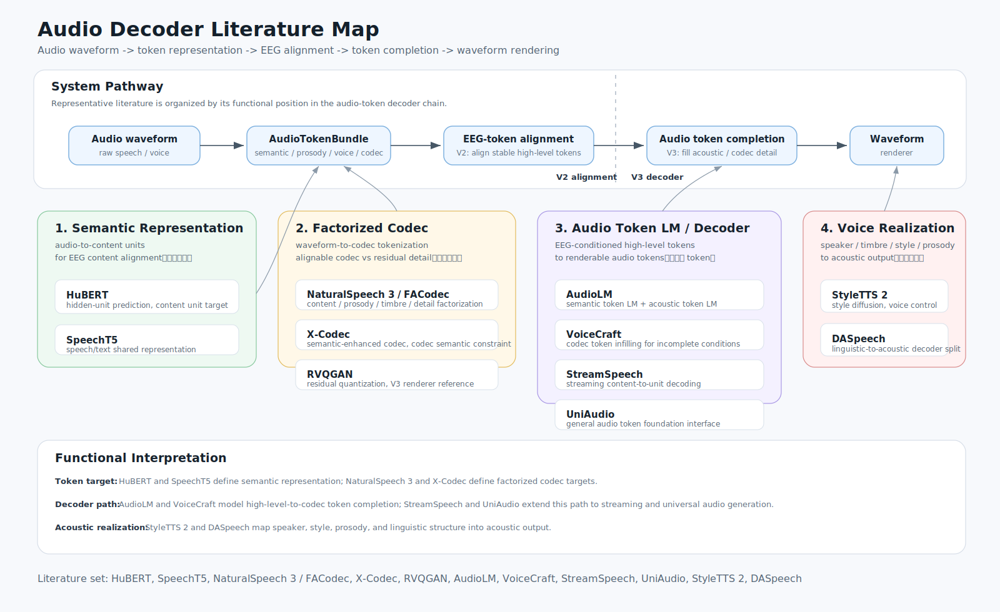

# Audio Decoder 文献阅读路线（0520）

这份阅读路线只针对本地目录 `paper-ref/audio-decoder/`。目录已经加入 `.gitignore`，其中的 PDF、HTML snapshot 和 BibTeX 不进入版本库；本文档只保留阅读结构和研究判断。

当前本地文献池包含 20 篇 PDF、7 个网页 snapshot 和一个 `audio-decoder.bib`。这批文献的覆盖面比较完整：一端是 HuBERT、wav2vec 2.0、WavLM、Whisper、BEATs 这类 audio representation / tokenizer，另一端是 AudioLM、VoiceCraft、UniAudio、NaturalSpeech 3、X-Codec 这类 audio token LM 和 decoder。对本项目来说，关键不是把所有论文平均读完，而是尽快建立一条清楚的链路：

```text
audio waveform
-> semantic / prosody / voice / codec tokens
-> EEG token alignment target
-> audio token completion
-> waveform decoder
```

## 一张阅读思维导图



这张图保存为静态 SVG，不依赖 Mermaid 渲染。阅读时先看中间的主链路，再看左右两侧的支撑论文；带“精读”标签的五篇就是第一轮需要认真读的核心文献。

## 只精读五篇

如果只精读五篇，推荐顺序如下。它不是按论文名气排序，而是按“能不能直接帮助定义 EEG-token 对齐目标和 V3 decoder 接口”排序。

| 顺序 | 精读论文 | 本地文件 | 精读原因 | 读完后应该回答的问题 |
| --- | --- | --- | --- | --- |
| 1 | HuBERT: Self-Supervised Speech Representation Learning by Masked Prediction of Hidden Units | `paper-ref/audio-decoder/files/6502/...HuBERT...pdf` | 它是最干净的 semantic/content token 起点。EEG 侧最先需要稳定对齐的是“听到/想象/说出的语音单位”，不是波形细节。 | hidden unit 是怎么来的？unit rate 如何和 EEG window 对齐？它能否作为 q2-q3 content code 的监督目标？ |
| 2 | NaturalSpeech 3: Zero-Shot Speech Synthesis with Factorized Codec and Diffusion Models | `paper-ref/audio-decoder/files/6484/...NaturalSpeech 3...pdf` | 它把 speech factorize 成 content、prosody、timbre、acoustic detail，几乎正好对应本项目的 content / pitch / timbre / speaker / residual 分组。 | factorized codec 怎样拆分属性？哪些 token 可以给 EEG 对齐，哪些只应留给 decoder？ |
| 3 | Codec Does Matter / X-Codec | `paper-ref/audio-decoder/files/6478/...Codec Does Matter...pdf` | 它直接说明普通 acoustic codec 会丢 semantic consistency。这个结论决定了 V2 不能把 full codec residual token 当作主监督。 | codec token 为什么会产生语义错误？semantic reconstruction loss 如何修正？本项目是否需要 semantic-enhanced codec 作为 audio target？ |
| 4 | AudioLM: A Language Modeling Approach to Audio Generation | `paper-ref/audio-decoder/files/6516/...AudioLM...pdf` | 它把 audio generation 明确写成 semantic token + acoustic token 的语言建模，是 V3 decoder roadmap 的骨架。 | semantic token 和 acoustic token 如何分工？prompt continuation 如何保留 speaker / prosody？EEG 预测的 token 应该接到哪一层？ |
| 5 | VoiceCraft: Zero-Shot Speech Editing and Text-to-Speech in the Wild | `paper-ref/audio-decoder/files/6456/...VoiceCraft...pdf` | 它的 token infilling 思路很适合 EEG 场景：EEG 不会给出完整 codec 序列，只会给出不完整、高层、带噪的条件。 | delayed stacking / causal masking 如何做 infilling？如果 EEG 只给 semantic/prosody/voice 条件，decoder 怎样补齐剩余 codec token？ |

这五篇合起来刚好覆盖一条最小闭环：HuBERT 定义 content token，NaturalSpeech 3 定义 factorized voice/prosody/acoustic token，X-Codec 解释为什么 codec 必须带 semantic 约束，AudioLM 给出 token LM 的生成范式，VoiceCraft 给出不完整 token 条件下的 decoder 形式。读完这五篇，V2/V3 的核心接口基本就能落地。

## 先不精读的论文

这些论文不是不重要，而是第一轮不需要花同等时间。它们更适合作为补充、对照或后续专项阅读。

| 论文 | 第一轮读法 | 什么时候升级为精读 |
| --- | --- | --- |
| wav2vec 2.0 | 读 abstract、method overview、quantization / contrastive objective。它是 HuBERT 的前置背景。 | 如果要比较 HuBERT unit 和 wav2vec feature 哪个更适合作为 content target。 |
| WavLM | 读摘要和 SUPERB/task coverage。它对 speaker、emotion、denoising 更有价值。 | 如果 voice / speaker retrieval 成为下一轮主实验，就把 WavLM 升级为精读。 |
| Whisper | 读大规模弱监督和 robustness 部分即可。 | 如果需要跨数据集 transcript sanity check，或英文/多语种内容标签质量不稳。 |
| BEATs | 读 acoustic tokenizer 的思路。 | 如果 OpenMIIR、MUSIN-G、MAD-EEG 这类 auditory proxy 要进入 audio-token 预训练。 |
| SpeechT5 | 读 cross-modal vector quantization 和 speech-text shared space。 | 如果要把 text token 作为 EEG/audio token 的中间桥。 |
| RVQGAN / ESC | 看 codec architecture、code rate、reconstruction metric。 | 如果开始选 V3 waveform renderer，或需要比较 codec bitrate 与音质。 |
| StyleTTS 2 / P-Flow / CoMoSpeech | 看 voice prompt、style diffusion、flow / consistency decoding。 | 如果 V3 要做具体 TTS decoder 或评估 speaker similarity / style controllability。 |
| UniAudio / UniAudio 1.5 | 看系统规模、任务统一方式、LLM-codec 思路。 | 如果后面想把 audio token 交给更大的 multimodal LLM controller。 |
| DASpeech / StreamSpeech | 看两阶段、流式、speech-to-speech 的结构。 | 如果实验目标转向 streaming EEG-to-speech 或 online decoding。 |
| VoiceCraft-X | 在 VoiceCraft 之后读。它主要补 multilingual 和 phoneme-free text processing。 | 如果跨语言数据正式进入 V3/V4 主实验。 |

## 五篇精读的具体读法

### 1. HuBERT

HuBERT 要读得很具体。重点不是它在 ASR benchmark 上超过谁，而是它怎样把连续 speech waveform 变成 hidden unit target。第一遍读 introduction 和 method，弄清楚 offline clustering、masked prediction 和 iterative refinement；第二遍读 feature rate、cluster 数量、pretraining target 和 fine-tuning setup；第三遍只看它和 wav2vec 2.0 的差异。

读完以后，应该能写出一个本项目接口判断：`audio.content_units = HuBERT(kmeans_id, frame_time)` 是否能作为 EEG q2-q3 的主监督。如果答案是可以，下一步就是定义 unit rate、EEG window、CTC/CE loss 和 temporal tolerance。

### 2. NaturalSpeech 3

NaturalSpeech 3 要围绕 FACodec / factorized codec 读。它最有价值的地方不是 zero-shot TTS 分数，而是把 speech 拆成 content、prosody、timbre 和 acoustic detail。这个拆分直接影响 EEGVoiceTokenV1/V2 的 token 分组：content 对 q2-q3，prosody 对 q4，timbre/speaker 对 q5-q6，acoustic detail 更接近 q7 或 decoder-only residual。

读这篇时要特别标出每个 factor 的输入、监督、采样率、是否离散、是否可被 prompt 控制。对本项目来说，最佳结果不是“复现 NaturalSpeech 3”，而是借它的 factorization 设计来定义 `AudioTokenBundle`。

### 3. Codec Does Matter / X-Codec

这篇应该和 NaturalSpeech 3 连着读。NaturalSpeech 3 告诉我们 codec 可以 factorize，X-Codec 进一步说明普通 codec 作为 audio language model token 会有 semantic shortcoming。这个结论对 EEG 研究很关键：如果 full codec token 自身就不稳定地表达内容，EEG 去预测它只会把任务变成噪声拟合。

精读时只抓三件事：普通 codec 的语义失败是什么，X-Codec 如何引入 semantic encoder 和 semantic reconstruction loss，改进是体现在 WER/content accuracy 还是单纯 MOS。读完以后，应该把 V2 的原则写死：EEG 优先对齐 semantic / prosody / voice token，不直接对齐 full residual codec token。

### 4. AudioLM

AudioLM 是 decoder roadmap 的骨架。它把 audio generation 写成 token language modeling，并且明确区分 long-term semantic token 和 low-level acoustic token。它的价值不在于我们马上训练一个 AudioLM，而在于它给出 V3 的系统分工：EEG 侧提供高层 token，audio LM 补全时间结构和 acoustic token，codec decoder 渲染 waveform。

读这篇时要画出 semantic token LM、coarse acoustic token LM、fine acoustic token LM 的层级关系。尤其要看 prompt continuation 如何保留 speaker identity 和 prosody，因为这对应本项目的 voice/speaker retrieval 与 voice-image foundation。

### 5. VoiceCraft

VoiceCraft 是五篇里最接近最终 decoder 接口的一篇。EEG token 的现实形态一定是不完整、有噪、低带宽的；VoiceCraft 的 token infilling 和 speech editing 正好可以作为“不完整条件 -> 完整 codec/audio”的参考。

精读时要看 token rearrangement、causal masking、delayed stacking 和任务格式。重点问题是：如果输入不是 text + clean audio prompt，而是 EEG 预测出的 semantic/prosody/voice token，decoder 需要怎样的 adapter 才能接入 VoiceCraft 类模型。VoiceCraft-X 可以作为 VoiceCraft 的跨语言扩展，在第一轮不必同等精读。

## 阅读顺序

建议按下面顺序读，不要按年份读。

| 阶段 | 读什么 | 目标 |
| --- | --- | --- |
| 第 1 轮 | HuBERT | 定义 content unit 和时间对齐方式。 |
| 第 2 轮 | NaturalSpeech 3 | 定义 factorized token space，确认 content/prosody/timbre/acoustic detail 的分工。 |
| 第 3 轮 | X-Codec | 确认普通 codec 的 semantic failure，避免把 residual codec token 误当成 EEG 主目标。 |
| 第 4 轮 | AudioLM | 建立 semantic-to-acoustic token LM 的 V3 路线。 |
| 第 5 轮 | VoiceCraft | 建立 incomplete/noisy upstream token 到 decoder completion 的实现参照。 |

每篇读两遍就够。第一遍只回答“它在整条链路里占什么位置”；第二遍才读 architecture、loss、token rate、evaluation。不要一开始就陷入所有实验表格，否则会丢掉本项目真正需要的接口信息。

## 每篇论文的笔记模板

```text
Paper:
Local file:

1. 它定义了什么 token 或 latent?
2. token 是离散、连续，还是混合?
3. token rate / frame rate 是多少?
4. 是否区分 content / prosody / voice / codec detail?
5. 训练目标是什么?
6. 评估指标是否能迁移到 EEG-token alignment?
7. 如果接入本项目，应该作为:
   - audio target
   - decoder backend
   - evaluation reference
   - ablation baseline
8. 它不适合直接借用的地方是什么?
```

## 对本项目的直接结论

这批文献支持一个相对清楚的路线：V2 不应直接做 waveform generation，也不应把 full codec residual token 当作 EEG 的主监督。更稳的做法是先把每段音频离线转成 `AudioTokenBundle`，其中 content 用 HuBERT / Whisper / SpeechTokenizer 这类 semantic unit，prosody 用 F0、energy、rhythm、duration，voice 用 WavLM speaker feature 或 factorized codec 的 timbre code，codec detail 只留给 V3 decoder。

V3 才进入 audio token completion。AudioLM 给出 semantic-to-acoustic token LM 的框架，VoiceCraft 给出不完整 codec token infilling 的工程形式，NaturalSpeech 3 / X-Codec 给出更适合 EEG 对齐的 factorized codec target。这样设计之后，EEG 模型的评估可以先落在 content accuracy、prosody correlation、speaker retrieval、voice embedding retrieval 和 token-to-token alignment 上；waveform MOS、speaker similarity MOS 和 naturalness 只在 decoder 阶段出现。

本地文件夹还缺少几篇很值得后续补齐的基础参考：SoundStream、EnCodec、VALL-E、SoundStorm 和 Voicebox。它们已经在 `docs/audio_decoder_ccf_a_papers_0520.md` 里进入总路线，但不在当前 `paper-ref/audio-decoder/` 文件夹中。第一轮精读可以先不等这些文件补齐；等开始写 V3 decoder 代码时，再把它们作为 decoder backend 和 foundation voice generator 的补充材料。
