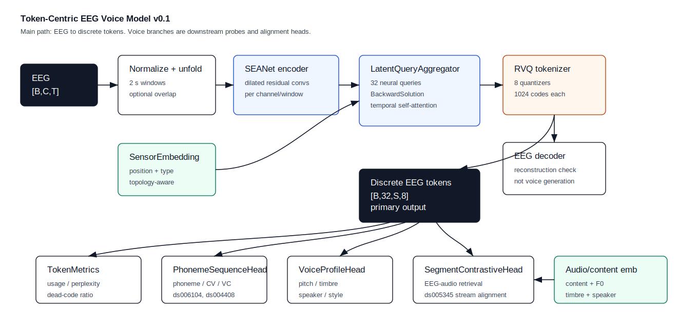
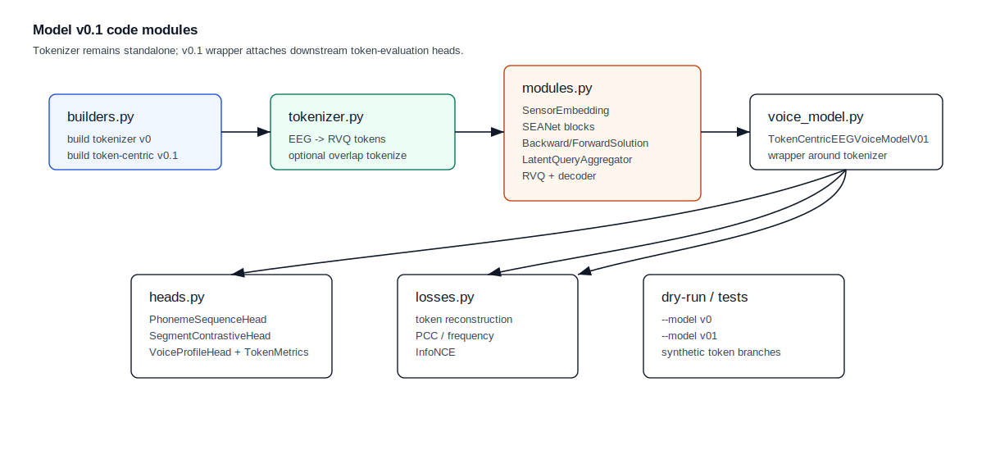
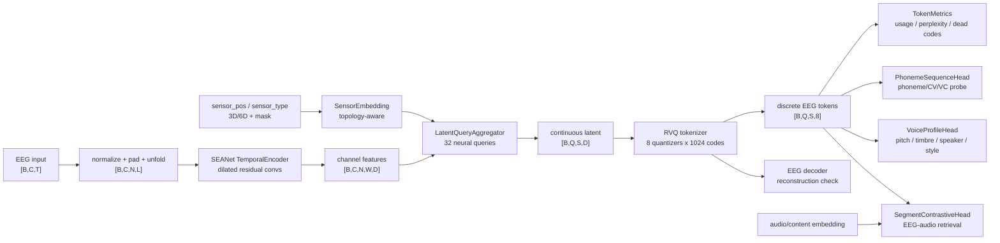

# Token-Centric EEG Voice Model v0.1

## 1. 模型目标

v0.1 的主干只做一件事：

```text
EEG -> discrete EEG tokens
```

内容、音调、音色、说话人和风格不替代 token 主干，而是作为 token 后面的评估头和对齐头：

```text
EEG [B,C,T]
-> BrainOmni-style EEG tokenizer
-> RVQ discrete EEG tokens [B,Q,S,num_quantizers]
-> downstream content / phoneme / pitch / timbre / speaker / style / retrieval heads
```

v0.1 不做 waveform generation。voice reconstruction 在当前阶段只表现为：

```text
tokens -> voice profile prediction / Top-K voice retrieval
```

## 2. 组件图



代码模块图：



Mermaid 版本：



## 3. 模型接口

Tokenizer-only 仍可单独使用：

```python
{
    "z": Tensor[B, Q, S, D],
    "z_q": Tensor[B, Q, S, D],
    "tokens": LongTensor[B, Q, S, num_quantizers],
    "x_rec": Tensor[B, C, T],
    "target": Tensor[B, C, T],
    "losses": {...}
}
```

v0.1 wrapper 输出：

```python
{
    "z": Tensor[B, Q, S, D],
    "z_q": Tensor[B, Q, S, D],
    "tokens": LongTensor[B, Q, S, num_quantizers],
    "x_rec": Tensor[B, C, T],
    "tokenizer_losses": {...},
    "token_metrics": {...},
    "content_embedding": Tensor[B, projection_dim],
    "phoneme_logits": Tensor[B, S, phoneme_classes],
    "pitch_pred": Tensor[B, pitch_dim],
    "timbre_pred": Tensor[B, timbre_dim],
    "speaker_embedding": Tensor[B, speaker_dim],
    "style_logits": Tensor[B, style_classes],
    "retrieval_logits": Tensor[B, B],  # when audio_embedding is provided
}
```

默认配置：

```text
sample_rate = 250
window_sec = 2.0
dim = 256
latent_queries = 32
codebook_dim = 128
codebook_size = 1024
num_quantizers = 8
encoder_channels = 96
downsample_rates = [2, 2, 2, 2]
n_heads = 8
```

## 4. 论文到模块的对应关系

| 论文方向 | v0.1 中的落点 |
| --- | --- |
| BrainOmni | `SensorEmbedding`、SEANet encoder、latent neural queries、RVQ、decoder |
| LUNA | latent query aggregation 使计算与 channel 数解耦，保留 topology-agnostic 思路 |
| DeWave | discrete EEG token 作为跨模态桥梁 |
| DELTA | RVQ multi-layer token 用于降低 EEG 噪声和个体差异 |
| NeuroLM | token 可以作为后续语言/语音模型输入，但 v0.1 不接 LLM |
| LaBraM / EEG-FM review | token 质量评估不只看 reconstruction，还看 codebook usage、perplexity、downstream probes |
| Défossez et al. | `SegmentContrastiveHead` 用 EEG token 做 speech segment retrieval |
| Lee 2025 | `PhonemeSequenceHead` 做 parallel phoneme sequence probe |
| Lee 2023 NeuroTalk | voice reconstruction 只保留为 downstream interface，不在 v0.1 生成 waveform |
| Moreira et al. ds006104 | phoneme、coarticulation、articulation、happy/angry、F0/timbre probe 数据来源 |

## 5. Tokenizer 数据流

```text
raw EEG
-> channel-wise normalization
-> 2 s windowization, optional overlap for dense tokenization
-> sensor-aware SEANet temporal encoding
-> latent-query aggregation across channels
-> RVQ quantization
-> discrete EEG tokens
```

overlap tokenization 用于连续 EEG：

```python
tokens = tokenizer.tokenize(eeg, sensor_pos, channel_mask, overlap_ratio=0.5)
```

`overlap_ratio=0.0` 保持旧行为。

## 6. Token 质量指标

`TokenMetrics` 输出：

| 指标 | 含义 |
| --- | --- |
| `codebook_usage` | 每个 codebook 中被使用 code 的比例 |
| `token_perplexity` | token 分布有效复杂度 |
| `dead_code_ratio` | 未被使用 code 的比例 |
| `unique_codes` | 平均 unique code 数 |

这些指标用于判断 RVQ 是否坍缩。tokenizer reconstruction loss 仍然保留：

```text
L_token = L_time
        + L_freq_amp
        + 0.5 * L_freq_phase
        + exp(-PCC)
        + L_commit
```

## 7. 下游头

### PhonemeSequenceHead

```text
tokens / z_q
-> mean over latent queries
-> per-time-step phoneme logits [B,S,num_phoneme_classes]
```

用于 `ds006104` 和 `ds004408`：

```text
phoneme / CV / VC / coarticulation probe
```

### SegmentContrastiveHead

```text
pooled EEG token embedding <-> audio/content embedding
```

用于 `ds005345`：

```text
single_female / single_male / mix attended stream retrieval
```

### VoiceProfileHead

```text
pooled EEG token embedding
-> pitch_pred
-> timbre_pred
-> speaker_embedding
-> style_logits
```

用于声音形象属性验证，不生成声音波形。

## 8. 数据集适配

| 数据集 | token 任务 | 下游验证 |
| --- | --- | --- |
| `ds006104` | speech-onset EEG tokenization | phoneme、CV/VC、manner/place/voicing、happy/angry、F0、brightness |
| `ds005345` | natural speech continuous tokenization | speaker-stream retrieval、F0/intensity tracking、word-window retrieval |
| `ds004408` | English audiobook tokenization | word/phoneme onset alignment |
| `ds004718` | Cantonese story tokenization | word/prosody/content alignment |
| Voice Image EEG Dataset | controlled voice-bank tokenization | content/pitch/timbre/speaker/style alignment |

## 9. Smoke tests

模型形状、tokenizer、probe head 和 v0.1 wrapper 统一用 pytest 检查。旧的独立 dry-run 脚本已删除，避免维护两套入口。

```bash
PYTHONPATH=. pytest -q tests/test_model_v0_synthetic.py
```

## 10. 当前边界

v0.1 的边界：

```text
EEG -> token
token -> downstream content / phoneme / pitch / timbre / speaker / style / retrieval heads
```

不包含：

```text
waveform generation
HuBERT/wav2vec/ECAPA heavy encoder integration
LLM or diffusion decoder
training loop
```
