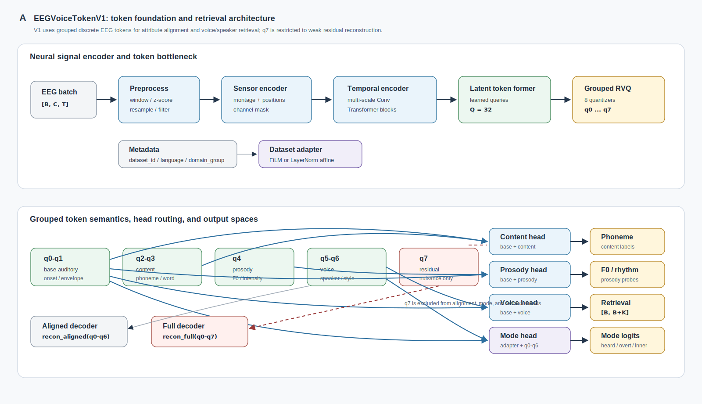
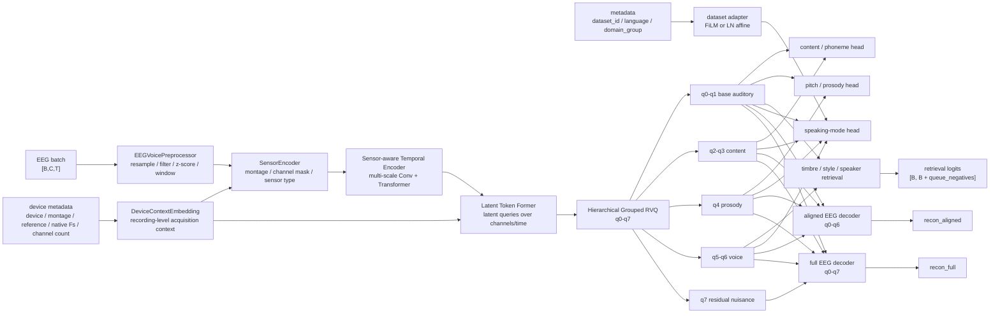

# EEGVoiceTokenV1 模型设计（0518）

## 摘要

EEGVoiceTokenV1 的第一版目标被限定为公开多数据集上的 speech/voice EEG token foundation。模型不直接生成波形，也不尝试个体化主观 voice image reconstruction，而是围绕以下链路建立可训练、可评估的中间表征：

```text
EEG -> discrete token
    -> content / pitch / timbre / speaker / style alignment
    -> voice / speaker retrieval / voice-image foundation
```

这一边界与 `docs/multi_dataset_voice_eeg_catalog_0518.md` 的数据判断一致。37 个 selected 数据集已经足够支撑 tokenization、attribute alignment 和 retrieval。V1 的第一版主结论以英文数据为核心，中文、粤语、西班牙语、荷兰语/丹麦语等数据保留为 cross-lingual transfer 和 robustness 验证。这样的分层避免把跨语言差异、范式差异和模型能力混在同一个不可解释的结果中。

模型主体采用 sensor-aware EEG encoder、device-aware acquisition context、latent token former 与 hierarchical grouped RVQ。RVQ 不再被视为一个完全共享的黑盒 codebook，而是被划分为 base auditory、content、prosody、voice 和 residual nuisance 五组。alignment heads 只读取与任务相关的 code groups，q7 residual code 只参与低权重重构，不进入任何 attribute 或 retrieval head。

---

## 1. 研究边界

### 1.1 V1 的正向目标

V1 处理的是神经表征问题，而不是完整语音生成问题。模型需要证明三件事。

第一，连续 EEG 可以被压缩为稳定的 discrete token。这个 token 序列需要有合理的 codebook usage、perplexity、跨被试泛化能力和 reconstruction sanity check。

第二，token 中存在可读出的 voice-relevant attributes。content、pitch、prosody、timbre、speaker、style 和 speaking mode 都以 probe 或 contrastive alignment 的形式进入评估，而不是以 waveform quality 作为第一目标。

第三，token 可以支持 voice / speaker retrieval。给定 EEG segment，模型在候选 audio、speaker 或 stream embedding 中检索匹配项。AAD、多说话人聆听和 speech decoding 数据天然适合这一目标。

### 1.2 V1 不承担的目标

V1 不训练 waveform decoder，不连接 neural codec vocoder，不以 MOS、PESQ、STOI 或 waveform similarity 作为主要指标。NaturalSpeech 3、X-Codec、speech quantization 与 audio decoder 文献只作为 factorized representation 和未来 decoder interface 的结构参考。

V1 也不声明 personalized subjective voice reconstruction。该任务需要统一 voice bank、主观相似度评分和全因子 F0/formant/style 控制。当前公开数据池的价值在于 foundation pretraining 与 retrieval，而不是个体主观声音空间的最终重构。

---

## 2. 文献到模型模块的映射

| 文献方向 | 对 V1 的结构作用 | 在模型中的落点 |
| --- | --- | --- |
| BrainOmni / LUNA | EEG/MEG foundation backbone、topology-aware / topology-agnostic sensor modeling、cross-device generalization | sensor-aware temporal encoder、device context embedding、latent query aggregation、channel mask |
| DeWave / NeuroLM | discrete EEG token 作为跨模态接口 | RVQ token bottleneck、token quality metrics |
| Défossez et al. speech perception decoding | 非侵入式脑信号到 speech segment retrieval | EEG-audio contrastive retrieval head |
| Lee 2025 parallel phoneme prediction | listened speech 中的 phoneme sequence supervision | content / phoneme head |
| Moreira ds006104 | articulation、coarticulation、controlled speech decoding 数据基础 | English-first content / prosody probe |
| NaturalSpeech 3 / X-Codec / speech quantization | content、prosody、timbre 的 factorized token 思想 | grouped RVQ 与 head routing |
| NeuroTalk / Lee 2023 imagined speech | imagined/overt speech reconstruction 的任务参照 | speaking-mode head 与 P2 transfer，不进入 V1 waveform target |
| EEG foundation model review | 对 token collapse、泛化和下游 probe 的评估约束 | codebook usage、perplexity、cross-dataset evaluation |

这组文献共同导向一个设计原则：EEG 侧先形成可解释的离散神经 token，voice/audio 侧先做 alignment 和 retrieval。波形生成是后续阶段，不是 V1 的训练目标。

---

## 3. English-first 数据分层

V1 第一版采用 English-first 训练与评估。这里的 English-first 不是排除其他语言，而是将主结论限定在最容易解释的一组数据上。跨语言数据作为扩展层进入，避免第一版实验同时混入语言差异、设备差异、任务差异和模型差异。

| 数据层 | 数据集 | 进入 V1 的角色 |
| --- | --- | --- |
| English-first core | `ds004408`, `ds006434`, Weissbart, Etard, `ds007591`, `ds007602`, Kara One, FEIS, `ds006104` | tokenizer、content、phoneme、prosody、speaker retrieval、speaking-mode probe 的主链路 |
| English / near-English retrieval expansion | Fuglsang, Rotaru, Geirnaert, KUL, DTU, 255ch EEG-AAD | retrieval robustness、attention stream、sensor density、long-context AAD |
| Cross-lingual reserved | 普通话、粤语、西班牙语数据，包括 `ds005345`, ESAA, NJU AAD, Yan 系列, `ds004718`, Chisco, Inner Speech, UGR-MINDVOICE, CIRE | later-stage transfer、language robustness、tone/prosody extension |
| Auditory proxy | OpenMIIR, MUSIN-G, MAD-EEG | auditory token ablation、pitch/timbre/target-source proxy |

该分层使 V1 的主实验具有清晰解释：English-first core 负责回答模型是否能在英文 speech/voice EEG 数据上形成可用 token；retrieval expansion 检验 token 是否能迁移到邻近 AAD 场景；cross-lingual reserved 数据检验语言迁移；auditory proxy 检验 token 是否过度依赖 speech-specific 标签。

---

## 4. 模型总览



图 1 展示 V1 的组件级结构。EEG 侧先经过 montage-aware 的时序编码器和 latent token former，再进入 q0-q7 hierarchical grouped RVQ。acquisition device、montage、reference、native sampling rate 和 native channel count 作为 recording-level context 条件化 sensor embedding 与 latent token。alignment、mode 和 retrieval heads 只读取 q0-q6 中与任务相关的 groups；q7 仅作为 weak residual code 进入 full reconstruction。



模型以 EEG token 为中心。alignment heads 并不直接读全部 latent representation，而是按 group routing 读取与任务对应的 token group。这样做的目的不是保证完全 disentanglement，而是将可解释性压力前移到 token 层，减少所有属性都从同一 entangled code 中硬读出的风险。

---

## 4.1 Acquisition device context

跨数据集 EEG 训练不能只把设备差异交给 `dataset_id` 或 q7 residual code 吸收。BrainOmni 的 cross-device 评估设置和 LUNA 的 topology-agnostic EEG 建模都提示同一个问题：采集设备、montage、reference、原始采样率和通道数会改变 EEG 的观测空间。V1 因此把 acquisition context 作为显式条件变量，而不是把它当作标签噪声。

当前接口保留以下 recording-level 字段：

```text
acquisition_device_id
montage_id
reference_id
sampling_rate_hz
native_channel_count
```

这些字段进入 `DeviceContextEmbedding`，形成一个 `[B, D]` 的 device context。该 context 有两个作用：第一，加到 channel-level sensor embedding 上，使 backward solution 能区分不同设备和 montage 下的同名或近似传感器；第二，通过低幅度 FiLM 条件化 latent token former 的输出，使 tokenizer 在跨设备数据上学习可比较的 token 空间。device context 不进入 content、prosody、voice、mode 或 retrieval head 的 label side，也不作为 retrieval target。这样设计的目的，是让模型校正观测差异，而不是靠设备标签直接完成任务。

q7 residual 与 device context 的角色不同。device context 是可解释的 acquisition covariate；q7 是弱重构 residual。若 q7 仍然强预测 dataset_id 或 device_id，该现象在评估中应被报告为 nuisance absorption，而不是 token 质量提升。当前代码在 acquisition device id 存在时会报告 `q7_device_predictability`。

---

## 5. Hierarchical grouped RVQ

### 5.1 Code group 分配

| Quantizer | Group | 语义角色 | 主要监督来源 |
| --- | --- | --- | --- |
| q0-q1 | base auditory code | onset、envelope、shared auditory response、跨任务听觉动态 | 所有数据集、EEG reconstruction、masked EEG modeling |
| q2-q3 | content code | phoneme、CV/VC、syllable、word、speech unit | `ds004408`, `ds006104`, FEIS, Kara One, `ds007602` |
| q4 | prosody code | F0、intensity、rhythm、tone、prosody contour | `ds006104`, `ds004408`, `ds004718`, CIRE, auditory proxy |
| q5-q6 | voice code | timbre、speaker、style、stream identity | `ds006434`, Etard, Weissbart, AAD retrieval expansion |
| q7 | residual nuisance code | reconstruction residual、dataset noise、unexplained variance | weak full reconstruction only |

RVQ 的层级结构与 speech factorization 文献保持一致，但它服务的是 EEG token interpretability，而不是 audio codec fidelity。q0-q1 保证跨任务共享听觉基础；q2-q6 承担可读出的 voice-relevant factors；q7 吸收不希望进入 alignment head 的剩余变化。

### 5.2 q7 weak residual policy

q7 是 V1 中最容易形成 dataset shortcut 的位置。它不进入任何 alignment、retrieval 或 speaking-mode head。模型只允许 q7 在低权重 full reconstruction 中出现。

```text
recon_aligned = Decoder(q0-q6)
recon_full    = Decoder(q0-q7)

L_recon = L_recon_aligned(recon_aligned, eeg)
        + 0.25 * L_recon_full(recon_full, eeg)
```

训练时 q7 采用 group dropout。dropout 的作用不是 regularization 的附属细节，而是防止 full decoder 将 q7 变成主要重构通道。评估中单独报告 q7 的 codebook usage、perplexity、dropout ablation、dataset predictability 和 device predictability。若 q7 对 dataset_id 或 acquisition_device_id 的预测过强，该现象被解释为 nuisance absorption，而不是 token 表征质量提高。

### 5.3 Head routing


图 2 将 grouped RVQ 的读取规则写成 routing matrix。V1 的关键约束是 q7 不进入 content、prosody、voice、retrieval 或 speaking-mode heads；它只以低权重参与 full reconstruction，并在评估时单独报告 dataset predictability、usage 和 dropout ablation。

| Head | 读取的 token groups | 不读取的 groups | 输出 |
| --- | --- | --- | --- |
| content / phoneme | base + content | prosody, voice, q7 | phoneme class、speech unit、content embedding |
| pitch / prosody | base + prosody | content, voice, q7 | F0 bin/regression、intensity、rhythm/prosody |
| timbre / style | base + voice | content, prosody, q7 | timbre vector、style logits |
| speaker / voice retrieval | base + voice | content, prosody, q7 | EEG embedding、retrieval logits |
| speaking-mode | base + content + prosody + voice + dataset adapter | q7 | heard / imagined / inner / overt / visualized-control |
| EEG reconstruction | aligned: q0-q6; full: q0-q7 | none for full view | `recon_aligned`, `recon_full` |

---

## 6. Speaking-mode modeling

Speaking-mode 数据天然跨范式。Kara One、FEIS、Inner Speech、Chisco、UGR-MINDVOICE 和 `ds007602` 在语言、被试、任务说明和 EEG acquisition 上均不统一。V1 因此采用共享 label space 与 per-dataset adapter 的折中结构。

Canonical labels 定义为：

```text
heard
imagined
inner
overt
visualized/control
```

每个 P2 数据集有轻量 FiLM 或 LayerNorm affine adapter。adapter 接收 `dataset_id`，只调节 mode head 前的 pooled token representation。分类器本身共享，从而保留跨数据集 speaking-mode alignment 的可能性。第一版 English-first 分析优先使用 Kara One、FEIS、`ds007591`、`ds007602` 和 `ds006104`；Chisco、Inner Speech 与 UGR-MINDVOICE 作为 cross-lingual mode transfer。

这一设计避免两种极端。纯共享 head 容易把 dataset artifact 当作 mode difference；完全 per-dataset head 则无法回答 imagined、inner、overt 是否存在可迁移神经结构。

---

## 7. Retrieval 与 hard negatives

Retrieval 是 V1 最稳定的下游任务。模型学习 EEG token embedding 与 audio/speaker/stream embedding 的匹配关系。

```text
z_eeg = f_eeg(q0-q1, q5-q6)
z_audio = f_audio(audio_or_speaker_embedding)
logits = z_eeg @ [z_audio_batch, z_audio_queue]^T
```

retrieval logits 的目标 shape 为：

```text
[B, B + queue_negatives]
```

第一版 sampler 优先混合 English-first core 和 English/near-English retrieval expansion。batch 内同时包含 within-dataset negatives 与 cross-dataset negatives。memory queue 保存近期 audio/speaker embeddings，hard negatives 依据 embedding similarity 选取。speaker ID 使用 `dataset_id + speaker_id` 命名空间，避免跨数据集 speaker 误合并。

metadata 中保留：

```text
dataset_id
speaker_id
language
domain_group
task_type
```

这些字段不直接决定 retrieval label，但用于 negative control、domain split 和 later-stage cross-lingual evaluation。

---

## 8. 数据到 loss/head 的映射

| 数据层 | 主要数据集 | Token groups | Heads / losses |
| --- | --- | --- | --- |
| English-first natural speech | `ds004408`, Weissbart, Etard | base, content, prosody, voice | reconstruction、content alignment、segment retrieval |
| English attention / two-speaker | `ds006434` | base, voice | attended-stream retrieval、speaker/voice retrieval |
| English controlled / production | `ds006104`, FEIS, Kara One, `ds007591`, `ds007602` | base, content, prosody, voice | phoneme/content、style、speaking-mode、production probe |
| Retrieval expansion | Fuglsang, Rotaru, Geirnaert, KUL, DTU, 255ch EEG-AAD | base, voice | speaker/stream retrieval、sensor robustness |
| Cross-lingual reserved | Mandarin, Cantonese, Spanish groups | group depends on labels | transfer / robustness, not first-version main claim |
| Auditory proxy | OpenMIIR, MUSIN-G, MAD-EEG | base, prosody, voice | pitch/timbre proxy、auditory ablation |

Losses are activated only when the corresponding labels or targets exist. Missing labels do not create dummy targets and do not contribute zero-valued losses. This behavior is essential because the 37 datasets do not share a common annotation schema.

---

## 9. Training objective

The V1 training objective is a masked multi-task loss over available labels:

```text
L = L_recon_aligned
  + 0.25 * L_recon_full
  + L_vq
  + lambda_content * L_content
  + lambda_prosody * L_prosody
  + lambda_voice * L_timbre_style
  + lambda_retrieval * L_retrieval
  + lambda_mode * L_mode
```

The first training stage uses reconstruction, VQ commitment, codebook usage regularization and retrieval on English-first data. The second stage adds content/prosody/style heads where labels exist. The third stage introduces speaking-mode adapter training. Cross-lingual data enter after the English-first token and retrieval baseline has been established.

The objective is not optimized for waveform fidelity. Reconstruction is a neural representation sanity check and an anti-collapse constraint. The scientific claims rely on token quality, attribute alignment and retrieval generalization.

---

## 10. Current code interface

The current `src/eeg_voice_model` interface is centered on `EEGVoiceTokenV1`. The implementation keeps the useful backbone ideas from the earlier prototype, but the active code path now exposes grouped-token semantics, q7 residual policy, dataset-adapted speaking-mode classification and memory-queue retrieval.

```python
from dataclasses import dataclass
from typing import Mapping

import torch


@dataclass
class EEGVoiceV1Config:
    sample_rate: int = 250
    window_sec: float = 2.0
    dim: int = 256
    latent_queries: int = 32
    codebook_size: int = 1024
    quantizer_groups: Mapping[str, tuple[int, ...]] = None
    use_device_context: bool = True
    device_vocab_size: int = 256
    montage_vocab_size: int = 64
    reference_vocab_size: int = 32
    device_film_scale: float = 0.1
    q7_full_recon_weight: float = 0.25
    q7_group_dropout: float = 0.5
    retrieval_queue_size: int = 4096
    retrieval_temperature: float = 0.07
    mode_labels: tuple[str, ...] = ("heard", "imagined", "inner", "overt", "visualized_control")


@dataclass
class EEGVoiceBatch:
    eeg: torch.Tensor
    sensor_pos: torch.Tensor
    channel_mask: torch.Tensor | None
    dataset_id: list[str]
    language: list[str]
    domain_group: list[str]
    speaker_id: list[str] | None = None
    audio_embedding: torch.Tensor | None = None
    targets: "VoiceAlignmentTargets | None" = None
    sensor_type: torch.Tensor | None = None
    acquisition_device_id: torch.Tensor | None = None
    montage_id: torch.Tensor | None = None
    reference_id: torch.Tensor | None = None
    sampling_rate_hz: torch.Tensor | None = None
    native_channel_count: torch.Tensor | None = None


@dataclass
class VoiceAlignmentTargets:
    content_labels: torch.Tensor | None = None
    phoneme_labels: torch.Tensor | None = None
    pitch_target: torch.Tensor | None = None
    prosody_target: torch.Tensor | None = None
    timbre_target: torch.Tensor | None = None
    style_labels: torch.Tensor | None = None
    mode_labels: torch.Tensor | None = None


@dataclass
class GroupedRVQOutput:
    z: torch.Tensor
    z_q: torch.Tensor
    tokens: torch.Tensor
    group_latents: dict[str, torch.Tensor]
    group_tokens: dict[str, torch.Tensor]
    group_names: tuple[str, ...]
    commitment_loss: torch.Tensor
    token_metrics: dict[str, torch.Tensor]


class EEGVoiceTokenV1(torch.nn.Module):
    def forward(self, batch: EEGVoiceBatch) -> dict[str, torch.Tensor | dict]:
        ...
```

The expected forward output includes:

```python
{
    "tokens": LongTensor[B, Q, S, 8],
    "group_tokens": {
        "base": LongTensor[..., 2],
        "content": LongTensor[..., 2],
        "prosody": LongTensor[..., 1],
        "voice": LongTensor[..., 2],
        "residual": LongTensor[..., 1],
    },
    "device_context": Tensor[B, D],
    "recon_aligned": Tensor[B, C, T],
    "recon_full": Tensor[B, C, T],
    "content_logits": optional Tensor,
    "pitch_pred": optional Tensor,
    "timbre_pred": optional Tensor,
    "style_logits": optional Tensor,
    "mode_logits": optional Tensor,
    "retrieval_logits": optional Tensor[B, B + queue_negatives],
    "losses": {...},
    "metrics": {...},
}
```

---

## 11. Evaluation

| Evaluation axis | Metric | Interpretation |
| --- | --- | --- |
| Token stability | codebook usage、perplexity、dead-code ratio | RVQ 是否坍缩 |
| Reconstruction sanity | aligned reconstruction loss、full reconstruction loss、PCC | token 是否保留 EEG structure |
| q7 nuisance behavior | q7 usage、q7 perplexity、dataset/device predictability、dropout ablation | residual 是否变成 dataset 或 device shortcut |
| Device robustness | seen-device / held-out-device performance、device-conditioned ablation | device context 是否改善跨设备泛化 |
| Content alignment | phoneme accuracy、unit accuracy、sequence F1 | content code 是否可读出 |
| Pitch/prosody | F0 correlation、tone/prosody accuracy、intensity correlation | prosody code 是否有效 |
| Timbre/style | style accuracy、timbre regression error | voice code 是否保留声音属性 |
| Retrieval | Recall@1/5/10、MRR、within/cross-dataset retrieval | EEG token 是否支持 speaker/voice retrieval |
| Mode transfer | mode accuracy、leave-one-dataset-out accuracy | adapter 是否缓解范式差异 |
| English-first generalization | English held-out dataset performance | 主结论是否在英文数据内成立 |
| Cross-lingual transfer | Mandarin/Cantonese/Spanish held-out transfer | 语言扩展是否带来稳健性 |

V1 的主指标是 retrieval 与 attribute probe，而不是 reconstruction loss。reconstruction 是必要约束，但不能作为 voice foundation 成功的唯一证据。

---

## 12. Implementation boundary

V1 的代码重构已经切换到 `EEGVoiceTokenV1` 主入口。当前仍未完成的是 selected-dataset registry、真实数据 collator、target extraction、training loop 和 evaluation scripts。旧的 v0 配置、v0 设计文档、早期 ds006104/ds005345 dataset adapter 和占位 audio feature helper 已从主项目中移除，后续真实数据接入应通过 V1 dataset registry 重建，而不是沿用旧接口。

最低代码验收标准为：

```text
synthetic batch -> tokenizer -> grouped RVQ -> all heads
tokens contain group names / indices / quantized latents / token metrics
batch accepts acquisition_device_id / montage_id / reference_id / sampling_rate_hz / native_channel_count
forward output contains device_context
reconstruction contains recon_aligned and recon_full
missing labels do not enter total loss
retrieval logits shape == [B, B + queue_negatives]
mode head supports dataset adapter and shared classifier
q7 metrics include usage / perplexity / dropout ablation / dataset and device predictability
device-heldout evaluation reports whether device context improves transfer
```

---

## 13. 结论

EEGVoiceTokenV1 不是一个 EEG-to-speech generator，而是一个 English-first EEG voice token foundation model。其核心贡献在于将 37 个 selected 数据集组织为一个可解释的 token、alignment 和 retrieval 系统。hierarchical grouped RVQ 使 content、prosody、voice 与 residual nuisance 在 token 层具有可分析的结构；device context embedding 将采集设备、montage、reference、原始采样率和通道数作为显式 acquisition covariates；speaking-mode adapter 处理 imagined、inner、overt、heard 范式之间的分布差异；memory queue hard negatives 使 speaker/voice retrieval 不停留在简单 in-batch 匹配。

这种设计保留了未来接入 audio codec decoder 的接口，但 V1 的科学结论只建立在 discrete EEG token、voice attribute alignment 和 speaker/voice retrieval 上。
