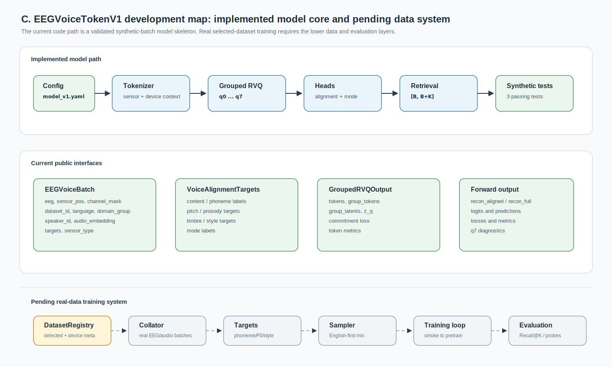
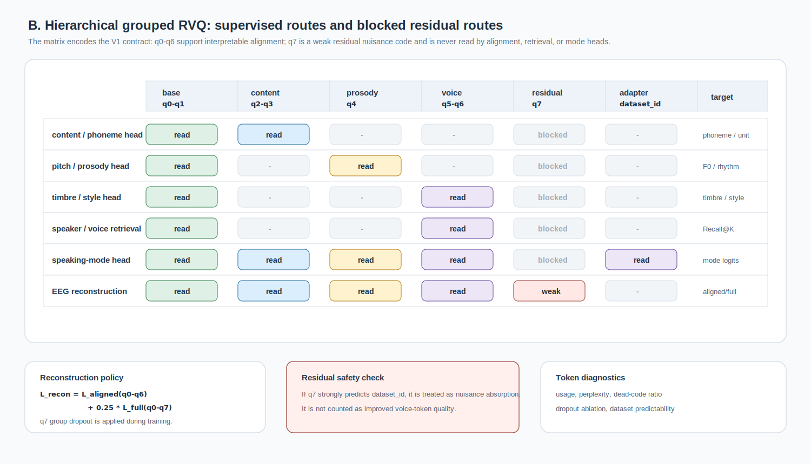

# EEGVoiceTokenV1 开发进度（0518）

## 当前状态

V1 模型第一版代码已经落地。当前实现不再沿用 v0 prototype 的主入口，而是切换为 `EEGVoiceTokenV1`。模型目标与 `docs/model_v1_design_0518.md` 保持一致：

```text
EEG -> grouped discrete token
    -> content / pitch / timbre / speaker / style / mode alignment
    -> voice / speaker retrieval
```

这一版仍然是模型骨架和 synthetic batch 验证阶段。真实 37 个 selected 数据集的 dataset registry、collator、target extraction 和训练脚本尚未接入。



图 1 总结当前工程边界：上层 `EEGVoiceTokenV1` 模型链路已经能够在 synthetic batch 上闭环；下层真实 selected-dataset 训练系统仍需要补齐 registry、collator、target extraction、sampler、training loop 和 evaluation。

---

## 已完成的代码

| 模块                               | 状态   | 说明                                                                                                             |
| ---------------------------------- | ------ | ---------------------------------------------------------------------------------------------------------------- |
| `EEGVoiceV1Config`               | 已完成 | 定义 V1 主配置，包含 grouped RVQ、q7 residual、retrieval queue、mode labels 等参数。                             |
| `EEGVoiceTokenizerV1`            | 已完成 | 复用 sensor-aware encoder、latent query aggregator 和 temporal decoder，输出 grouped RVQ token。                 |
| `GroupedResidualVectorQuantizer` | 已完成 | 实现 `base/content/prosody/voice/residual` 五组 token，覆盖 q0-q7。                                            |
| `EEGVoiceTokenV1`                | 已完成 | 接入 tokenizer、alignment heads、mode head、retrieval head 和总 loss。                                           |
| q7 weak residual                   | 已完成 | 输出 `recon_aligned` 与 `recon_full`；q7 只进入 full reconstruction，不进入 alignment/retrieval/mode heads。 |
| Speaking-mode adapter              | 已完成 | 使用 shared classifier + per-dataset FiLM adapter。                                                              |
| Retrieval queue                    | 已完成 | 实现 memory queue hard negatives，输出 logits shape 为 `[B, B + queue_negatives]`。                            |
| `configs/model_v1.yaml`          | 已完成 | 写入 V1 默认配置和 English-first core 数据层。                                                                   |
| V1 synthetic tests                 | 已完成 | 替换旧 v0 synthetic test，覆盖 grouped token、optional losses、retrieval queue 和 builder。                      |

---

## 关键接口

### Public package exports

当前 `src/eeg_voice_model/__init__.py` 暴露：

```python
EEGVoiceBatch
EEGVoiceTokenV1
EEGVoiceTokenizerV1
EEGVoiceV1Config
GroupedRVQOutput
VoiceAlignmentTargets
build_eeg_voice_token_v1
build_model_v1_bundle
```

### Batch schema

`EEGVoiceBatch` 当前字段：

```python
eeg
sensor_pos
channel_mask
dataset_id
language
domain_group
speaker_id
audio_embedding
targets
sensor_type
```

### Target schema

`VoiceAlignmentTargets` 当前支持：

```python
content_labels
phoneme_labels
pitch_target
prosody_target
timbre_target
style_labels
mode_labels
```

缺失 target 时，对应 loss 不会进入总 loss。

---

## V1 Token 分组

| Quantizer | Group        | 代码状态 |
| --------- | ------------ | -------- |
| q0-q1     | `base`     | 已实现   |
| q2-q3     | `content`  | 已实现   |
| q4        | `prosody`  | 已实现   |
| q5-q6     | `voice`    | 已实现   |
| q7        | `residual` | 已实现   |

Head routing 当前固定为：

| Head                       | 读取 group                           |
| -------------------------- | ------------------------------------ |
| content / phoneme          | `base + content`                   |
| pitch / prosody            | `base + prosody`                   |
| timbre / style / retrieval | `base + voice`                     |
| speaking-mode              | `base + content + prosody + voice` |
| aligned reconstruction     | `q0-q6`                            |
| full reconstruction        | `q0-q7`                            |

q7 不进入任何 alignment、retrieval 或 speaking-mode head。



图 2 展示当前代码已经实现的 group routing contract。`base/content/prosody/voice` 进入对应 alignment、retrieval 和 speaking-mode heads；`residual` 只进入 full reconstruction，并通过 q7 metrics 单独检查。

---

## 已验证

模型实现阶段已运行：

```bash
python3 -m py_compile src/eeg_voice_model/*.py
PYTHONPATH=. python3 -m pytest -q
git diff --check
```

结果：

```text
3 passed
```

测试覆盖：

| 测试                                                       | 覆盖内容                                                                   |
| ---------------------------------------------------------- | -------------------------------------------------------------------------- |
| `test_eeg_voice_token_v1_grouped_forward_without_labels` | grouped token 输出、q7 不进入 heads、双 reconstruction、无 label forward。 |
| `test_eeg_voice_token_v1_all_optional_losses_and_queue`  | 所有 optional losses、retrieval queue hard negatives、logits shape。       |
| `test_builder_loads_model_v1_yaml`                       | `configs/model_v1.yaml` 能构建 `EEGVoiceTokenV1`。                     |

本轮 legacy cleanup 后额外检查：

```bash
python3 -m py_compile src/eeg_voice_model/*.py
git diff --check
rg "from \\.audio_features|from \\.datasets|eeg_voice_model\\.audio_features|eeg_voice_model\\.datasets" src tests scripts configs README.md
```

当前系统 Python 没有安装 `torch` 和 `pytest`，因此本轮没有重新执行 pytest。删除的 legacy 文件没有被当前 V1 package、tests、configs 或 scripts 引用。

---

## 尚未完成

| 工作                    | 当前缺口                                                                                             |
| ----------------------- | ---------------------------------------------------------------------------------------------------- |
| Dataset registry        | 还没有把 37 个 selected 数据集整理成统一 registry。                                                  |
| Real-data batch builder | 还没有从本地样例目录生成 `EEGVoiceBatch`。                                                         |
| Target extraction       | phoneme、F0、prosody、style、speaker/audio embedding 还没有统一提取管线。                            |
| Training loop           | 还没有 V1 pretraining / finetuning 脚本。                                                            |
| Evaluation scripts      | 还没有 Recall@K、phoneme accuracy、pitch correlation、q7 dataset predictability 的真实数据评估脚本。 |
| English-first sampler   | 还没有实现 English-first / retrieval expansion / cross-lingual reserved 的 sampler。                 |
| Model checkpointing     | 还没有保存、加载、resume、metric logging。                                                           |

这些缺口属于训练系统阶段，不影响当前模型代码 skeleton 的完成度。

---

## 当前文件状态

当前 V1 入口：

```text
README.md
configs/model_v1.yaml
docs/model_v1_design_0518.md
docs/model_v1_development_status_0518.md
docs/assets/model_v1_architecture.svg
docs/assets/model_v1_development_stack.svg
docs/assets/model_v1_rvq_head_routing.svg
tests/test_model_v1_synthetic.py
```

替换或重构：

```text
src/eeg_voice_model/__init__.py
src/eeg_voice_model/builders.py
src/eeg_voice_model/heads.py
src/eeg_voice_model/losses.py
src/eeg_voice_model/tokenizer.py
src/eeg_voice_model/voice_model.py
```

已清理的 legacy 文件：

```text
configs/ds005345_runs.yaml
configs/model_v0.yaml
docs/model_v0_design.md
docs/assets/model_v0_code_module_diagram.svg
docs/assets/model_v0_component_diagram.svg
src/eeg_voice_model/audio_features.py
src/eeg_voice_model/datasets.py
tests/test_model_v0_synthetic.py
```

这些 legacy 文件不再作为 V1 代码或文档入口保留。后续真实数据接入应通过 V1 `DatasetRegistry` 和 `EEGVoiceBatch` collator 重建，避免继续沿用 ds006104 / ds005345 的早期专用 adapter。

---

## 下一阶段工程重点

下一阶段应从“模型 skeleton”进入“真实数据训练接口”。核心顺序是：

1. 建立 `DatasetRegistry`，把 English-first core 数据先纳入统一元数据表。
2. 实现 `EEGVoiceBatch` collator，先支持本地完整样例和 derived NPZ/FIF/EDF。
3. 建立 audio/speaker embedding extraction，先用轻量 mel / acoustic stats，后续替换为 HuBERT / WavLM / ECAPA。
4. 写 V1 smoke training loop，只跑 synthetic + 1-2 个真实小样例。
5. 补 evaluation：retrieval Recall@K、token metrics、q7 metrics、phoneme/mode probe。

当前模型代码已经为这些阶段预留接口。
