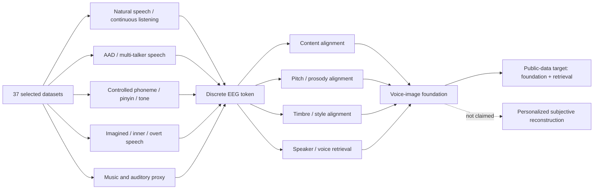

# Multi-Dataset EEG Voice Catalog（0518 解读版）

## 摘要

```text
EEG -> discrete token
    -> content / pitch / timbre / speaker / style alignment
    -> voice / speaker retrieval 或 voice-image foundation
```

在这一边界内，现有数据池已经具备可训练性。其充分性并不来自单一大规模数据集，而来自多类任务范式的互补：自然语音聆听数据提供连续 speech tracking；多说话人 AAD 数据提供 speaker-stream retrieval；受控 phoneme、pinyin、tone、prosody 与 emotion 数据提供声音属性 probe；imagined、inner 与 overt speech 数据提供 heard-to-imagined / overt-to-covert transfer 的代理证据。

因此，本阶段的研究目标不是个体化主观说话形象重构，也不是直接 waveform-level EEG-to-speech generation。更稳健的表述是：在**[跨语言、跨范式公开 EEG 数据上学习可复用的 speech/voice EEG discrete token，并检验这些 token 是否携带内容、音调、音色、说话人和风格信息]()**，进而支持 voice/speaker retrieval 与 voice-image foundation。

---

## 1. 研究问题的边界

### 1.1 本阶段要回答的问题

本研究关注的是 EEG 中是否存在可离散化、可迁移、可解释的 speech/voice 表征。模型目标可以拆成三个层次。

第一层是 neural tokenization。连续 EEG 被编码为 discrete token，token 的质量由重建稳定性、codebook 使用率、跨被试泛化和跨数据集可迁移性刻画。这个层次并不要求模型生成声音，而要求 EEG token 能稳定地表示听觉与语音相关的神经响应。

第二层是 voice attribute alignment。EEG token 与 speech content、phoneme、pitch contour、voicing、timbre proxy、speaker identity、prosody、emotion 和 speaking mode 建立统计关联。这里的“alignment”不是主观语义解释，而是由可观测标签或可计算声学特征支持的神经解码问题。

第三层是 retrieval。给定 EEG segment，模型在候选 speech/audio/speaker 表征中检索匹配项。该目标天然适配 AAD、多说话人聆听、单声道/混合语音对照以及跨语言 speaker-stream 数据。

### 1.2 不纳入本阶段结论的目标

个体化 personalized voice image reconstruction 不作为 0518 版数据充分性的判据。该任务要求统一 voice bank、同一被试对同一批声音的主观相似度结构、系统化 F0/formant/style 操控，以及同一实验范式下的 EEG-voice 对齐。公开数据集很少同时具备这些条件。

这一边界并不削弱当前数据池的价值。相反，公开数据池已经覆盖 foundation model 所需的主要监督信号。其能力范围是 voice/speaker retrieval 与 voice attribute foundation，而不是对某个被试内在主观声音空间的最终重构。

---

## 2. 数据充分性的核心判断

| 研究组件                          | 当前 selected 数据池状态                                                                                         | 结论                                       |
| --------------------------------- | ---------------------------------------------------------------------------------------------------------------- | ------------------------------------------ |
| EEG discrete tokenizer            | 自然语音、连续语音、AAD、受控短语音、音乐代理数据均已覆盖                                                        | 足够形成第一版 tokenizer                   |
| Content alignment                 | phoneme、CV/VC、word、pinyin、syllable、semantic category 与自然语音时间标注同时存在                             | 足够做 content / phoneme probe             |
| Pitch / prosody alignment         | 粤语 tone、F0/intensity、CIRE prosody、音乐 pitch proxy、受控短语音声学特征形成互补                              | 足够做 pitch / prosody probe               |
| Timbre / style alignment          | speaker stream、male/female/mix、emotion/intention、happy/angry/control、instrument proxy 共同提供音色和风格线索 | 足够做 timbre / style probe                |
| Speaker / voice retrieval         | 中文 AAD、Yan 系列、KUL/DTU/255ch、Fuglsang/Rotaru/Geirnaert 与多说话人任务形成 retrieval 主体                   | 足够做 general speaker retrieval           |
| Imagined / inner / overt transfer | Chisco、Inner Speech、Kara One、FEIS、UGR-MINDVOICE、`ds007602` 扩展了 P2 覆盖                                 | 足够做 speaking-mode transfer 的第一版证据 |
| Personalized voice reconstruction | 缺统一主观 voice bank                                                                                            | 不属于当前目标                             |

37 个 selected 数据集的数量本身不是最重要的证据。更重要的是，这 37 个数据集覆盖了不同的可观测轴：声学内容轴、音调轴、音色轴、说话人轴、注意轴、想象/发声状态轴和跨语言轴。这些轴共同构成了 voice-image foundation 所需的训练和验证空间。

---

## 3. 数据池结构

### 3.1 优先级定义

| 优先级 | 数据功能                                                                             | 对本研究的作用                                    |
| ------ | ------------------------------------------------------------------------------------ | ------------------------------------------------- |
| P0     | 主训练集，通常具有明确 EEG-audio 对齐或高价值 voice 属性标签                         | 形成 tokenizer 与核心 retrieval 实验              |
| P1     | 辅助预训练集，包含自然语音、AAD、连续听觉追踪或大样本听觉数据                        | 扩大跨被试、跨语言和跨设备泛化                    |
| P2     | 代理/控制集，包含 phoneme、pinyin、imagined speech、overt speech、prosody 或 emotion | 检验 token 中是否存在可读出的声音属性             |
| P3     | 弱相关听觉代理，如音乐、目标乐器注意、pitch/timbre proxy                             | 辅助 auditory tokenizer，不直接承担 speech 主结论 |

### 3.2 语言与任务分布

| 语言/类型                   |           P0 |           P1 |           P2 |          P3 | selected 数据集数 |
| --------------------------- | -----------: | -----------: | -----------: | ----------: | ----------------: |
| 英文 / speech-decoding 扩展 |            3 |            6 |            3 |           0 |                12 |
| 中文普通话                  |            8 |            1 |            3 |           0 |                12 |
| 粤语                        |            1 |            0 |            1 |           0 |                 2 |
| 受控/代理/音乐              |            1 |            3 |            4 |           3 |                11 |
| **合计**              | **13** | **10** | **11** | **3** |      **37** |

这一分布显示，数据池不是单纯堆叠 AAD 数据。P0/P1 建立 tokenizer 和 speaker retrieval 的主体，P2 提供属性验证，P3 提供听觉 token 的辅助边界。P2 的补强尤其关键，因为 content、pitch、timbre、style alignment 不可能只依赖自然连续语音或 AAD 标签完成。

### 3.3 可用性口径

“可用”在本 catalog 中指 selected 数据集已经进入研究数据池，且公开可获取、可申请或存在可追踪的访问路径。本地是否已下载只表示执行状态，不构成数据池充分性的判断标准。

| 口径                 | 含义                                     |
| -------------------- | ---------------------------------------- |
| `selected_public`  | 已选入池，公开可取或公开可申请           |
| `selected_large`   | 公开可取但体量较大，适合分批或单被试接入 |
| `selected_contact` | 需要登录、授权或联系作者                 |
| `local_ready`      | 本地已有样例或派生格式，仅表示执行进度   |

---

## 4. 研究链路与数据证据

### 4.1 从 EEG 到 discrete token

EEG tokenizer 的训练依赖的是连续神经信号的稳定结构，而不是某一个数据集内的完整 voice bank。自然语音、竞争语音、受控短语音和音乐代理数据都可以贡献不同时间尺度的神经动态。

自然语音数据提供长时 speech envelope、word/phoneme onset、prosody 与语义上下文。AAD 数据提供 attention-modulated neural tracking。受控 phoneme 与 pinyin 数据提供短时音素级响应。音乐代理数据提供 pitch、beat、timbre 和 target-source attention 的非语音边界。合并后，tokenizer 不只学习“听见语音”的平均 ERP，而是在多任务条件下学习 auditory/speech neural code。

### 4.2 从 token 到 content

Content alignment 的证据主要来自四类数据。

| 数据类型                      | 代表数据集                                                  | 贡献                                                      |
| ----------------------------- | ----------------------------------------------------------- | --------------------------------------------------------- |
| 自然语音 word/phoneme timing  | `ds004408`, `ds004718`                                  | 连续语音中的 word、phoneme、F0/intensity 与 EEG 对齐      |
| 受控 phoneme / CV / VC        | `ds006104`, FEIS                                          | 短刺激、音素类别、heard / imagined / spoken 条件          |
| 中文 pinyin / syllable        | `ds006465`, Cantonese tone/syllable ERP                   | 声母、韵母、声调、拼音 production 与 syllable-level probe |
| overt / covert / inner speech | `ds003626`, Kara One, UGR-MINDVOICE, `ds007602`, Chisco | 发声、想象、内隐语音状态与内容类别的分离                  |

这些数据集并非使用同一种语言或任务范式，但 content alignment 的关键不是语言一致性，而是将语音内容映射到可比较的表征空间，例如 IPA、articulatory features、phoneme class、pinyin class 或 speech unit embedding。

### 4.3 从 token 到 pitch 与 prosody

Pitch 与 prosody 的证据不集中于单个数据集，而是由多种互补范式构成。

| 线索                       | 代表数据集                                | 可读出的属性                                              |
| -------------------------- | ----------------------------------------- | --------------------------------------------------------- |
| 粤语自然语音与声调         | `ds004718`, Cantonese tone/syllable ERP | F0、tone、intensity、pitch contour                        |
| 普通话 prosody / intention | CIRE                                      | prosodic emotion、speech intention、Wav2Vec2 feature      |
| 受控短语音                 | `ds006104`                              | voicing、F0 proxy、spectral brightness、emotion condition |
| 音乐代理                   | OpenMIIR, MUSIN-G, MAD-EEG                | pitch、beat、timbre、target-source attention              |

对本研究而言，pitch/prosody alignment 的目标是确认 EEG token 中存在可预测的音调和韵律信息，而不是恢复精确声波。多语言声调、情绪语调和音乐 pitch proxy 的组合已经足以支撑这一层验证。

### 4.4 从 token 到 timbre、speaker 与 style

Timbre 与 speaker 的证据主要由多说话人聆听和 AAD 数据提供。普通话数据池中的 `ds005345`、ESAA、NJU AAD、AASD、MS-AASD、Yan 系列和 ASA 构成中文 speaker-stream retrieval 的主体。KUL、DTU、255ch EEG-AAD、Fuglsang、Rotaru 与 Geirnaert 提供荷兰语/丹麦语 AAD 的跨语言与跨设备扩展。`ds006434` 提供英语双 narrator 条件，`ds004718` 提供粤语 narrator 与 F0/intensity 标注。

Style 的证据来自 CIRE 的 emotion / intention、`ds006104` 的 happy / angry / control 条件，以及部分音乐和目标乐器注意数据中的 timbre proxy。虽然这些数据不能等价于完整 voice style bank，但足以检验 token 是否携带风格相关低维属性。

### 4.5 从 token 到 voice / speaker retrieval

Retrieval 是当前数据池最成熟的应用形态。AAD 与 multi-talker 数据天然包含 target stream、masker stream、attention label、speaker stream 或 spatial stream。模型可以学习：

```text
EEG token embedding <-> attended speech / speaker embedding
```

这一学习问题不要求每个被试听过所有说话人。跨数据集 speaker 可以作为 batch-level negative pool，speaker ID 可以采用 `dataset_id + speaker_id` 的命名方式保持独立。训练目标是 general speaker retrieval，而不是个体化主观 voice manifold。该目标与当前数据结构匹配。

---

## 5. 数据集解读表

### 5.1 英文与 speech-decoding 扩展

| 数据集                                 | 主贡献                                                             | 研究位置                                  |
| -------------------------------------- | ------------------------------------------------------------------ | ----------------------------------------- |
| `ds004408` naturalistic speech       | 英语有声书，TextGrid word/phoneme timing，适合连续 speech tracking | P0 tokenizer / content alignment          |
| `ds006434` ABR + attention           | 双 narrator，注意条件和高精度 timing                               | P0/P1 attention-modulated speech response |
| `ds007630` EEG-Speech Brain Decoding | 大体量 listening / speechopen 数据，EEG + audio                    | P0/P2 大规模扩展，访问受限不阻塞第一版    |
| Weissbart natural speech               | 连续语音、surprisal 与 acoustic tracking                           | P1 natural speech pretraining             |
| Etard competing speech                 | 连续竞争语音                                                       | P1 competing speech 扩展                  |
| SparrKULee / EEGDash                   | 大规模 speech EEG，85 participants                                 | P1 扩展，需授权                           |
| Fuglsang 2020                          | 丹麦语 AAD，含听障被试                                             | P1 AAD 泛化                               |
| Rotaru 2024                            | 荷兰语长时 AAD                                                     | P1 长序列 speaker-stream tracking         |
| Geirnaert 2025                         | scalp / around-ear / in-ear 多设备 AAD                             | P1 sensor robustness                      |
| `ds007591` speech decoding           | overt speech production                                            | P2 production sanity check                |
| `ds007602` EEG-Speech Brain Decoding | overt speech production，EEG + vocal audio 描述明确                | P2 production-to-audio probe              |
| Kara One                               | imagined + vocalized phoneme/word，EEG + audio + face tracking     | P2 imagined/overt phonological probe      |

### 5.2 中文普通话

| 数据集                        | 主贡献                                                   | 研究位置                             |
| ----------------------------- | -------------------------------------------------------- | ------------------------------------ |
| `ds005345` LPP Multi-talker | 合成男声、女声、混合语音，EEG + fMRI                     | P0 中文 speaker-stream retrieval     |
| ESAA                          | 普通话 AAD，female/male storytellers                     | P0 Mandarin target speaker retrieval |
| NJU AAD                       | 普通话竞争语音                                           | P0/P1 contrastive speaker learning   |
| AASD                          | 注意切换与多目标流                                       | P0/P1 dynamic attention              |
| MS-AASD                       | mixed speech 与 self-initiated switch                    | P0/P1 switch-aware retrieval         |
| Four-Talker AAD               | 4 speaker，空间化普通话                                  | P0 multi-speaker identity            |
| Four-Direction AAD            | 4 方向空间化，消声室                                     | P0 spatial speaker-stream baseline   |
| Non-block AAD                 | 非 block 自由切换                                        | P0/P1 naturalistic attention switch  |
| ASA                           | 多空间角度，普通话                                       | P1 spatial generalization            |
| `ds006465` / 3M-CPSEED      | pinyin production                                        | P2 声母/韵母/声调 probe              |
| `ds005170` Chisco           | 中文 imagined speech                                     | P2 imagined semantic/sentence probe  |
| CIRE                          | prosodic emotion / intention，128ch EEG + audio features | P2 prosody / style / intention       |

### 5.3 粤语

| 数据集                      | 主贡献                                          | 研究位置                                     |
| --------------------------- | ----------------------------------------------- | -------------------------------------------- |
| `ds004718` LPPHK          | 粤语《小王子》，word timing、F0、intensity、POS | P0 tone / prosody / natural speech alignment |
| Cantonese tone/syllable ERP | 粤语 tone / syllable ERP                        | P2 pitch / tone probe                        |

### 5.4 受控、代理与音乐数据

| 数据集                                       | 主贡献                                                          | 研究位置                             |
| -------------------------------------------- | --------------------------------------------------------------- | ------------------------------------ |
| `ds006104` speech decoding                 | phoneme、CV/VC、happy/angry/control、短语音                     | P0/P2 content / timbre / style probe |
| KUL AAD                                      | 经典荷兰语 AAD                                                  | P1 retrieval baseline                |
| DTU AAD                                      | 混响竞争语音                                                    | P1 room robustness                   |
| 255ch EEG-AAD                                | 高密度 EEG + AAD                                                | P1 sensor-density ablation           |
| `ds003626` Inner Speech                    | inner / pronounced / visualized Spanish commands                | P2 speaking-mode separation          |
| FEIS                                         | English phonemes + Chinese syllables，heard / imagined / spoken | P2 低密度快速 probe                  |
| UGR-MINDVOICE                                | overt / covert Spanish phoneme、word、pseudoword                | P2 overt-to-covert transfer          |
| `ds004306` semantic imagination/perception | auditory / visual / orthographic perception and imagination     | P2/P3 semantic imagination bridge    |
| OpenMIIR                                     | music perception / imagery                                      | P3 pitch / beat proxy                |
| MUSIN-G `ds003774`                         | natural music listening                                         | P3 timbre / pitch pretraining        |
| MAD-EEG                                      | target instrument attention                                     | P3 target-source attention proxy     |

---

## 6. 训练与验证层次

### 6.1 Foundation pretraining cohort

Foundation pretraining 由自然语音、连续语音、AAD 与受控短语音共同构成。该层的数据目标是让 tokenizer 学到跨任务稳定的 auditory-speech EEG structure。`ds004408`、`ds004718`、`ds005345`、`ds006434`、ESAA、Yan 系列、KUL、DTU、255ch EEG-AAD 以及若干长时 AAD 数据共同承担这一层。

### 6.2 Attribute probe cohort

Attribute probe cohort 覆盖 content、pitch、timbre、style 和 speaking mode。`ds006104` 提供受控 phoneme 与 emotion 条件；`ds006465` 与 Cantonese tone/syllable ERP 提供中文音节和声调；CIRE 提供 prosody emotion 与 speech intention；FEIS、Kara One、UGR-MINDVOICE、Inner Speech 和 Chisco 提供 imagined、inner、overt 和 spoken 条件。

### 6.3 Retrieval cohort

Retrieval cohort 以 AAD 和 multi-talker 数据为中心。目标不是重建声波，而是在候选 voice / speaker / stream embedding 中找出 EEG 对应的目标项。该任务与 current selected 数据结构高度一致，因为多数 AAD 数据天然包含 target 与 masker 的对照。

### 6.4 Proxy auditory cohort

P3 数据不直接支撑 speech 结论，但能为 auditory tokenizer 提供边界条件。音乐数据中的 pitch、beat、timbre 与 target-source attention 可以帮助判断 tokenizer 是否仅仅学到语音特异模式，还是捕获了更一般的 auditory neural dynamics。

---

## 7. 跨数据集组合的合理性

跨数据集训练的核心假设是：EEG-audio 对齐不要求所有被试听过同一批说话人。Tokenizer 学习的是神经响应的结构，retrieval 学习的是 EEG segment 与 voice/audio embedding 的匹配关系。只要每个数据集内部存在可靠的事件、音频、speaker 或 condition 标签，跨数据集合并就可以扩大负样本池和声学覆盖。

### 7.1 Speaker identity 的处理

不同数据集中的 speaker 不被视为同一 identity。speaker ID 以数据集为命名空间，例如 `esaa_spk01`、`kul_spk02`、`yan4_spk03`。这种处理避免了跨数据集说话人重名或重叠造成的错误合并，同时保留了 speaker retrieval 所需的负样本结构。

### 7.2 语言差异的处理

语言差异不是障碍，而是属性覆盖的一部分。英语自然语音、普通话多说话人、粤语声调、西班牙语 overt/covert speech、荷兰语/丹麦语 AAD 分别提供不同的 phoneme inventory、prosody structure 和 speaker distribution。content probe 可以映射到 articulatory features、IPA 或 speech-unit embedding，speaker retrieval 则主要依赖 voice/audio embedding 而不是语言标签本身。

### 7.3 EEG 设备差异的处理

通道数、采样率和设备位置不同会增加模型复杂度，但也构成泛化测试。统一重采样、run-level normalization、标准 montage interpolation、channel mask 与 sensor embedding 可以把这些差异纳入模型输入，而不是简单丢弃。Geirnaert、255ch EEG-AAD 和多类 OpenNeuro 数据在这一点上尤其有价值。

---

## 8. 本地样例状态

本地样例状态仅反映执行进度，不改变 selected 数据池的可用性判断。

| 项目                             | 状态                                                               |
| -------------------------------- | ------------------------------------------------------------------ |
| 样例根目录                       | `data/voice_eeg_dataset_samples/`                                |
| 数据集目录                       | 37 / 37                                                            |
| `README.md` 与 `status.json` | 37 / 37                                                            |
| 统一索引                         | `data/voice_eeg_dataset_samples/_unified_index/sample_files.tsv` |
| 统一 symlink 目录                | `data/voice_eeg_dataset_samples/_unified_samples/`               |
| 当前样例记录                     | 331                                                                |
| 统一 symlink                     | 331                                                                |
| broken symlink                   | 0                                                                  |
| 严格完整真实样例覆盖             | 35 / 37                                                            |

当前仍被访问权限或登录流程卡住的条目只有两个：`ds007630_eeg_speech_brain_decoding` 与 `sparrkulee_eegdash`。二者属于扩展价值较高的数据集，但不构成第一版 tokenizer、attribute alignment 和 speaker retrieval 的阻断项。

---

## 9. 图示



图示中的虚线表示研究边界。personalized subjective reconstruction 没有被纳入当前充分性判断，因此公开数据不具备统一 subjective voice bank 并不削弱本阶段目标。

---

## 10. 结论

0518 版 catalog 的结论是明确的：在 `EEG -> discrete token -> content / pitch / timbre / speaker / style alignment -> voice / speaker retrieval 或 voice-image foundation` 这一目标下，当前 37 个 selected 数据集已经足够形成系统研究。数据池同时覆盖了 tokenizer 训练、属性 probe、speaker retrieval、attention decoding 和 imagined/overt/inner speech transfer。

公开数据的剩余缺口主要指向另一个更强的目标，即 personalized voice image reconstruction。该目标需要统一 voice bank 和主观相似度结构；它不属于当前阶段的必要条件。对于当前研究，公开数据组合已经从“候选集合”转为“可训练数据池”。在这种界定下，研究推进的关键从数据发现转向 dataset registry、预处理规范、训练样本格式和 baseline evaluation 的统一。
