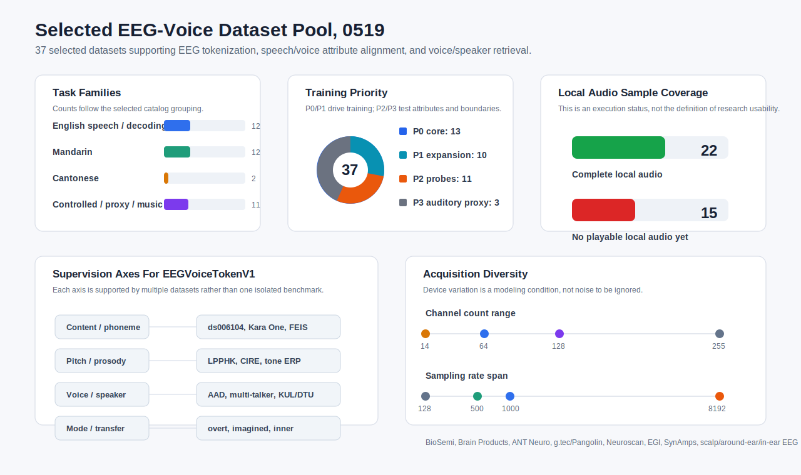

# Selected EEG-Voice Datasets: Detailed Reading Notes（0519）

# 研究口径

这份说明基于 `multi_dataset_voice_eeg_catalog_0518.md` 中已经选定的 37 个 EEG-voice / EEG-audio / speech-proxy 数据集。这里的可用性沿用 catalog 口径：数据集已经进入研究池，并且存在公开下载、公开申请或可追踪访问路径。本地样例只是执行进度，它说明哪些数据已经被拉到机器上，不能替代对整个研究数据池的判断。

这些数据集并不属于同一种实验传统。自然语音数据关注连续听觉追踪，AAD 数据关注目标说话人或目标声源的选择，phoneme / pinyin / tone 数据提供更受控的语音属性标注，imagined / inner / overt speech 数据则把研究从听觉感知推进到发声准备和内隐言语。把它们放在一起阅读时，核心问题不是“哪一个数据集最大”，而是这些范式能否共同支撑一个稳定的模型链路：

```text
EEG -> discrete token
    -> content / pitch / timbre / speaker / style alignment
    -> voice / speaker retrieval / voice-image foundation
```

设备参数优先采用本地 BIDS sidecar、README、channels.tsv、dataset page 与原论文中能够互相印证的信息。没有被本地 metadata 或论文明确确认的条目保留为“待完整包复核”，避免把推断写成采集事实。

## 数据总结图



图中把 37 个 selected 数据集压缩成四层信息：任务范式、训练优先级、本地音频样例覆盖和采集设备差异。它反映的是当前数据池的结构，而不是单纯的下载进度。可以看到，P0/P1 数据已经覆盖 tokenizer 与 retrieval 的主训练需求，P2/P3 数据则主要承担属性 probe、speaking-mode transfer 和 auditory boundary 的角色。

## 数据总结表

| 组别                             | 数据集                                                                                                       | 主任务                                                   | 主要监督信号                                                                      |
| -------------------------------- | ------------------------------------------------------------------------------------------------------------ | -------------------------------------------------------- | --------------------------------------------------------------------------------- |
| English natural / decoding       | `ds004408`, Weissbart, `ds006434`, `ds007630`, `ds007602`, Etard, `ds007591`, Kara One, SparrKULee | 连续听觉、选择性注意、overt / imagined speech            | speech envelope、word/phoneme timing、speech mode、vocal / MIC、attention         |
| Mandarin / Cantonese speech      | `ds005345`, ESAA, NJU AAD, AASD, MS-AASD, Yan 系列、ASA、`ds004718`, tone/syllable ERP                   | 多说话人 AAD、自然语音、声调/音节                        | speaker stream、attention label、tone、F0/intensity、spatial stream               |
| Controlled speech / inner speech | `ds006104`, `ds006465`, Chisco, Inner Speech, FEIS, UGR-MINDVOICE, CIRE, `ds004306`                    | phoneme、pinyin、inner/imagined/overt、prosody/intention | phoneme class、pinyin unit、mode label、emotion/intention、semantic category      |
| AAD expansion / music proxy      | KUL, DTU, 255ch AAD, Fuglsang, Rotaru, Geirnaert, OpenMIIR, MUSIN-G, MAD-EEG                                 | AAD、设备泛化、音乐注意                                  | attended stream、room/spatial condition、sensor modality、pitch/timbre/beat proxy |

| 维度             | 当前状态                                                                        | 对 V1 模型的含义                                                      |
| ---------------- | ------------------------------------------------------------------------------- | --------------------------------------------------------------------- |
| Selected 数据集  | 37 个                                                                           | 已经从候选集合转为可训练研究池                                        |
| 训练优先级       | P0 13、P1 10、P2 11、P3 3                                                       | P0/P1 形成主训练，P2/P3 支撑属性解释和边界验证                        |
| 本地完整音频样例 | 22 / 37                                                                         | 足够做快速试听、特征抽样和统一 manifest；未覆盖项不等同于数据集不可用 |
| 主要任务类型     | 自然语音、AAD、多说话人、phoneme/pinyin/tone、imagined/inner/overt、音乐代理    | 覆盖 tokenizer、alignment、retrieval、mode transfer 四条实验线        |
| 设备跨度         | 14 到 255 通道；128 Hz 到 8192 Hz；scalp、ear、in-ear 多形态                    | 模型必须显式处理 montage、采样率和 device/domain shift                |
| 当前研究边界     | foundation + retrieval，不做 waveform generation 或 personalized reconstruction | 数据池与目标匹配；个体化主观 voice image 仍需自采                     |

本地统一音频状态见 `data/voice_eeg_dataset_samples/_unified_audio/audio_coverage_37.md`。37 个 selected 数据集里，22 个已有完整本地可播放音频样例，15 个公开包不含音频、受版权限制或需要权限/登录。这个差异主要影响样例整理和快速试听，不改变 EEG 训练、属性验证和 retrieval 实验的基本可行性。

---

## 1. `ds004408` — EEG responses to continuous naturalistic speech

- 来源：OpenNeuro / EEGDash，DOI `10.18112/openneuro.ds004408.v1.0.8`。
- 实验范式：健康成人听英文有声书片段，材料来自 *The Old Man and the Sea*。每段音频有 `.wav` 与 TextGrid，TextGrid 给出 word 和 phoneme timing。
- 设备与参数：128-channel BioSemi ActiveTwo EEG；采样率 512 Hz；原始记录未滤波、未重参考。EEGDash 记录 19 subjects、380 recordings。
- 数据内容：每个音频片段对应一段 EEG run；起点与音频对齐。`stimuli/` 中有 audiobook wav 和 forced-alignment TextGrid。
- 已有结果与可用线索：该数据集本身是自然语音 EEG 基准，适合做 speech envelope tracking、phoneme/word onset alignment、match-mismatch retrieval 和 tokenizer 预训练。
- 在当前研究中的位置：英文 P0。它提供最干净的 `EEG <-> continuous speech` 主链路，是 content code 与 base auditory code 的核心来源。
- 本地样例状态：已有本地 EEG run、audio wav、TextGrid 样例，并已复制到 `_unified_audio`。

## 2. `weissbart_natural_speech` — Weissbart natural speech EEG

- 来源：Zenodo `7086168`，题名为 Cortical Tracking of Surprisal during Continuous Speech Comprehension 数据集。
- 实验范式：被试听连续自然语音故事，研究语言 surprisal、precision 与 EEG 低频皮层跟踪之间的关系。
- 设备与参数：当前本地样例包含 BrainVision EEG、stimulus onset、word frequency、alignment audio。完整通道数与采样细节需要从完整 ZIP 或原论文逐项复核。
- 数据内容：连续 EEG、词级 timing、word frequency / surprisal 相关材料，以及故事音频。
- 已有结果与可用线索：原研究报告 cortical activity 在不同频段跟踪 word surprisal，并受 precision 调制。它不是 speaker retrieval 数据，而是 linguistic feature tracking 数据。
- 在当前研究中的位置：英文 P1。主要用于 natural speech tokenizer 与 language-feature probe，不用于 speaker identity 主训练。
- 本地样例状态：已抽取 stimulus metadata 与一个完整 speech wav 样例。

## 3. `ds006434` — ABR to natural speech and selective attention

- 来源：OpenNeuro；PLOS Biology 论文 *The auditory brainstem response to natural speech is not affected by selective attention*。
- 实验范式：被试听自然语音，包含 diotic / dichotic selective-attention 条件。研究 subcortical ABR 与 cortical speech response 是否受注意调制。
- 设备与参数：Brain Products actiChamp EP preamps；32 EEG channels；采样率 500 Hz；参考 TP9/TP10，ground Fpz；extended 10-20 system。
- 数据内容：BIDS EEG、events、channels、task sidecar 与 speech wav。
- 已有结果与可用线索：论文结论是自然语音 ABR 没有明显受到选择性注意影响，而更晚的 cortical responses 能反映注意。这个结果对我们有价值，因为它提示 q0-q1 base auditory code 与 q5-q6 attention/voice retrieval code 不应被混为同一层。
- 在当前研究中的位置：英文 P0/P1。用于区分早期 auditory response 与 attention-modulated response。
- 本地样例状态：已有 EEG metadata、完整 EEG 样例和一个 speech wav 样例。

## 4. `ds007630_eeg_speech_brain_decoding` — EEG-Speech Brain Decoding Dataset

- 来源：OpenNeuro / EEGDash，DOI `10.18112/openneuro.ds007630` 系列。
- 实验范式：包含 `speechopen` 和 `listening`。`speechopen` 是视觉呈现文本后发声，`listening` 是听觉聆听任务。数据说明写明包含 EEG 与 audio。
- 设备与参数：EEGDash 记录 3 subjects、1974 recordings、约 955.3 GB。通道数存在多个 acquisition group：134、90、140、70；采样率主要为 1200 Hz，也有 1024 Hz 与 2048 Hz。
- 数据内容：EDF EEG、speech/open events、listening events，以及 BIDS 之外的 `recording-vocal_beh.wav` / `recording-audio_beh.wav` 路径说明。
- 已有结果与可用线索：这是大体量 speech decoding 数据集，价值在于同时覆盖 perception 和 production，适合作为英文大规模扩展。
- 在当前研究中的位置：英文 P0/P2，但第一版不能依赖它作为唯一核心，因为当前直接 S3/OpenNeuro 文件访问出现 403，需要 EEGDash/OpenNeuro client 或权限路径。
- 本地样例状态：目前只有 EEGDash HTML 记录；无完整本地音频，已在 `_unified_audio/missing_19_audio_attempts.md` 标为 access blocked。

## 5. `ds007602_eeg_speech_overt` — EEG-Speech Brain Decoding Dataset overt speech subset

- 来源：OpenNeuro / EEGDash，DOI `10.18112/openneuro.ds007602.v1.0.1`。
- 实验范式：`speechopen`，被试看视觉文本并发声。
- 设备与参数：ANT Neuro Pangolin 64 / EasyCap M10；128 EEG channels，加 DISPLAY、MIC、EOG、EMG、STIM 等辅助通道后本地 channels.tsv 为 134 通道；采样率 1200 Hz；参考 FCz，ground AFz。
- 数据内容：EDF EEG、events、channels、participant metadata。官方 README 说明 vocal recordings 存在于 `beh/*_recording-vocal_beh.wav`，但当前公开镜像没有直接暴露 standalone wav。
- 已有结果与可用线索：EEGDash 记录 3 subjects、113 recordings、约 49.6 GB。该数据集用于 overt speech production 与 EEG/audio 对齐验证。
- 在当前研究中的位置：英文 P2。它用于 speaking-mode head 的 `overt` 条件，并可作为 production-to-audio probe。
- 本地样例状态：已下载一个 EDF 样例，并按 channels.tsv 中的 `MIC` 通道提取了同步 wav；这个 wav 是诊断性 MIC-channel audio view，采样率 1200 Hz，不等同于高保真 vocal wav。

## 6. `etard_continuous_speech_7086209` — Etard continuous speech and competing speakers EEG

- 来源：Zenodo `7086209`，相关工作包括 Etard 与 Reichenbach 关于连续语音、竞争说话人与脑干/皮层跟踪的研究。
- 实验范式：连续 speech comprehension 与 competing-speaker selective attention。被试在竞争说话人中关注目标语音，并回答理解问题。
- 设备与参数：完整设备参数需要从完整 ZIP / 论文复核；当前本地只抽取了 BrainVision sidecars 和部分 EEG 成员。
- 数据内容：长时 EEG、连续语音刺激、竞争语音条件、stim `.mat` 文件。当前公开 ZIP central directory 中未发现 standalone wav 成员。
- 已有结果与可用线索：相关论文表明连续语音的 brainstem response 与 cortical response 都可用编码/解码模型分析，且竞争说话人注意会影响部分 response。
- 在当前研究中的位置：英文 P0/P1。主要贡献是 competing speech 与 continuous speech tracking；不作为第一批音频可播放样例。
- 本地样例状态：有 EEG/metadata 样例，无完整本地 playable audio。

## 7. `ds007591` — Delineating neural contributions to EEG-based speech decoding

- 来源：OpenNeuro，相关预印本为 *Delineating neural contributions to electroencephalogram-based speech decoding*。
- 实验范式：minimally overt speech / speech production calibration。用于区分 EEG 与 EMG、不同时间段与空间区域对 speech decoding 的贡献。
- 设备与参数：g.tec medical engineering GmbH Pangolin；128 EEG channels；采样率 256 Hz；raw/pre-reference，ground left mastoid。本地 channels.tsv 总通道数为 139，包含非 EEG 辅助通道。
- 数据内容：EDF EEG、events、channels、participants、task metadata。
- 已有结果与可用线索：预印本关注 speech decoding 中 EEG、EMG 与 speech-related brain regions 的贡献，强调去除肌电污染后的解释。
- 在当前研究中的位置：英文 P2。它对 speaking-mode 与 production artifact control 很重要，尤其适合评估 token 是否过度吸收 EMG。
- 本地样例状态：已有一条 EDF 样例与 metadata；未发现公开 standalone audio。

## 8. `kara_one` — Kara One

- 来源：University of Toronto Kara One 页面；Zhao & Rudzicz, ICASSP 2015。
- 实验范式：14 名参与者完成 imagined 与 vocalized phonemic / single-word prompts。每个 trial 有 rest、stimulus、imagined speech、speaking 四个状态。
- 设备与参数：64-channel Neuroscan Quick-Cap，10-20 system；SynAmps RT amplifier；采样率 1 kHz；另有 4 个 ocular electrodes。Microsoft Kinect v1.8 同步记录面部 animation units 与 speech audio。
- 数据内容：EEG `.cnt`、trial indices、Kinect wav、face-tracking features、prompt order。刺激包括 7 个 phonemic/syllabic prompts 和 4 个 words。
- 已有结果与可用线索：原页面报告 subject-independent leave-one-out 下，DBN 在若干二分类 phonological category 任务上达到约 80%-91% accuracy。这个结果证明 EEG 中存在可解码的 phonological category，但不等于可直接生成 speech waveform。
- 在当前研究中的位置：英文 P2。它是 imagined/overt phonological probe 的核心数据集之一。
- 本地样例状态：已从 P02 archive 提取 2 个 Kinect wav 样例，并写入 `_unified_audio`。

## 9. `sparrkulee_eegdash` — SparrKULee / EEGDash `NM000238`

- 来源：KU Leuven RDR / NeMAR / EEGDash；Accou et al. Data 2024。
- 实验范式：年轻正常听力被试听自然语音短故事，用于 speech-evoked auditory response、encoding/decoding 和 match/mismatch paradigm。
- 设备与参数：EEGDash 记录 87 subjects、4088 recordings；64 channels；采样率 8192 Hz。原数据描述为 85 名参与者，每人约 90-150 分钟自然语音。
- 数据内容：BIDS EEG、自然语音 session、speech response metadata。部分受试者在 NeMAR re-host 中因数据使用协议受限被排除。
- 已有结果与可用线索：数据描述给出 linear 与 non-linear speech encoding/decoding、match/mismatch baseline。它是大样本 natural speech EEG 的强扩展。
- 在当前研究中的位置：英文 P1。用于 tokenizer 泛化和 speech/auditory match-mismatch retrieval。
- 本地样例状态：当前只有 EEGDash record；直接对象访问没有拿到 playable wav，受限或需要特定下载路径。

---

## 10. `ds005345` — Le Petit Prince Multi-talker

- 来源：OpenNeuro；Scientific Data 论文 *Le Petit Prince multi-talker: Naturalistic 7T fMRI and EEG dataset*。
- 实验范式：普通话 multi-talker Le Petit Prince，自然语音聆听，包含 single female、single male、mixed speech 等条件。
- 设备与参数：Brain Products BrainAmp DC；EasyCap M10；64 EEG channels；采样率 500 Hz；10-20 system；reference Cz，ground AFz。数据还包含 7T fMRI。
- 数据内容：原始与派生 EEG、speech wav、word/acoustic annotation、fMRI。对 EEG-voice 工作主要使用 EEG/audio/annotation。
- 已有结果与可用线索：Scientific Data 论文提供技术验证，数据用于自然语言、多说话人和跨模态神经语言研究。
- 在当前研究中的位置：中文 P0。它同时提供 single speaker 与 mixture，对 speaker-stream retrieval 和 timbre/content disentanglement 很关键。
- 本地样例状态：已有 local derived EEG、annotation 与多类 wav 样例；统一音频中有 18 个样例。

## 11. `esaa_7078451` — ESAA Mandarin auditory attention

- 来源：Zenodo `7078451`；相关论文 *Auditory attention decoding from EEG-based Mandarin speech envelope reconstruction*。
- 实验范式：普通话 competing speech AAD。被试在男女说话人或空间流中关注目标流。
- 设备与参数：数据说明写明 17 名正常听力被试；每人 32 trials；每 trial 55-90 s。MAT 内包含 `ChannelCount`、channel coordinates、markers、sample rate 等字段；具体设备型号需从完整 MAT/论文中复核。
- 数据内容：EEG `.mat`、Mandarin competing speech stimuli、attention/spatial labels、baseline scripts。
- 已有结果与可用线索：数据页称这是首个 tonal language Mandarin AAD database，并提供 speaker attention detection 与 speaker locus attention detection baseline。
- 在当前研究中的位置：中文 P0。它是 Mandarin speaker/stream retrieval 的核心来源。
- 本地样例状态：已下载 S1 EEG `.mat` 与 `Trail1.wav`，音频已复制进统一目录。

## 12. `nju_aad_7253438` — NJU Mandarin AAD

- 来源：Zenodo `7253438`。
- 实验范式：普通话竞争语音 AAD，用于从 EEG 识别 attended speech stream。
- 设备与参数：当前本地有 preprocessed EEG `.mat` 样例与 scripts；设备型号、通道数、采样率需要从完整数据说明或论文补齐。
- 数据内容：预处理 EEG、attention labels、脚本。公开 ZIP 成员检查中未发现 standalone audio。
- 已有结果与可用线索：作为 Mandarin AAD 训练/泛化补充，可用于 cross-dataset retrieval 和 Mandarin stream tracking。
- 在当前研究中的位置：中文 P0/P1。主要提供普通话 AAD 的被试与条件扩展。
- 本地样例状态：已有一个 preprocessed `.mat` EEG 样例；无完整本地 playable audio。

## 13. `aasd_17413336` — AASD spontaneous auditory attention switch decoding

- 来源：Zenodo `17413336`；Scientific Data 论文 *An Open Non-Invasive EEG Dataset for Spontaneous Auditory Attention Switch Decoding*。
- 实验范式：18 名普通话被试听两个空间化 speech streams，在无外部切换提示的情况下自发切换注意，并用按键标记当前目标流。
- 设备与参数：64-channel EEG；空间化双说话人经 HRTF 呈现到 ±90°；每名被试 60 trials，每 trial 60 s；另有 passive listening control。
- 数据内容：raw CNT、preprocessed MAT、spatialized two-channel AISHELL Mandarin stimuli、button-press switch markers 与 trial-level metadata。
- 已有结果与可用线索：论文/数据说明强调 spontaneous attention switching，而不是传统 sustained attention。其价值在于 label latency 与 streaming AAD 场景。
- 在当前研究中的位置：中文 P0/P1。用于 dynamic attention / retrieval 的状态切换建模。
- 本地样例状态：已有 EEG 和 mixed audio 样例；统一目录中有音频。

## 14. `ms_aasd_17149387` — MS-AASD mixed-speech attention switch decoding

- 来源：Zenodo `17149387`。
- 实验范式：13 名普通话被试听 unspatialized mixed speech，自己决定何时在男女 speech stream 间切换注意，并用按键报告目标流。
- 设备与参数：NeuroScan SynAmps RT；66 scalp electrodes；extended 10-20 system；采样率 500 Hz。刺激经耳机约 65 dB SPL 呈现；E-Prime 2 控制实验。
- 数据内容：mixed speech、male/female clean speech、EEG、keypress switch labels、preprocessing code。
- 已有结果与可用线索：数据说明强调无方向线索，减少 eye movement / spatial shortcut；适合检验模型是否真正利用 speech-EEG matching，而不是空间侧化捷径。
- 在当前研究中的位置：中文 P0/P1。用于 streaming retrieval 与 switch-aware sampler。
- 本地样例状态：已有 female/male/mixed wav 样例与 EEG 样例，音频已统一复制。

## 15. `four_talker_aad_10803261` — Four-Talker AAD (Yan 2024)

- 来源：Zenodo `10803261`；相关工作 *Using Ear-EEG to Decode Auditory Attention in Multiple-speaker Environment*。
- 实验范式：普通话四说话人空间化 AAD。被试在多说话人环境中关注其中一个目标说话人。
- 设备与参数：数据说明标为 64ch NeuSen scalp EEG + cEEGrid ear EEG；公开压缩包包含 Poly5 与 session 文件。详细采样率需完整包复核。
- 数据内容：ear/raw EEG、scalp/ear sensor files、session metadata。当前公开成员检查未发现 playable audio。
- 已有结果与可用线索：相关工作报告四说话人场景中 ear-EEG 与 scalp EEG 的 decoding 差异；论文摘要级信息显示 scalp EEG 明显优于 around-ear EEG，且多说话人任务接近真实听觉场景。
- 在当前研究中的位置：中文 P0。它为 speaker identity 和多 speaker negative pool 提供比双说话人更强的检验。
- 本地样例状态：已有 session 与 Poly5 样例；无完整本地 playable audio。

## 16. `four_direction_aad_10803229` — Four-Direction AAD (Yan 2024)

- 来源：Zenodo `10803229`。
- 实验范式：普通话四方向空间化 AAD，强调空间方向与目标流识别。
- 设备与参数：64ch scalp EEG；消声室/空间化设计；公开文件包括 BDF data、event 和 recordInformation。采样率需从完整 BDF/recordInformation 复核。
- 数据内容：raw EEG BDF、events、recording metadata。
- 已有结果与可用线索：适合比较 voice identity、spatial direction 与 attention label 的耦合。
- 在当前研究中的位置：中文 P0。作为 spatial speaker-stream baseline。
- 本地样例状态：已有 BDF/event metadata 样例；无完整本地 playable audio。

## 17. `non_block_aad_14887886` — Non-block Design AAD (Yan 2025)

- 来源：Zenodo `14887886`；Interspeech 2025 相关材料。
- 实验范式：non-block 设计的普通话 AAD，减少固定 block 范式对注意状态的限制。
- 设备与参数：公开包包含 ear EEG 与 scalp EEG 两条路径，含 Poly5、BDF event 与 recordInformation；具体采样率需完整包复核。
- 数据内容：ear/scalp EEG、events、session metadata。
- 已有结果与可用线索：non-block 设计更接近自然注意变化，可用于测试模型在非固定 trial/block 下的 retrieval 稳定性。
- 在当前研究中的位置：中文 P0/P1。补充 dynamic AAD 与跨设备 EEG。
- 本地样例状态：已有 ear/scalp small metadata 与 EEG 样例；无完整本地 playable audio。

## 18. `asa_lin2024_11541114` — ASA multi-angle Mandarin AAD

- 来源：Zenodo `11541114`；Interspeech 2024 *ASA: An Auditory Spatial Attention Dataset with Multiple Speaking Locations*。
- 实验范式：普通话 auditory spatial attention decoding，包含多角度说话位置。
- 设备与参数：数据页说明多 speaking locations，角度覆盖约 ±5° 到 ±90°；本地样例为 single-trial raw FIF。具体通道和采样率需从完整 FIF 或论文复核。
- 数据内容：raw FIF、preprocessing code、spatial attention labels。
- 已有结果与可用线索：目标是评估多 speaking locations 下的 ASAD，而不是只有左右二分类。
- 在当前研究中的位置：中文 P1。用于 spatial generalization 和 angle-aware negative control。
- 本地样例状态：已有一个 raw FIF EEG 样例；无完整本地 playable audio。

## 19. `ds004718` — LPPHK Cantonese natural speech

- 来源：OpenNeuro；Scientific Data 论文 *Le Petit Prince Hong Kong: Naturalistic fMRI and EEG data from older Cantonese speakers*。
- 实验范式：粤语版本 *The Little Prince* 自然听觉，老年粤语 speaker/listener 数据，含 fMRI 与 EEG。
- 设备与参数：gel-based 64-channel Neuroscan system；10-20 template；采样率 1000 Hz；本地 BIDS sidecar 记录 reference average。
- 数据内容：粤语语音、sentence/word timing、F0、intensity、POS 等 acoustic / linguistic annotations，以及 EEG/fMRI。
- 已有结果与可用线索：数据论文提供自然粤语语音神经数据与技术验证，特别适合 tone/prosody 与 natural speech alignment。
- 在当前研究中的位置：粤语 P0。它是 pitch/prosody code 的关键 naturalistic source。
- 本地样例状态：已有 sentence wav 与 EEG set 样例；统一目录中有 8 个音频样例。

## 20. `cantonese_tone_syllable_7750292` — Cantonese tone/syllable production ERP

- 来源：Zenodo `7750292`。
- 实验范式：粤语 tone / syllable 相关 ERP，面向声调和音节生产/加工。
- 设备与参数：当前样例为 CNT EEG 与行为表；具体设备、通道数、采样率需从完整说明或论文补齐。
- 数据内容：CNT EEG、behavior/condition table。公开记录未列出 standalone audio。
- 已有结果与可用线索：适合做 Cantonese tone/syllable probe，用于检验 EEG token 是否保留 tone-level neural response。
- 在当前研究中的位置：粤语 P2。作为 pitch/tone alignment 的受控补充。
- 本地样例状态：已有 CNT EEG 样例；无完整本地 playable audio。

---

## 21. `ds006104` — EEG dataset for speech decoding

- 来源：OpenNeuro；Scientific Data 论文 *An open-access EEG dataset for speech decoding: Exploring the role of articulation and coarticulation*。
- 实验范式：phoneme discrimination with TMS。Study 1 关注 CV/VC phoneme pairs；Study 2 扩展到 single phonemes、CV pairs、real words 和 pseudowords。
- 设备与参数：ANT Neuro eego mylab system；WaveGuard 64-channel EEG cap；采样率 2000 Hz；reference CPz，ground AFz；channels.tsv 中 EEG usable channels 为 61。TMS 使用 Magstim Super Rapid Plus1，figure-of-eight 40 mm coil，110% resting motor threshold，paired pulses 50 ms interval。
- 数据内容：BIDS EEG、events、channels、phoneme/word stimuli、TMS target metadata、EEGLAB derivatives。
- 已有结果与可用线索：数据论文提供技术验证；近期 benchmark 显示粗粒度 articulatory classification 更容易，细粒度 phoneme/word decoding 难度较高。这一点对我们很重要：content code 不应以单一高准确率二分类作为成功标准。
- 在当前研究中的位置：P0/P2。它是 content、phoneme、coarticulation、style/emotion prompt 的核心 probe。
- 本地样例状态：已有 derived EEG 与大量 stimuli wav；统一目录中有 48 个音频样例。

## 22. `ds006465_3m_cpseed` — 3M-CPSEED Mandarin pinyin speech

- 来源：OpenNeuro；Scientific Data 论文 *3M-CPSEED, An EEG-based Dataset for Chinese Pinyin Production in Overt, Mouthed, and Imagined Speech*。
- 实验范式：20 名右利手普通话被试完成 pinyin 的 speak、silently articulated / mouthed、imagined 三种模式。刺激覆盖 finals `a, i, u, ü` 与 initials `m, f, j, l, k, ch`。
- 设备与参数：本地 BIDS sidecar 记录 32 EEG channels，采样率 500 Hz，extended 10/20 system，power line 50 Hz。README 写明每名被试 4 blocks、总计 1600 trials。
- 数据内容：raw EEG EDF、preprocessed MAT、events、pinyin labels。
- 已有结果与可用线索：数据论文关注三种 speech production modes 的神经动力学差异和跨 pinyin articulation 的可解码性。
- 在当前研究中的位置：中文 P2。它给 speaking-mode head 提供 `overt / mouthed / imagined` 的中文 pinyin 轴。
- 本地样例状态：已有 EDF header、preprocessed MAT 样例；无 standalone audio。

## 23. `ds005170_chisco` — Chisco Chinese imagined speech

- 来源：OpenNeuro；Scientific Data 论文 *Chisco: An EEG-based BCI dataset for decoding of imagined speech*。
- 实验范式：中文句子级 imagined speech。被试先阅读文本，再回忆并想象自己说出该文本。
- 设备与参数：SynAmps-2 128-channel Amplifier 与 128-channel Quik-Cap（Compumedics Neuroscan）；原始 EDF 采样率 1000 Hz，预处理后下采样到 500 Hz；包含 125 EEG channels、6 external channels 与 event marks。实验用 PsychoPy 控制。
- 数据内容：5 名参与者公开数据；每人 5-6 天 session；raw EDF、preprocessed FIF/PKL、textdataset/json。论文初版强调 3 名参与者、每人 6681 trials，后续公开包扩展到 5 名。
- 已有结果与可用线索：论文称 Chisco 提供超过 20,000 sentence-level imagined-speech EEG trials，每名被试超过 900 分钟 EEG，并提供 semantic reconstruction / classification baseline。
- 在当前研究中的位置：中文 P2。它不提供音频，但提供最重要的 imagined-speech semantic/content proxy。
- 本地样例状态：已有 raw/preprocessed EEG 样例和 text metadata；无 standalone audio。

## 24. `cire_2025` — CIRE Chinese prosodic emotion and speech intention EEG

- 来源：Scientific Data 论文 *CIRE: A Chinese EEG Dataset for decoding speech intention modulated by prosodic emotion*；ScienceDB。
- 实验范式：38 名参与者听 240 条普通话语音刺激，判断说话人真实意图。刺激由 120 个句子以两种 intention / prosodic emotion 条件表达。
- 设备与参数：128-channel Quik-Cap-SynAmps 2/RT（Neuroscan, USA）；extended 10-5 system。本地已下载一条 EEGLAB `.set` 样例和一个 speech wav。
- 数据内容：原始/预处理 EEG、sentences.csv、原始音频、Wav2Vec2 acoustic features。
- 已有结果与可用线索：论文和中文报道给出跨被试 intention classification baseline，报道约 68.2% accuracy。它直接服务 prosody、style、intention alignment。
- 在当前研究中的位置：中文 P2。它是 q4 prosody code 与 style/intention head 的关键来源。
- 本地样例状态：已有 `156.wav` 与 EEG set 样例，音频已统一复制。

## 25. `ds003626_inner_speech` — Inner Speech

- 来源：OpenNeuro；Scientific Data 论文 *Thinking out loud, an open-access EEG-based BCI dataset for inner speech recognition*。
- 实验范式：10 名被试完成三种条件：Inner Speech、Pronounced Speech、Visualized Condition。类别为西班牙语方向命令 `Arriba/Up`, `Abajo/Down`, `Derecha/Right`, `Izquierda/Left`。
- 设备与参数：BioSemi ActiveTwo；128 active EEG channels + 8 external EOG/EMG channels；24-bit；采样率 1024 Hz。数据说明记录 total trials = 5640。
- 数据内容：raw BDF、epoched FIF derivatives、events.dat。
- 已有结果与可用线索：论文提供 inner speech multiclass EEG database 和基础识别结果，用于比较 inner、pronounced、visualized 三种范式。
- 在当前研究中的位置：跨语言 P2。它主要用于 speaking-mode transfer，不参与第一版英文主结论。
- 本地样例状态：已有 BDF header、epoched FIF 样例；无 standalone audio。

## 26. `feis_3554128` — FEIS, Fourteen-channel EEG with Imagined Speech

- 来源：Zenodo `3554128`，GitHub FEIS。
- 实验范式：English phonemes 与 Chinese syllables 的 hearing、imagined、speaking 条件。目标是低通道 EEG imagined speech / heard speech / spoken speech 对比。
- 设备与参数：14-channel EEG。具体设备型号和采样率需从完整 FEIS archive 进一步复核。
- 数据内容：EEG、decoded wavs、实验代码和 heard/imagined/spoken 条件文件。
- 已有结果与可用线索：FEIS 作为 imagined speech 数据集被用于 silent-speech BCI 和 stimulus reconstruction 相关工作；它的价值在于低通道、跨语言 prompt 和三种 mode。
- 在当前研究中的位置：P2。用于快速检查 token 在低密度 EEG 下是否保留 phoneme/syllable mode 信息。
- 本地样例状态：已抽取 hearing 与 speaking 两个 wav 样例；EEG archive 还需完整展开。

## 27. `ugr_mindvoice` — UGR-MINDVOICE

- 来源：OSF / GitHub；ScienceDirect / Computer Speech & Language 数据论文。
- 实验范式：15 名 Iberian Spanish native speakers 完成 overt 与 covert speech production，刺激覆盖 phoneme、word、pseudoword。
- 设备与参数：64-channel actiCAP snap system（Brain Products）+ actiCHamp amplifier；BrainVision Recorder；10-20 layout；采样率 1000 Hz；online reference FCz；2 个 EOG electrodes。音频使用 Audio-Technica AT2020USB-XP cardioid condenser microphone，48 kHz、16-bit，约 20 cm 口距。
- 数据内容：同步 overt speech EEG + audio，以及相同刺激下 covert speech EEG；events、channels、audio events、anonymized wav。
- 已有结果与可用线索：论文做了 ERP、signal-quality metrics、covert 阶段 articulatory movement control，以及区分 covert / overt / rest 的 DNN baseline。
- 在当前研究中的位置：跨语言 P2。它是 overt-to-covert transfer 和 mode head 的高质量参考。
- 本地样例状态：已有 EDF、events、channels、audio events 与完整 anonymized wav，音频已统一复制。

## 28. `ds004306_semantic_imagination` — EEG Semantic Imagination and Perception

- 来源：OpenNeuro / EEGDash。
- 实验范式：auditory、visual、orthographic perception and imagination，围绕 semantic concept 进行多模态感知/想象。
- 设备与参数：EEGDash 信息显示 12 subjects、128-channel EEG、约 18.18 h；本地样例包含 preprocessed FIF 与 auditory `.ogg` stimulus。具体采样率需完整 BIDS sidecar 复核。
- 数据内容：audio stimuli、semantic labels、preprocessed EEG。
- 已有结果与可用线索：数据集支持 semantic imagination/perception decoding，不是传统 speech production 数据，但可为 semantic bridge 和 imagined/perceived contrast 提供 probe。
- 在当前研究中的位置：P2/P3。用于检验 EEG token 是否同时支持 auditory perception 与 imagination 的 semantic alignment。
- 本地样例状态：已有一个 audio ogg 与 preprocessed FIF 样例。

---

## 29. `kul_aad_4004271` — KUL AAD

- 来源：Zenodo `4004271`；Biesmans et al. / Das et al. KUL auditory attention dataset。
- 实验范式：16 名正常听力被试听两段荷兰语故事，关注左/右耳或某个 story track。条件包括 HRTF spatialized 与 dry dichotic。
- 设备与参数：BioSemi ActiveTwo；64-channel EEG；原始采样率约 8192 Hz；发布数据高通 0.5 Hz 后下采样到 128 Hz；Etymotic ER3A insert phones，60 dBA。
- 数据内容：subject-specific `.mat`、trial-level attended ear/track、stimuli wav、condition metadata。
- 已有结果与可用线索：这是 AAD 标准 benchmark。数据维护者明确警告深度模型若随机切分 trial 会产生严重过拟合，并且该数据存在 eye-gaze bias 风险。这个警告会直接影响我们的 retrieval split 设计。
- 在当前研究中的位置：P1。用于 AAD retrieval baseline，但必须使用 leave-trial/story/subject 的严格划分。
- 本地样例状态：已有一个 EEG `.mat` 与 dry speech wav 样例。

## 30. `dtu_aad_1199011` — DTU EEG and audio dataset for AAD

- 来源：Zenodo `1199011`。
- 实验范式：被试听两个同时呈现的 speech streams，按 cue 关注目标说话人。包含 anechoic、mild reverberation、high reverberation 条件。
- 设备与参数：64-channel BioSemi system；采样率 512 Hz。trial 长度约 50 s；音频中含 male/female speaker 和 acoustic room condition。
- 数据内容：EEG `.mat`、audio wav、expinfo table、attended speaker/spatial position、room condition。
- 已有结果与可用线索：DTU 数据常用于 room robustness 和 auditory scene AAD benchmark。
- 在当前研究中的位置：P1。用于检验 retrieval embedding 对混响和 room condition 的鲁棒性。
- 本地样例状态：已有 EEG `.mat` 和一个 trial wav 样例。

## 31. `eeg_aad_255ch_4518754` — Ultra high-density 255-channel EEG-AAD

- 来源：Zenodo `4518754`。
- 实验范式：30 名正常听力男性被试完成 AAD，记录高密度 EEG。
- 设备与参数：SynAmps RT（Compumedics, Australia）；255-channel EEG；active Ag/Cl electrodes；国际 10-5 system；采样率 1 kHz。
- 数据内容：S3 tar.gz EEG、stimuli wav、misc scripts。
- 已有结果与可用线索：该数据集主要用于高密度 EEG 下的 AAD、channel selection、sensor-density ablation。
- 在当前研究中的位置：P1。它不是最大样本，但对 sensor-aware encoder 很关键。
- 本地样例状态：已有一个 dry speech wav；EEG archive 较大。

## 32. `fuglsang2020_3618205` — Fuglsang 2020 large-sample AAD

- 来源：Zenodo `3618205`。
- 实验范式：丹麦语 competing-speech AAD，含正常听力与听障被试。
- 设备与参数：BioSemi ActiveTwo；64 scalp electrodes；采样率 512 Hz；本地 BIDS sidecar 记录 reference CMS/DRL，channels.tsv 含 73 行（EEG + auxiliary）。
- 数据内容：BIDS EEG、events、channels、subject metadata。大 tar 中当前扫描到 `task-tonestimuli` BDF/events/channels 成员，未确认 playable audio。
- 已有结果与可用线索：常用于 AAD 方法比较和听障群体泛化；有助于验证模型是否只适合年轻正常听力被试。
- 在当前研究中的位置：P1。用于 speaker retrieval 和 population shift robustness。
- 本地样例状态：已有 EEG metadata 与 BDF 样例；无完整本地 playable audio。

## 33. `rotaru2024_11058711` — Rotaru 2024 long-session AAD

- 来源：Zenodo `11058711`；Journal of Neural Engineering *What are we really decoding? Unveiling biases in EEG-based decoding of the spatial focus of auditory attention*。
- 实验范式：荷兰语长时 competing listening，系统操控 gaze 与 visual conditions，以检验 AAD 是否误用 gaze shortcut。
- 设备与参数：BioSemi ActiveTwo；64-channel EEG；采样率 8196 Hz；另有 4 EOG electrodes；音频经 Etymotic ER10 insert phones，65 dB SPL。数据预处理后先下采样到 256 Hz，再到 128 Hz。
- 数据内容：preprocessed EEG/EOG、attended/unattended envelopes、conditions、randomization、switch metadata。原始 `.wav/.mp4` 因版权排除，只保留 envelope。
- 已有结果与可用线索：论文核心结果是 AAD 方法可能解码 gaze/spatial focus shortcut，而非纯 auditory attention。对我们 retrieval 训练尤为重要。
- 在当前研究中的位置：P1。用于 hard negative 与 gaze-control negative control。
- 本地样例状态：已有 preprocessed `.mat` 样例；无原始音频。

## 34. `geirnaert2025_16536441` — Geirnaert 2025 multi-device AAD / Ear-SAAD

- 来源：Zenodo `16536441`；Scientific Reports *A direct comparison of simultaneously recorded scalp, around-ear and in-ear EEG for neural selective auditory attention decoding to speech*。
- 实验范式：15 名正常听力被试听两个 Danish speech streams，注意其中一个；同时记录 scalp、around-ear、in-ear EEG。
- 设备与参数：scalp EEG 29 channels + 3 EOG，around-ear 19 channels，in-ear 12 channels；本地 BIDS sidecar 记录总 EEGChannelCount 61，采样率 1000 Hz，reference common，ground CPz。每名被试 6 个 10-min trials，共约 60 min。
- 数据内容：BIDS raw dataset、preprocessedData、experiment manual、Danish speech stimuli。
- 已有结果与可用线索：论文比较三种 EEG 形态在 selective auditory attention decoding 中的表现，是 sensor robustness 的直接证据。
- 在当前研究中的位置：P1。用于设备适配、sensor embedding 和跨设备 retrieval generalization。
- 本地样例状态：已抽取 BIDS metadata、preprocessed MAT 与一个 `Speaker1Part1.wav`，音频已统一复制。

## 35. `openmiir` — OpenMIIR

- 来源：OpenMIIR GitHub / ISMIR 2015。
- 实验范式：music perception and imagination。被试听或想象 12 个短音乐片段。
- 设备与参数：64-channel EEG；具体 amplifier 与采样参数需从 OpenMIIR 原始说明复核。
- 数据内容：music wav、beat annotations、stimulus metadata、preprocessed EEG。
- 已有结果与可用线索：OpenMIIR 用于 music imagery information retrieval，已有 tempo/beat tracking 与 MIR-style EEG analysis。
- 在当前研究中的位置：P3。它不是 speech 结论来源，但可为 pitch、beat、auditory imagery 和 q0-q1 auditory token 提供边界。
- 本地样例状态：已有 wav、beats、metadata 与小 FIF 样例。

## 36. `musin_g_ds003774` — MUSIN-G `ds003774`

- 来源：OpenNeuro / EEGDash；Data in Brief 相关数据说明。
- 实验范式：20 名被试听自然音乐片段并完成响应任务；用于 music listening / genre EEG。
- 设备与参数：Magstim EGI NetAmps 400；128-channel Hydrocel Geodesic Sensor Net + Cz reference，BIDS sidecar 记录 EEGChannelCount 129；采样率 250 Hz；EGI layout。
- 数据内容：EEGLAB `.set`、events、channels、music wav。
- 已有结果与可用线索：用于研究自然音乐听觉加工、genre 相关 EEG 和 auditory feature decoding。
- 在当前研究中的位置：P3。用于 timbre/pitch proxy，不承担 speech retrieval 主结论。
- 本地样例状态：已有 EEG set 和 music wav 样例。

## 37. `mad_eeg_4537751` — MAD-EEG

- 来源：Zenodo `4537751`；SMM 2019 论文 *MAD-EEG: an EEG dataset for decoding auditory attention to a target instrument in polyphonic music*。
- 实验范式：8 名被试听 polyphonic music mixture，并关注目标乐器。
- 设备与参数：20-channel EEG；具体硬件与采样率需从 `madeeg_raw.yaml` / paper 复核。
- 数据内容：raw/preprocessed HDF5、behavioral data、stimuli wav、sequence YAML。
- 已有结果与可用线索：原论文和数据页用于 decoding auditory attention to target instrument。它把 speech-AAD 的 attended-source 问题扩展到 music/timbre domain。
- 在当前研究中的位置：P3。用于 target-source attention、timbre proxy 和 auditory tokenizer ablation。
- 本地样例状态：已有 raw HDF5 样例和一个 target instrument wav。

---

## 数据池对模型设计的含义

### 1. tokenizer 可以进入主训练，但设备差异必须进入模型

从数据结构看，第一版 tokenizer 已经有足够的训练材料。更需要认真处理的是采集差异本身。37 个数据集覆盖 BioSemi、Brain Products、ANT Neuro、g.tec/Pangolin、Neuroscan、EGI、SynAmps 以及 ear-EEG / in-ear EEG 等设备族；通道数从 14、20、32、61/64、128 到 255 不等，采样率从 128/250/256/500/512 到 8192 Hz 不等。因此，V1 不适合被写成固定 montage 模型。sensor embedding、channel mask、montage normalization 和 dataset/device adapter 不是工程细节，而是跨数据集结论能否成立的前提。

### 2. 五类 alignment 不是单点证据，而是多范式交叉证据

content 轴由 `ds006104`, `ds006465`, Kara One, FEIS, Chisco 和 Inner Speech 共同支撑；pitch/prosody 轴来自 `ds004718`, CIRE, Cantonese tone/syllable ERP 以及 OpenMIIR、MUSIN-G 这类音乐代理；timbre/speaker 轴主要由 KUL、DTU、ESAA、`ds005345`、Yan 系列、Geirnaert 和 255ch AAD 提供；style/intention 则集中在 CIRE、`ds006104` 与 AASD/MS-AASD 的 switch labels 中。speaking mode 不是某个单独数据集能解决的问题，它需要 Kara One、FEIS、UGR-MINDVOICE、Inner Speech、Chisco、`ds007602` 和 `ds006465` 之间的交叉验证。

### 3. 公开数据的自然落点是 foundation + retrieval

多数 AAD 数据的 speaker/stream label 是数据集内部的；多数 imagined/inner speech 数据没有真实 audio；部分自然语音数据没有统一 speaker bank 或主观相似度评分。因此第一版应继续聚焦：

```text
EEG -> discrete token
    -> content / pitch / timbre / speaker / style alignment
    -> voice / speaker retrieval / voice-image foundation
```

这个目标与当前数据结构吻合。它既不要求所有被试听过同一批说话人，也不要求公开数据具备统一的主观 voice bank。相反，personalized subjective voice image reconstruction 需要同一批被试、同一套 voice bank、系统化 F0/formant/style 操控和主观相似度评分，这仍然是自采实验的问题。

### 4. retrieval evaluation 需要主动避免捷径

KUL 与 Rotaru 的数据说明都提醒了同一个问题：随机切分 trial 容易让模型利用 trial identity、eye gaze 或 spatial shortcut，而不是学习 EEG 与 speech/voice representation 的真实对应关系。因此，V1 的 retrieval 评估应至少包含：

- leave-subject-out；
- leave-story/speaker-out；
- leave-dataset-out；
- gaze/spatial negative control；
- cross-device evaluation。

## 主要来源

- `docs/multi_dataset_voice_eeg_catalog_0518.md`
- `data/voice_eeg_dataset_samples/_unified_index/sample_status.md`
- `data/voice_eeg_dataset_samples/_unified_audio/audio_coverage_37.md`
- EEGDash / OpenNeuro examples: [`ds004408`](https://eegdash.org/api/dataset/eegdash.dataset.DS004408.html), [`ds007630`](https://eegdash.org/api/dataset/eegdash.dataset.DS007630.html), [`ds007602`](https://eegdash.org/api/dataset/eegdash.dataset.DS007602.html), [`ds003626`](https://eegdash.org/api/dataset/eegdash.dataset.DS003626.html), [`ds006465`](https://eegdash.org/api/dataset/eegdash.dataset.DS006465.html), [`ds003774`](https://eegdash.org/api/dataset/eegdash.dataset.DS003774.html), [`NM000238`](https://eegdash.org/api/dataset/eegdash.dataset.NM000238.html)
- Scientific Data / PLOS / journal papers: [`ds006434` PLOS Biology](https://journals.plos.org/plosbiology/article?id=10.1371/journal.pbio.3003407), [`ds005345` Scientific Data](https://www.nature.com/articles/s41597-025-05158-7), [`ds006104` Scientific Data](https://www.nature.com/articles/s41597-025-05187-2), [`ds004718` Scientific Data](https://www.nature.com/articles/s41597-024-03745-8), [Chisco](https://www.nature.com/articles/s41597-024-04114-1), [CIRE](https://www.nature.com/articles/s41597-025-05957-y), [3M-CPSEED](https://www.nature.com/articles/s41597-025-06346-1), [Inner Speech](https://www.nature.com/articles/s41597-022-01147-2), [UGR-MINDVOICE](https://www.sciencedirect.com/science/article/pii/S0885230826000276), [Geirnaert / Ear-SAAD](https://www.nature.com/articles/s41598-025-25576-2)
- Dataset pages: [Kara One](https://www.cs.toronto.edu/~complingweb/data/karaOne/karaOne.html), [KUL AAD](https://zenodo.org/records/4004271), [DTU AAD](https://zenodo.org/records/1199011), [ESAA](https://zenodo.org/records/7078451), [AASD](https://zenodo.org/records/17413336), [MS-AASD](https://zenodo.org/records/17149387), [255ch EEG-AAD](https://zenodo.org/records/4518754), [Ear-SAAD](https://zenodo.org/records/16536441), [MAD-EEG](https://zenodo.org/records/4537751), [FEIS](https://zenodo.org/records/3554128), [ASA](https://zenodo.org/records/11541114)
