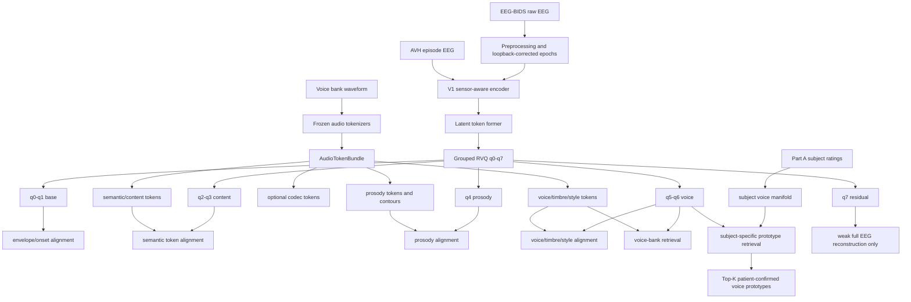
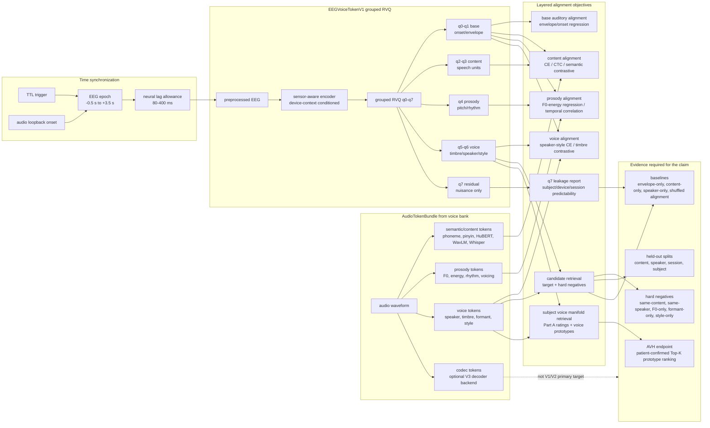

# Voice-Image EEG-Voice Token Model 设计思考（0521）

## 0. 文档定位

本文档回答一个核心工程与科学问题：

```text
如果研究目标是让 EEG-derived tokens 与 voice/audio tokens 最终对齐，
模型应该如何在 EEGVoiceTokenV1 的基础上扩展？
```

结论先行：当前 `EEGVoiceTokenV1` 的方向是对的，但它仍是 public-dataset pretraining 和 synthetic skeleton 阶段。要支撑自采 voice-image EEG 论文，需要把 V1 从“EEG token -> pooled audio embedding retrieval”扩展为：

```text
EEG
-> grouped discrete EEG tokens
-> token-wise semantic / prosody / voice alignment
-> candidate-level voice retrieval
-> subject-specific voice manifold retrieval
-> optional audio decoder interface
```

这里的“对齐好”不能只理解为一个 EEG embedding 和一个 audio embedding 的 InfoNCE 对齐。真正需要的是分层 token 对齐：

- q0-q1 对齐 onset、envelope、shared auditory response。
- q2-q3 对齐 phoneme、pinyin、syllable、HuBERT/WavLM/Whisper semantic units。
- q4 对齐 F0、energy、rhythm、intonation、speaking rate。
- q5-q6 对齐 speaker、timbre、formant、style、voice identity 和 subject-level voice manifold。
- q7 只保留 weak EEG reconstruction residual，不进入任何 alignment、retrieval 或 clinical head。

---

## 1. 模型主张边界

### 1.1 模型要证明什么

模型的第一目标不是生成好听的 waveform，而是证明 EEG token 与 voice/audio token 的可解释对齐关系：

1. EEG token 是稳定的：codebook usage 合理、跨 session 可靠、跨 subject 有迁移能力。
2. EEG token 是可读的：不同 token group 能分别读出 content、prosody、timbre、speaker、style。
3. EEG token 是可检索的：给定 EEG segment，可以在 voice bank 中检索匹配 voice item 或 subject-confirmed voice prototype。
4. EEG token 是可分解的：content-only、speaker-only、F0-only、formant-only、style-only hard negatives 下仍有可解释表现。
5. EEG token 不靠 shortcut：subject_id、session_id、device_id、clinical_label 和 q7 residual 不能解释 primary retrieval。

### 1.2 模型暂时不证明什么

| 不应作为 V1/V2 主张 | 原因 | 正确定位 |
| --- | --- | --- |
| EEG 直接恢复完整语音波形 | 非侵入式 EEG 信噪比和空间分辨率不足；codec residual 过细 | 后续 V3 decoder，可作为渲染接口 |
| EEG 客观还原幻听真实声波 | AVH 无外部 ground-truth waveform | 检索患者事后确认的 subjective voice prototype |
| 只凭公开数据证明 personalized voice image | 缺少统一 voice bank 和主观评分 | 公开数据用于 P0 pretraining，自采数据用于 personalized endpoint |
| q7 也参与 retrieval | q7 极易吸收 subject/device/session shortcut | q7 只做 weak reconstruction 和 nuisance diagnostics |

---

## 2. V1 已经做对的部分

`EEGVoiceTokenV1` 已经实现了几个重要设计，应该保留：

| V1 模块 | 当前作用 | 在 voice-image 模型中的保留方式 |
| --- | --- | --- |
| Sensor-aware temporal encoder | 处理 EEG `[B,C,T]` 和 sensor position | 继续作为 EEG backbone |
| DeviceContextEmbedding | 显式建模 device、montage、reference、sampling rate、channel count | 保留；用于观测空间校正，不作为 retrieval label |
| Latent token former | 把 sensor/time 表征聚合成 latent queries | 保留；后续可加 segment-level aggregator |
| Grouped RVQ q0-q7 | base/content/prosody/voice/residual 分组 | 保留；是论文可解释性的核心 |
| Head routing | 不同 head 只读对应 token group | 保留并强化到 AudioTokenBundle 对齐 |
| q7 weak residual | q7 不进 alignment/retrieval/mode heads | 必须保留，是避免 shortcut 的关键 |
| Retrieval queue | memory queue hard negatives | 保留；扩展为 voice-bank candidate retrieval |
| Speaking-mode head | heard/imagined/inner/overt/control | 保留；B5 imagery 和公开 imagined speech 作为 transfer |

当前 V1 的主要不足不是方向错误，而是接口还太粗：

- `audio_embedding_dim=11` 只是 skeleton 级别，不足以表达 AudioTokenBundle。
- `VoiceAlignmentTargets` 只有 content、phoneme、pitch、prosody、timbre、style、mode，缺少分层 audio token、candidate set、subject voice manifold 和 AVH prototype target。
- retrieval 目前主要是 pooled EEG embedding 对 pooled audio embedding，尚未实现 token-wise semantic/prosody/voice alignment。
- 没有 subject calibration embedding，无法把 Part A 主观评分接入模型。
- 没有 clinical AVH episode 的 soft target/listwise ranking 设计。

---

## 3. 总体架构

推荐把模型命名为 `EEGVoiceTokenV2` 或 `VoiceImageEEGTokenModel`，但不需要推翻 V1。它应该是 V1 的扩展版：

```text
Audio waveform
-> frozen audio tokenizers
-> AudioTokenBundle

EEG segment
-> EEGVoiceTokenV1 backbone
-> grouped EEG tokens q0-q7

AudioTokenBundle + EEG tokens
-> token-wise alignment heads
-> candidate retrieval heads
-> subject voice manifold retrieval
-> AVH prototype retrieval
```



### 3.1 EEG-Voice token alignment 总图

下面这张图把语音 token 与 EEG token 的 alignment 关系压成一个完整闭环。核心思想是：先用 audio loopback 校正时间轴，再把 audio side 拆成 semantic、prosody、voice 三类高层 token；EEG side 用 V1 的 q0-q7 grouped RVQ，其中 q0-q6 进入分层对齐，q7 只做 weak reconstruction 和 nuisance diagnostics。



这张图对应的训练约束是：

```text
q0-q6 can align with semantic / prosody / voice tokens.
q7 cannot enter alignment, retrieval, mode, or clinical heads.
codec tokens are optional downstream decoder targets, not primary EEG supervision.
```

---

## 4. AudioTokenBundle 设计

### 4.1 为什么必须有 AudioTokenBundle

如果 audio side 只有一个 speaker embedding 或一个 waveform codec code，模型会出现两个问题：

1. 语义、韵律、音色混在一个 target 里，无法证明 EEG token 学到的是哪一类声音信息。
2. full codec residual 太细，可能主要反映相位、麦克风、噪声、压缩残差，而不是 EEG 可稳定恢复的 perceptual voice image。

因此 audio target 必须分层：

```text
AudioTokenBundle
  semantic/content
  prosody
  voice/timbre/style
  codec optional
```

### 4.2 推荐字段

```python
@dataclass
class AudioTokenBundle:
    waveform_id: list[str]
    frame_times: Tensor | None

    semantic_unit_ids: Tensor | None
    semantic_embeddings: Tensor | None
    phoneme_labels: Tensor | None
    pinyin_labels: Tensor | None
    word_labels: Tensor | None

    f0_contour: Tensor | None
    energy_contour: Tensor | None
    voicing_mask: Tensor | None
    rhythm_features: Tensor | None
    prosody_token_ids: Tensor | None
    prosody_embedding: Tensor | None

    speaker_embedding: Tensor | None
    timbre_embedding: Tensor | None
    style_labels: Tensor | None
    style_embedding: Tensor | None
    formant_features: Tensor | None
    mfcc_features: Tensor | None

    codec_codes: Tensor | None
    codec_group_names: list[str] | None
    valid_mask: Tensor | None
```

### 4.3 Audio target 分层

| Audio target | 推荐来源 | 对齐 EEG group | 主任务 |
| --- | --- | --- | --- |
| phoneme/pinyin/word labels | transcript, forced alignment | q2-q3 | content CE/CTC |
| HuBERT/WavLM/Whisper units | frozen SSL encoder | q2-q3 | semantic unit prediction |
| F0/energy/rhythm | pyworld, Praat/Parselmouth, librosa | q4 | prosody regression/token CE |
| formants/MFCC/timbre embedding | Praat/librosa/WavLM/FACodec | q5-q6 | timbre regression |
| speaker embedding | ECAPA/WavLM speaker | q5-q6 | speaker/voice retrieval |
| style labels/embedding | voice bank metadata or style encoder | q5-q6 | style CE/contrastive |
| codec codes | EnCodec/FACodec/X-Codec | optional q0-q6 interface only | V3 decoder backend |

V2 的 primary target 应是 semantic/prosody/voice，不是 full codec residual。

---

## 5. EEG token 分组与 audio token 对齐

### 5.1 Group-level contract

| EEG group | 必须对齐 | 不允许承担 | 主要证据 |
| --- | --- | --- | --- |
| q0-q1 base | onset, envelope, shared auditory response | 单独声称 content/voice | silence/noise/scrambled controls |
| q2-q3 content | phoneme, pinyin, syllable, word, SSL semantic units | speaker identity/style | held-out speaker content decoding |
| q4 prosody | F0, energy, rhythm, intonation, tone | speaker identity | F0-only and rhythm controls |
| q5-q6 voice | timbre, speaker, style, formant, voice identity | transcript shortcut | same-content hard negatives |
| q7 residual | weak EEG reconstruction | alignment/retrieval/clinical endpoint | q7 leakage diagnostics |

### 5.2 Token-wise 对齐而不是只做 pooled 对齐

V1 当前 retrieval 使用 pooled q5-q6 voice representation。V2 需要增加三个层级：

1. **Frame/token-level alignment**

   q2-q3 与 semantic units 对齐，q4 与 F0/energy contour 对齐。这里需要保留时间维。

2. **Segment-level alignment**

   q5-q6 与 speaker/timbre/style embedding 对齐。voice identity 比 phoneme 更慢变，可以使用 segment pooling。

3. **Candidate/listwise alignment**

   B4 和 AVH prototype retrieval 不是单个 embedding 对比，而是在候选集内排序。需要 listwise ranking loss 或 candidate InfoNCE。

---

## 6. 模型模块设计

### 6.1 EEG backbone

继续使用 V1：

```text
EEG [B,C,T]
-> normalize/resample/window
-> sensor embedding + device context
-> temporal encoder
-> latent query aggregator
-> grouped RVQ
-> q0-q7 group latents and tokens
```

自采数据中建议保留 V1 的 `sample_rate=250`，但窗口策略要扩展：

| 层级 | 建议 |
| --- | --- |
| tokenizer window | 2 s 可沿用 V1，便于与公开数据 pretraining 兼容 |
| retrieval segment | 3 s segment，可由多个 2 s overlapping windows 聚合 |
| AVH episode | variable length，用 sliding windows + episode-level attention pooling |

这样可以同时利用 V1 代码和 Defossez-style 3 s retrieval 粒度。

### 6.2 SegmentTokenAggregator

新增一个轻量模块，把多个 V1 window token 聚合成 retrieval segment：

```text
V1 windows: [B, W, Q, S, D]
-> group-specific temporal attention
-> segment token representation: [B, group, D]
```

它的作用：

- 对短 voice item，聚合 2-3 s 内的 EEG evidence。
- 对 AVH episode，处理 variable-length episode。
- 对 B4 retrieval，把 target/candidate 时长差异压到可比较空间。

### 6.3 AudioTokenProjector

Audio side 的 tokenizer 通常是 frozen，不应该和 EEG backbone 一起从零训练。新增 projector，把不同 audio encoder 的输出投到统一维度：

```text
semantic units/embeddings -> SemanticProjector
prosody features/tokens   -> ProsodyProjector
voice embeddings/tokens   -> VoiceProjector
```

推荐统一投影维度：

```text
semantic_proj_dim = 256
prosody_proj_dim  = 256
voice_proj_dim    = 256
```

当前 V1 的 `audio_embedding_dim=11` 应视为 synthetic placeholder。真实模型中应改为 256 或 768，并由 projector 输出固定维度。

### 6.4 Alignment heads

| Head | 输入 EEG groups | Audio target | 输出 |
| --- | --- | --- | --- |
| BaseAuditoryHead | q0-q1 | envelope/onset/speech presence | onset/envelope prediction |
| SemanticTokenHead | q0-q3 | HuBERT/WavLM/Whisper units, phoneme/pinyin | token logits, CTC/CE |
| SemanticContrastiveHead | q0-q3 | semantic embeddings | frame/segment contrastive |
| ProsodyHead | q0-q1 + q4 | F0, energy, rhythm, voicing | regression + token CE |
| TimbreHead | q0-q1 + q5-q6 | formants, MFCC, timbre embedding | regression/contrastive |
| SpeakerStyleHead | q0-q1 + q5-q6 | speaker/style labels | CE + balanced accuracy |
| VoiceRetrievalHead | q0-q1 + q5-q6 | candidate voice embeddings | InfoNCE/listwise ranking |
| SubjectVoiceManifoldHead | q0-q1 + q5-q6 + subject manifold | subject-rated voice prototypes | candidate ranking |
| ModeHead | q0-q6 | heard/imagined/inner/overt/control | CE with dataset adapter |

---

## 7. Subject-specific voice manifold

### 7.1 为什么需要 subject manifold

personalized subjective voice image reconstruction 的关键不是模型知道“哪个 speaker ID 正确”，而是知道：

```text
对于这个受试者，这个声音在其主观 voice space 中接近什么。
```

Part A 的评分不是附属行为数据，而是模型 personalized retrieval 的条件。

### 7.2 Manifold 构建

每个 voice item 形成一个 joint feature：

```text
v_item = [
  objective_audio_embedding,
  F0/formant/style features,
  speaker embedding,
  subject rating vector
]
```

然后对每个 subject 建立：

```text
subject_voice_manifold = ManifoldEncoder({v_item, rating_item})
```

可选实现：

| 实现 | 说明 | 推荐阶段 |
| --- | --- | --- |
| PCA/UMAP + metric learning | 简单、可解释、适合 pilot | pilot |
| Subject-specific kNN graph | 用评分相似度定义邻居 | pilot/main |
| Neural manifold encoder | item embedding + rating embedding -> subject-conditioned embedding | main |
| Low-rank subject adapter | 用 Part A 评分生成 adapter，不直接用 subject_id | main |

### 7.3 不要直接喂 subject_id

模型可以使用 `subject_calibration_embedding`，但不应把 `subject_id` 作为 retrieval shortcut。

推荐做法：

```text
Part A ratings
-> subject_calibration_encoder
-> subject_calibration_embedding
-> low-rank adapter / manifold query
```

禁止做法：

```text
subject_id embedding
-> retrieval head
```

原因是后者会让模型记住某个受试者常见的声音偏好，而不是从 EEG episode 中读出 voice image。

---

## 8. Retrieval 设计

### 8.1 三类 retrieval

| Retrieval 类型 | Query | Candidate | 用途 |
| --- | --- | --- | --- |
| Audio item retrieval | listening EEG q5-q6 | actual voice item embedding | healthy B2/B4 primary |
| Attribute retrieval | EEG q4/q5-q6 | F0/formant/style manipulated items | disentanglement |
| Subject prototype retrieval | AVH/imagery EEG q5-q6 + subject manifold | subject-confirmed prototype candidates | clinical endpoint |

### 8.2 B4 candidate-level loss

B4 不是普通 batch retrieval。每个 trial 有一个 target 和 4 个 candidates，且 candidates 是 hard negatives。推荐使用：

```text
score_i = sim(z_eeg_voice, z_candidate_i)
L_b4 = CE(score_1..score_K, target_index)
```

同时保留 in-batch InfoNCE：

```text
L_voice_infonce = InfoNCE(z_eeg_voice, z_audio_voice, queue_negatives)
```

B4 的关键是候选集设计，而不是 batch 里随机 negative 的数量。

### 8.3 AVH prototype soft target

AVH 没有真实 audio target。患者事后选择 Top-5 closest voices，并调 pitch/formant/style slider。因此 target 应是 soft distribution：

```text
positive weights:
  selected_top1: 1.0
  selected_top2: 0.7
  selected_top3: 0.5
  selected_top4: 0.3
  selected_top5: 0.2

slider-morphed prototype:
  additional continuous target in voice manifold
```

可用 listwise loss：

```text
L_avh = KLDiv(log_softmax(scores), soft_target_distribution)
      + margin_rank_loss(selected_topK, non_selected_candidates)
      + manifold_distance_loss(predicted_voice_point, slider_morphed_point)
```

只有 confidence 达到预注册阈值的 episode 进入 primary clinical loss/evaluation。

---

## 9. Loss 总目标

推荐 V2 总 loss：

```text
L =
  L_recon_aligned(q0-q6)
  + 0.25 * L_recon_full(q0-q7)
  + L_vq
  + lambda_base * L_envelope_onset
  + lambda_sem_ce * L_semantic_token_CE
  + lambda_sem_ctc * L_phoneme_or_pinyin_CTC
  + lambda_sem_ctr * L_semantic_contrastive
  + lambda_pros_reg * L_f0_energy_regression
  + lambda_pros_tok * L_prosody_token_CE
  + lambda_voice_reg * L_timbre_formant_regression
  + lambda_voice_ctr * L_voice_embedding_InfoNCE
  + lambda_style * L_style_CE
  + lambda_b4 * L_candidate_retrieval
  + lambda_manifold * L_subject_manifold_ranking
  + lambda_mode * L_speaking_mode
```

临床 AVH 阶段：

```text
L_clinical =
  lambda_avh_rank * L_avh_prototype_ranking
  + lambda_avh_attr * L_avh_slider_attribute_distance
```

临床阶段不建议大规模更新 backbone。优先：

1. 冻结 EEG backbone 和 grouped RVQ。
2. 只训练 subject manifold head 或 adapter。
3. 或使用极小 learning rate 做 subject-specific calibration。

---

## 10. 训练阶段

| Phase | 数据 | 训练内容 | 冻结策略 | 目标 |
| --- | --- | --- | --- | --- |
| P0 Public V1 pretraining | selected public datasets | V1 tokenizer、q0-q7、basic heads、retrieval | 无 | 稳定 EEG token foundation |
| P1 Audio target preparation | self voice bank audio only | frozen audio tokenizers + projectors | EEG 不参与 | 冻结 AudioTokenBundle |
| P2 Healthy listening alignment | B1-B4 | semantic/prosody/voice heads、candidate retrieval | audio tokenizers frozen | 主模型对齐 |
| P3 Hard-negative disentanglement | B1-B4 hard negatives | attribute-specific losses and ablations | backbone 可微调 | 证明不是 shortcut |
| P4 Imagery transfer | B5 | mode head、heard-to-imagined adapter | backbone 大部分冻结 | AVH bridge only |
| P5 Subject adaptation | Part A + selected trials | subject manifold encoder/head | 不直接用 subject_id | 个体化 voice space |
| P6 Clinical AVH validation | natural AVH episodes | prototype retrieval head | backbone frozen or low LR | held-out clinical validation |

### 10.1 推荐顺序

第一篇健康论文只需要 P0-P3，最多加 P4 exploratory。

第二篇临床论文需要 P5-P6，但必须在 P2/P3 已经稳定后再做。

---

## 11. Split policy

模型要证明 token alignment，不是记忆刺激。必须报告：

| Split | 检验问题 | 必须用于 |
| --- | --- | --- |
| held-out trial | pipeline sanity | all tasks |
| held-out content | 不是记住句子 | content and voice retrieval |
| held-out speaker | 不是记住 speaker ID | content/prosody generalization |
| held-out manipulation | 是否理解 F0/formant/style axis | prosody/timbre/style |
| held-out session | test-retest 稳定性 | main claim |
| held-out subject | cross-subject generalization | foundation claim |
| within-subject adapted | personalized voice image | subject manifold claim |
| held-out device | device context 是否有效 | public pretraining |
| held-out clinical subject | clinical validation | AVH paper |

最重要的是区分两类结论：

```text
Cross-subject foundation alignment:
  模型不依赖某个受试者个体校准，能在新 subject 上做基本 voice/audio alignment。

Subject-specific voice image retrieval:
  模型使用该 subject 的 Part A calibration，在其个人 voice manifold 内做检索。
```

这两者不能混写。

---

## 12. Evaluation 指标

### 12.1 Token quality

| 指标 | 解释 |
| --- | --- |
| codebook usage | 是否使用足够多 code |
| perplexity | token 是否坍缩 |
| dead-code ratio | 是否有大量不用 code |
| group usage by q0-q7 | 不同 group 是否承担不同信息 |
| token stability | retest/session 相关性 |

### 12.2 Alignment quality

| Group | 指标 |
| --- | --- |
| q0-q1 | envelope correlation, onset decoding, speech vs silence |
| q2-q3 | phoneme/unit accuracy, CTC loss, content retrieval |
| q4 | F0 MAE, F0 correlation, energy/rhythm correlation |
| q5-q6 | speaker Top-K, style macro F1, timbre embedding retrieval |
| q7 | subject/device/session/clinical predictability diagnostics |

### 12.3 Voice retrieval

| 指标 | 用途 |
| --- | --- |
| Top-1/Top-5 | primary retrieval |
| MRR | ranking quality |
| candidate-level accuracy | B4 hard-negative performance |
| within-subject manifold distance | personalized retrieval |
| prototype Top-K agreement | AVH endpoint |
| shuffled-time baseline | 排除时间错配 |
| content-only/speaker-only/F0-only baselines | 证明 attribute disentanglement |

---

## 13. Ablation 设计

| Ablation | 目的 |
| --- | --- |
| no-RVQ continuous latent | 检验 discrete token 是否必要 |
| q0-q6 only vs q0-q7 in retrieval | 证明 q7 leakage 会污染结论 |
| content-only target | 检验是否只靠 transcript |
| speaker-only target | 检验是否只靠 speaker ID |
| envelope-only baseline | 检验是否只是低层 auditory tracking |
| no subject calibration | 检验 Part A manifold 是否带来 personalized gain |
| subject_id embedding positive control | 作为违规 shortcut 上限，只能放 supplement |
| held-out content/speaker/session | 检验泛化 |
| shuffled EEG/audio | 检验时间对齐 |
| device context ablation | 检验 device context 是校正而不是 shortcut |

`subject_id embedding positive control` 可以作为反例说明模型为什么不能这么做，但不能作为主模型。

---

## 14. 代码接口扩展建议

### 14.1 新 dataclass

```python
@dataclass
class VoiceImageTargets:
    audio: AudioTokenBundle | None = None
    candidate_voice_embeddings: torch.Tensor | None = None
    candidate_voice_ids: list[list[str]] | None = None
    candidate_target_index: torch.Tensor | None = None
    hard_negative_type: list[str] | None = None
    subject_calibration_embedding: torch.Tensor | None = None
    subject_voice_manifold: torch.Tensor | None = None
    prototype_soft_labels: torch.Tensor | None = None
    prototype_morph_features: torch.Tensor | None = None
    avh_confidence: torch.Tensor | None = None
```

### 14.2 新 heads

```text
BaseAuditoryAlignmentHead
SemanticTokenAlignmentHead
SemanticContrastiveHead
ProsodyTokenAlignmentHead
VoiceAttributeAlignmentHead
CandidateVoiceRetrievalHead
SubjectVoiceManifoldHead
AVHPrototypeRetrievalHead
```

### 14.3 Config 需要扩展

当前 `configs/model_v1.yaml` 可保留。建议新增：

```text
configs/model_voice_image_v2.yaml
```

关键新增字段：

```yaml
audio_tokens:
  semantic_dim: 256
  prosody_dim: 256
  voice_dim: 256
  codec_enabled: false

segment:
  tokenizer_window_sec: 2.0
  retrieval_segment_sec: 3.0
  overlap_sec: 1.0

subject_manifold:
  enabled: true
  rating_dim: 10
  embedding_dim: 256
  adapter_rank: 8
  use_subject_id_embedding: false

clinical:
  avh_soft_topk: 5
  min_confidence_primary: TBD
  freeze_backbone: true
```

---

## 15. 最小可实现路线

不要一上来做完整 AVH + waveform。工程上应分四步。

### Step 1：把 V1 接到真实健康 listening 数据

目标：

- BIDS EEG -> `EEGVoiceBatch`。
- Voice bank -> simple `AudioTokenBundle`。
- 跑通 q0-q7 tokens、content/prosody/voice heads、retrieval。

最低 audio target：

```text
HuBERT units
F0 mean / contour
energy contour
MFCC/formants
speaker embedding
style label
```

### Step 2：实现 candidate retrieval

目标：

- 支持 B4 的 target + 4 candidates。
- 输出 candidate-level Top-1/Top-5/MRR。
- hard-negative type 分层报告。

### Step 3：实现 subject voice manifold

目标：

- Part A ratings -> subject calibration embedding。
- voice item -> subject-specific manifold point。
- 检验 no-subject-calibration vs subject-calibrated retrieval。

### Step 4：再接 clinical AVH

目标：

- AVH episode windows -> q5-q6 voice query。
- patient Top-5 prototype -> soft ranking target。
- 输出 within-subject rank improvement。

---

## 16. 论文叙事中的模型图

推荐论文中用三张模型图：

1. **V1 backbone 图**

   EEG -> sensor encoder -> grouped RVQ q0-q7 -> routed heads。

2. **AudioTokenBundle 对齐图**

   audio waveform -> semantic/prosody/voice/codec tokens；q2-q3/q4/q5-q6 分别对齐。

3. **Subject voice manifold 图**

   Part A ratings + voice bank embeddings -> subject manifold；listening/imagery/AVH EEG query -> Top-K voice prototype。

这三张图对应三层贡献：

- discrete EEG token foundation。
- EEG-audio token alignment。
- personalized subjective voice-image retrieval。

---

## 17. 最终推荐模型路线

最稳的模型路线是：

```text
V1 public pretraining
-> V2 self-collected AudioTokenBundle alignment
-> V2 subject voice manifold retrieval
-> clinical AVH prototype validation
-> optional V3 audio decoder rendering
```

具体来说：

1. 保留 V1 的 sensor-aware backbone、device context、grouped RVQ、q7 weak residual 和 routing contract。
2. 把 audio side 从单一 embedding 升级为 frozen AudioTokenBundle。
3. 把 alignment 从 pooled InfoNCE 升级为 semantic/prosody/voice 分层 token 对齐。
4. 把 B4 做成 candidate-level hard-negative retrieval，而不是普通 in-batch retrieval。
5. 把 Part A 评分变成 subject voice manifold 和 subject calibration embedding。
6. 把 AVH episode 建模成 no-ground-truth waveform 的 prototype ranking 问题。
7. 所有 primary claim 都建立在 q0-q6；q7 只做 reconstruction residual 和 leakage report。

这一路线与现有 V1 兼容，也符合自采实验设计的科学边界。它不会过早承诺 EEG-to-waveform generation，但能非常清楚地证明：EEG discrete tokens 是否能在内容、韵律、音色、说话人和个体主观 voice image 层面与 voice/audio tokens 对齐。
