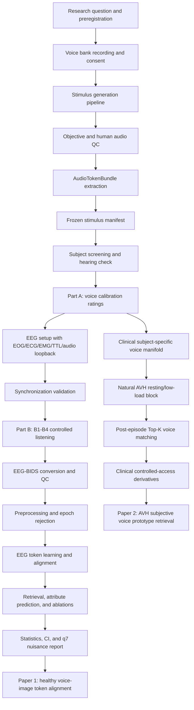
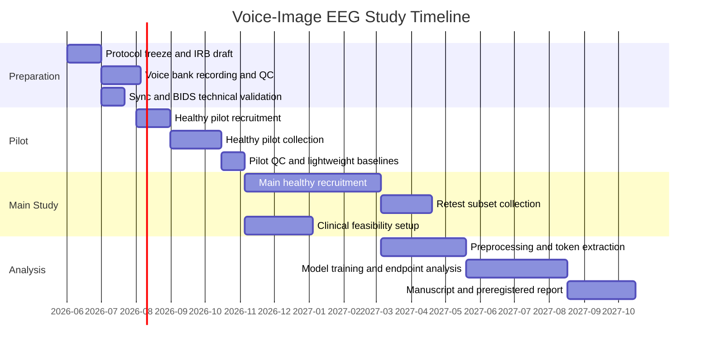

# Voice-Image EEG 实验设计二次优化版（0521）

## 0. 文档定位

本文档是在以下材料基础上的二次优化版：

- `docs/voice_image_eeg_self_collection_protocol_0520.md`：正式自采协议。
- `docs/voice_image_protocol_consistency_review_0520.md`：一致性与 BIDS/统计/执行风险核查。
- `docs/voice_image_pilot_feasibility_review_0520.md`：三个月 healthy pilot 可执行性评估。
- 用户提供的“双实验优化稿”：健康 voice-image EEG 数据集方案与 clinical AVH 扩展方案。

本文不是替代完整协议的删减版，而是把方案重新整理成更适合论文方法、预注册、IRB、pilot 启动和汇报展示的一份可执行设计。核心优化目标是：

1. 用实验设计三原则明确写出对照、随机和重复。
2. 把健康实验与 AVH 临床实验拆成两篇论文可分别支撑的设计。
3. 将 primary endpoints、任务 block、统计模型和成功标准一对一绑定。
4. 把 voice bank、AudioTokenBundle、EEG-BIDS、同步校准和 pilot go/no-go 写成可执行规范。
5. 明确科学主张边界：本研究重构的是 subject-specific voice image 或 voice prototype，而不是客观存在的幻听声波。

---

## 1. 执行概要

本研究的主问题是：能否把非侵入式 EEG 压缩为 grouped discrete EEG tokens，并使这些 tokens 与语音内容、pitch、prosody、timbre、speaker identity、style 以及个体主观 voice image 对齐。优化后的设计分为两个相互衔接但独立发表的实验。

**实验 1：健康受试者 Voice-Image EEG Dataset。**

目标是建立可控 voice bank 与健康 EEG 受控听觉数据，证明 EEG tokens 不只包含 speech content，还能在 held-out content、held-out speaker 和 held-out session 条件下检索声音属性。论文主张应限定为 controlled listening 与 optional imagery 下的 voice-image token alignment 或 voice-image retrieval。

**实验 2：Clinical AVH Voice-Image EEG。**

目标是在不诱发、不强化幻听的前提下，采集自然发生 AVH episode 的 EEG，并检验 episode-level EEG tokens 是否能在患者个体化 voice manifold 中检索其事后确认的 Top-K voice prototype 或 morph。论文主张应限定为 subjective voice-image retrieval，不能写成客观恢复幻听声波。

本版方案相对前稿的关键改动是：

- 明确 stimulus accounting：区分 `source_recording_id`、`voice_item_id`、`derived_item_id`、`analysis_set_id` 和 `voice_prototype_id`。
- 将 full protocol 默认拆分为多 session，避免单日 4 小时以上造成疲劳和肌电污染。
- 增加 synchronization validation：正式 EEG 前必须用 TTL + audio loopback click test 估计 delay、jitter 和 dropout。
- 将 `events.tsv` 的自定义字段写入 sidecar JSON；列表字段使用 `|` 分隔字符串。
- 将 pilot 统计降级为 descriptive + bootstrap + lightweight baseline，main study 才使用 full mixed-effects model。
- 临床 AVH 不使用诱发性相似声音刺激；只采自然 episode 和低负荷 resting/imagery 桥接条件。

---

## 2. 科学主张边界

### 2.1 推荐论文表述

健康主论文可使用以下主张：

> Controlled EEG-voice data support discrete EEG voice tokens that align with speech content, prosody, timbre, speaker identity, and style, enabling subject-specific voice-image retrieval in a controlled voice manifold.

临床扩展论文可使用以下主张：

> In patients with naturally occurring auditory verbal hallucinations, episode-level EEG voice tokens can retrieve patient-confirmed voice prototypes within a subject-specific voice manifold.

### 2.2 禁止或需降级的表述

| 风险表述 | 问题 | 规范替代表述 |
| --- | --- | --- |
| 还原幻听患者听到的真实声音 | AVH 没有客观外部声波；非侵入式 EEG 也不能证明恢复真实 waveform | 在患者个体化 voice manifold 中检索其事后确认的主观 voice prototype |
| EEG 直接生成患者幻听语音 | 超出数据和非侵入式 EEG 上限 | EEG tokens 与患者主观评分/匹配的 voice attributes 对齐 |
| 想象声音可替代 AVH 证据 | healthy imagery 与 clinical AVH 机制不同 | Imagery 只作为 transfer/bridge task，不替代 clinical AVH endpoint |
| AVH 组使用相似刺激诱发幻听 | 伦理风险高，也会混淆自然 episode 与诱发反应 | AVH block 只记录自然发生 episode；外部声音任务与 AVH 记录分开 |

---

## 3. 文献证据链与设计约束

| 设计决定 | 关键文献 | 约束到本实验 |
| --- | --- | --- |
| Voice/timbre 是独立神经目标 | Belin et al., *Nature*, 2000, voice-selective areas in human auditory cortex: https://www.nature.com/articles/35002078 | 不能只采 transcript；必须操控 speaker、formant、timbre、style |
| 非侵入式 EEG/MEG 可做 speech retrieval | Defossez et al., *Nature Machine Intelligence*, 2023: https://www.nature.com/articles/s42256-023-00714-5 | 采用 segment retrieval、held-out split 和 chance/shuffle baselines；不声称 ECoG 级别解码 |
| 神经语音合成应使用中间表示 | Chen et al., *Nature Machine Intelligence*, 2024: https://www.nature.com/articles/s42256-024-00824-8 | EEG 先预测 AudioTokenBundle 和 voice embedding，不直接预测 full waveform |
| 侵入式 BCI 已可个体化 speech synthesis | Anumanchipalli et al., *Nature*, 2019: https://www.nature.com/articles/s41586-019-1119-1；Metzger et al., *Nature*, 2023: https://www.nature.com/articles/s41586-023-06443-4 | 可作为上限参照；非侵入式 EEG 论文主张必须降级为 token alignment/retrieval |
| 2-8 Hz speech rhythm 与 intelligibility 关键 | Poeppel and Assaneo, *Nature Reviews Neuroscience*, 2020: https://www.nature.com/articles/s41583-020-0304-4 | q0-q1 需要保留 onset/envelope，q4 需要保留 rhythm/prosody |
| 语音层级结构可被 cortical activity tracking | Ding et al., *Nature Neuroscience*, 2016: https://www.nature.com/articles/nn.4186 | content token 不能只用 acoustic envelope；需 phoneme/syllable/word units |
| AVH 与 perceptual priors overweighting 有关 | Powers et al., *Science*, 2017: https://doi.org/10.1126/science.aan3458 | AVH 分析必须记录 confidence、externality、distress 和 subjective matching |
| AVH 涉及 inner speech misattribution 与 STG/insula 网络 | Barber et al., *Translational Psychiatry*, 2021: https://www.nature.com/articles/s41398-021-01670-7；Nature Mental Health umbrella review, 2025: https://www.nature.com/articles/s44220-025-00493-5 | 需要区分 external listening、imagery 和 natural AVH；避免 reverse inference |
| EEG 数据必须可复用 | EEG-BIDS, Pernet et al., *Scientific Data*, 2019: https://www.nature.com/articles/s41597-019-0104-8；BIDS EEG spec: https://bids-specification.readthedocs.io/en/stable/modality-specific-files/electroencephalography.html | 使用 EEG-BIDS、events sidecar、stimulus manifest、derivatives schema |

---

## 4. 原始 vs 二次优化要点对照

| 属性 | 实验 1 原始/一版优化 | 实验 1 二次优化 | 实验 2 原始/一版优化 | 实验 2 二次优化 |
| --- | --- | --- | --- | --- |
| 目标 | 建立 EEG 到语音内容/音色/说话人变量的预测 | 明确为 healthy controlled listening 下的 AudioTokenBundle alignment 和 voice retrieval | 验证 EEG 声音检索并扩展到 AVH | 明确为自然 AVH episode 的 subjective prototype retrieval，不诱发幻听 |
| 假设 | 内容、音色、检索、解耦 | H1-H4 绑定 block、metric、split 和 baseline | 健康/AVH 差异和幻听相关性 | 分为 feasibility endpoint 与 confirmatory endpoint，episode 数不足时自动降级 |
| 自变量 | content、speaker、pitch、timbre、style | 增加 hard-negative 类型和 held-out split；每个 manipulation 有 manifest | group、clinical status、stimulus condition | 增加 confidence、distress、externality、PSYRATS、medication 作为协变量 |
| 因变量 | EEG token、评分、检索准确率 | Top-1/Top-5/MRR、F0 MAE、style F1、embedding retrieval、q7 predictability | 检索、分类、临床量表 | AVH Top-K prototype agreement、within-subject rank improvement、episode-level confidence gating |
| 对照 | silence/noise 简略提及 | silence、speech-shaped noise、scrambled voice、non-vocal sound、shuffled alignment、content-only/speaker-only baselines | healthy vs AVH | healthy matched control、psychiatric control 可选；不把外部刺激反应混作 AVH |
| 随机化 | 顺序随机 | seeded subject-wise randomization、balanced incomplete block、Latin-square counterbalancing | 区组随机简略 | matched recruitment + stimulus order randomization + analyst blinding |
| 重复 | test-retest 简略 | 30 人 7-14 天 retest；重复 item 只用于 reliability，不进入 primary leakage | 多次测试 | episode-level repetition 和 subject-level random effects；最低 episode 规则 |
| 样本量 | pilot 12-20，main 40-60 | pilot 16/effective 12，main 80/effective 60；pilot 后冻结 power/precision rationale | AVH 30/effective 20 | 若 total usable episodes <80 或 <10 人有 >=3 episodes，只报告 feasibility |
| 流程 | Part A + Part B | 默认两 session；pilot 压缩 B1/B2/B4，B3 缩短，B5 exploratory | Part A/B + clinical | clinical AVH 单独 resting/low-load block，post-episode matching 立即完成 |
| BIDS | 提到 BIDS | 明确 events sidecar、list delimiter、derivatives、controlled access | 提到临床数据保护 | 自由文本、量表、voice matching 进入 controlled access；健康匿名数据可公开 |
| 成功标准 | 显著高于随机 | endpoint-by-endpoint success thresholds 和 go/no-go thresholds | 差异显著 | primary 为 subjective prototype retrieval，一切结论受 confidence 和 episode 数约束 |

---

## 5. 统一术语表

| 术语 | 操作定义 | 数据字段 |
| --- | --- | --- |
| `source_recording_id` | 原始录音文件主键，未经过 pitch/formant/style/spatial 派生 | `voice_bank_sources.tsv` |
| `voice_item_id` | 可呈现给受试者的一条标准化语音刺激 | `events.tsv: stim_file`, `voice_item_id` |
| `derived_item_id` | 从同一 source recording 派生出的 F0/formant/spatial/control 版本 | `voice_bank_manifest.tsv` |
| `analysis_set_id` | B1/B2/B3/B4/control 等分析集合标签 | `events.tsv` |
| `voice_profile` | item 的客观声学与模型特征向量：F0、energy、formant、MFCC、speaker embedding、style embedding 等 | `derivatives/audio_features/` |
| `subject_voice_manifold` | 个体主观评分 + audio embeddings 形成的低维声音空间 | `derivatives/voice_embeddings/` |
| `voice_prototype_id` | 受试者或患者选择/调节后确认的主观声音原型 | `clinical_ratings/`, `beh/*.jsonl` |
| `AudioTokenBundle` | semantic/content、prosody、voice、style 和 optional codec token 的分层音频目标 | `derivatives/audio_tokens/` |
| `EEG token` | 离线模型从 EEG 中学习到的 grouped discrete tokens；采集阶段不依赖在线 tokenization | `derivatives/eeg_tokens/` |

---

## 6. 实验 1：健康受试者 Voice-Image EEG Dataset

### 6.1 研究目的

建立健康成人的可控 EEG-voice 数据集，检验 EEG tokens 是否能稳定对齐 speech content、pitch、prosody、timbre、speaker identity 和 style。实验 1 是第一篇主论文的核心数据，不包含临床 AVH 主张。

### 6.2 可证伪假设

| 假设 | 任务 block | 主要指标 | 成立标准 |
| --- | --- | --- | --- |
| H1 Content alignment | B1 Content Listening | content retrieval / phoneme or unit accuracy / CTC-CE | held-out speaker 和 held-out content 条件下显著高于 shuffled EEG-audio baseline |
| H2 Prosody alignment | B3 Prosody/Style | F0/prosody temporal correlation、MAE、Spearman/Pearson | F0-only hard negatives 中优于 envelope-only baseline |
| H3 Timbre/speaker/style alignment | B2 Timbre/Speaker, B3 Style | speaker/style balanced accuracy、macro F1、embedding retrieval | same-content different-speaker 与 formant-only 条件下显著高于 chance |
| H4 Disentanglement | B4 Voice Retrieval | Top-1/Top-5/MRR by hard-negative type | content-only、speaker-only、F0-only、formant-only、style-only negatives 分别报告并均有可解释性能 |

### 6.3 变量与对照

| 类型 | 变量/条件 | 说明 |
| --- | --- | --- |
| 自变量 | content、speaker、F0 shift、formant shift、style、spatial azimuth | 每个变量写入 stimulus manifest；不做全组合，使用 fractional factorial |
| 因变量 | EEG token、content/prosody/voice predictions、retrieval accuracy、behavioral ratings | primary 以 subject-level metrics 汇总 |
| 控制条件 | silence、speech-shaped noise、scrambled voice、non-vocal sound | 区分低层听觉响应、speech-like acoustic response 和 voice-specific response |
| Hard negatives | same-content different-speaker、same-speaker different-content、F0-only、formant-only、style-only | 防止模型只走 transcript、speaker 或低层声学 shortcut |
| Nuisance checks | subject_id、session_id、device_id、q7 predictability | 必须报告，证明 residual shortcut 没有污染 primary head |

### 6.4 样本与功效策略

| 阶段 | 招募目标 | 有效样本目标 | 目的 |
| --- | ---: | ---: | --- |
| Technical pilot | 2-4 | 不进入主分析 | 验证 voice bank、TTL/audio loopback、BIDS writer |
| Healthy pilot | 16 | >=12 | 估计 artifact rate、rating ICC、baseline retrieval、session 时长 |
| Healthy main | 80 | >=60 | 主模型训练、held-out split、attribute alignment |
| Retest subset | main 中 30 | >=25 | 7-14 天 test-retest，检验 token 与 voice manifold 稳定性 |

若 pilot 前没有 formal power calculation，预注册需明确写明：sample size is based on feasibility, prior non-invasive speech decoding studies, and precision needs for within-subject retrieval estimates. Pilot 完成后应冻结主实验样本量依据，至少报告：

- primary endpoint 的 subject-level effect size 和 bootstrap CI。
- valid epoch ratio 与 dropout rate。
- Part A rating ICC。
- B4 behavioral retrieval 是否高于 chance。
- 预期 main study 在 n=60 有效样本下对 Top-K retrieval improvement 的 precision。

### 6.5 随机化、平衡与盲法

1. 每名受试者使用独立随机种子生成 stimulus order，种子写入 `sub-*/beh/*_randomization.json`。
2. B1-B4 内部使用 balanced incomplete block，保证每个 content、speaker、F0/formant/style 水平出现次数近似平衡。
3. B4 candidate order 每 trial 随机；正确 candidate 位置四选一均衡。
4. Catch trial 的 yes/no 答案比例均衡，不能让某个按键成为 shortcut。
5. 预处理阶段可见 subject/session，但不使用 task labels 做人工数据清理。
6. Primary analysis 脚本在 pilot 后冻结；main study 分析者在模型选择阶段不查看 clinical group label。

### 6.6 Voice bank 与 stimulus generation pipeline

#### 6.6.1 Voice bank 最小规格

| 项目 | Pilot | Main |
| --- | ---: | ---: |
| 真实说话人 | 8-12 | 12 |
| source recordings | 240-360 | 600-900 |
| 每人 Part A rating | up to 200 | up to 200 |
| EEG presented items | 根据 B1-B4 抽样 | 根据 B1-B4 抽样 |
| control items | >=40 | >=120 |

#### 6.6.2 生成流程

```text
speaker consent
-> raw recording
-> trim and silence cleanup
-> loudness normalization
-> F0/formant/spatial/control transforms
-> objective QC
-> human listening QC
-> feature extraction
-> AudioTokenBundle extraction
-> frozen voice_bank_manifest.tsv
-> experiment randomization manifests
```

推荐工具：

- Loudness：`pyloudnorm` 或 EBU R128-compatible pipeline。
- F0/formant：Praat/Parselmouth 或 WORLD vocoder；主实验前固定一条路线。
- Audio features：librosa/torchaudio 提取 F0、energy、MFCC、spectral centroid、roughness proxy、formant estimates。
- Content units：HuBERT/WavLM/Whisper units。
- Voice/style：speaker embedding、style embedding、codec semantic/prosody/voice codes。

所有派生刺激必须保存生成参数和版本号；不可只保存最终 wav。

### 6.7 实验流程

#### Session A：筛查与 voice calibration

| 步骤 | 时长 | 输出 |
| --- | ---: | --- |
| Consent, hearing screen, demographic form | 15-25 min | `participants.tsv`, hearing threshold |
| Part A voice ratings | 35-50 min | pitch、brightness、roughness、breathiness、gender/age impression、style strength、familiarity、externalization、confidence |
| Optional practice | 5-10 min | catch task comprehension |

#### Session B：EEG controlled listening

| Block | 目标 | 推荐 pilot 规模 | Main 规模 |
| --- | --- | ---: | ---: |
| B1 Content Listening | q2-q3 content | 96-128 trials | 160 trials |
| B2 Timbre/Speaker Listening | q5-q6 voice | 120-144 trials | 180 trials |
| B3 Prosody/Style Listening | q4 prosody + style | 72-120 trials | 180 trials |
| B4 Voice Retrieval | subject-level retrieval | 72-96 trials | 120 trials |
| B5 Imagined Voice | AVH bridge only | optional 30-40 trials | separate/exploratory |

首轮 pilot 不建议把 B5 作为 primary endpoint。若运行 B5，必须记录 jaw/neck EMG 或明确标注为 exploratory。

### 6.8 EEG 采集与同步

| 项目 | 最低规格 | 推荐规格 |
| --- | --- | --- |
| EEG | 64 channel, 500 Hz | 128 channel, 1000 Hz |
| Reference | online Cz/mastoid, offline average and mastoid reference saved | 同左 |
| Aux | EOG、ECG、jaw/neck EMG、TTL、audio loopback | 同左 |
| Impedance | target <10 kOhm, max <20 kOhm | <10 kOhm |
| Audio level | hearing-adjusted 60-70 dB SPL | calibrated with sound level meter/coupler |
| Sync | corrected onset error <10 ms for pilot | target <5 ms for main |

正式受试者前必须完成 synchronization validation：

1. 用正式 presentation stack 播放 100-200 个 click/pulse。
2. 同时记录 TTL 和 audio loopback。
3. 输出 TTL-to-loopback delay mean、SD、max、dropout rate。
4. 如果 run-level corrected onset error >10 ms，暂停采集并修复 audio chain。

### 6.9 EEG-BIDS 与数据结构

最低文件结构：

```text
sub-001/
  eeg/
    sub-001_task-voiceimage_eeg.*
    sub-001_task-voiceimage_events.tsv
    sub-001_task-voiceimage_events.json
    sub-001_task-voiceimage_channels.tsv
    sub-001_task-voiceimage_eeg.json
  beh/
    sub-001_task-voicecalibration_ratings.tsv
    sub-001_task-voiceimage_randomization.json
stimuli/
  voice_bank_sources.tsv
  voice_bank_manifest.tsv
  voice_bank_features.tsv
derivatives/
  audio_features/
  audio_tokens/
  eeg_preproc/
  eeg_tokens/
  voice_embeddings/
```

`events.tsv` 可包含自定义列，但必须在 `events.json` 描述。列表字段一律使用 `|` 分隔，例如：

```text
candidate_voice_ids = v001|v014|v032|v077
```

复杂对象进入 `beh/*.jsonl` 或 derivatives，不直接塞入 TSV 单元格。

### 6.10 预处理与质量控制

| 步骤 | 规范 |
| --- | --- |
| Filtering | 0.1-40 Hz 或 1-40 Hz primary pipeline；notch for line noise |
| Referencing | average reference 和 mastoid reference 派生都保存 |
| Bad channels | 自动阈值 + manual review；review 不看 task labels |
| Artifact correction | ICA/SSP for EOG/ECG；EMG-rich epochs 标记 |
| Epoching | audio-loopback corrected onset；window 与 block endpoint 对齐 |
| Exclusion | valid epochs <70%、catch accuracy <70%、同步失败 run、严重肌电污染 |
| QC report | 每人输出 bad channel ratio、valid epoch ratio、catch accuracy、sync error、rating reliability |

### 6.11 Endpoint-to-analysis mapping

| Endpoint | Block | Metric | Primary contrast | Statistical model | Multiple correction |
| --- | --- | --- | --- | --- | --- |
| Content retrieval | B1 | Recall@K, unit accuracy, CTC/CE | true alignment vs shuffled EEG/audio | subject-level bootstrap + mixed-effects in main | FDR across content endpoints |
| Prosody prediction | B3 | F0 MAE, temporal correlation | F0-only vs envelope-only baseline | cluster permutation for time series; bootstrap for summary | FDR across prosody metrics |
| Timbre/speaker | B2 | balanced accuracy, macro F1, embedding retrieval | same-content different-speaker vs chance | mixed-effects with random subject/speaker/content in main | FDR across voice attributes |
| Voice retrieval | B4 | Top-1/Top-5/MRR | hard-negative retrieval vs random candidate | subject-level bootstrap; mixed-effects rank model in main | primary family |
| Disentanglement | B1-B4 | drop in performance by ablation | q0-q6 vs content-only/speaker-only/q7 leakage | paired subject-level tests | FDR across ablations |
| Nuisance leakage | all | subject/session/device/q7 predictability | q7 in/out heads | descriptive + negative-control tests | reported regardless of significance |

### 6.12 成功标准

Pilot go/no-go：

- 完成率 >=75%。
- run-level corrected onset error <10 ms。
- valid epoch ratio >=70%。
- catch accuracy >=70%。
- Part A rating ICC >=0.60，或删除低质量 items 后达到。
- B4 behavioral retrieval 高于 chance。
- 至少一个 lightweight EEG baseline 高于 shuffled baseline。

Main paper success：

- B4 Top-1/Top-5/MRR 在 held-out content、held-out speaker、held-out session 至少两个 split 中显著高于 chance。
- F0/prosody temporal prediction 优于 envelope-only baseline。
- Timbre/speaker/style endpoints 在 same-content hard negatives 下显著高于 chance。
- q7 leakage analysis 不支持 subject/device/clinical shortcut 解释 primary retrieval。

---

## 7. 实验 2：Clinical AVH Voice-Image EEG

### 7.1 研究目的

在当前有 auditory verbal hallucination 的患者中，检验自然 AVH episode 的 EEG tokens 是否能检索患者事后确认的 voice prototype。实验 2 是 clinical extension，只有在临床样本和 episode 数量达标时才能形成 confirmatory paper。

### 7.2 可证伪假设

| 假设 | 数据 | 主要指标 | 成立标准 |
| --- | --- | --- | --- |
| C1 Feasibility | AVH resting/low-load block | usable episode count、confidence、artifact rate | total usable episodes >=80 且 >=10 subjects 有 >=3 episodes |
| C2 Prototype retrieval | AVH episode EEG | Top-K agreement with patient-confirmed prototype | within-subject rank improvement 高于 shuffled-time/random prototype |
| C3 Attribute agreement | post-episode sliders | pitch/formant/style distance | EEG-predicted attributes 与 patient morph 显著相关 |
| C4 Clinical modulation | clinical scales | retrieval strength vs PSYRATS/PANSS/confidence | mixed-effects/Bayesian model 中 confidence/PSYRATS 解释 episode-level variance |

若 C1 不成立，只能报告 feasibility 和 negative data，不能声称已验证 AVH voice-image reconstruction。

### 7.3 分组与匹配

| 组别 | 招募目标 | 有效目标 | 作用 |
| --- | ---: | ---: | --- |
| Clinical AVH | 30 | >=20 with usable data | primary clinical group |
| Psychiatric control | 30 | >=24 | 可选，控制 general psychosis/medication |
| Healthy matched control | 30 | >=24 | 控制 age/sex/hearing/language |

匹配变量至少包括年龄、性别、语言背景、听阈、教育年限；临床模型记录 medication、illness duration、sleep、caffeine、nicotine。成年患者不默认需要监护人同意，但必须由精神科医生或合格临床人员评估 consent capacity；若当地 IRB 或法律要求法定代理人，则按 IRB 执行。

### 7.4 临床安全边界

1. 不诱发、不强化、不训练幻听。
2. 不向患者呈现“专门模仿其幻听”的刺激以诱发 episode。
3. 只采自然发生 AVH，或在低负荷 resting/imagery 条件下记录自发 episode。
4. 患者可随时暂停、跳过或退出，不影响治疗。
5. 现场必须有精神科医生或训练过的临床人员。
6. 若 distress、panic、agitation、command hallucination risk 或临床人员判断风险升高，立即停机。
7. 自由文本、临床量表、voice matching 结果和可识别临床信息进入 controlled access。

### 7.5 Clinical AVH 流程

| 步骤 | 时长 | 输出 |
| --- | ---: | --- |
| Clinical screening and capacity check | 20-40 min | consent capacity, PANSS/PSYRATS/AVHRS-Q |
| Part A shortened voice calibration | 20-35 min | subject voice manifold anchors |
| EEG setup | 45-60 min | EEG + aux + sync |
| Low-load resting/AVH block | 20-30 min | button-marked AVH onset/offset, continuous EEG |
| Post-episode matching | immediately after each episode | Top-5 closest voices, pitch/formant/style sliders, confidence |
| Debrief and safety check | 10-20 min | adverse event log, distress rating |

若患者没有自然 AVH，保留 resting negative data，但不纳入 AVH primary endpoint。

### 7.6 AVH episode 数据编码

推荐两层编码：

- `events.tsv` 中使用独立 event row：`trial_type=avh_episode`，`onset` 和 `duration` 表示 episode。
- post-episode rating 使用 `avh_episode_id` 与 episode row 关联。

`avh_top5_voice_ids` 使用 `|` 分隔，不写 Python list。自由描述、slider 轨迹和多轮 matching 存为 `beh/*_avh_matching.jsonl`。

### 7.7 Clinical endpoint-to-analysis mapping

| Endpoint | Metric | Inclusion rule | Model | 降级规则 |
| --- | --- | --- | --- | --- |
| AVH prototype retrieval | Top-K agreement, MRR, rank improvement | confidence >= preregistered threshold; artifact-clean EEG | hierarchical mixed-effects or Bayesian rank model | episode 不足则只做 descriptive feasibility |
| Attribute reconstruction | pitch/formant/style distance | completed slider morph | within-subject correlation + mixed-effects | slider 不稳定则从 primary 降为 exploratory |
| Group comparison | retrieval/attribute metrics | matched controls with same tasks | group fixed effect + subject random effect | psychiatric control 不足时只报告 healthy comparison |
| Clinical association | PSYRATS/PANSS/confidence | complete scales | Bayesian/mixed-effects with covariates | 不做 causal claim |

### 7.8 Clinical success standard

临床论文最低门槛：

- 至少 20 名患者有可用 clinical EEG，且 total usable AVH episodes >=80。
- 至少 10 名患者有 >=3 个 confidence-qualified episodes。
- AVH episode 的 Top-K prototype retrieval 优于 shuffled-time/random-prototype baselines。
- 结果在排除低 confidence episodes 后仍保留方向一致性。
- 论文表述限定为 subjective voice prototype retrieval。

---

## 8. 数据与代码可重复性规范

### 8.1 冻结项

Pilot 完成后、main study 开始前必须冻结：

- stimulus manifest 与 manipulation version。
- B1-B4 trial counts 和 randomization policy。
- preprocessing parameters。
- train/validation/test split policy。
- primary endpoints 与 baseline list。
- q7 nuisance report 指标。
- exclusion rules。

### 8.2 可公开与受控访问

| 数据类型 | 建议访问级别 |
| --- | --- |
| 健康匿名 EEG-BIDS | 可公开，优先 OpenNeuro/OSF |
| voice bank wav | 取决于 speaker consent；至少公开 metadata 和 derived features |
| 健康 behavioral ratings | 匿名后公开 |
| 临床 EEG | controlled access |
| AVH free text, voice matching, clinical scales | controlled access only |
| 训练代码、preprocessing scripts、analysis notebooks | 公开 |

### 8.3 软件环境

建议使用 `environment.yml` 或 `requirements-lock.txt` 固定版本，至少记录：

- Python, MNE-Python, NumPy, SciPy, pandas, scikit-learn。
- PyTorch/torchaudio/transformers。
- Praat/Parselmouth or WORLD。
- BIDS validator version。
- random seeds and manifest hashes。

---

## 9. 自动化 Prompt 模板

### 9.1 生成实验流程

```text
你是一位 EEG 语音解码实验设计专家。请基于研究目标“{研究目的}”生成可执行实验流程。
必须包含：受试者筛选、分组、voice bank 生成、随机化、任务 block、EEG 采集、同步校准、数据存储、预处理、分析和 go/no-go 标准。
请用表格给出每一步的输入、输出、预计时长、失败标准和补救措施。
```

示例填充：

```text
研究目的：通过健康受试者 controlled listening EEG，验证 EEG tokens 可对齐语音内容、pitch、timbre、speaker 和 style，并进行 voice retrieval。
```

### 9.2 生成测量工具

```text
根据实验需求，为变量“{变量名}”设计测量工具。
请输出：题目说明、量表范围、锚点定义、呈现时机、数据字段名、质量控制规则和 exclusion rule。
```

示例填充：

```text
变量名：受试者对声音外部化程度的主观评分。
```

### 9.3 模拟 pilot 数据

```text
模拟 {N} 名受试者的 pilot 数据。
变量包括：subject_id、block_id、trial_id、stim_file、speaker_id、content_id、f0_shift、formant_shift、style、response_time_ms、catch_correct、valid_epoch、retrieval_rank、rating_confidence。
请输出一个小型 Markdown 表格，并说明该数据只能用于 pipeline smoke test，不能用于真实统计结论。
```

### 9.4 生成分析代码

```text
使用 {R/Python} 代码计算 {分析目标}。
给定数据框 df，包含变量 {变量列表}。
请输出可运行代码，并包括：数据检查、主模型、bootstrap 或 mixed-effects 推断、效应量、置信区间和多重比较修正。
```

示例填充：

```text
分析目标：比较 B4 voice retrieval 的 MRR 是否高于随机候选 baseline。
变量列表：subject_id, trial_id, retrieval_rank, n_candidates, hard_negative_type。
```

### 9.5 结果总结撰写

```text
根据以下预注册指标和分析结果，撰写一段论文 Results 风格总结。
要求：先报告 primary endpoint，再报告 CI、effect size、baseline、exclusion 数量和 residual risk。
禁止使用“读心”“客观还原幻听声波”等过度表述。
输入结果：{结果概述}
```

---

## 10. 示例数据与分析片段

以下数据仅用于 pipeline smoke test 和汇报演示，不可作为真实统计推断示例。

| subject_id | group | block_id | stim_id | hard_negative_type | response_time_ms | valid_epoch | retrieval_rank | confidence |
| --- | --- | --- | --- | --- | ---: | ---: | ---: | ---: |
| S001 | healthy | B4 | v001 | same_content_diff_speaker | 812 | 1 | 1 | 0.82 |
| S001 | healthy | B4 | v014 | f0_only | 905 | 1 | 2 | 0.76 |
| S002 | healthy | B4 | v032 | formant_only | 744 | 1 | 1 | 0.88 |
| P001 | clinical_avh | AVH | ep003 | prototype_pool | 0 | 1 | 2 | 0.71 |

Python 示例：

```python
import numpy as np
import pandas as pd

df = pd.DataFrame({
    "subject_id": ["S001", "S001", "S002", "S003"],
    "retrieval_rank": [1, 2, 1, 3],
    "n_candidates": [4, 4, 4, 4],
})

df["mrr"] = 1 / df["retrieval_rank"]
observed = df["mrr"].mean()
chance_mrr = np.mean([1 / r for r in range(1, int(df["n_candidates"].iloc[0]) + 1)])

print({"observed_mrr": observed, "chance_mrr": chance_mrr})
```

R 示例：

```r
df <- data.frame(
  subject_id = c("S001", "S001", "S002", "S003"),
  retrieval_rank = c(1, 2, 1, 3),
  n_candidates = c(4, 4, 4, 4)
)

df$mrr <- 1 / df$retrieval_rank
observed <- mean(df$mrr)
chance_mrr <- mean(1 / seq_len(df$n_candidates[1]))

print(list(observed_mrr = observed, chance_mrr = chance_mrr))
```

---

## 11. Mermaid 工作流图





---

## 12. Pilot 检查清单

### Day 1 前必须完成

- [ ] 说话人授权和录音 SOP。
- [ ] F0/formant/style/spatial manipulation 工具固定。
- [ ] loudness normalization 和 audio QC 标准固定。
- [ ] `voice_bank_manifest.tsv` 字段冻结。
- [ ] PsychoPy/Psychtoolbox/Python presentation stack 完成 TTL + audio loopback logging。
- [ ] 100-200 click synchronization test 通过。
- [ ] 原始 event log 可无损转成 BIDS-like TSV。
- [ ] Pilot randomization manifest 可复现。

### 每名受试者前

- [ ] hearing screen 完成。
- [ ] consent 和 demographic form 完成。
- [ ] impedance target <10 kOhm，max <20 kOhm。
- [ ] EOG/ECG/EMG/TTL/audio loopback channels 检查。
- [ ] practice block 通过。
- [ ] emergency stop and pause instruction 已说明。

### 每名受试者后

- [ ] event log 与 EEG trigger 数量一致。
- [ ] audio loopback delay report 生成。
- [ ] valid epoch preliminary report 生成。
- [ ] catch accuracy 记录。
- [ ] Part A rating completeness 检查。
- [ ] 数据备份和 BIDS conversion 初检完成。

### Pilot 结束后两周内

- [ ] 生成 group-level sync QC。
- [ ] 生成 EEG preprocessing QC。
- [ ] 跑通 audio features 和 lightweight AudioTokenBundle。
- [ ] 跑通 envelope-only、content-only、speaker/voice retrieval baselines。
- [ ] 输出 go/no-go report，并冻结 main study split policy。

---

## 13. 仍需补充或冻结的项目

| 项目 | 当前状态 | 冻结时间 |
| --- | --- | --- |
| EEG 品牌型号、trigger 接口、aux channel 类型 | 待填 | technical pilot 前 |
| 录音设备、麦克风距离、房间噪声底 | 待填 | voice bank 录制前 |
| F0/formant manipulation 工具 | 待选 | pilot Day 1 前 |
| SPL calibration 工具 | 待填 | EEG pilot 前 |
| formal power analysis 或 precision justification | pilot 后补全 | main preregistration 前 |
| clinical recruitment SOP | 待临床合作方确认 | clinical IRB 前 |
| controlled-access 数据访问流程 | 待伦理审批确认 | clinical collection 前 |

---

## 14. 最终建议

短期最优路线是先按实验 1 启动 healthy pilot，并把主结论压在 controlled listening 下的 content/prosody/timbre/speaker/style token alignment。B5 imagery 和 clinical AVH 都应作为后续桥接，不应抢占第一篇论文的 primary claim。

临床 AVH 方案可以同步准备 IRB 和临床合作，但必须保留降级路径：如果 episode 数量或 confidence 不达标，临床数据只作为 feasibility report 或 exploratory extension。这样论文主张会更稳，也更符合非侵入式 EEG 和精神病学伦理的证据边界。
