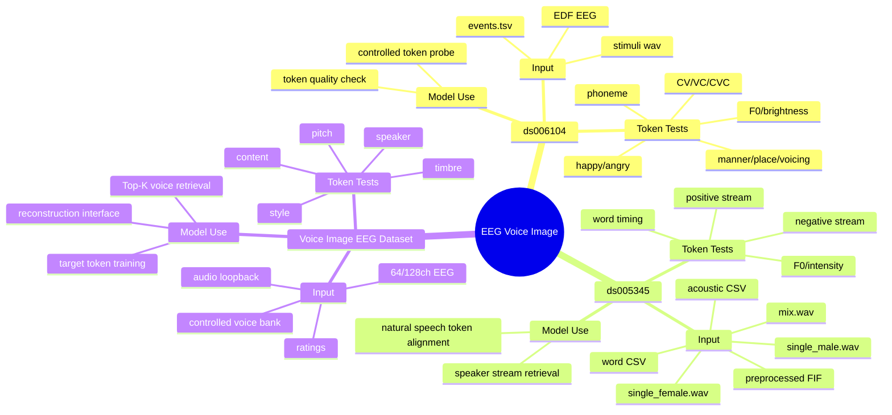
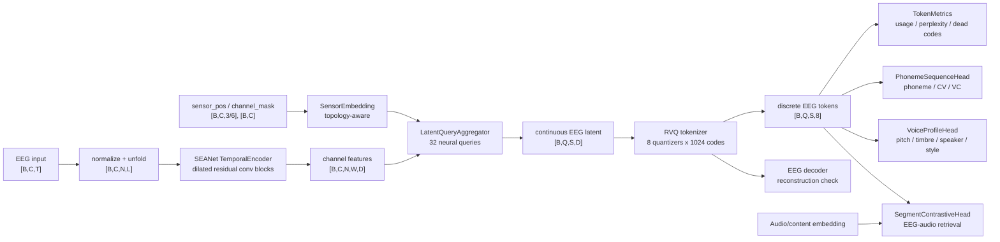

# EEG Voice Image 汇报 0507

## 1. 当前问题定义

当前项目的主线是：

```text
听到 voice 时的 EEG
-> discrete EEG tokens
-> token 与内容、音调、音色、说话人、风格表征对齐
-> voice retrieval / voice image reconstruction interface
```

模型当前贡献聚焦在 **EEG tokenization**。音色、音调、内容、说话人和风格不是替代 token 的输出，而是 token 的下游评估和对齐目标。

| 维度 | 典型标签 | token 下游验证 |
| --- | --- | --- |
| 内容 | phoneme、CV/VC、word、short phrase | content / phoneme probe |
| 音调 | F0、pitch contour、voicing | pitch attribute head |
| 音色 | formant、MFCC、spectral centroid、brightness | timbre attribute head |
| 说话人 | speaker id、male/female stream、speaker embedding | speaker retrieval |
| 风格 | happy、angry、neutral、commanding、whisper | style probe |

阶段性结果：

```text
BrainOmni-style EEG tokenizer
-> RVQ discrete EEG tokens
-> token quality metrics + downstream probe/retrieval baseline
```

## 2. 可用数据集

### 2.1 第一优先级：当前模型可直接使用

| 数据集 | 数据类型 | 声音材料 | EEG | 当前作用 | 不足 |
| --- | --- | --- | --- | --- | --- |
| `ds006104` | controlled speech + TMS-EEG | single phoneme、CV、VC、real word、pseudoword；本地有 1273 个 wav | 64 channel，2000 Hz，EDF | controlled token probe：phoneme/CV/VC、manner/place/voicing、happy/angry、F0/timbre | 不是自然连续语音；TMS 是 confound |
| `ds005345` | natural multi-talker EEG/fMRI | `single_female.wav`、`single_male.wav`、`mix.wav`，约 10 min 普通话叙事 | 64 channel，500 Hz，BrainVision + preprocessed FIF | natural token retrieval：single/mix speaker-stream retrieval，F0/intensity/word-level alignment | 说话人数量少，不能覆盖丰富音色空间 |

最小闭环：

```text
ds006104: token 是否保留内容、音素、发音结构、音调/音色/风格
ds005345: token 是否能在自然语音中对齐 target speaker stream
```

### 2.2 第二优先级：自然语音和跨语言扩展

| 数据集 | 声音材料 | 当前作用 | 进入位置 |
| --- | --- | --- | --- |
| `ds004408` continuous naturalistic speech | 20 段英语有声书 wav + TextGrid word/phoneme timing | 英语自然语音 tokenizer pretraining、phoneme/onset supervision | ds006104 probe 之后 |
| `ds004718` LPPHK | 粤语《小王子》音频、word timing、f0/intensity、POS、词频 | word/prosody/content alignment，跨语言迁移 | ds005345 retrieval 之后 |

### 2.3 目标数据集：Voice Image EEG Dataset

公开数据无法完整覆盖“同内容、多说话人、多 F0、多 formant、多风格”的声音形象空间。自采数据补足以下监督：

| 需求 | 数据设计 |
| --- | --- |
| 同内容多说话人 | same-content multi-speaker voice bank |
| 同说话人多内容 | same-speaker multi-content voice bank |
| 音调操控 | original、-4 semitones、+4 semitones |
| 音色操控 | formant original、0.9x、1.1x |
| 风格操控 | neutral、happy、angry、commanding、whisper |
| EEG 对齐 | TTL trigger + audio loopback |
| 标签 | content_id、speaker_id、voice_id、F0、formant、style、subject rating |

## 3. 数据集到模型的思维导图



## 4. Token-centric 模型图

当前 v0.1 采用 token-centric 结构。主路径只做 EEG 到离散 token：



标准输入：

```python
{
    "eeg": Tensor[B, C, T],
    "sensor_pos": Tensor[B, C, 3] or Tensor[B, C, 6],
    "channel_mask": BoolTensor[B, C],
    "dataset_id": "ds006104" | "ds005345" | "voice_image",
}
```

核心输出：

```python
{
    "tokens": LongTensor[B, Q, S, 8],
    "z_q": Tensor[B, Q, S, D],
    "x_rec": Tensor[B, C, T],
    "token_metrics": {
        "codebook_usage": ...,
        "token_perplexity": ...,
        "dead_code_ratio": ...,
    }
}
```

下游输出：

```python
{
    "phoneme_logits": Tensor[B, S, phoneme_classes],
    "pitch_pred": Tensor[B, pitch_dim],
    "timbre_pred": Tensor[B, timbre_dim],
    "speaker_embedding": Tensor[B, speaker_dim],
    "style_logits": Tensor[B, style_classes],
    "retrieval_logits": Tensor[B, B],
}
```

## 5. 论文如何影响模型设计

| 论文方向 | 汇报中的模型落点 |
| --- | --- |
| BrainOmni | sensor-aware tokenizer、SEANet encoder、latent neural queries、RVQ |
| LUNA | latent query aggregation 让计算不依赖固定 electrode topology |
| DeWave | discrete EEG token 作为跨模态桥梁 |
| DELTA | multi-layer RVQ token 降低 EEG 噪声和个体差异影响 |
| NeuroLM | token 可以进入后续语言/语音模型，当前不接 LLM |
| Défossez et al. | token 与 speech segment embedding 做 contrastive retrieval |
| Lee 2025 | phoneme auxiliary branch 用于 listened speech token probe |
| Lee 2023 NeuroTalk | voice reconstruction 保留为后续接口，当前不生成 waveform |
| Kuruppu EEG-FM review | token 评估包含 reconstruction、codebook usage、downstream probe |
| Moreira et al. | ds006104 提供 phoneme、coarticulation、articulation、style probe 数据 |

## 6. 每个数据集如何接入模型

### 6.1 `ds006104`

```text
EDF EEG + events.tsv + stimuli wav
-> stimulus onset epoch
-> EEG tokenizer
-> discrete tokens
-> PhonemeSequenceHead / VoiceProfileHead / TokenMetrics
```

输入：

| 字段 | 来源 |
| --- | --- |
| `eeg` | `sub-*/ses-*/eeg/*.edf` 或派生 `*_full_eeg.npz` |
| `sensor_pos` | EDF montage / zero-filled fallback |
| `content labels` | `events.tsv` 的 `phoneme1/2/3`、`category` |
| `articulatory labels` | `manner`、`place`、`voicing` |
| `style labels` | wav 文件名中的 `happy` / `angry` |
| `audio attributes` | wav 提取 F0、RMS、centroid、MFCC |

训练/评估目标：

```text
L_ds006104 = CE(phoneme)
           + CE(CV/VC/CVC)
           + CE(manner/place/voicing)
           + CE(happy/angry)
           + CE(F0 high/low)
           + CE(brightness high/low)
           + token reconstruction / token metrics
```

### 6.2 `ds005345`

```text
FIF EEG + run mapping + wav/acoustic/word CSV
-> continuous EEG windows
-> EEG tokenizer
-> pooled token embedding
-> positive stream vs negative stream retrieval
```

输入：

| 字段 | 来源 |
| --- | --- |
| `eeg` | `derivatives/sub-01/eeg/*_preprocessed.fif` 或派生 `*_full_eeg.npz` |
| `run condition` | `configs/ds005345_runs.yaml` |
| `positive stream` | `single_female` 或 `single_male` |
| `negative stream` | 另一说话人 stream |
| `audio embedding` | wav + acoustic CSV + word CSV |
| `F0/intensity` | `annotation/*_acoustic.csv` |

训练/评估目标：

```text
L_ds005345 = InfoNCE(token embedding, target stream embedding)
           + regression(F0 / intensity)
           + optional word-window retrieval
           + token reconstruction / token metrics
```

### 6.3 Voice Image EEG Dataset

```text
voice bank wav + metadata + ratings + EEG
-> audio feature extraction
-> EEG tokenizer
-> token-to-content/pitch/timbre/speaker/style alignment
-> Top-K voice retrieval
```

训练/评估目标：

```text
L_voice_image = InfoNCE(token, voice item)
              + CE(content / speaker / style)
              + regression(F0 / timbre / rating)
              + token reconstruction / token metrics
```

## 7. 实验路线

### 7.1 阶段 0：本地状态

| 数据 | 本地路径 | 状态 |
| --- | --- | --- |
| `ds006104` 音频 | `data/raw/openneuro/ds006104/stimuli/` | 已有 1273 个 wav |
| `ds006104` EEG 派生 | `data/derived/openneuro_full/ds006104/` | 已有示例受试完整派生 |
| `ds005345` EEG 派生 | `data/derived/openneuro_full/ds005345/` | 已有 `sub-01` run-1 到 run-4 |
| `ds005345` 音频/annotation | `data/raw/openneuro/ds005345_datalad/stimuli/`、`annotation/` | 已有 single/mix wav 与 CSV |
| 模型 v0.1 | `src/eeg_voice_model/` | tokenizer + downstream heads synthetic dry-run |

### 7.2 阶段 1：公开数据 baseline

`ds006104`：

```text
epoch by stimulus onset
-> extract audio labels: F0, RMS, centroid, happy/angry
-> tokenizer
-> phoneme/CV/VC/style/F0/timbre probe
```

输出：

| 输出 | 指标 |
| --- | --- |
| EEG reconstruction | L1、PCC |
| token quality | usage、perplexity、dead-code ratio |
| phoneme/CV/VC | balanced accuracy、macro F1 |
| manner/place/voicing | balanced accuracy |
| happy/angry | AUC / accuracy |
| F0 high/low | balanced accuracy |
| brightness high/low | balanced accuracy |

`ds005345`：

```text
window continuous EEG
-> map run to positive/negative stream
-> build audio stream embedding
-> token-to-stream InfoNCE retrieval
```

输出：

| 输出 | 指标 |
| --- | --- |
| single female/male retrieval | Top-1、MRR |
| mix attend female/male retrieval | Top-1、MRR |
| F0/intensity regression | Pearson、Spearman |
| word-window retrieval | Top-K accuracy |

### 7.3 阶段 2：自采数据 pilot

| 项目 | 数量 |
| --- | --- |
| 受试者 | 12-20 |
| voice-bank items | 180-240 |
| EEG trials | 320-440 |
| 单条音频 | 0.8-3.0 s |
| EEG 有效任务时间 | 55-70 min |

采集结构：

```text
Part A: 声音库校准与评分，25-35 min
Part B: EEG 主采集，55-70 min
```

EEG 主采集：

| Block | Trials | 任务 | 标签 |
| --- | ---: | --- | --- |
| B1 Content listening | 120-160 | 听短语音，偶发内容判断 | phoneme、word、content embedding |
| B2 Voice attribute listening | 120-160 | 同内容不同 voice，判断音调/音色/风格 | F0、formant、timbre、style |
| B3 Voice retrieval | 80-120 | 目标 voice 后做候选匹配 | voice_id、speaker_id、Top-K labels |

## 8. 明天讨论的核心判断

| 问题 | 数据集 | 状态 |
| --- | --- | --- |
| token 是否保留 phoneme / CV / VC | `ds006104` | 可验证 |
| token 是否保留 F0 / timbre / happy-angry | `ds006104` | 可做受控 probe |
| token 是否对齐自然语音 speaker stream | `ds005345` | 可做 retrieval baseline |
| token 是否在 mixed speech 中追踪 attended speaker | `ds005345` | 可做 retrieval baseline |
| token 是否能完整恢复多说话人、多音色 voice image | 公开数据 | 不够 |
| 自采数据是否必要 | Voice Image EEG Dataset | 必要 |

当前项目可讲成的贡献：

```text
1. 不是 EEG-to-text，而是 EEG-to-token-to-voice-representation。
2. token 是中间层，把 EEG 从连续波形变成可对齐、可检索、可组合的离散表示。
3. ds006104 用来证明 token 含有内容、音调、音色和风格线索。
4. ds005345 用来证明 token 能在自然连续语音中对齐目标说话人 stream。
5. 自采 Voice Image EEG Dataset 补足公开数据缺失的同内容多说话人、多 F0、多音色、多风格监督。
```

结论：

```text
Layer 1: controlled token probe
  ds006104

Layer 2: natural speaker-stream token retrieval
  ds005345

Layer 3: target voice image alignment
  self-collected Voice Image EEG Dataset
```
