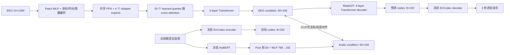

# OpenVoice-EEG 0722 V1：从想象语音 EEG 到开放词汇语音

> 明日汇报用简版｜当前阶段：模型与训练流程已搭建，尚不汇报重建效果。

## 0. 一句话讲清楚

我们希望训练一个**推理时只输入 EEG** 的生成模型：先把多通道 EEG 压缩成 50 个“声学条件 token”，再预测 EnCodec 的离散音频码，最后解码成波形。

```text
EEG → EEG encoder → 50×192 acoustic condition
    → MaskGIT → 8×150 EnCodec codes → frozen EnCodec decoder → waveform
```

Label、受试者 ID 和数据集 ID **不进入生成器**。Label 只在训练时提供很弱的语义辅助，因此模型原则上不会被固定词表锁死。

---

## 1. 数据是什么

### 1.1 总量与监督强度


| 数据集 | Trial | 受试者组 | Label | 唯一音频 | EEG–音频关系 | 在模型中的主要作用 |
|---|---:|---:|---:|---:|---|---|
| FEIS | 3,152 | 20 | 16 | 320 | 受试者×label，共享音频 | EEG 自监督、弱语义/全局对齐 |
| KaraOne | 1,913 | 14 | 11 | 1,913 | **同一 trial 的 overt audio** | 唯一的逐 trial 声学对齐与生成监督 |
| ds004306 | 2,078 | 12 | 3 | 3 | 类别级候选音频 | EEG 自监督、通道鲁棒性；不做逐 trial 重建 |
| **合计** | **7,143** | **46** | — | **2,236** | — | — |

正式 subject-disjoint split：train 5,848、validation 726、locked test 569。当前所有图只读取 validation，未访问 locked test。

最重要的边界是：**7,143 个 EEG trial 不等于 7,143 对精确 EEG–音频。**目前只有 KaraOne 的 1,913 对可以监督 trial-specific 波形生成。

### 1.2 三个数据集的真实样本

每张图从上到下依次是：14 条 EEG 通道、音频波形、音频时频图。EEG 为了便于显示对每个通道单独缩放，因此图中只能比较时间结构，不能跨通道比较绝对振幅。

#### FEIS：想象单词，音频为“受试者×词”级别


同一受试者想象同一 label 的多个 trial 会指向同一条音频，所以它适合弱语义对齐，不适合声称逐 trial 波形重建。

#### KaraOne：想象语音，并有同 trial 的外显发音


这是当前最关键的数据：每个 trial 有独立的 overt audio，因此可训练 EEG 到具体声学结构的映射。

#### ds004306：听觉想象/感知任务，但只有类别原型音频


2,078 个 trial 只对应 3 个类别声音。它能增加 EEG 和受试者数量，但不能当作 2,078 对精确音频监督。

### 1.3 处理后的数据结构

```text
eeg_output/
├── manifests/unified_trials.csv       # 每个 trial 的索引和监督资格
├── subjects/
│   ├── feis/<subject>.npz
│   ├── karaone/<subject>.npz
│   └── ds004306/<subject_session>.npz
└── audio_16k/<sha256>.wav              # 去重后的公开音频
```

单个 EEG trial 当前统一为：

```text
eeg             [14, 1280]   # 14 通道 × 5 秒 × 256 Hz
valid_length    scalar       # 真实有效长度，padding 不参与计算
audio           16 kHz WAV
manifest fields sample / subject / label / pairing level / split
```

公共 14 通道顺序为：`F3, FC5, AF3, F7, T7, P7, O1, O2, P8, T8, F8, AF4, FC6, F4`。EEG 统一到 256 Hz、1–40 Hz、平均参考，并以 baseline median/MAD 做稳健归一化。音频统一为 16 kHz；进入 EnCodec 时截断或补零为 2 秒。

---

## 2. 当前版本与最终版本的边界

当前正在跑的是 **Track A / project-only HuBERT**：

- 只用已经处理好的公共 14 通道；
- 音频教师为冻结的 `HuBERT-base`；
- 训练音频只来自三个 EEG 项目的 2,236 条去重音频；
- 当前关闭 XLM-R 文本辅助，也未加入 LibriTTS/AISHELL-1。

因此它首先检验“label-free EEG 生成链路是否学得动”，**现在还不能声称真正的中英文开放词汇泛化**。后续 Track B 才会加入全通道可变 montage、XLS-R 和各 50 小时英文/中文公开语音。

---

## 3. 模型全貌



训练时，真实音频提供“正确的声学空间”和“正确的 EnCodec code”；推理时整条音频教师分支被移除，只保留 EEG → codes → waveform。

---

## 4. 每一步具体做了什么

### 4.1 EEG 切成 token

每个通道用长度 64、步长 32 的滑窗切片：

- 64 samples = 0.25 秒；hop 32 = 0.125 秒，既保留局部节律又有 50% 重叠；
- 每通道得到 39 个 patch，14 通道共约 546 个 token；
- 每个 patch 经过 MLP：`LayerNorm(64) → Linear(64,192) → GELU → Linear(192,192)`。

每个 token 再加三类信息：电极三维坐标、时间位置、该局部窗口的 RMS 信号质量。`d_model=192` 是在表达能力和约七千 trial 的小数据风险之间取的中等规模；6 个 attention heads 刚好是每头 32 维。

### 4.2 Adapter-MoE 选择信息，而不是硬选电极

所有 token 先经过一个始终工作的共享 FFN：`192 → 384 → 384 → 192`。随后有 4 个轻量 specialist adapter，每个仅为 `192 → 48 → 192`：

- epoch 1–5：4 个 expert 都以连续权重参与，避免早期 expert 死亡；
- epoch 6 起：保留权重最高的 2 个 specialist，仍是软权重，不做 Top-1 硬切换；
- expert dropout = 10%，并加入负载均衡、router z-loss 和 expert diversity。

Router 只能读取当前 EEG token、坐标、局部质量和时间，不能读取 label、subject 或 dataset ID。这里的目标是让专家学习不同脑区/信号模式，而不是记住某个数据集。

### 4.3 从约 546 个 EEG token 压到 50 个声学 token

设置 50 个可学习 query，对所有有效 EEG token 做 6-head cross-attention；每个 query 主动汇聚与自己最相关的通道和时间片。随后用 3 层 Transformer 建模这 50 个 token 之间的关系，输出 `[50,192]`。

之所以固定为 50，是为了和音频教师的 50 个 condition token 一一处于同一接口，而不是假设 EEG 与发音在每个毫秒严格同步。

### 4.4 音频教师如何产生“对齐目标”

冻结 HuBERT 将 16 kHz 波形编码成可变长度的 `[T,768]` 特征，然后：

```text
adaptive pooling 到 50 步
→ LayerNorm(768)
→ Linear(768,192) → GELU → Linear(192,192)
→ 2-layer Transformer
→ audio condition [50,192]
```

HuBERT 不负责生成，它只是告诉 EEG encoder：“与这段声音对应的表示应该靠近哪里”。教师被冻结，可减少小数据下把音频空间一起训练坏的风险。

### 4.5 MaskGIT 如何生成声音

冻结 EnCodec 把 2 秒音频转换为 `[8,150]` 个离散 code，每个 code 有 1,024 种取值。训练时随机遮住 50%–95% 的 code，MaskGIT 根据 condition 预测被遮住的值：

- code embedding 后合并 8 个 codebook；
- 4 层 Transformer decoder，`d_model=192`、6 heads、FFN=768；
- 8 个独立输出头分别预测 8 条 code stream；
- 前两个粗粒度 codebook 权重最高，因为它们主要决定可懂度和能量轮廓；
- 推理时做 12 轮迭代填充，再交给冻结 EnCodec decoder 还原波形。

这里没有 label embedding，也没有 label probability；改变 label 文件不会改变生成结果。

---

## 5. EEG 和音频究竟怎样对齐

“CLIP 式”不是调用图文 CLIP，而是借用它的**双编码器对比学习**思想。

### 5.1 全局声学对齐

分别把 EEG 与 audio 的 50 个 token 汇聚为 192 维向量并 L2 normalize。一个 batch 内计算：

```text
similarity(i,j) = EEG_i · Audio_j / temperature, temperature=0.08
```

同一 KaraOne trial 的 EEG–audio 是强正样本，其余 trial 是负样本；同时计算 EEG→audio 与 audio→EEG 两个方向的交叉熵。这样模型学习“这段 EEG 对应哪一段具体声音”，而不是只学 label。

### 5.2 局部声学对齐

想象 EEG 与外显发音不存在严格逐帧同步，所以不做固定时间点 MSE。当前实现用 50×50 token 相似度，加单调位置偏置，再做双向 soft-attention/cosine 对齐；它是 soft-DTW 思路的可微近似，允许局部提前或延迟。

### 5.3 同 label 只在语义空间弱靠近

| 样本关系 | 声学空间 | 语义空间 | Code 生成监督 |
|---|---|---|---|
| KaraOne 同 trial | 强正样本 1.0 | 强正样本 | 有 |
| 同 label、不同 trial/受试者 | **hard negative** | 弱正样本 0.15 | 无 |
| FEIS 受试者×label 音频 | 仅弱全局对齐 0.25 | 弱正样本 | 无 |
| ds004306 类别音频 | 不参与 | 不参与 | 无 |

这样既利用“同一个词可能有共同语义”，又明确保留不同说话者、不同 trial 的声学差异，不强迫它们生成同一波形。

---

## 6. 损失函数与数据集路由

当前无文本版本可概括为：

```text
L = 1.00 L_code
  + 1.00 L_global-CLIP
  + 0.50 L_local-align
  + 0.25 L_structure
  + 0.15 L_same-label-semantic
  + 1.00 L_masked-EEG
  + 0.20 L_channel-consistency
  + 0.05 L_domain-adversarial
  + 0.01 L_MoE
```

| Loss | 直观作用 | KaraOne | FEIS | ds004306 |
|---|---|:---:|:---:|:---:|
| Code CE | 从 EEG 预测真实 EnCodec code | ✓ | — | — |
| Global CLIP | 整段 EEG 与整段音频配对 | 1.0 | 弱监督 0.25 | — |
| Local align | 局部声学 token 软对齐 | ✓ | — | — |
| Structure | 能量包络、onset、duration、调制谱 | ✓ | — | — |
| Same-label semantic | 同 label 表示轻微靠近 | ✓ | ✓ | — |
| Masked EEG reconstruction | 学 EEG 本身的结构 | ✓ | ✓ | ✓ |
| Channel/domain/MoE | 抗缺失通道、数据域捷径和路由塌缩 | ✓ | ✓ | ✓ |

权重的原则是：**精确配对声学监督优先；label 语义只占很小比例；弱配对数据绝不伪装成逐 trial 波形监督。**

---

## 7. 训练分为哪几步

1. **冻结教师 cache**：HuBERT 提取 50×768 声学特征；EnCodec 提取 8×150 code。只计算一次。
2. **Label-free audio prior**：用真实音频训练 HuBERT condition → MaskGIT → code，确认 decoder 能在无 label 条件下建模音频。
3. **EEG 自监督预训练**：三个数据集共同训练 masked patch reconstruction、通道视图一致性和 MoE。
4. **配对 EEG–audio 训练**：KaraOne 提供完整生成监督，FEIS 提供弱对齐，ds004306 只继续自监督。
5. **Validation 选 checkpoint**：按受试者宏平均的 envelope、调制谱、log-mel 和 retrieval 选择，不用 label accuracy 选模型。
6. **最后才访问 locked test**：通过 validation gate 后做一次正式评估。

当前快速运行的 `20 audio / 10 pretrain / 20 paired EEG epochs` 适合检查全流程，但 paired 阶段前 20 epochs 的 audio decoder 都被冻结，所以它仍是 **smoke/proof-of-pipeline**。第一轮有信息量的实验更建议 `30 / 15 / 30`；是否继续增加 epoch 应由 validation 曲线决定，而不是只看训练 loss。

---

## 8. 推理时模型看得到什么

```text
允许：EEG、channel coordinates、channel mask、time mask
禁止：label、文本、subject ID、dataset ID、真实音频
```

推理链路为：

```text
未知 EEG
→ patch MLP / Adapter-MoE / cross-attention
→ 50×192 condition
→ MaskGIT 预测 8×150 codes
→ EnCodec 解码
→ 2 秒语音
```

因此未来遇到训练中未出现的词，模型仍然可以输出声音；是否真的具备开放词汇内容恢复能力，需要之后通过 G2 留一词和 G3 留一词＋新受试者实验验证，不能仅由网络结构推断。

---

## 9. 之后如何评价，但本次不报告结果

后续会比较 `reference / codec oracle / audio-condition oracle / EEG-conditioned / shuffled EEG / channel-shuffled / zero EEG / dataset prior`，主要观察：

- RMS envelope correlation 与 soft-DTW distance：粗略能量和时间结构；
- modulation spectrum、log-mel MAE、multi-resolution STFT：声学形状；
- EEG→audio retrieval R@1/R@5/MRR：是否找到正确音频；
- HuBERT/XLS-R content cosine：语音内容是否接近；
- raw correlation、SI-SDR 继续报告，但不再单独决定成败。

本次汇报只介绍**问题、数据监督边界和方法**，不展示或暗示尚未得到的效果。

---

## 10. 可以直接照着说的 90 秒总结

> 我们现在做的是一个 label-free 的 EEG 到语音生成模型。三个数据集一共有 7,143 个 trial，但只有 KaraOne 的 1,913 个 trial 有同 trial 独立音频，所以只有它负责精确生成监督；FEIS 只做弱语义对齐，ds004306 主要做 EEG 自监督。模型把每个 EEG 通道切成 0.25 秒 patch，经 MLP、坐标和时间编码，再用一个小型 Adapter-MoE 提取不同通道与脑区的信息。50 个 learned queries 把约 546 个 EEG token 汇聚成 50 个 192 维声学 token。训练时，冻结 HuBERT 给出音频 token，我们用 CLIP 式双向对比损失对齐整段 EEG 和音频，并用允许时间偏移的局部 soft-attention 对齐局部结构。随后 MaskGIT 从 EEG condition 预测 EnCodec 的 8×150 离散码，再由冻结 EnCodec 解码成波形。推理时不输入 label、受试者或数据集 ID。当前 14 通道 HuBERT 版本先验证方法链路；真正的中英文开放词汇结论还需要公开语音、全通道模型和留一词实验。

---

## 图表复现

三张数据样本图和数据量图由下列脚本从 unified manifest 与 validation 数据确定性生成：

```bash
cd /Users/samxie/Research/EEG-Voice/ref_github/speech_decoding/eeg2wave_server_bundle/feis_karaone_ds004306_bundle
MPLCONFIGDIR=/tmp/openvoice-mpl \
  /opt/anaconda3/bin/python \
  reports/figures/open_vocab_0722_pre/generate_pre_figures.py
```

同时输出 PNG、矢量 PDF 和 `figure_metadata.json`，方便后续做幻灯片或核对样本来源。
