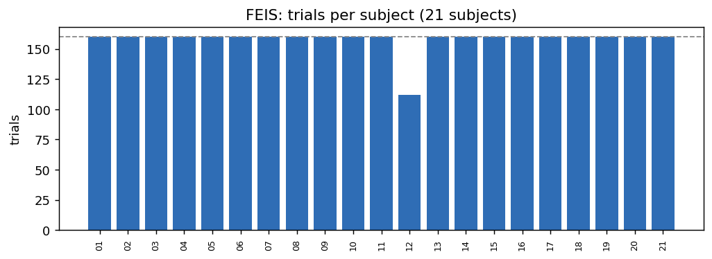
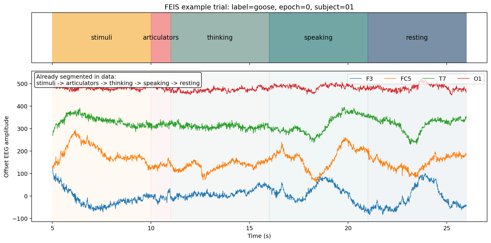
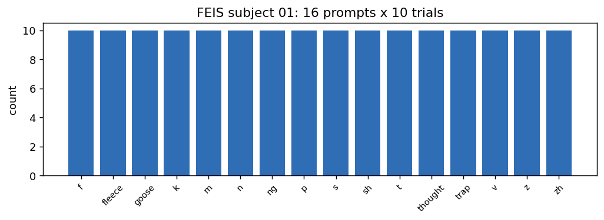
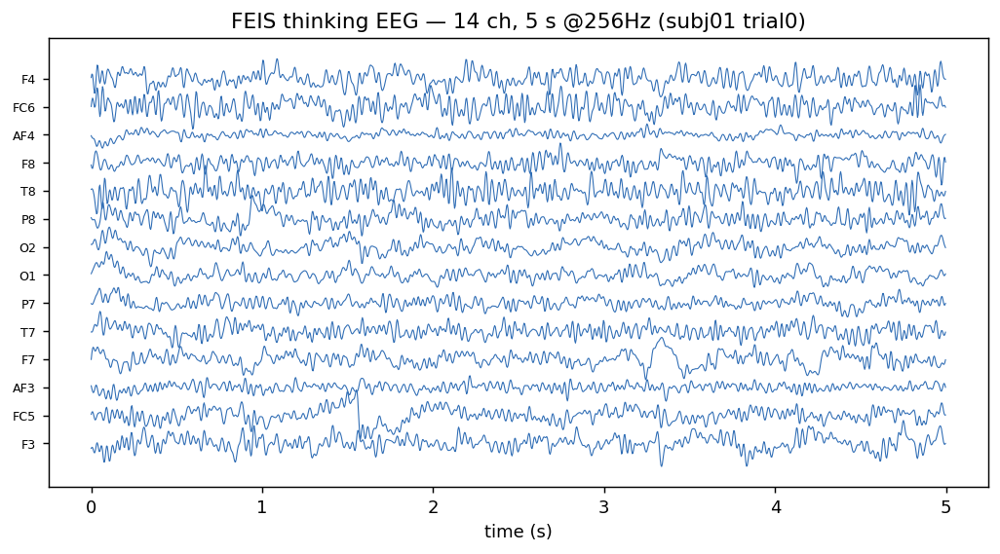
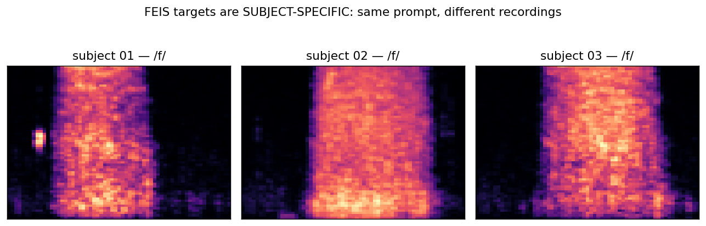

# FEIS 数据集

2026-06-10

[https://github.com/scottwellington/FEIS](https://github.com/scottwellington/FEIS)

[https://zenodo.org/records/3369179](https://zenodo.org/records/3369179)

FEIS（Fourteen-channel EEG for Imagined Speech）是一个**14 通道、消费级低密度**的想象语音 EEG 数据集，
标签为音素/音节级 prompt。优点是 trial 切分极干净、五阶段边界明确、体量轻；
局限是通道少且**缺中央运动区电极**、音频是**每个受试本人录的真人语音、但每 (受试,prompt) 仅一条**（被该受试 10 个 trial 共享，无 trial 级差异），而非逐 trial 同步录音。

---

## 1. 采集与规模

| 项           | 值                                                    |
| ------------ | ----------------------------------------------------- |
| 采集设备     | Emotiv EPOC（消费级干电极头戴）                       |
| EEG 通道     | 14：`F3 FC5 AF3 F7 T7 P7 O1 O2 P8 T8 F8 AF4 FC6 F4` |
| 英文被试     | 21（另有 2 个中文补充被试，schema 不同，已排除）      |
| 每被试 trial | 约 160（subject 12 报告说他要先离开，就仅 112）       |
| prompt 数    | 16，每 prompt 重复 10 次                              |
| 处理后采样率 | EEG 256 Hz / 音频 16 kHz                              |

**通道的脑区覆盖（重要分析点）**：14 个电极集中在
额叶（F3 F4 F7 F8 FC5 FC6 AF3 AF4）、颞叶（T7 T8）、顶叶（P7 P8）、枕叶（O1 O2）。
**没有中央/运动区电极（无 C3 Cz C4、无 CP 行）** —— 而发音相关的运动/感觉运动皮层正位于中央区，
这意味着 FEIS 对"发音运动信息"的覆盖天然偏弱，是它做发音级解码偏难的硬件层面原因之一。

---

## 2. 实验范式：五阶段，已在数据里切好

**刺激方式**：audio-visual flashcard（视听卡片）。session 开头一次 5s baseline，之后 160 个 trial 按**伪随机序列**呈现（`experiment-timeline.lua` 的 `sequence` 表），16 个 prompt 各约 10 次。**单 trial 时间线（脚本写死的时长，共 ≈22s）**：

| 顺序 | 阶段（处理后名）                           | 时长         | 屏幕                                                   | 声音                                                          |
| ---- | ------------------------------------------ | ------------ | ------------------------------------------------------ | ------------------------------------------------------------- |
| 1    | **cue → `stimuli`**（hearing）    | **5s** | prompt 卡片图（`imgs/f.png`…）                      | **播放该 prompt 音频（当前受试自己提前根据提示卡录制)** |
| 2    | prepare →`articulators`                 | 1s           | `prepare_articulators.png`（**仅 1s 注视点**） | —                                                            |
| 3    | **`thinking`**（想象说出，主输入） | 5s           | `think_of_speaking.png`                              | —                                                            |
| 4    | **`speaking`**（真出声，被录音）   | 5s           | `speaking.png`                                       | 受试朗读                                                      |
| 5    | **`resting`**                      | 5s           | `rest.png`                                           | —                                                            |
| 6    | post-trial 间隔                            | 1s           | —                                                     | —                                                            |

作者提供的文件包含了已经切割好的5个csv以及原始完整的csv (14通道)

下图是 subject 01、label=goose 的一个完整 trial（上方色带是阶段，下方是 4 个代表通道 F3/FC5/T7/O1 的波形）。可见五阶段在 5–27 秒区间整齐切换：

代表被试 01 的 `full_eeg.csv` 各阶段样本数（256 Hz）：

| 阶段         | 样本数 | 时长           |
| ------------ | ------ | -------------- |
| stimuli      | 204800 | 5s ×160 trial |
| articulators | 40960  | 1s ×160       |
| thinking     | 204800 | 5s ×160       |
| speaking     | 204800 | 5s ×160       |
| resting      | 204800 | 5s ×160       |

> 注：FEIS 当前发布的是**按阶段切好的派生 CSV**（带 Stage/Epoch/Label 列），不是带 trigger 的原始 EEG 流，
> 因此重做更细粒度事件切分的自由度有限——但对我们"按阶段取窗"的用法完全够用。

---

## 3. 标签体系：音素/音节为主

16 个 prompt 可按发音方式分组：

| 类别               | prompt                                                   |
| ------------------ | -------------------------------------------------------- |
| 塞音 plosive       | `p, t, k`                                              |
| 擦音 fricative     | `f, s, sh, v, z, zh`                                   |
| 鼻音 nasal         | `m, n, ng`                                             |
| 元音/词 vowel-word | `fleece /iː/, goose /uː/, trap /æ/, thought /ɔː/` |

每被试每 prompt 恰好 10 次，类别完全均衡（无长尾）。

精确音素（README supplementary）：4 元音 `/iː/(fleece) /uː/(goose) /æ/(trap) /ɔː/(thought)` + 12 辅音 `/m/ /n/ /ŋ/ /f/ /s/ /ʃ/ /v/ /z/ /ʒ/ /p/ /t/ /k/`。fleece/goose/trap/thought 是 Wells 词汇集关键词（代表那 4 个元音），不是四个真单词。

受试构成：21 人混合 **E（英语母语）/ NNS（非母语 ≥C1）**，含左利手/双利手；subject 12 仅录 3 个 session 中的 2 个 → 112 trial。

---

## 4. EEG 信号示例（14 通道 thinking 段）

thinking 阶段每 trial 为固定 `[14, 1280]`（5s ×256Hz）。14 通道都能连续观测到随阶段切换的慢波变化：

**预处理流程（已固化）**：1–40 Hz 带通 → 50 Hz 陷波 → 共平均参考（CAR）→ 用同 trial 的 `resting` 段做基线标准化 → 重采样到 256 Hz。
所以数值是**相对基线的偏移量**，不是原始微伏绝对值。

---

## 5. 音频目标：受试本人真人语音，每 (受试,prompt) 一条

### 5.1 Stimulus

FEIS 的刺激是 **audio-visual flashcard（视听卡片）**：每个 trial 展示提示卡图片（`imgs/`，如 `f.png`），
受试按五阶段走（听自己的录音感知 → 准备 → 想象 → 出声 → 静息），其中出声阶段被录音。

### 5.2 每 (受试,prompt) 一条，无 trial 级差异

全集共 21×16 = **336 条**目标 wav。

- 时长几乎都是 1 秒（5 秒的是阶段窗口，不是 wav 本体）。
- **同一受试、同一 prompt 的 10 个 trial 共享同一条 wav** → 没有 trial 级声学差异。
- **但跨受试是不同录音**：subject 01 的 `/f/` 与 02/03/04 的 `/f/` 内容 hash 全不同（各人各自的嗓音）。比如下面这个图直接证明"受试专属"：同一 prompt `/f/` 在三个受试上的 mel 谱明显不同。
  **含义：重建目标是这个人自己的嗓音，而不是通用模板，因此还原到本人的声音在语义上成立；但因每 (受试,prompt) 仅一条，无法还原 trial 级独特发音。**

> 数据质量备注：subject 05 的音频有已知异常，按照作者上传的readme，所以 subject 05 实际上使用了 subject 04 念出来的语音作为刺激
