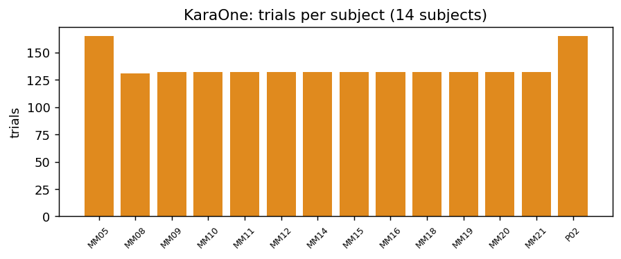
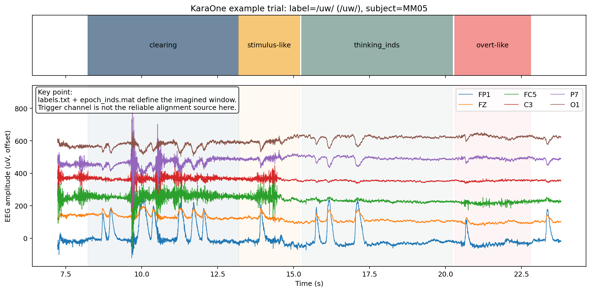
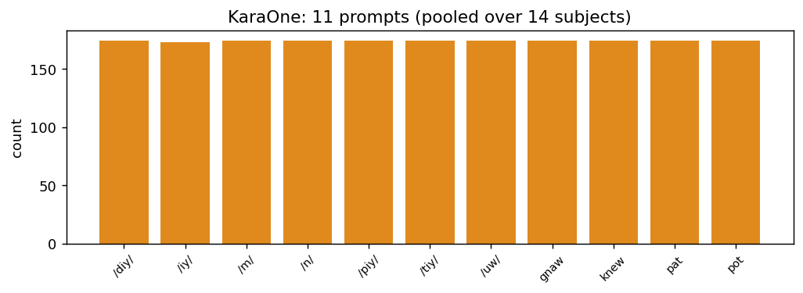
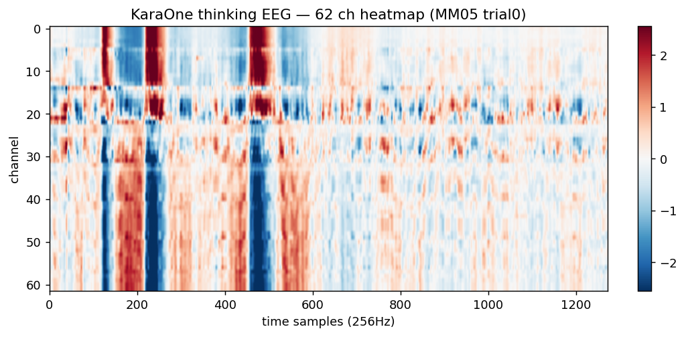
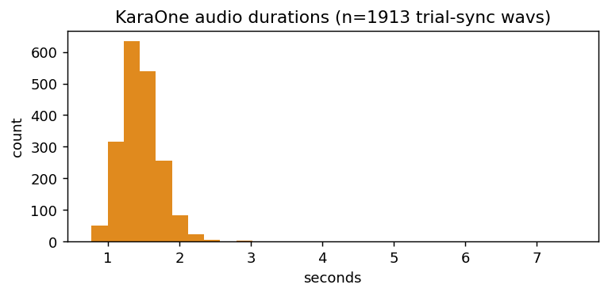
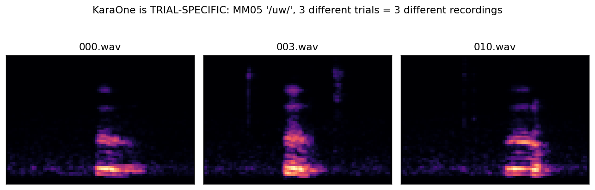

# KaraOne 数据集

2026-06-10

[https://www.cs.toronto.edu/~complingweb/data/karaOne/karaOne.html](https://www.cs.toronto.edu/~complingweb/data/karaOne/karaOne.html)

KaraOne 是一个**62 通道高密度**的 imagined + overt speech EEG 数据集，
每个 trial 都配有**与该次发音同步的真实出声录音（trial-synchronous overt wav）**，且电极覆盖含**中央运动区**。**我们能训练并评测"逐 trial 波形保真"的数据**。

> **结论（2026-06）：本研究不采用 KaraOne。** 它是 imagined/overt **speech production** 范式——"imagined"是想象**自己发音**、重建目标是受试**自己说出的录音**，与本研究"听到声音 → 脑海中保持其听觉表象 → 重建听到的声音"（听觉感知/想象重建）不符。本文保留作为数据调研记录与范式对照；server 端 KaraOne 兼容代码与 `data/karaone` 已删除。

---

## 1. 采集与规模

| 项             | 值                                                                                 |
| -------------- | ---------------------------------------------------------------------------------- |
| 采集设备       | 64-导 Neuroscan 医用级 EEG（cnt 文件含 69 通道，处理后取**62 个 EEG 通道**） |
| 原始采样率     | 1000 Hz（处理后统一到**256 Hz**）                                            |
| 单被试连续 EEG | 约 41 分钟                                                                         |
| 本地被试       | 14（MM05…MM21, P02），每被试约 131–165 trial，共**1913 trial**             |
| prompt 数      | 11                                                                                 |
| 音频           | Kinect 采集的 overt speech，**逐 trial 一段**，16 kHz                        |

**通道脑区覆盖（与 FEIS 的关键差异）**：62 通道是完整 10-20 扩展布局，**包含中央/感觉运动区（FC、C、CP 行，如 FC1-6、C1-6、CP 行）**，正好覆盖发音相关的运动皮层 。

---

## 2. 实验范式：四阶段，窗口由 epoch_inds 定义

`clearing`（放空上一 trial, ~5s）→ `stimulus_like`（接收 prompt, ~2s）→ **`thinking`（想象, 变长 ~5s, 主输入）** → **`overt_like`（真出声, 变长 ~1.4–2s, 有录音）**。

> **哪个阶段有录音？（易混点）** 据 `karaOne.html`，每 trial 4 状态：clearing(5s rest) → **stimulus**(屏幕出现 prompt 文字 + **音箱播放该 prompt 的发音** + 2s 发音器官准备) → thinking(5s 想象) → **speaking**(真出声，**Kinect 录下音频**)。
> 所以 **stimulus_like 没有对受试的录音**——那时受试在听+看+准备、不说话；那段"声音"是**播给他听的外部刺激语音**（非受试本人）。**唯一的录音是 overt/speaking 阶段**（Kinect 录的），即我们的 trial-sync 目标 wav。
> 对比 FEIS：FEIS 在 stimuli 阶段播的是**受试本人**录音；KaraOne 播的是**外部标准**发音。两者真正录受试声音的都是出声阶段。

下图是 subject MM05、label=/uw/ 的一个 trial（上方色带为阶段，下方 6 个代表通道）：

**对齐来源的关键点**（图中注明）：imagined 窗口由 `labels.txt` + `epoch_inds.mat` 定义，**trigger 通道不是可靠对齐源**，所以预处理以 epoch_inds 为准。各窗口统计：

| 区段                                  | 数量 | 平均时长       |
| ------------------------------------- | ---- | -------------- |
| clearing                              | 165  | 4.98 s         |
| thinking                              | 165  | 4.95 s（变长） |
| stimulus-like（speaking_inds 奇数项） | 165  | 2.01 s         |
| overt（speaking_inds 偶数项）         | 165  | 变长 ~1.4–2 s |

> 一个直接的数据观察：`speaking_inds` 有 330 段而标签只有 165 —— 按奇偶拆分，奇数项是 stimulus-like、偶数项是真正的 overt。

---

## 3. 标签体系：音素 + 少量词

| 类别          | prompt                   |
| ------------- | ------------------------ |
| 元音          | `/iy/ /uw/`            |
| 塞音+元音音节 | `/piy/ /tiy/ /diy/`    |
| 鼻音          | `/m/ /n/`              |
| 词            | `pat, pot, knew, gnaw` |

与 FEIS **几乎不重叠**，仅 `/m/ /n/` 与 FEIS 的 `m, n` 概念相通。

---

## 4. EEG 信号示例（62 通道 thinking 段）

thinking 段变长（存储时按 `valid_lengths` 对齐到 ~1272 采样，并记 `src_ranges`）。下图为 MM05 trial0 的 62 通道热图：

**预处理流程**：1–40 Hz 带通 → **60 Hz** 陷波（北美电网）→ CAR → 用 `clearing` 段做基线 → 重采样 256 Hz；变长段用 `valid_lengths` + `src_ranges` 标注有效区间，建模时做 mask。

---

## 5. 音频目标：trial-synchronous，**逐 trial 不同**（建模关键）

KaraOne 每个 trial 都有一段**当次说话的真实录音**，不是共享模板。

> 注：这段录音来自 **overt/speaking 阶段**（Kinect 录）。处理后 `segments.csv` 里该 trial 的 4 个阶段（含 stimulus_like）`audio_path` 都指向同一条 overt 录音——这是 `audio_pairing=same-trial overt wav` 的**目标配对约定**（把 overt 录音作为该 trial 所有阶段 EEG 的统一重建目标），**不代表 stimulus_like 期间录了音**。

- 时长**变长**（约 0.96–2.0 秒，中位 1.41s），反映真实发音节奏。
- 全集 **1913 条目标 wav，每 trial 一条**，目标键为 `subject:trial`。

下图证明"逐 trial 不同"：同被试同 prompt 的 3 个不同 trial，mel 谱各不相同**。**

