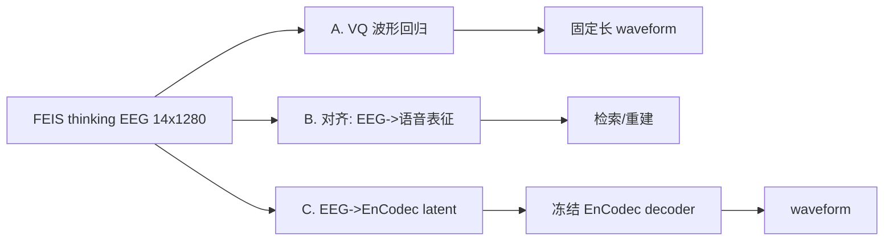

# eeg2wave_demo_bundle — 开发进展（探索/迭代阶段）

## 定位

`eeg2wave_demo_bundle` 是**本地开发与快速迭代**的 bundle，是 server bundle 的前身。
它完整记录了第一阶段的三条技术路线探索：**(A) VQ 波形回归基线 → (B) 语音表征对齐 → (C) codec-latent 重建**，
以及把它们打包成可上传服务器目录的工具。结论：**A 路线坍缩、B/C 路线确立了正确方向**，
这套结论直接催生了 server bundle 的 v3 重写。

## 数据流总览

## 脚本逐个说明（每步在做什么）

### 路线 A：VQ 波形回归基线

| 脚本 | 作用 | 关键点 |
|---|---|---|
| `src/model.py` | `EEG2WaveVQModel`：1D-CNN encoder → 单层 EMA-VQ(codebook=512) → ConvTranspose 上采样 → waveform + 分类头 | 显式 token bottleneck |
| `src/dataset.py` | `FEISThinkingDataset`（单被试）/ `FEISProtocolDataset`（G/S/U 协议）| 按 trial 顺序切分防泄漏 |
| `src/losses.py` | `compute_total_loss`：L1 + multi-STFT + log-STFT + RMS + envelope + VQ + 分类 | 直接回归原始采样 |
| `scripts/train.py` | 单被试训练 VQ demo，保存 checkpoint + 训练曲线 | `--subject 01` |
| `scripts/infer.py` | 推理：EEG→重建 wav，算 STFT 距离 + Nearest-Template-Accuracy，写 wav | 核心评估指标 NTA |
| `scripts/train_waveform_protocol.py` | 把 VQ 基线放到 G/S/U 协议下训练（含 subject-conditioned 版本）| `src/subject_conditioned_waveform.py` |
| `scripts/eval_waveform_protocol.py` | 协议化评测：waveform L1 / STFT / 分类 acc / NTA | 产出 A 路线最终数字 |

**A 路线结果（关键负面结论）**：模型**坍缩到均值**——在 G 协议 320 条测试里，对几乎所有 EEG 都输出同几条"平均波形"
（`m` 112 次、`fleece` 93 次…），NTA=0.003 甚至低于随机 0.0625。

诊断：FEIS 只有 336 条目标，"对原始采样做 L1+STFT 回归"的平凡最优解就是输出均值；EEG 内容信号弱时必然滑向它。
**→ 必须换目标函数与目标表征，这条结论是整个项目的转折点。**

### 路线 B / C：语音表征对齐 + codec 重建

| 脚本 | 作用 | 关键点 |
|---|---|---|
| `src/audio_features.py` | 音频特征后端：HuBERT pooled / HuBERT sequence / **EnCodec latent**（含 encode+decode）| 目标表征工厂 |
| `scripts/extract_audio_targets.py` | 把 336 条 canonical wav 抽成目标缓存（pooled / seq / encodec_latent）| 一次性预处理 |
| `src/alignment_model.py` | `EEGSpeechAlignmentModel`：EEG encoder → 投影 → speech/prosody/label/phoneme/codec-scale 多头 | 表征对齐 |
| `src/alignment_losses.py` | 序列 cosine + MSE + 对称 InfoNCE + 韵律 + 分类 + 音素 | 引入对比目标 |
| `scripts/train_alignment.py` | 训练对齐模型（G/S/U），检索 top-k 评测 | B 路线主入口 |
| `scripts/eval_alignment.py` | 检索评测 + 先验对照（label-only / subject-only）+ subject probe | 控制变量 |
| `scripts/audit_pipeline.py` | 体检：参数量、张量形状、前向是否通 | 防 silent bug |
| `scripts/plot_stage_summary.py` | 画 thinking/stimuli/speaking 阶段对照图 | 阶段比较 |
| `scripts/run_stage_compare.sh` | 一键跑多阶段对照 | 批处理 |

**B/C 路线结果（A/B/C 对照，见 `artifacts/.../test_phase_report_compare_all.md`）**：

| 系统 | 目标 | 重建方式 | Top-1 | Mean STFT↓ |
|---|---|---|---|---|
| A. 原始波形基线 | raw waveform | direct | N/A | 1.60 |
| B. 序列 HuBERT 检索 | hubert_seq | retrieval | 0.0031 | 1.61 |
| **C. codec latent 重建** | encodec_latent | **冻结 codec decode** | 0.0031 | **1.21（最低）** |

- C 路线 STFT 距离最低、且**绕开了"必须坍缩"的原始回归**，被确立为 forward path。
- 但当时的检索指标（top1≈chance、pooled embedding cosine 虚高 0.997）暴露出"区分度差"的问题——
  这个伏笔在 server bundle 里被进一步诊断为"成绩主要来自 subject identity"。

### 打包工具

| 脚本 | 作用 |
|---|---|
| `scripts/prepare_local_bundle.sh` | 把处理后的 FEIS 数据拷进 demo bundle，做成自包含本地目录 |
| `scripts/prepare_server_bundle.py` | 生成可上传服务器的单一目录（code + data + models + artifacts），即 server bundle 的来源 |

## 三路线结果一图

## 阶段结论

1. **A 路线（裸波形回归）被否定**：结构性坍缩，不是调参能救。
2. **C 路线（EEG→EnCodec latent→冻结 decoder）确立为正确方向**：天生自然、避开坍缩、STFT 最低。
3. **遗留问题**：对齐目标当时主要靠 pooled embedding，区分度不足，需要更强的训练目标 + 跨被试/跨阶段杠杆——
   这些在 server bundle 的 v3 中系统性解决（见 `04_server_bundle_progress.md`）。
