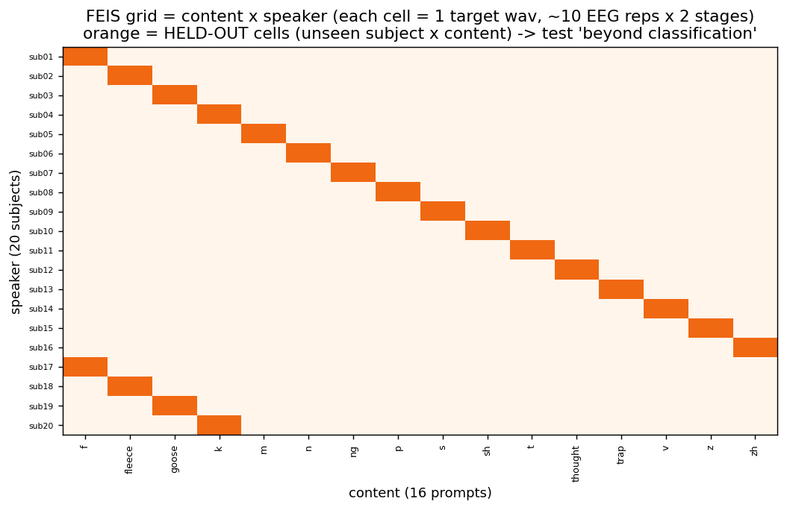
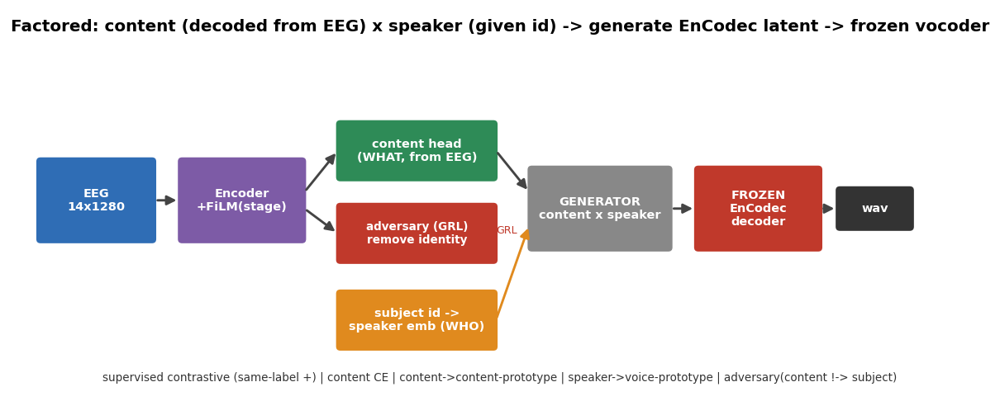

# eeg2wave_server_bundle — 开发进展（当前主线：factored）

## 定位

server bundle 现在**只保留一套模型：`feis_factored`**（v3 已移除，其工具 encoder/synth 并入 factored）。
factored 是"正确使用 FEIS 网格结构"的版本——把目标拆成 **内容(从 EEG 解) × 说话人(从已知 id 取)**，
解耦生成 EnCodec latent，再用冻结声码器发声；并用 hold-out-cell 划分检验"超越分类"。

> v3（subject-aware 单模型）作为**诊断里程碑**保留在历史里：它暴露了"成绩主要来自 subject identity"的
> confound，正是这个发现催生了 factored 的对抗解耦设计。当前代码库已删除 v3。

## 为什么是 factored：FEIS 的网格

```
内容(16 label) × 说话人(20 受试) × 阶段(听 stimuli / 想象 thinking) × 重复(每格~10)
每个 (受试,label) 格子 = 1 条目标 wav（该受试自己的录音）
```



## 架构



- **内容**：从 EEG 解（难，科学问题），FiLM 条件用**阶段**（听/想象），不用 subject（防身份捷径）。
- **说话人**：从**已知 subject id** 取 embedding（嗓音是"免费的一半"）。
- **对抗解耦（GRL）**：adversary 想从 content 预测 subject，梯度反转 → **强制 content 丢掉身份**。
- **生成**：(content, speaker) → generator → EnCodec latent → 冻结 EnCodec decoder → wav。

## 脚本/模块

| 文件 | 作用 |
|---|---|
| `src/feis_factored/targets.py` | 从 EnCodec 缓存建 content/speaker 原型、粗音系类别、**RMS/scale/audio 路径** |
| `src/feis_factored/data.py` | 网格数据集 + hold-out-cell 划分（train / **val_seen** / test_seen / test_holdout）+ 可选随机留格子 |
| `src/feis_factored/model.py` | `FactoredEEG2Speech`：内容头 + 说话人 embedding + 对抗(GRL) + 生成器 + **能量 log-RMS 头** |
| `src/feis_factored/losses.py` | 监督对比 + 内容CE + 内容原型 + 嗓音原型 + 对抗 + 重建 + **能量 + 反塌缩 std** |
| `src/feis_factored/eval.py` | **内容增益(top1−zeroeeg) headline** + 粗类别 zero-EEG 基线 + **塌缩诊断** |
| `scripts/factored_train.py` | 训练 + **按 val 内容增益选 best.pt** + `no_eeg_content_gain` 标记 + history 日志 |
| `scripts/content_probe.py` | **（v2 新增）独立解码探针**：线性 ridge + 受试内 k 折 + **标签置换检验** |
| `scripts/factored_recon_eval.py` | **（v2 新增）codec QC**：五路对照(原始/oracle/mean/pred)、塌缩诊断 |
| `scripts/factored_synthesize.py` | 五路 wav 输出 + manifest（含 rep 序号）|
| `scripts/factored_interpolate.py` | **嗓音插值**：固定内容、两受试间扫 speaker → 同音不同嗓音渐变 wav |

## 损失（每项的作用）

| 损失 | 作用 | 关键 |
|---|---|---|
| 监督对比 | 同 label 全设为正 | **修了 v3 的假负 bug**（10 段共享 1 目标）|
| 内容 CE / 内容原型 | 16 类内容 + 向说话人无关原型对齐 | 内容可读、说话人无关 |
| 嗓音原型 | speaker embedding → 音频嗓音原型 | 学到本人音色（可换 ECAPA）|
| **对抗(GRL)** | content 不许预测出 subject | **打 identity confound** |
| 重建 cos/MSE | 预测 latent → 该格目标 | recon_mse 从 1.0→**0.25**，减少均值奖励 |
| **能量 log-RMS（v2）** | 预测 decoded wav 响度 | **修"小声"（17% RMS）**，合成用预测 scale |
| **反塌缩 std（v2）** | pred 与 target 每维 std 对齐 | 默认关；**会刷自身指标，仅诊断** |

## 进展：v1 训练 → 诊断 → v2

**v1（100 epoch）**：训练集内容准升到 ~0.35，但 **test 内容卡 chance、== zero-EEG**；重建 wav 只有参考的
17–24% 音量、不同样本互相关高达 0.6 → **mean-collapse**（详见 05 与可视化诊断报告）。

**v2 工具化（按 `V2_PLAN.md`）**：加了 ① 独立解码探针（先把"内容可解性"钉死）；② 诚实评测（headline=内容增益）；
③ 能量/log-RMS 头修响度；④ 反塌缩 std 项；⑤ val 独立划分 + 按增益选模型 + `no_eeg_content_gain` 标记；
⑥ codec QC 五路对照。

**v2（100 epoch）结果**：见 05。一句话——**工程坍缩修好了，内容增益仍为零**。

## 阶段结论

1. **工程已闭环**：v2 把坍缩修干净（pred 互相关 0.24→0.09、std 比 0.004→0.53、响度还原）、能量可控、嗓音轴连续可插值。
2. **科学判决已下**：独立探针（置换 p≈0.9，连"听"都 chance）+ factored v2 内容增益=0/负 → **FEIS 16 类内容受试内不可解**。这是信号上限，不是模型缺陷。
3. **下一步**：FEIS 留作诚实方法基线；主线转**听觉感知/想象数据集**或**跨数据集预训练**。

> 运行指令见 `RUN_SERVER.md`、方案见 `V2_PLAN.md`。
