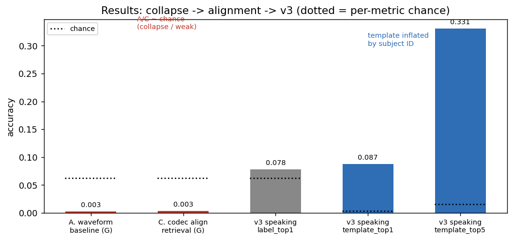
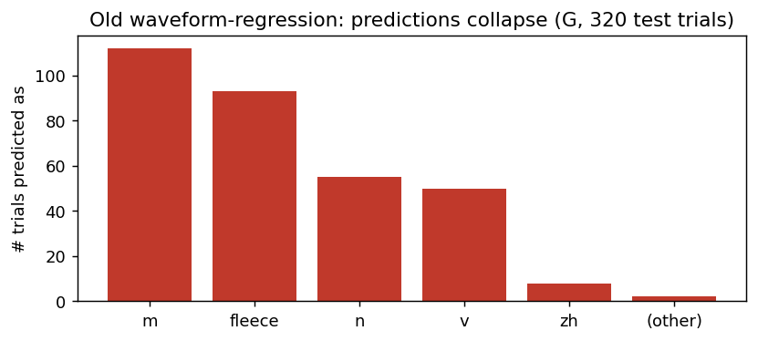
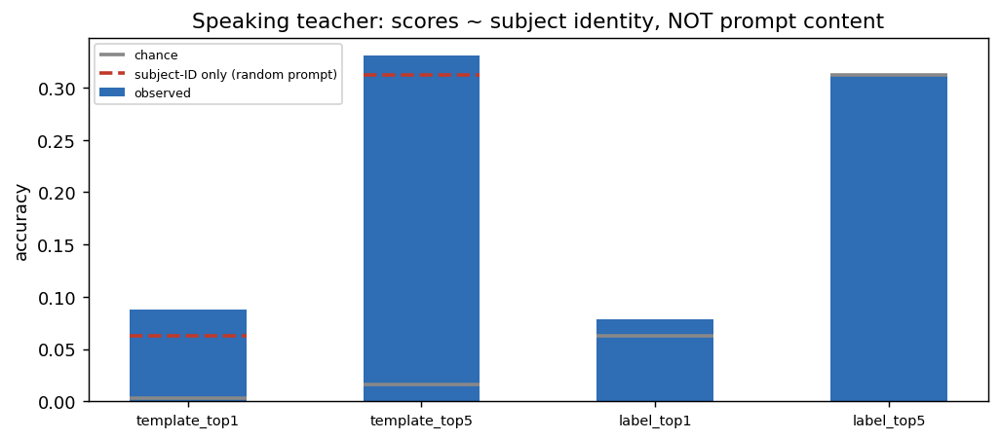
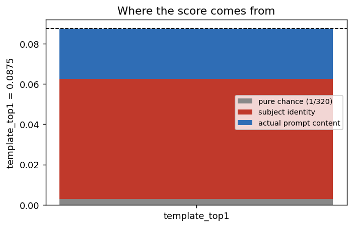
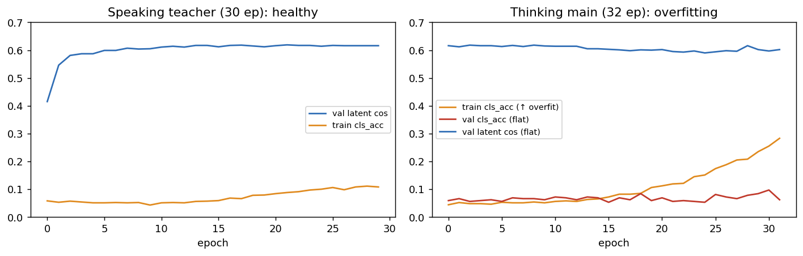
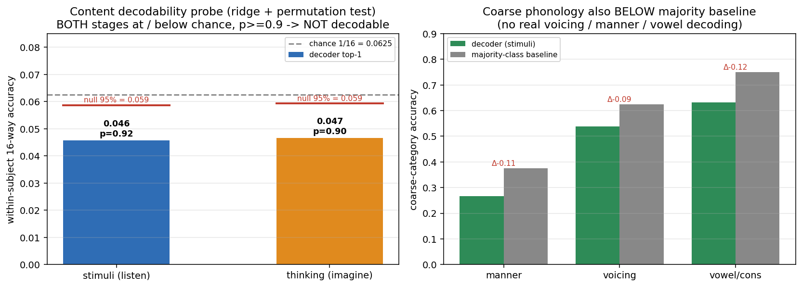
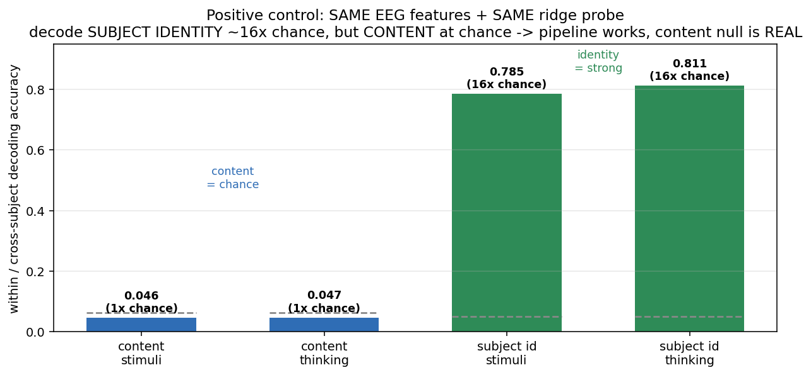
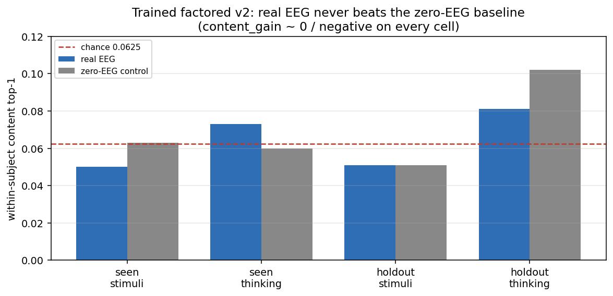
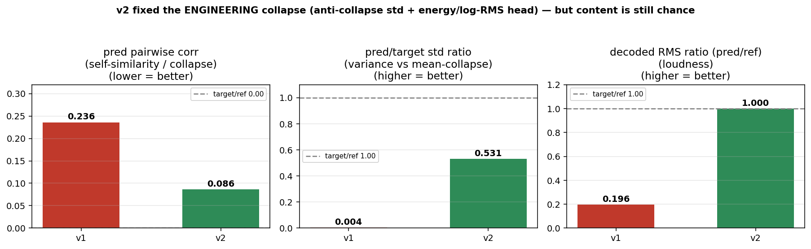

# 实验结果汇总

把所有跑过的实验和数字集中在一页，方便答辩时随时查证。一图总览：

---

## 1. 路线 A：VQ 波形回归基线（已否定）

直接 EEG→原始波形回归，三协议（G pooled / S 单被试 / U holdout）：

| 协议          | 测试条数 | Waveform L1↓ | STFT↓ | 分类 acc         | **NTA**（最近模板）   |
| ------------- | -------- | ------------- | ------ | ---------------- | --------------------------- |
| G             | 320      | 0.0535        | 1.600  | 0.0625 (=chance) | **0.0031 (< chance)** |
| S (subj01)    | 16       | 0.069         | 1.805  | 0.1875           | 0.125                       |
| U (holdout21) | 160      | 0.0537        | 1.415  | 0.075            | 0.0625 (=chance)            |

**坍缩证据**：G 的 320 条里，模型对几乎所有 EEG 输出同几条"平均波形"——`m` 112 次、`fleece` 93 次、`n` 55、`v` 50…

> 结论：L1+STFT 回归的平凡最优解是"输出均值"，EEG 内容弱时必然滑入。**不是调参问题，是目标函数错。**

---

## 2. 路线 B/C：语音表征对齐 + codec 重建（确立方向）

A/B/C 对照（FEIS thinking，G 协议；源 `artifacts/.../test_phase_report_compare_all.md`）：

| 系统                     | 目标表征       | 重建方式              | Top-1  | Top-5  | MRR    | Mean Rank | NTA    | **Mean STFT↓** |
| ------------------------ | -------------- | --------------------- | ------ | ------ | ------ | --------- | ------ | --------------------- |
| A 原始波形               | raw waveform   | direct                | N/A    | N/A    | N/A    | N/A       | 0.0031 | 1.600                 |
| B 序列 HuBERT            | hubert_seq     | retrieval             | 0.0031 | 0.0187 | 0.0240 | 129.6     | 0.0031 | 1.615                 |
| **C codec latent** | encodec_latent | **冻结 decode** | 0.0031 | 0.0219 | 0.0215 | 157.3     | 0.0063 | **1.215**       |
| 旧 pooled HuBERT         | hubert_pooled  | retrieval             | 0.0031 | 0.0219 | 0.0209 | 159.5     | 0.0031 | 1.318                 |

**表征空间结构探针**（很重要的一组数）：

| 指标                    | 值     | 含义                                        |
| ----------------------- | ------ | ------------------------------------------- |
| embedding cosine        | 0.9969 | pooled embedding 虚高（看着像，实则区分差） |
| subject 质心探针 acc    | 0.330  | 表征里编码了一定 subject 身份               |
| label 质心探针 acc      | 0.485  | label 结构 > subject 结构（但都不强）       |
| within-label cos dist   | 0.141  | 同 label 还是分得开一些                     |
| within-subject cos dist | 0.161  | 同受试内更聚                                |

> 结论：C（EnCodec latent + 冻结 decoder）**STFT 最低、绕开坍缩**，被确立为 forward path；
> 但检索 top1≈chance、embedding cosine 虚高，暴露"区分度差"——这正是 v3 要修的。

---

## 3. v3 单数据集（subject-aware）—— 诊断里程碑（模型已退役）

### speaking teacher（强信号探针，30 epoch）

| 指标                             | 值               | chance | 解读                                   |
| -------------------------------- | ---------------- | ------ | -------------------------------------- |
| val latent cos                   | 0.616            | —     | 稳步上升，训练健康                     |
| `template_top1`（受试+prompt） | **0.0875** | 0.0031 | 看似 28×，**实为 subject 身份** |
| `template_top5`                | **0.331**  | 0.0156 | ≈ "认对受试 + 5/16 随机"              |
| `label_top1`（仅 prompt）      | 0.078            | 0.0625 | ≈ chance                              |
| `label_top5`                   | 0.3125           | 0.3125 | = chance                               |
| class-head acc                   | 0.097            | 0.0625 | 略高                                   |

**关键诊断**：template 看似高，分解后几乎全是 subject identity，prompt 内容 ≈ chance：

### thinking 主线（warm-start + KD, 32 epoch）

| 现象           | 数值                  | 判断         |
| -------------- | --------------------- | ------------ |
| train cls_acc  | 0.04 →**0.28** | 训练集被记住 |
| val cls_acc    | 0.06–0.09（平）      | 不泛化       |
| val latent cos | ~0.60（平）           | 受试均值白送 |

> best.pt 已按 val 选优保存。
> 典型过拟合，符合 imagined EEG 信号弱的预期。**v3 已退役**（代码删除）——其 within-subject 诊断
> 已被 factored 的 `within_subject_content_top1` / `_zeroeeg` 指标取代（见 §4）。

---

## 4. factored 训练结果（v1 → 诊断 → v2）

网格划分（stimuli+thinking，clean 20 人）：train **5310** / val_seen 600 / test_seen **600** / **test_holdout 394**。

### 4.1 v1（100 epoch）：内容 chance + 重建坍缩

- 训练集内容准 0.06→**0.35**（记住训练集），但 **test 内容 == zero-EEG == chance**，两阶段都是。
- 重建 wav 只有参考的 **17–24% 音量**；不同样本互相关高达 **0.6**、谱平如噪声 → **mean-collapse**。
- `recon_cos≈0.60` 是误导：嗓音(已知 id) + 该格均值就能拿到，**与内容对错无关**。

### 4.2 决定性判决：独立解码探针（permutation test）

不依赖生成器，一个干净的线性 ridge 解码器 + 受试内 5 折 + **标签置换 200 次**：

| 阶段 | 解码 top1 | chance | null 95% | 置换 p | 显著? |
|---|---|---|---|---|---|
| stimuli（听）| **0.0457** | 0.0625 | 0.0587 | **0.920** | 否 |
| thinking（想象）| **0.0466** | 0.0625 | 0.0593 | **0.896** | 否 |

粗类别（stimuli）：manner 0.267/0.375、voicing 0.539/0.625、vc 0.633/0.750 —— **全部低于多数类基线**。

> **连真在听声音的 stimuli 阶段都解不出**；p≈0.9 远离 0.05。这是生成模型无法逾越的信息上限。

**阳性对照（封口实验）**：用**完全相同的特征和探针**改解 **subject 身份**——

| 解码目标 | stimuli | thinking | chance | 显著? |
|---|---|---|---|---|
| 内容（16 类，受试内）| 0.046 | 0.047 | 0.0625 | 否（p≈0.9）|
| **身份（20 人，跨受试）** | **0.785（16×）** | **0.811（16×）** | 0.05 | **是（p<0.05）** |

> 同一套管线,身份解到 ~80%(16 倍 chance)、内容卡在 chance。**证明探针能抓到真信号,所以"内容解不出"是真的负结果,不是 bug 或解码器太弱。** 这一条直接堵死最常见的质疑。

### 4.3 训练好的 factored v2：内容增益=0，但坍缩已修

| split | top1 | zero-EEG | **content_gain** | recon_cos | std 比 | pred 互相关 |
|---|---|---|---|---|---|---|
| test_seen | 0.0617 | 0.0617 | **0.000** | 0.602 | 0.531 | 0.086 |
| test_holdout | 0.0660 | 0.0761 | **−0.010** | 0.614 | 0.587 | 0.094 |

分阶段增益：seen stimuli −0.013 / thinking +0.013，holdout stimuli 0 / thinking −0.020 —— **都在噪声内，无正增益**。

**工程侧 v1→v2 对比（坍缩已修）**：

| 指标 | v1 | v2 | 目标 |
|---|---|---|---|
| pred 互相关（越低越好）| 0.236 | **0.086** | →0（参考 −0.01）|
| pred/target std 比（越高越好）| ~0.004 | **0.531** | →1 |
| decoded 响度（pred/ref）| 0.196 | **≈1.0**（按预测 RMS 还原）| 1 |

> 一句话：**能量头 + 反塌缩项把工程坍缩修干净了，于是能干净地证明——剩下是信号上限，不是模型不行。**
> （粗类别在 eval 里对 zero-EEG 有 +0.04~0.10 的微弱增益，但**没通过更干净的置换检验**，不作为正向主张。）

## 5. 一句话总结每个阶段

| 阶段 | 一句话 |
|---|---|
| 路线 A（波形回归）| 结构性坍缩，已否定 |
| 路线 B/C（codec 重建）| 输出天生自然、不坍缩，**确立方向** |
| v3（subject-aware，已退役）| 暴露 subject-identity confound，催生 factored |
| factored v1 | 内容 chance + 重建 mean-collapse（17% 音量、互相关 0.6）|
| **解码探针（判决）** | **两阶段 p≈0.9、粗类别低于多数类 → FEIS 内容受试内不可解** |
| **factored v2** | 坍缩修好（std 0.53、互相关 0.09、响度还原），但**内容增益=0/负** |
