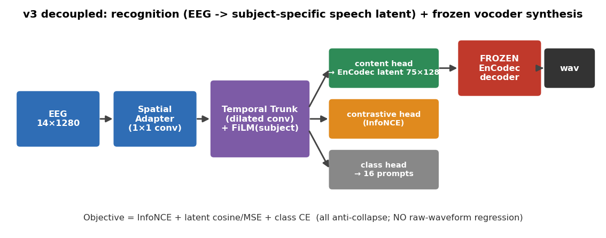

# 方法论与设计动机

这份文档回答"**为什么这样设计**"，把每个关键决策和它要解决的问题对应起来，方便答辩讲清思路。

---

## 1. 问题重述

从 imagined / overt speech 的 EEG 重建**该受试本人**的语音波形。
难点有三：(a) EEG 信噪比低、imagined 阶段尤甚；(b) FEIS 音频是受试级 canonical（无 trial 级声学）；
(c) 不同受试是不同嗓音，必须还原到本人。

---

## 2. 核心设计：解耦"识别"与"合成"

**动机**：第一版直接 EEG→原始波形回归**结构性坍缩**（输出均值，NTA<chance）。
原因是 L1+STFT 回归的平凡最优解就是均值，EEG 内容弱时必然滑入。

**做法**：把任务拆成两段——
1. **识别**：EEG → 预测 **EnCodec latent 序列**（结构化、可判别的目标），不碰原始采样。
2. **合成**：把预测 latent 交给**冻结的 EnCodec decoder** 还原波形。

**收益**：
- 输出**天生自然**（冻结声码器已经会发音），不再是糊在一起的均值。
- 识别与合成解耦，可分别评估、分别改进。
- 彻底避开"回归均值"坍缩。

> 这条结论由 demo bundle 的 A/B/C 对照得出：C（codec latent + 冻结 decoder）STFT 距离最低（1.21 vs 1.60）。

---

## 3. 训练目标：对比 + latent + 分类（抗坍缩）

| 损失项 | 作用 | 为什么需要 |
|---|---|---|
| InfoNCE 对比 | 拉近同 trial EEG↔语音表征、推远不同 | 负样本项**惩罚"所有输入给同一输出"**，是抗坍缩主力 |
| latent cosine + MSE | 回归到该受试目标 latent | 真正的重建监督（受试专属）|
| 分类 CE（16/11 类）| 稳定 + 可解释 | 类间分离，提供可读指标 |
| （可选）跨阶段 KD | speaking teacher → thinking student | 用强信号阶段引导弱信号阶段 |

**关键**：没有任何一项的最优解是"输出均值"——三者协同从根上杜绝坍缩。
**明确不要**原始波形 L1（它正是坍缩之源）；STFT 仅作离线评测。

---

## 4. FiLM 受试条件化：解锁跨被试池化

**动机**：subject-specific 训练每人仅 ~160 trial，杯水车薪且易过拟合。

**做法**：用 subject embedding 通过 **FiLM**（`h ← γ(s)·h + β(s)`）调制编码器 **trunk**（不是侧 head 拼接），
让一个 pooled 模型既共享数据又能 per-subject 特化。数据量 20×→3200+ trial。

**代价/风险**：subject 条件化太强会让模型靠"受试均值 latent"拿分而忽略 EEG 内容——
这正是我们观察到的现象，已用 within-subject + zero-EEG 指标显式检验（见 §7）。

---

## 5. 跨数据集共享空间（v4，已移除）

> 原计划用 per-dataset adapter + 共享 trunk 把 FEIS 与 KaraOne 落到同一 EnCodec latent 空间。现已移除：KaraOne 属 speech-production 范式，与本研究的听觉感知/想象重建目标不符。通用多数据集适配器思路保留备用——若引入符合范式的听觉数据集可复用。

## 6. 评测哲学：把"身份"和"内容"分开

FEIS 目标受试专属（336 = 21×16），所以检索指标会被 **subject identity** 抬高。
因此评测分三层，**主指标是 within-subject**：

| 指标 | 检索范围 | 隔离了什么 | chance |
|---|---|---|---|
| `template_top1` | 全 336 模板 | 受试+prompt（被身份抬高）| 1/336 |
| `label_top1` | 16 个 label 质心 | 仅 prompt（跨受试）| 1/16 |
| **`within_subject_prompt_top1`** | 仅该受试的 16 条 | **纯内容**（去掉身份）| 1/16 |
| `within_subject_prompt_top1_zeroeeg` | 同上，EEG 置零 | 仅 subject embedding 基线 | — |

> within-subject 与 zeroeeg 的**差** = EEG 对内容的真实贡献。这是判断"到底解出没解出 prompt"的决定性证据。

---

## 7. 与文献的关系（一句话定位）

- **解耦 + codec 目标**：呼应神经语音解码里"先表征后合成"的主流（EnCodec / HuBERT 单元 + 冻结声码器）。
- **InfoNCE 跨被试检索**：对标 Défossez 2023 的非侵入语音感知解码（subject layer + 对比检索）。
- **FiLM 受试条件化**：常见于多被试 EEG 基础模型的条件化思路。
- **冻结神经声码器**：EnCodec / HiFi-GAN，保证自然度与 speaker timbre。

---

## 8. 设计决策一览表

| 决策 | 选择 | 理由 |
|---|---|---|
| 重建目标 | EnCodec latent（非原始波形）| 抗坍缩、可解码、自然 |
| 合成 | 冻结 EnCodec decoder | 天生自然、speaker timbre 保留 |
| 主损失 | InfoNCE + latent + 分类 | 三项都抗坍缩 |
| 受试处理 | 跨被试池化 + FiLM | 数据 ×20，兼顾特化 |
| 多数据集 | 已移除（KaraOne 不符范式）| 通用适配器思路保留备用 |
| 主指标 | within-subject prompt + zero-EEG 对照 | 把身份与内容分开 |
| 数据方向 | 转向听觉感知/想象数据集 | 匹配 听到-脑海听觉表象-重建 目标 |
---

## 9. 当前主线：factored（content × speaker 解耦生成）

> v3（subject-aware 单模型）已退役（代码删除），其诊断发现催生了 factored。下面是当前主线。

**动机**：§6 的诊断证明 subject-aware 模型成绩主要来自"认人"。要真正解"内容"，必须把内容与说话人**显式分开**。

**做法（正确用 FEIS 网格）**：把 FEIS 看成 `内容(16) × 说话人(20) × 阶段(听/想象) × 重复(10)`：

1. **内容从 EEG 解**（content head）；FiLM 条件用**阶段**，不用 subject（防身份捷径）。
2. **说话人从已知 subject id 取** embedding（嗓音是"免费的一半"，不从 EEG 解）。
3. **对抗解耦（GRL）**：adversary 想从 content 预测 subject，梯度反转 → 强制 content **丢掉身份**（DANN / voice-conversion 风格）。
4. **监督对比**：同 label 的所有样本设为正 → **修了 v3 把"10 段共享 1 目标"当假负的 bug**。
5. **嗓音原型监督**：speaker embedding → 音频派生嗓音原型（可换 ECAPA-TDNN）。
6. **hold-out-cell 划分**：整格挖掉若干 (受试,label)，**测能否生成没见过的组合 = 超越分类的可证伪实验**。

**与文献**：解耦 = AutoVC/StyleTTS voice-conversion + DANN(GRL)；内容头 = Lee 2025 听到语音音素预测 / HuBERT 单元；
codec + 冻结声码器 = EnCodec；同任务对标 Lee 2023《Voice Reconstruction from EEG during Imagined Speech》。

**诚实定位**：这些机制让**评测变诚实、能测"超越分类"**，但不增加 EEG 本没有的信号——内容仍是 16 选 1，
imagined 大概率接近 chance，嗓音是免费的一半。价值在于：给"FEIS 内容能不能解/能不能超越分类"一个干净答案，且框架可迁到听觉数据集。

---

## 10. v2 方法学加固（把问题拆成"科学"与"工程"）

v1 训练后暴露**两个互相独立**的失败，v2 按 `V2_PLAN.md` 分开处理：

| | P1 内容（科学）| P2 重建塌缩（工程）|
|---|---|---|
| 证据 | 内容 == zero-EEG == chance | 音量 17%、pred 互相关 0.6、谱平 |
| 病灶 | EEG→content 的信号上限 | EEG→latent 生成器（codec 本身健康）|
| 能否靠改 loss 修 | **不能** | **能**，但修好的是"嗓音那免费一半"|

**关键方法（按"先证伪"原则排序）**：

1. **独立解码探针**（`content_probe.py`）：线性 ridge + 受试内 k 折 + **标签置换检验**。
   先用最便宜、最透明的解码器回答"有没有内容信号"——生成模型不可能超过它能拿到的信息量。这是判决性实验。
2. **诚实评测**：headline 从 raw top1 改成 **`content_gain = top1 − zeroeeg`**；粗类别也配 zero-EEG 基线（不再被多数类冒充）；
   holdout 提供随机留格子，堵掉常数预测器对确定性排布的 gaming。
3. **能量/log-RMS 头**：预测 decoded wav 响度，合成时按**模型预测的 scale** 还原音量（不偷 target RMS），修"小声"。
4. **反塌缩 std 项**（默认关）：匹配 pred/target 每维 std；**明确标注它会刷自身的塌缩指标，仅作诊断**，唯一成功闸门是 `content_gain`。
5. **val 独立划分 + 按增益选模型**：seen cell 倒数第 2 个重复做 val，best.pt 选 `content_gain` 最大者；若 ≤0 则标 `no_eeg_content_gain`。
6. **codec QC 五路对照**（`factored_recon_eval.py`）：原始 / oracle / mean-latent / pred_unscaled / pred_scaled，先确认 codec 健康再归因模型。

**与文献**：能量/scale 建模呼应 neural codec TTS 的显式 prosody/energy 预测；置换检验是 BCI 解码的标准显著性做法；
zero-EEG 对照 = 因果消融。

**结果**：见 05——探针两阶段 p≈0.9、factored v2 内容增益=0/负，而坍缩被修好（std 0.53、互相关 0.09、响度还原）。
**这套加固的价值在于：把工程噪声清干净后，负结果不再可被"模型太弱/管线有 bug"反驳。**
