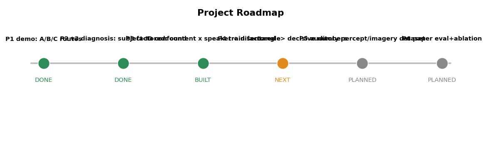

# 路线图、风险与答辩预案

## 1. 路线图

| 阶段 | 内容                                                                                           | 状态              |
| ---- | ---------------------------------------------------------------------------------------------- | ----------------- |
| P1   | demo bundle：A/B/C 三路线探索，确立 codec-latent 方向                                          | ✅ 完成           |
| P2   | server bundle v3：单数据集 FEIS 解耦重写 →**诊断出 subject-identity confound**          | ✅ 完成（已退役） |
| P3   | **factored**：content×speaker 解耦 + 对抗(GRL) + hold-out-cell + v2 诚实评测/能量头     | ✅ 完成           |
| P4   | **训 factored + 独立探针 → 判决**：内容增益=0、探针 p≈0.9 → **FEIS 内容不可解** | ✅ 完成（负结果） |
| P5   | 选定符合范式的**听觉感知/想象**数据集，迁 factored 框架                                  | 🔶 进行中         |
| P6   | 新范式重建（hear → 听觉表象 → 重建听到的声音）+ 论文级评测（消融/置换/听感）                 | ⬜ 规划           |

## 2. 近期具体任务（2 周内）

1. **（已完成）判决 FEIS 内容可解性**：factored v2 内容增益=0/负；独立探针两阶段 p≈0.9、粗类别低于多数类 → **内容不可解，已坐实**。
   - 建议补 1 个**阳性对照**（用同特征同探针解 subject 身份，预期高准确率）→ 证明探针管线没坏、负结果无法被反驳。
2. **选听觉感知/想象数据集**（核心、进行中）：按"听觉刺激 + 听觉想象/复述阶段 + 重建目标=听到的声音 + 模态"四条标准筛选。
   - 候选：OpenMIIR（听→想象同一段音乐，范式最贴合）；Broderick/Brennan 自然语音聆听 EEG（感知重建）；MEG（Gwilliams/Schoffelen）信号更好；ECoG（Bellier 重建听到的音乐）保真最高但侵入。
3. **迁移 factored 框架**：内容×说话人解耦 + 对抗 + 冻结声码器 + 诚实评测(增益/置换)，迁到新数据集的“听/想象”阶段；或先做**跨数据集预训练**抬高 EEG encoder 起点。

## 3. 风险与应对

| 风险                            | 可能性                          | 影响 | 应对                                                                  |
| ------------------------------- | ------------------------------- | ---- | --------------------------------------------------------------------- |
| FEIS 内容不可解（神经上限）     | **已确认**（探针 p≈0.9） | 中   | 已执行：FEIS 退为方法基线，主线转听觉感知/想象数据集                  |
| 负结果被质疑"解码器太弱/有 bug" | 中                              | 中   | 补阳性对照（同探针解 subject 身份应很高）+ 已有 v2 修好坍缩、置换检验 |
| 成绩被 subject identity 主导    | 已发生                          | 中   | within-subject + zero-EEG 显式剥离 + 对抗(GRL) 解耦                   |
| 找不到完美匹配范式的公开数据集  | 中                              | 高   | 退而求其次：感知重建（Broderick/Brennan）；或自采小规模听觉想象数据   |
| 非侵入 EEG 重建声音波形难       | 高                              | 高   | 现实目标先定在包络/谱重建或片段检索；高保真考虑 MEG/ECoG/fMRI         |
| 过拟合（小数据）                | 高                              | 中   | 早停 + 正则 + 跨被试池化 + 预训练                                     |

## 4. 答辩 Q&A 预案

**Q：你做的"想象语音"和"听觉想象"有什么区别？**
A：imagined **speech**（FEIS/KaraOne）是想象**自己发音**（运动想象，激活运动皮层，目标是自己嗓音）；
我要做的是 auditory **imagery**——脑海里**回放听到的声音**（听觉表象，激活听觉皮层），目标是**听到的那个声音**。两者是不同的认知过程与脑区。

**Q：为什么把 KaraOne 去掉了？**
A：KaraOne 的"imagined"指令是 imagine **speaking**、重建目标是受试**自己说出的录音**，是 production 范式，
跟我"听 → 脑海听觉表象 → 重建听到的声音"对不上。留着只会让模型和叙事偏离研究问题。

**Q：FEIS 符合你的研究吗？**
A：部分符合。它有真正的 hearing 阶段（听到真实声音，且是本人录音），可支撑"听 → 重建听到的声音"；
但它的 thinking 阶段是"想象发音"，缺"听觉复述"那一步。所以 FEIS 当**方法基线**用，不是最终范式数据集。

**Q：factored 跟之前的 v3 有什么本质不同？**
A：v3 是一个 subject-aware 单模型，结果被“认人”主导。factored **显式把内容和说话人拆开**：内容只从 EEG 解、
说话人从已知 id 取，并用**对抗(GRL)** 强制内容表征丢掉身份信息——直接修掉 v3 暴露的 confound。

**Q：怎么证明你“超越分类”、不是 16 选 1 再播录音？**
A：用 **hold-out-cell** 划分——整格挖掉若干 (受试,label) 组合（Latin-square，20 个留格子），
测模型能否为**训练里没见过的“某人×某内容”组合**生成正确波形。这是分类做不到、只有生成式解耦模型才能答的题。

**Q：能学到跨被试的嗓音特点吗？**
A：能，且可演示。`factored_interpolate.py` 固定内容、在两个受试间扫 speaker embedding，
得到“同一音、嗓音连续渐变”的一串 wav（voice-conversion 风格），说明嗓音轴是连续可控的。

**Q：那这些机制会提升内容解码准确率吗？**
A：**诚实讲不会**——它们不增加 EEG 本就没有的信号。价值在于让评测**诚实、可证伪**：
给“FEIS 内容到底能不能解 / 能不能超越分类”一个干净答案，且框架能直接迁到听觉数据集。

**Q（核心）：你凭什么说"内容不可解"？会不会是你模型/解码器太弱？**
A：两条独立证据互相印证。① **独立解码探针**：一个干净的线性 ridge 解码器 + 受试内 5 折 + **标签置换检验 200 次**，
听(stimuli) 0.046、想象(thinking) 0.047，**都 ≤ chance(0.0625)，p=0.92/0.90**，粗类别还低于多数类基线——
线性解码器是 BCI 标准探针，它都拿不到，说明信号本身没有。② **训练好的 factored v2**（一个深网）内容增益=0/负，
撞到同一条 chance 线。"太弱"无法同时解释线性探针和深网都到 chance。

> **阳性对照（已做）**：用完全相同的特征和探针改解 subject 身份 → 听 0.785、想象 0.811（≈16× chance，p<0.05）。
> 同一管线身份解到 ~80%、内容卡 chance → 证明管线能抓真信号，**内容的负结果是真的，不是 bug 也不是解码器太弱**。

**Q：那 recon_cos 有 0.6、声音也能合成，不算重建出来了吗？**
A：那 0.6 和"能出声"来自**嗓音那免费的一半**（说话人由已知 id 给）。EnCodec latent 被音色主导，
"对的说话人 + 该格均值"就能拿到 0.6，**与内容对错无关**。v2 还专门修好了坍缩（音量还原、互相关 0.09），
所以现在能干净地说：声音是嗓音驱动的，不是从脑信号解出的内容。

**Q：为什么 v1 时 holdout 上 zero-EEG（0.20）反而比真 EEG 高？**
A：那是旧的确定性留格子排布（label=subject%16）被**常数预测器**蹭到了，是评测 artifact，不是解码。
v2 已提供 `holdout_random` 随机排布 + 直接报 `content_gain`（EEG−zeroeeg）来堵这个洞；结论不变：EEG 无内容增益。

**Q：template_top1 比 chance 高 28 倍，不是能解码语音吗？**
A：分解后几乎全是 subject identity（≈ 认对受试 + 受试内随机猜），真正衡量内容的 within-subject / label 指标都在 chance 附近。即"解出是谁"，不是"解出说/听到什么"。

**Q：为什么不端到端回归波形？**
A：试过（路线 A），结构性坍缩——对所有输入输出均值波形，NTA 低于 chance。改成预测 codec latent + 冻结解码后解决。

**Q：非侵入 EEG 真能重建出能听的声音吗？**
A：诚实讲很难。14–64 通道 EEG 目前多做到包络/谱重建或片段检索（Défossez 2023 也只做检索）。
真正"还原成能听的声音"主要靠 ECoG/fMRI。所以选数据集时**模态比数据集本身更决定上限**。

## 5. 一页纸结论（贴最后一张 slide）

- **方法已确立**：EEG → EnCodec latent → 冻结解码，输出自然；factored 把内容×说话人显式解耦。
- **诊断已量化**：v3 成绩主要来自 subject identity（已退役）→ 催生 factored。
- **工程已闭环**：v2 修好重建坍缩（std 比 0.53、pred 互相关 0.09、响度还原）、能量可控、嗓音轴连续可插值。
- **判决已下（核心）**：**FEIS 16 类内容受试内不可解**——独立探针两阶段 p≈0.9、粗类别低于多数类；factored v2 内容增益=0/负。这是信号上限，不是模型缺陷。
- **下一步**：FEIS 作诚实方法基线；主线转**听觉感知/想象数据集**（信噪比更高、范式更贴合）或**跨数据集预训练**。
