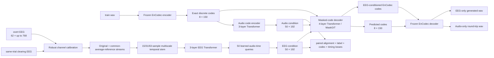

# KaraOne 0715：独立 EEG-to-Voice Codec Alignment 模型与运行指南

## 1. 结论先行

0715 是一个不依赖 0711 checkpoint、0711 HuBERT codebook 或 0711 flow 的独立版本。它可以读取相同的 KaraOne 原始 EEG/wav 数据，但重新构建语音目标、audio encoder/decoder、EEG encoder、alignment loss、生成器和验证 gate。

0715 解决 0711 的两个主要瓶颈：

1. 0711 的 P02 跨被试 EEG→语义 gate 没有通过，说明生成器收到的 EEG 条件不可靠；
2. 更关键的是，0711 的 64-unit HuBERT token 即使完全不经过 EEG，token→wav 的 waveform correlation 仍约为 0，SI-SDR 约为 −33 dB。该 token 适合语义聚类，但不是可逆声学表示。

0715 因此把生成目标改为本地冻结 EnCodec 的原生离散 codes：

```text
每条 2 秒 wav -> 8 codebooks × 150 frames，每个 code 为 0..1023
```

真实 codes 可以由冻结 EnCodec decoder 确定性地还原为 codec wav。这里的“可解码”不等于无损：4 条真实样本的 code-oracle smoke test 平均零延迟 waveform correlation 为 0.871；但它显著不同于 0711 HuBERT-token round-trip 接近 0 的相关。0715 不再要求 flow 从高斯噪声回归一个高度共享、容易产生误导性高 cosine 的连续 latent。

需要明确区分两个目标：

- 内容可懂的 EEG-conditioned speech synthesis：EEG 能否恢复 11 类语音内容，并生成听起来像该词/音素的声音；
- 样本级原声重建：EEG 能否额外恢复该 trial 的时序、韵律、说话人和声学细节。

前者在 KaraOne 规模下有现实机会；后者更困难。0715 同时测量两者，不把“预测对类别后生成一个模板音频”误写成原声重建。

## 2. 0715 开发前信号探针

0715 已运行一个不读取 MM21 的线性探针。训练使用 12 位训练被试，P02 只用于跨被试验证，机会水平为 1/11 = 9.09%。

| EEG 输入/基线 | P02 balanced accuracy |
|---|---:|
| overt segment 长度 | 10.91% |
| clearing EEG | 10.30% |
| stimulus-like EEG | 8.48% |
| thinking EEG | 10.91% |
| overt EEG，trial 内标准化 | **18.18%** |
| overt EEG，same-trial clearing 校准 | **18.18%** |

这说明：

- 标签不能仅靠 segment 长度解码；
- 非 overt 阶段在 P02 上没有稳定信号；
- overt EEG 中存在弱但非零的跨被试类别信息，可能混合运动皮层、发音准备、肌电/运动伪迹等来源；
- 0715 应先把 P02 内容解码稳定提高到 18% 以上，再判断生成结果。

探针结果保存在：

```text
artifacts/outputs_karaone_0715/karaone_0715_signal_probe.json
```

## 3. 总体架构



## 4. Audio encoder/decoder

### 4.1 可逆目标

本地 EnCodec 以 6 kbps、24 kHz 工作。每条 2 秒 wav 产生 `[8,150]` integer codes。0715 缓存：

- `encodec_codes [1913,8,150]`；
- `encodec_scale` 与 `encodec_scale_valid`；
- 150 步 audio envelope；
- onset 和 duration；
- trial key、subject、label、audio path、train-only fit mask。

真实 code oracle 通过 EnCodec 官方 decode 路径生成。若模型返回 scale，只有 oracle 可以使用真实 scale；EEG-conditioned 与 label-only 路径禁止使用 reference scale。

### 4.2 Audio condition encoder

8 个 codebook 分别使用 embedding；同一时间位置的 8 路 embedding 融合后，经过 3 层 Transformer，并压缩成 `[50,192]` audio condition。额外的 audio label head 用于验证 condition 是否保留 11 类内容。

### 4.3 Masked-code decoder

decoder 接收：

- 被随机遮挡的 EnCodec codes；
- `[50,192]` condition；
- label probability condition。

训练时 mask ratio 在 50%–95% 之间，25% batch 使用 100% mask；另外随机丢弃 condition 和 label，确保模型既能学习声学 condition，也能形成 label-only canonical speech prior。

推理从全部 mask 开始，以 12 个 MaskGIT steps 逐步填充最有把握的 codes。输出始终是合法的 0–1023 code index，再交给冻结 EnCodec decoder。

## 5. EEG encoder

### 5.1 输入与基线校准

0715 使用 overt EEG 的前 768 samples，约 3 秒，避免 0711 将多数 2 秒左右 trial 填充到 1,280 samples 所造成的大量无效 token。

same-trial clearing 只计算每个通道的 median 和 MAD：

```text
x_normalized = (x_overt - median_clearing) / (1.4826 × MAD_clearing)
```

它不提供标签、音频或模板，只是 EEG-only 的传感器/被试基线校准。模型内部同时保留原始校准流和 common-average-reference 流。

### 5.2 多尺度时空编码

- temporal kernels：15、31、63 samples，约 59、121、246 ms；
- stride 4，将 256 Hz EEG 降到约 64 token/s；
- 3 层 Transformer 建模 overt 时间序列；
- 50 个 learned queries 对 EEG tokens 做 cross-attention，产生与 audio condition 同形状的 `[50,192]` 表征。

EEG 模型约 3.40 M 参数；audio code autoencoder 约 9.40 M 参数。规模针对 1,616 条训练 trial 控制，没有使用大型端到端 waveform generator。

## 6. EEG/audio alignment loss

EEG 阶段冻结 audio encoder 与 masked-code decoder，只训练 EEG encoder。总损失包括：

1. 11 类 label cross-entropy；
2. EEG/audio condition 的 Smooth-L1、cosine 和 temporal-delta alignment；
3. trial-paired InfoNCE；同标签非配对 trial 从负例中移除，避免 false negative；
4. 全 mask decoder 下的 8-codebook cross-entropy，前两个 coarse codebooks 权重最高；
5. audio envelope BCE、onset/duration regression；
6. audio label-head 到 EEG label-head 的 distillation；
7. 训练被试 domain-adversarial loss；
8. condition variance regularizer。

codec loss 在前 20 epochs 逐步加权。这样模型先学习较容易且可验证的内容，再学习更高熵的声学 codes。

## 7. 三条生成路径与审计逻辑

每个 trial 导出：

| 路径 | 输入 | 用途 |
|---|---|---|
| `codec_oracle` | 真实 EnCodec codes | 检查 codec/cache 是否可逆 |
| `label_only` | EEG 预测的 label probability；audio condition 置零 | 内容模板/canonical speech 基线 |
| `eeg_conditioned` | EEG condition + EEG 预测 label probability | 0715 主生成路径 |

所有预测 label 都来自 EEG；推理没有真实 label。reference wav 在生成结束后才读取，用于写 comparison 图与计算指标。

只有当 `eeg_conditioned` 相对 `label_only` 在 coarse-code accuracy、生成音频内容分类或声学指标上有稳定增益，才能说明 EEG condition 提供了超越类别模板的样本级信息。

## 8. Gate

### 8.1 Audio gate

训练期先用 one-pass code accuracy 选择 audio checkpoint；随后必须运行真正的 P02 全 mask、12-step MaskGIT round-trip gate。该 gate 同时导出 codec-oracle、audio-condition、audio-condition+true-label 和 label-only wav，要求：

- 不输入 label 的 audio-condition 生成 codes，其 11 类 balanced accuracy ≥ 50%；
- audio-condition + true-label 审计分支的 balanced accuracy ≥ 70%；
- audio-condition 的 q0/q1 code accuracy 高于 true-label-only decoder。

true label 只存在于明确标注的 audio-only 审计分支，不进入 EEG 推理。audio round-trip gate 失败时默认停止 EEG 训练，因为 decoder 本身尚未学会利用可逆 condition。

### 8.2 EEG P02 gate

默认要求：

- P02 balanced accuracy ≥ 20%，明确高于 18.18% 线性 overt-EEG 基线；
- stratified bootstrap 95% CI 下界高于 1/11；
- EEG-conditioned q0/q1 accuracy 高于 EEG-predicted-label-only prior。

MM21 在 gate 通过前保持锁定。`ALLOW_EXPLORATORY=1` 可以生成诊断文件，但这些结果必须标记为 exploratory/not reportable。

## 9. 一键运行

### 9.1 小规模接口测试

该命令只用于检查完整链路，不用于判断效果：

```bash
cd /Users/samxie/Research/EEG-Voice/ref_github/speech_decoding/eeg2wave_server_bundle/karaone_overt_recon_bundle/app

ALLOW_EXPLORATORY=1 DEVICE=mps AUDIO_EPOCHS=1 EEG_EPOCHS=1 LIMIT=3 \
bash run_karaone_0715.sh full
```

### 9.2 正式开发运行：不读取 MM21

```bash
cd /Users/samxie/Research/EEG-Voice/ref_github/speech_decoding/eeg2wave_server_bundle/karaone_overt_recon_bundle/app

DEVICE=mps caffeinate -dims bash run_karaone_0715.sh full
```

它依次执行：

```text
signal probe
-> resumable EnCodec code cache
-> audio code autoencoder 60 epochs
-> P02 audio-only MaskGIT/code/wav gate
-> EEG alignment 80 epochs
-> P02 evaluation
-> P02 reference/oracle/label-only/EEG-conditioned wav + comparison PNG
```

训练与 cache 建立都显示实时进度条。`last.pt` 存在时自动续训；cache 提取也按 batch 保存临时 part，意外中断后可继续。

### 9.3 P02 gate 通过后最终运行

```bash
cd /Users/samxie/Research/EEG-Voice/ref_github/speech_decoding/eeg2wave_server_bundle/karaone_overt_recon_bundle/app

ALLOW_FINAL_TEST=1 DEVICE=mps caffeinate -dims bash run_karaone_0715.sh final
```

`final` 会在复用已完成 checkpoint 后，导出 train、P02 和 MM21 全部结果。若 P02 gate 未通过，它会在访问 MM21 前退出。

若仅为了失败分析而明确需要 MM21 exploratory 输出：

```bash
ALLOW_FINAL_TEST=1 ALLOW_EXPLORATORY=1 DEVICE=mps caffeinate -dims \
bash run_karaone_0715.sh final
```

## 10. 输出目录

```text
artifacts/karaone_0715/
  karaone_0715_encodec_codes_s15.npz
  karaone_0715_encodec_codes_s15.audit.json
  karaone_0715_split_manifest.json

artifacts/outputs_karaone_0715/
  karaone_0715_signal_probe.json
  karaone_0715_run_manifest.json
  karaone_0715_audio_codec_s15/
    checkpoints/best.pt
    checkpoints/last.pt
    metrics/validation_gate.json
    metrics/roundtrip_gate.json
    metrics/history.json
    roundtrip_subject_val/
      reference/
      codec_oracle/
      audio_condition/
      audio_condition_plus_label/
      label_only/
  karaone_0715_eeg_align_s15/
    checkpoints/best.pt
    checkpoints/last.pt
    metrics/validation_gate.json
    metrics/subject_val_evaluation.json
    metrics/subject_val_audio_metrics.json
    wavs/0715_subject_val/
      reference/
      codec_oracle/
      label_only/
      eeg_conditioned/
      comparison/
      synthesis_manifest.json
```

## 11. 结果解读优先级

结果出来后按以下顺序判断：

1. `codec_oracle` 是否接近 reference；否则先修 cache/codec；
2. audio gate 是否通过；否则 masked-code decoder 不可用；
3. EEG P02 label accuracy/CI 是否超过机会水平与 18.18% 线性基线；
4. `eeg_conditioned_coarse_gain` 是否大于 0；否则声音主要来自 EEG label-only prior；
5. 生成 codes 经 audio encoder 的内容分类是否优于 label-only；
6. 最后才看 waveform correlation、SI-SDR、频谱 MAE和人工听感。

不能因为 wav 文件能播放、EnCodec code 合法或 latent cosine 很高，就声称 EEG 重建成功。

## 12. 研究边界

MM21 已在 0711 的诊断阶段被查看，因此它对整个研究项目而言不再是完全未触碰的 virgin test。0715 仍保持训练代码不使用 MM21，并在 P02 gate 前锁定访问，但论文级结论应再补充：

- 固定配置后的多 seed 结果；
- 14-subject leave-one-subject-out 汇总；
- clearing/length-only、label-only、无 domain adversary、无 code loss 等消融；
- 新数据或外部数据集验证。

0715 的目标不是承诺必然恢复原声，而是把“信号是否存在、内容是否可懂、声音是否只来自类别 prior、EEG 是否增加样本级声学信息”分成可独立证伪的层级。
