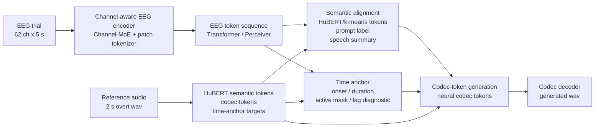

# KaraOne EEG-to-Speech 当前进展展示稿

2026-07-02

---

## 1. 研究问题

**EEG 中是否存在可以跨被试泛化的语音内容、语音时序和可生成声学结构**。

我上次回去后又做了一下，发现其实不是模型学到了EEG内容，而是直接按照Subject套模板，所以看起来重建像。这点启发了我，如果只展示一段听起来像语音的 wav，很容易把训练集语音先验、retrieval 最近邻或者时间错位后的相似包络误认为 EEG 解码成功。我发现直接从EEG重建到Waveform非常困难，因此我尝试把任务拆成三层：

第一层是语义层，判断 EEG 表示是否真的指向对应 speech content，例如 HuBERT semantic tokens (上次我提到过这个，这个是比较成熟得将音频转化为Token的方法)、speech semantic summary 和 prompt label (仅作为检验辅助，为了避免框定住了泛化性)。

第二层是时序层，判断 EEG 是否能预测语音主体段什么时候出现、持续多久、active speech window 在哪里，这个一开始我做的时候没有考虑，做着做着发现挺重要，因为这个数据集 thinking 为5s，被试在这 5 秒里并不是从第 0 秒开始就稳定地想象发音，也不一定在固定时间点完成“看到提示、确认声音、在脑海中模拟发音”这一过程。真正和 imagined speech 对应的 EEG 片段非常有可能只占 5 秒中的一小段，而且不同 trial、不同 subject 的位置都会偏移。

第三层是生成层，在前两层成立的基础上，再生成 neural codec tokens，并通过 codec decoder 合成 wav，随后比较合成的wav与真是wav的差异。

我现在做的可以总结成 **tokenized, time-aware neural speech generation**。这个比之前的路线更麻烦，但更能避免伪成功（比如之前的其实是直接识别到 subject id 就去对应的受试 id 作为模板得到语音，这个我在后面看了数据后也觉得不奇怪，因为每个受试自己的特色太强了，无论是自己说出的语音还是自己的EEG，所以看到很多论文说跨被试非常困难，模型很容易假学其实没学到EEG的内容信号，也不难理解）。

---

## 2. KaraOne 数据介绍与 trial 流程

KaraOne 每个 trial 包含一个 prompt，例如 `/tiy/`、`/uw/`、`pat`、`knew`。结合 Zhao & Rudzicz 2015 的实验描述，一个 trial 的原始流程是：

```text
rest / clearing
-> stimulus cue
-> imagined speech / thinking
-> speaking / overt production
```

其中 `stimulus cue` 不是单纯的 beep，而是屏幕显示 prompt text，同时播放该 prompt 对应的 auditory utterance（未公开）；`thinking` 是被试想象说这个 prompt 但不动嘴；`speaking/overt` 是被试真正开口说，reference/original wav 来自这个阶段。

当前 bundle 中主要使用两条路线：

- `thinking`：想象发音 EEG，单个样本为 `62 channels x 1280 samples`，采样率 256 Hz，约 5 秒；
- `overt_like`：真实发声阶段 EEG，也就是 speaking/overt production 对应的 EEG。

每条路线各有 1913 个 trial-level 样本，采用固定 subject-holdout：

数据集还是不够，数据集合并，都行不通，用Text做引导，只用EEG调整语音语调

EEG增强

语音增强

| split         |                                                                subject | 样本数 | 用途                            |
| ------------- | ---------------------------------------------------------------------: | -----: | ------------------------------- |
|               |                                                                        |        |                                 |
| subject_train | MM05, MM08, MM09, MM10, MM11, MM12, MM14, MM15, MM16, MM18, MM19, MM20 |   1616 | 训练模型、拟合 train-only cache |
| subject_val   |                                                                    P02 |    165 | 模型选择与 gate 评估            |
| subject_test  |                                                                   MM21 |    132 | heldout 泛化评估                |

label 空间共 11 类，随机分类水平约为 `1/11 = 0.0909`。音频目标统一整理为 2 秒窗口，即 `16000 Hz x 2 s = 32000 samples`。

### 具体数据展示：跨被试泛化很困难

下面选取同一个 label `/tiy/` 的四条样本：`MM14 trial 29/31` 和 `MM18 trial 18/23`。图中 EEG 按连续上下文展示：

```text
current clearing/resting
-> current stimulus_like
-> current thinking
-> current overt_like/speaking
-> next-trial clearing/resting
```

为了避免图过于复杂，只展示四个代表通道 `FZ, C3, CZ, PZ`。这个图想表达的不是模型结果，而是原始数据事实：同一个 label 下，不同 trial 和不同 subject 的 EEG 形态本来就有明显差异。


同样，下面四条 waveform 都是 `/tiy/` 的真实 overt/reference audio，但 onset、duration、峰值幅度和 envelope 也不完全一致。也就是说，即使 label 相同，具体发音时序和声学形态仍然有相当显著的 trial-level 与 subject-level 变化，这个确实让人头疼。


这两张图解释了为什么我不直接做 waveform regression，也不只看 retrieval 听感。因为跨被试 EEG-to-Speech 的难点从原始数据层面就存在，同 label 的 EEG 和真实发音都不是固定模板。

---

## 3. 建模思路：从 EEG 到 Token，再到 Speech Generation

目前展示的最近两天的模型版本。基本上我每天都会根据前一天跑的结果来调整一下模型，希望能有更好的效果，感觉结合这几年相关的论文，结合各种老师提出的建议：从简单的比如MLP开始，到MoE选通道，信号聚类，加diffusion提升效果等等都试了一轮，都没有在这个数据集上做出稳定有效的结果，后面用Codex和Claude诊断优化也没有做出效果，非常受打击。目前EEG到语音的工作确实偏向于证明可以分类区分之类的，我现在还在阅读EEG还原图像的工作，看看能不能有更多灵感。

当前模型的核心思路是：先把 EEG 表示成 token sequence，再对齐到 speech semantic/prosody tokens，最后生成 neural codec tokens。这样可以把“说了什么”“什么时候说”“怎么生成波形”分开验证。



先做对比学习

HuBERT 针对本数据集改进，简化

EEG Channel：随机选几个来做，数据增强

最后都不行再考虑Text

时序问题：建立Window：SwinTF，Jepa


其中 Channel-MoE 的作用是让模型在 62 个 EEG 通道中学习 trial-level 的软通道选择，而不是假设所有通道都同等可靠。semantic alignment 负责判断 EEG 是否进入正确语音内容邻域(这一块我做的还不是很好)；time anchor 负责估计语音主体段的位置；codec-token generation 负责把表示转成可解码的声学 token。图我是直接用Codex画的，不符合流程图标准且有点乱，每一点总结起来说是：

* `EEG trial -> Channel-aware EEG encoder` 这条线表示原始 EEG 被输入到模型中。这里的 EEG trial 指的是一条 thinking 或 overt_like 阶段的 EEG 样本，数据形状大致是 62 个通道、5 秒长度，也就是 `62 channels x 5 seconds`。原始 EEG 本质上是连续的脑电时间序列，里面包含不同通道、不同时间点的电位变化，不能直接拿来生成语音。因此模型首先需要一个 EEG encoder，把原始 EEG 转换成后续模型可以处理的表征。
* `Channel-aware EEG encoder -> EEG token sequence` 这条线表示 EEG 被编码成一串 token。这个 Channel-aware EEG encoder 主要做两件事：第一是通过 Channel-MoE 判断不同 EEG 通道的重要性，因为 62 个通道不一定都同样有用，有些通道可能对语音想象或发声任务更敏感，有些通道可能主要是噪声或个体差异；第二是通过 patch tokenizer 把连续 EEG 按时间和局部结构切成一段一段的 token。经过这一步之后，模型不再直接处理原始连续 EEG，而是处理一个 EEG token sequence。可以把它类比成把连续脑电信号翻译成一串“脑电词”，后面的 Transformer 或 Perceiver 就是在这些“脑电词”之间建模关系。
* `EEG token sequence -> Semantic alignment` 这条线表示模型用 EEG token 去预测语音内容。也就是说，这一步要回答的是：这段 EEG 对应的到底是哪一个语音 prompt，比如 `/tiy/`、`/uw/`、`pat`、`knew`，还是其他 label；同时，它还要判断这段 EEG 在语音语义空间里更接近哪一类 speech token。这里的 Semantic alignment 主要负责 speech content，也就是“说了什么”这个问题。它的目标不是直接生成 waveform，而是先证明 EEG 表示能够和真实语音的语义表示对齐（这里是主要问题，用我目前的思路一直训练不好)。
* `EEG token sequence -> Time anchor` 这条线表示模型用 EEG token 去预测语音发生的时间位置。它要回答的问题包括：语音主体段什么时候开始，持续多久，active speech window 在哪里，以及 thinking 条件下语音想象片段相对 reference audio 大概偏移了多少。这个模块之所以重要，是因为 thinking 阶段有 5 秒，但被试不一定从第 0 秒就开始稳定地想象发音，真正和 imagined speech 相关的 EEG 可能只出现在其中一小段时间里，而且不同 trial、不同 subject 的位置可能都不一样。因此需要 Time anchor 来估计语音主体段的位置，而不是默认所有样本都天然时间对齐。
* `Reference audio -> HuBERT semantic tokens / codec tokens / time-anchor targets` 这条线表示训练时 reference audio 提供监督目标。这里的 reference audio 是真实 overt audio，在作者的实验里被整理成 2 秒 wav。模型会从这段真实语音里提取三类目标：第一类是 HuBERT semantic tokens，用来表示语音内容；第二类是 codec tokens，也就是可以被 codec decoder 还原成声音的声学 token；第三类是 time-anchor targets，包括 onset、duration、active mask 等时序目标。需要强调的是，这条线不是说测试时把 reference audio 输入模型。测试时模型看不到 reference audio，它只看 EEG。reference audio 只是训练阶段用来告诉模型正确答案是什么。
* `HuBERT semantic tokens / codec tokens / time-anchor targets -> Semantic alignment` 这条线表示 reference audio 为 Semantic alignment 提供训练目标。具体来说，EEG 这一侧会预测一个 semantic representation，而 audio 这一侧会从真实语音中提取 HuBERT semantic tokens、speech summary 和 prompt label。训练时，模型会被要求让 EEG 预测出来的语义表示尽量靠近真实音频的语义表示。换句话说，EEG 这边负责预测，audio 这边提供标准答案，Semantic alignment 的训练目标就是让两边在共享语义空间中对齐。
* `HuBERT semantic tokens / codec tokens / time-anchor targets -> Time anchor` 这条线表示 reference audio 为 Time anchor 提供时序监督。比如可以从真实音频的 envelope 中提取真实 onset 是什么时候、真实 duration 有多长、真实 active mask 对应哪一段。然后模型用这些信息训练 Time anchor head，使它以后在测试时即使只看到 EEG，也能预测语音主体段的位置和持续时间。这个模块的作用是让模型不仅知道“这可能是什么语音”，还要知道“这段语音应该在时间轴上的哪里出现”。
* `HuBERT semantic tokens / codec tokens / time-anchor targets -> Codec-token generation` 这条线表示训练 codec generator 时，真实音频提供 codec token 目标。模型最终要生成的是 codec tokens，而 reference audio 可以通过神经 codec 编码成真实 codec tokens。训练时，我们用这些真实 codec tokens 作为监督，要求模型生成的 codec tokens 尽量接近真实音频对应的 codec token 序列。也就是说，这条线的作用是告诉模型：如果这条 EEG 对应的是这段真实语音，那么你生成出来的 codec token 应该接近这段真实语音的 codec token。和前面一样，这条线也是训练监督，不是测试时输入。
* `Semantic alignment -> Codec-token generation` 这条线表示语义内容会作为 codec 生成的条件。codec generator 不能随便生成一段听起来像语音的声音，而应该根据前面预测出来的语音内容来生成。例如，如果 Semantic alignment 判断这段 EEG 更接近 `/tiy/`，那么 codec-token generation 就应该围绕 `/tiy/` 的语义和声学结构生成，而不是生成 `/uw/`、`pat` 或其他 label。也就是说，Semantic alignment 给 codec generation 提供的是“说什么”的信息（这一点其实还没到我们最开始想的真正开放式生成脑内语音，还只是KaraOne 这个小规模闭集数据集上，验证 EEG 是否能驱动语音生成链路，结果连这个小的数据集都还不行，其实我也怀疑是不是这个数据集能做的极限就这么多了，之前的FEIS数据集也是不太够用）。
* `Time anchor -> Codec-token generation` 这条线表示时序信息也会作为 codec 生成的条件。Time anchor 会告诉 codec generator：语音主体应该放在什么时间位置，持续多长，哪些时间段应该有声音，哪些时间段应该接近静音。因此 codec generation 接收的不只是语义条件，还接收时序条件。可以简单概括为：Semantic alignment 负责告诉模型“说什么”，Time anchor 负责告诉模型“什么时候说、说多久”。两者结合之后，codec generator 才能生成更合理的 speech token sequence。
* `Codec-token generation -> Codec decoder` 这条线表示模型生成的 codec tokens 最后被 codec decoder 转换成 wav。也就是说，模型并不是直接输出 waveform，而是先输出 neural codec tokens，再通过 codec decoder 把这些 token 还原成可以播放的语音波形。这个阶段得到的 generated wav，就是最终我们能听到的重建语音。整体来看，模型的生成路径是：EEG 先变成 EEG tokens，再预测语义内容和时序位置，然后生成 codec tokens，最后由 codec decoder 解码成 wav。

这里有一个我很头疼的地方，模型被改得太复杂了，所以有很多工程上的超参数，确实其中有部分是我人为设定的工程超参数，例如我试过手动设置 cluster 数、codec vocab size、MoE top-k、Transformer hidden size 等等。现在我正在通过这个 pipeline 测试不同的选择组合这些选择。

---

## 4. 训练策略：三阶段思路

当前训练分三段，每段优化的问题不同。

第一段是 **semantic/token alignment**。这一阶段让 EEG encoder、Channel-MoE、semantic token head、summary head、prompt head 和 prosody head 学会把 EEG 映射到语音语义空间。它使用 semantic token CE、CTC、contrastive learning、soft-OT、prompt CE、cross-subject positives 和 anti-collapse 约束。目标是让 EEG 表示比 zero prior、mean speech prior 更接近正确 speech semantic neighborhood。抽象来说：

* 首先，模型把原始 EEG 输入 Channel-aware EEG encoder。输入 EEG 通常是 `62 channels x 5 seconds` 的 trial-level 信号。Channel-MoE 会根据每个 trial 的通道描述符对 62 个 EEG 通道做软选择和加权，避免模型默认所有通道都同等重要；patch tokenizer 再把连续 EEG 切成 EEG token sequence，之后用 Transformer 或 Perceiver 建模这些 EEG tokens 之间的时间关系和上下文关系。
* 然后，reference audio 会通过 HuBERT/k-means 或对应的 speech-token extraction 流程，被转换成 semantic tokens、semantic summary、prompt label 和 prosody targets。模型用 EEG tokens 去预测这些语音目标，包括 HuBERT/k-means semantic tokens、整条语音的 semantic summary、11 类 prompt label，以及 energy、duration、active speech 等 prosody 特征。也就是说，这一步不是直接生成 waveform，而是先让 EEG 表示进入一个可监督的 speech semantic token space。
* 最后，训练时同时加入多种对齐约束：semantic token CE 负责 token 分类预测，CTC 负责处理 EEG/audio token 序列边界不严格对齐的问题，contrastive learning 和 cross-subject positives 负责把正确 EEG-audio pair 以及同 label 跨被试样本拉近，soft-OT 负责柔性序列匹配，prompt CE/CTC 提供闭集 prompt 辅助监督，zero/mean prior margin 和 anti-collapse 约束防止模型只学到平均 speech prior。

第二段是 **time-anchor training**。这一阶段主要训练 onset、duration、lag、active mask 和 boundary 相关输出。它回答的问题是：模型是否知道主体语音段在哪里，而不是只知道“这是某个 prompt”。thinking 条件下尤其需要这一层，因为 imagined EEG 和 overt/reference audio 不严格同步。抽象概括来说：

* 首先，系统从 reference audio 中提取能量 envelope，并通过 active speech detection 流程得到主体语音段。具体来说，会根据音频能量包络估计 onset、duration、center、active mask 和 boundary targets，这些目标描述真实语音大概什么时候开始、持续多久，以及哪些时间位置属于有效语音段。heldout subject 的 reference audio 只用于评估诊断，不参与 train-only time prior 的拟合。
* 然后，模型在 EEG token representation 后面接 Time-anchor head，让它只根据 EEG tokens 预测 `pred_onset_sec`、`pred_duration_sec`、`pred_lag_sec`、`pred_active_mask` 和 `pred_token_boundary_logits`。这里的 lag 是关键，因为 thinking 是 5 秒，被试真正想象发音的时间点可能和 reference overt audio 不一致；如果不预测 lag，生成语音即使形状接近，也可能在时间轴上整体错位。
* 最后，训练时使用 onset/duration/lag 的 Huber 或 SmoothL1 回归损失，active mask 的 BCE/IoU 损失，以及 ctc boundary、forward monotonic alignment 和 shift-invariant envelope loss。shift-invariant envelope loss 的作用是允许训练阶段在小范围内平移匹配包络，让模型先学到主体语音段结构，而不是被绝对时间点过度约束；forward monotonic alignment 则约束 EEG/audio token path 更接近单调推进，减少任意漂移。

第三段是 **codec-token generation**。这一阶段训练模型生成 neural codec token，再通过 codec decoder 合成 wav。这里仍然不能把 wav 听感直接当成功标准，因为 codec head 可能学到 speech prior；必须回到 semantic gate 和 subject-holdout 指标判断 EEG content 是否真的有效。抽象来说：

* 首先，reference audio 会通过 neural codec encoder 或对应的 codec-token extraction 流程，被转换成 codec tokens 和 codec latent。codec tokens 是离散的神经语音压缩表示，codec latent 是对应的连续声学表示；它们不是 waveform 本身，但可以通过 codec decoder 被还原成可听语音。这一步相当于先把真实语音变成模型可以学习的生成目标。
* 然后，模型把前两阶段得到的 EEG semantic representation 和 time-anchor representation 作为条件，输入 codec-token generator，预测对应的 neural codec token sequence。也就是说，codec generator 接收的信息包括 semantic condition 和 time condition，输出的是 codec tokens。
* 最后，训练时使用 codec token CE 监督离散 token id，使用 codec latent SmoothL1 约束连续 codec latent，使用 semantic guard 防止生成过程脱离 EEG-derived semantic representation，使用 boundary continuity 减少相邻 codec latent 的不自然跳变，并使用 time guard 约束生成语音落在 predicted active window 附近。预测出的 codec tokens 最后进入 codec decoder 合成 wav，但这个 wav 只能在 semantic alignment 和 subject-holdout gate 同时支持时，才可以被解释为 EEG-conditioned speech generation。

---

## 5. 输出音频和评价逻辑

当前输出音频分为四类：

| 类型                         | 含义                                                         | 是否能证明成功               |
| ---------------------------- | ------------------------------------------------------------ | ---------------------------- |
| `reference`                | 当前 trial 的真实 overt audio                                | 只是评估目标                 |
| `retrieval_diagnostic`     | 用 EEG-predicted semantic summary 在训练音频库中找最近邻     | 只能作诊断，不能证明生成成功 |
| `generated_codec`          | EEG -> codec token -> codec latent -> codec decoder -> wav   | 真正生成路径                 |
| `generated_codec_pred_lag` | 按预测 onset/duration 做 time placement 后的 generated codec | time-aware 生成诊断          |

波形评价也分三层：

- `zero_lag_*`：严格逐点对齐，最保守，但会低估 thinking 中时间偏移；
- `best_lag_*`：用 reference 搜索最佳 shift，只能说明形状相似，不能作为真实生成证据；
- `predicted-placement`：使用模型自己预测的 time anchor，更接近真实应用。

因此当前判断成功的核心是：EEG semantic representation 是否在 heldout subject 上超过 zero/mean prior，是否能在不泄漏真实 label 的情况下接近同标签跨被试 speech neighborhood。

---

## 6. 结果：还在测试，目前跑出来最好的一组还是失败的

本轮正式实验包含 `overt_like` 与 `thinking` 两条路线。subject_val 为 P02，subject_test 为 MM21。这里把 Hybrid、Linear 和 MLP 三组实验合并展示。Hybrid 是目前主结果；Linear 是 `LayerNorm -> Linear` 的 direct CE baseline；MLP 是多层 projector baseline。

三者的区别主要在 EEG token 到 speech token/codec token 的 projector 复杂度和归纳偏置上。Hybrid 使用当前完整混合式 head，把 semantic alignment、time-anchor condition 和 codec generation 中的多种约束结合起来，目标是尽量保留 token-level、summary-level、timing-level 和 codec-level 信号，因此是当前主模型。Linear 则把关键 projector 简化为 `LayerNorm -> Linear`，基本不加入额外非线性表达能力，用来检验 EEG representation 本身是否已经足够支持直接 CE/token prediction；如果 Linear 也有信号，说明结果不完全依赖复杂 head。MLP 介于二者之间，使用多层非线性 projector，比 Linear 有更强表达能力，但没有 Hybrid 那么多结构化归纳偏置；它主要检验增加 projector capacity 是否能改善 semantic retrieval 或 codec token prediction。

| 实验   | 路线       | split | semantic token top3 gain | token retrieval cross-subject gain | same-label cross-subject gain | prompt acc | active IoU | codec token acc | codec top3 acc |
| ------ | ---------- | ----- | -----------------------: | ---------------------------------: | ----------------------------: | ---------: | ---------: | --------------: | -------------: |
| Hybrid | overt-like | P02   |                   0.1977 |                            -0.1401 |                       -0.0378 |     0.1394 |     0.3755 |          0.2109 |         0.2745 |
| Hybrid | overt-like | MM21  |                   0.1106 |                            -0.1358 |                       -0.0251 |     0.0682 |     0.2703 |          0.2917 |         0.3759 |
| Hybrid | thinking   | P02   |                   0.2610 |                            -0.0532 |                       -0.0415 |     0.1091 |     0.3429 |          0.2284 |         0.2843 |
| Hybrid | thinking   | MM21  |                   0.2405 |                            -0.0541 |                       -0.0386 |     0.0682 |     0.2386 |          0.2976 |         0.3831 |
| Linear | overt-like | P02   |                   0.2258 |                            -0.1461 |                       -0.0466 |     0.1030 |     0.3633 |          0.2046 |         0.2462 |
| Linear | overt-like | MM21  |                   0.1253 |                            -0.1504 |                       -0.0215 |     0.1061 |     0.2571 |          0.2714 |         0.3337 |
| Linear | thinking   | P02   |                   0.3080 |                            -0.0749 |                       -0.0389 |     0.0909 |     0.3346 |          0.2075 |         0.2529 |
| Linear | thinking   | MM21  |                   0.2567 |                            -0.0697 |                       -0.0379 |     0.0909 |     0.2376 |          0.2745 |         0.3377 |
| MLP    | overt-like | P02   |                   0.1126 |                             0.0120 |                       -0.0352 |     0.1091 |     0.3774 |          0.2075 |         0.2531 |
| MLP    | overt-like | MM21  |                   0.0774 |                             0.0215 |                       -0.0359 |     0.0833 |     0.2606 |          0.2745 |         0.3343 |
| MLP    | thinking   | P02   |                   0.3007 |                            -0.0531 |                       -0.0353 |     0.0848 |     0.3103 |          0.2075 |         0.2520 |
| MLP    | thinking   | MM21  |                   0.2662 |                            -0.0495 |                       -0.0335 |     0.1061 |     0.2387 |          0.2745 |         0.3393 |

结果分析（以Hybrid为例）：

semantic token top3 gain 在大多数设置上都是正的，说明局部 token 统计不是完全随机；thinking 路线尤其稳定。Hybrid 的 codec top3 acc 仍然最高，subject_test 上约为 0.38；Linear/MLP 的 subject_test codec top3 acc 约为 0.33 到 0.34。time-anchor 的 active IoU 也不是零，说明模型对 active speech timing 有一定信号。

* `semantic token top3 gain`计算 EEG 预测的 semantic token top3 命中率，再减去 prior 的 top3 命中率。看 EEG 是否提供了比 prior 更好的局部语音 token 信息。
  top3_acc(EEG_pred, true_audio_tokens) - top3_acc(prior, true_audio_tokens)
  EEG 预测出的 HuBERT/k-means semantic token 是否比 prior 更接近真实语音 token。`top3` 表示真实 token 只要落在模型预测概率最高的前三个 token 里，就算局部预测有一定命中。Hybrid、Linear 和 MLP 大多数 split 都是正的，尤其 thinking 路线的 top3 gain 比较稳定。这说明模型在局部 semantic token 统计上确实学到了一些信号。但只说明局部 token 分布有信息，无法证明完整语音内容已经跨被试解码成功。
* `token retrieval cross-subject gain`用 EEG 预测的 token 表示去训练音频库里检索跨被试语音邻域，再减去 mean prior 的检索分数。看 EEG token 表示是否比平均先验更能找到正确跨被试语音。
  retrieval_score(EEG_pred_tokens) - retrieval_score(mean_prior_tokens)
  EEG 预测出的 token 分布能不能在训练音频库中找到同 label、不同 subject 的语音邻域。它比较的是“EEG 预测 token 表示”相对于“train speech mean prior”有没有增益。Hybrid 和 Linear 仍然全为负；MLP overt-like 在 P02/MM21 上小幅转正到 `0.0120/0.0215`，但幅度很小，而且没有带来 same-label gain 转正。因此这只能说 MLP 对 retrieval neighborhood 有一点改善迹象，不能解释为跨被试语义成功。
* `same-label cross-subject gain`计算 EEG 预测的 semantic summary 与同 label 跨被试 speech prototype 的相似度，再减去 mean prior 的相似度。看 EEG 表示是否超过平均语音先验。
  cos(EEG_pred_summary, same_label_proto) - cos(mean_prior, same_label_proto)
  EEG 预测出的 semantic summary 是否比 train speech mean prior 更接近“同 label、不同 subject”的真实语音 prototype。它是 summary-level 的跨被试语义对齐指标。三组实验、两条路线、两个 heldout split 仍然全部为负。这说明 EEG-predicted semantic representation 还没有稳定超过平均语音先验，模型还没有证明它能从 heldout subject EEG 中解码出跨被试共享的 speech content。
* `prompt acc`11 类 prompt 分类准确率，随机水平约 1/11 = 0.0909。
  correct_prompt_predictions / total_samples
  这个指标是 11 类 prompt/label 分类准确率。KaraOne 有 11 个 prompt，所以随机水平大约是 `1/11 = 0.0909`。三组实验基本都在随机水平附近波动，Hybrid overt-like P02 最高为 `0.1394`，但 Hybrid 在 MM21 上只有 `0.0682`。这说明 prompt-level 信号没有稳定跨被试泛化。简单来说就是分类都很难做好，就更不用说生成了。
* `active IoU`预测 active speech mask 和真实 active speech mask 的交并比，看模型是否预测对语音主体段位置。
  intersection(pred_mask, true_mask) / union(pred_mask, true_mask)
  这个指标属于 time-anchor 层，衡量模型预测的 active speech window 和 reference audio 中提取出的真实 active speech window 有多少重叠。三组实验的 P02 大约在 `0.31-0.38`，MM21 大约在 `0.24-0.27`。这些值不算高，但不是零，说明模型对语音主体段的位置和持续范围学到了一些信号。这支持 time-anchor 设计是有必要的，毕竟 thinking 阶段，imagined EEG 和 overt/reference audio 本来就不严格同步。
* `codec token acc`预测 codec token 的 top1 准确率，看生成的 codec token 是否和真实音频 token 一致。
  argmax(pred_codec_logits) == true_codec_token
  这个指标看模型预测的 neural codec token id 和真实 audio codec token id 有多少位置完全一致。reference audio 会先通过 neural codec encoder 或 codec-token extraction 流程转换成 codec tokens，模型再根据 EEG-derived semantic representation 和 time-anchor representation 去预测这些 token。Hybrid 在 MM21 上约 `0.29-0.30`，Linear/MLP 在 MM21 上约 `0.27`。这说明 codec generation 链路能学到一些可解码的声学 token 结构，但它不能单独证明 EEG 语义内容被正确解码，因为 codec head 可能学到 speech prior。
* `codec top3 acc`真实 codec token 是否落在预测概率最高前三个 token 里，看 codec 生成候选是否接近真实语音。
  true_codec_token in top3(pred_codec_logits)
  这是 codec token acc 的宽松版本。只要真实 codec token 落在模型预测概率最高的前三个候选里，就算命中。Hybrid 在 MM21 上约 `0.38`，Linear/MLP 在 MM21 上约 `0.33-0.34`。它高于 top1 codec token acc，说明模型预测的 codec token 分布有一定方向性，真实 token 经常落在候选前几位。但和 codec token acc 一样，它主要说明生成链路可训练，不能单独作为 EEG-to-Speech 成功证据。
* 综合来看
  当前比较积极的结果是：三组实验都能看到 `semantic token top3 gain`、`active IoU`、`codec token acc/top3 acc` 这些弱信号；Hybrid 的 codec 指标最好，Linear 的 thinking semantic top3 gain 较强，MLP overt-like 的 token retrieval cross-subject gain 小幅转正。但是最关键的 `same-label cross-subject gain` 仍然全部为负，说明 EEG-predicted semantic representation 还没有稳定超过 train speech mean prior，也不能在无真实 label 约束下稳定检索到正确的跨被试语音邻域。

---

## 7. 当前结论与下一步验证

当前只是有了一个 EEG-conditioned speech generation 的基本框架，但整体结果不行。一些指标诸如：semantic token top3 gain、active IoU、codec token acc 和 codec top3 acc 都显示模型学到了一些局部语义、时序和声学 token 信号，但关键的跨被试语义指标仍为负。EEG-predicted semantic representation 还没有稳定超过 train speech mean prior，显然模型没有真正从 heldout subject EEG 中解码出 speech content。

下一步我比较迷茫，是否应该继续调整参数（比如Cluster数量，xx 数据结构等等），还是更换模型方法？或者我重新去找更多数据（我目前也在做，感觉还是很有必要的）？现在我还可以做的验证：

* 做 LOSO 或 subject-level 5-fold cross-validation，替代目前固定的 P02/MM21 split。
* 每个 fold 都重新 fit train-only cluster、token bank、codec prior 和 time-anchor prior，避免 heldout leakage。
* 区分 closed-set prompt generation 和真正 EEG-conditioned generation。当前 KaraOne 只有 11 个 prompt，所以 prompt label 只能作为辅助监督，不能作为最终生成目标。
* 降低 retrieval 在结果解释中的地位。retrieval 只能作为 diagnostic baseline，真正生成证据必须来自 `generated_codec` 或 `generated_codec_pred_lag`。
* 继续加强 time-anchor，尤其是 thinking 阶段的 onset、duration、lag 和 active mask 预测，因为 imagined EEG 和 overt audio 不天然同步。
* 做关键 ablation，包括 `mlp / clip / ctc / ot / perceiver / hybrid` aligner、Channel-MoE top-k、cluster 数、codec vocab size 和 loss weight。

其实我最终目标是测试时只输入 EEG，不依赖真实 label、不依赖 reference audio、不做最近邻检索，而是由 EEG 自己预测 semantic tokens、time anchors 和 codec tokens，再生成 wav，这样才是真正做到重建音色音调的wav。但是目前连分类都做不太好，真的头疼

。
