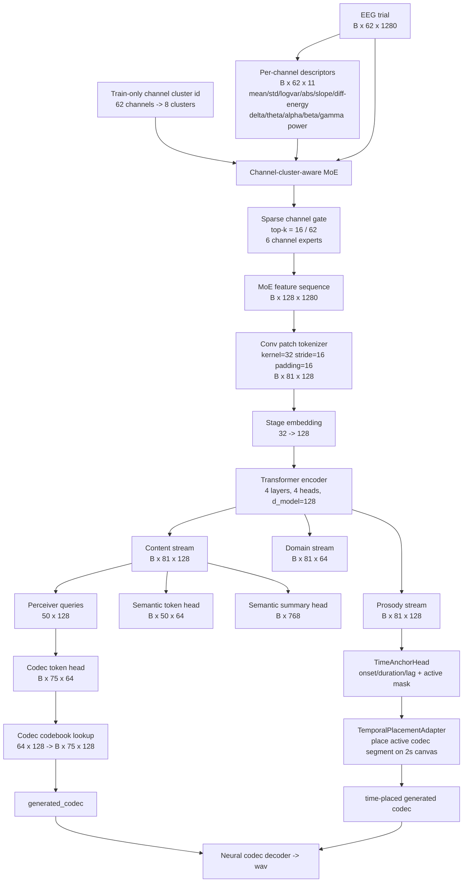

# KaraOne 语义辅助 EEG-to-Speech 当前进展全文稿

## 1. 研究目标与问题定义

核心目标：从 KaraOne 数据集中的 EEG 试次恢复相应的语音信息。这里的“恢复”不是简单地让模型输出一个听起来像语音的波形，而是要区分三件事情：第一，EEG 中是否包含可跨被试泛化的语义内容信号；第二，模型能否从 EEG 中预测语音发生的时间结构，例如 onset、duration 和 active speech window；第三，在语义与时序信息可用的前提下，模型能否进一步生成 neural codec token，并通过 codec decoder 合成语音波形。

然后我很快就遇到了问题：语音信号本身具有强时序结构。一个语音片段不仅包含“说了什么”，还包含“什么时候开始说、持续多久、能量轮廓如何变化、音素或音节结构如何推进、声学 token 如何排列”。尤其在受试听到刺激后思考的 thinking 条件下，我们无法真正准确判断受试到底是怎么想的，即：**EEG 与 overt/reference audio 之间天然存在 onset/lag 偏移，如果只用零滞后 waveform 去评价，很容易把“形状相似但整体错位”的生成误判为失败；反过来，如果只看听感或 retrieval 波形，又可能把训练语音先验误判为 EEG 解码成功**。因此当前系统把研究目标拆成两个层次：

- **语义与 token 对齐层**：EEG encoder 输出的表示是否比 zero prior、mean speech prior 和随机检索更接近对应 speech semantic/token neighborhood。这里我直接参考之前讨论时收录过的文献的指标：关注 heldout subject 上的 semantic token top-k gain、same-label cross-subject gain、token retrieval cross-subject gain 和 prompt accuracy。
- **时序与 codec 生成层**：在 EEG 表示给定的情况下，模型是否能预测 speech active timing，并生成 codec token sequence。这里关注 codec token accuracy、active IoU、onset/duration/lag 误差，以及 zero-lag、best-lag、predicted-placement 三类波形诊断指标。

当前结果的总体结论是：codec token 指标和 time-anchor 指标有可观察信号；但是跨被试语义对齐 gate 仍未通过（这个真的头疼，因为），尤其是 `same_label_cross_subject_gain` 和 `token_retrieval_cross_subject_gain` 仍为负，只能并观察到局部 token、timing 和 codec 层面的弱信号。

## 2. 数据结构与实验划分

KaraOne 当前使用两条 stage 路线：`overt_like` 和 `thinking`。两条路线使用同一批 subject/trial/audio metadata，但 EEG stage 不同。每条路线各有 1913 个 trial-level 样本，split 采用 subject-holdout：

| split         |                                                                subject | 样本数 | 用途                                       |
| ------------- | ---------------------------------------------------------------------: | -----: | ------------------------------------------ |
| subject_train | MM05, MM08, MM09, MM10, MM11, MM12, MM14, MM15, MM16, MM18, MM19, MM20 |   1616 | 训练模型、拟合 cluster/codebook/time prior |
| subject_val   |                                                                    P02 |    165 | 模型选择与 gate 评估                       |
| subject_test  |                                                                   MM21 |    132 | heldout 泛化评估                           |
| 合计          |                                                          14 个 subject |   1913 | 每条 stage 各一套                          |

label 空间共 11 类，分别包含 phoneme-like label 和 word label。样本分布接近平衡：`/diy/`、`/m/`、`/n/`、`/piy/`、`/tiy/`、`/uw/`、`gnaw`、`knew`、`pat`、`pot` 各 174 个，`/iy/` 为 173 个。subject 分布为 MM05 与 P02 各 165 个，MM08 为 131 个，其余主要 subject 为 132 个。这个分布说明当前 prompt accuracy 的随机水平约为 `1/11 = 0.0909`，因此 `prompt_acc` 需要明显高于 0.09 才能说明模型捕捉到 label-level speech content。

EEG 输入在模型中固定为：

```text
EEG trial: 62 channels x 1280(256Hz*5s) time samples
EEG sample rate: 256 Hz
trial duration represented by EEG tensor: 5.0 s
```

音频目标统一为 2 秒窗口（实验的Stimulate时间)：

```text
reference wav: 16000 Hz x 2.0 s = 32000 samples
HuBERT semantic sequence: 50 frames (2s切成50个切片) x 768 dim
HuBERT summary: 做朋pooling, 768 dim
HuBERT semantic token seq: 50 token ids (和切片对应), vocab size = 64
EnCodec latent sequence: 150 frames(设定3倍，保存更多细节) x 128 dim
codec token sequence cache: 150 token ids, vocab size = 64
model codec prediction steps: 75 steps x 128 dim
prosody / event target: 4 dims，整个 语音(utterance) 的风格，我正在往frams-level改
time-anchor active mask: 200 steps(时间轴上的离散采样点), hop = 10 ms
```

* **HuBERT frame** ：语义级表示，时间分辨率较粗，关注“说了什么”。
* **EnCodec frame** ：声学级表示，时间分辨率更细，希望能保留韵律、音色等细节。
* **10 ms mask** ：训练时使用的统一时间锚点，用于精确标记 EEG 与语音的时间对齐。

这里有两个不同长度的 codec 表示。cache 中保留的是原始 EnCodec latent sequence，形状为 `1913 x 150 x 128`；当前模型为了降低序列建模难度，参考论文设定的内部 codec head 默认输出 `75 x 64` 的 token logits，再查 `64 x 128` 的 train-only codec codebook 得到 `75 x 128` 的 codec latent sequence。生成 wav 时，再将预测 codec latent 送入本地 codec backend 解码为波形。

### KaraOne数据示例：完整 trial 上下文、同一 label 的 trial 被试内差异与跨被试差异

为了让数据结构更直观，这里选取同一个 label `/tiy/` 的四条原始样本作为例子。随机选择被试：`MM14` 和 `MM18`；每个 subject 内再从该 label 的 trial 序列中取靠中间的两次 trial。最终样本为 `MM14 trial 29/31` 和 `MM18 trial 18/23`。EEG 图先按论文中的真实实验顺序拼接当前 trial 的四个阶段：`clearing/resting -> stimulus_like -> thinking -> overt_like/speaking`，然后再额外接上下一个 trial 开头的 `clearing/resting`，因为这个resting才是真正的trial后rest。


下面这张图把同四条 trial 的 overt/reference waveform 放在同一张图里。它们都对应 `/tiy/`，但 active speech 的起点、持续时间、峰值幅度和能量包络并不完全一致。


**跨被试泛化的难点从原始数据层面就存在：同 label 的 MM14 与 MM18 不仅 EEG 不同，真实发音波形也不同**

## 3(个人). Train-only cache 与防泄漏约束

当前系统在数据层维护三类 train-only 结构。第一类是 EEG/speech/cross-modal cluster bank。对每条 stage，cluster bank 的样本数为 1913，但 centroids 只由 1616 个 subject_train 样本拟合；P02 与 MM21 只 assignment，不参与 centroids 拟合。当前 cluster 形状为：

```text
EEG clusters: 12 clusters, centroid shape = 12 x 660
speech clusters: 12 clusters, centroid shape = 12 x 197
cross-modal clusters: 16 clusters, centroid shape = 16 x 857
EEG-to-speech soft map: 12 x 12
```

第二类是 token bank。对每条 stage，token bank 保存 1913 条样本的 channel cluster assignment 与 codec token ids。channel cluster 是针对 62 个 EEG 通道的 train-only 聚类，默认 8 个 channel clusters；codebook 是 `64 x 128`，对应 64 个 codec token，每个 token 是 128 维 codec latent prototype。overt-like 路线中 62 个通道的 cluster 分布为 `{3:12, 7:12, 2:9, 4:8, 1:6, 0:5, 5:5, 6:5}`；thinking 路线中分布为 `{7:17, 2:15, 6:10, 0:5, 3:4, 1:4, 5:4, 4:3}`。这些 channel cluster 不代表神经科学结论，只是模型输入端的结构化先验和后续 channel importance 分析的分组依据。

第三类是 time-anchor bank。它从 reference audio 中提取 active speech segment、RMS envelope、onset、duration、center 和 lag-related metadata。active mask 使用 10 ms hop，因此每个 2 秒音频对应 200 个 active/envelope step。active 判定阈值为：

```text
threshold = max(median(envelope) + 1.5 * MAD(envelope), 0.15 * peak(envelope))
merge silence gaps shorter than 80 ms
minimum active segment = 120 ms
```

time-anchor bank 中 P02/MM21 的 reference audio 只用于 heldout diagnostic target，不参与 train prior 拟合。当前 time-anchor 的全体统计为：audio onset median 约 0.59 s，active duration median 约 0.30 s，confidence median 约 0.53。需要特别说明的是，bank 中的 `lag_sec` 来自 EEG/audio alignment cache，它表示神经响应或 EEG-audio 对齐滞后，不等于“应该把生成 wav 平移多少秒”。在 waveform 可视化中，不能直接把 `pred_lag_sec` 当作整段波形平移量；当前生成代码使用 predicted onset/duration 进行 codec placement，而不是直接平移 wav。

这里补充一下这些 cluster 和 time-anchor 参数到底怎么来的。`n_eeg_clusters=12`、`n_speech_clusters=12`、`n_cross_clusters=16` 是配置里的工程超参数，不是论文中固定给出的理论值。选择 12/12 的原因是：KaraOne 的 label 空间是 11 类，如果 cluster 数小于 label 数，cluster 很容易退化成过粗的语音/脑电状态分组；如果 cluster 数远大于 label 数，在总样本只有 1913、subject_train 只有 1616 的情况下，每个 cluster 会很稀疏，跨被试 contrastive 和 cluster-balanced sampler 反而不稳定。因此 EEG/speech cluster 先设为比 label 数略多的 12。cross-modal cluster 同时看 EEG descriptor 和 speech descriptor，空间更复杂，所以设为 16，让联合空间有稍微更细的划分，但仍保持每个 cluster 有足够样本。

`EEG centroid shape = 12 x 660` 中的 660 来自 trial-level EEG descriptor 的手工设计。原始 EEG 是 `62 x 1280`，直接拿 79360 维原始波形做 KMeans 会非常高维、噪声强，而且对样本量不友好，所以先提取一个低维但覆盖能量、频谱、时间动态和空间协方差的 descriptor：

```text
logvar: 62
  每个 EEG 通道 1 个 log variance，用来描述该 trial 内各通道整体波动强度。

bandpower: 62 channels x 5 bands = 310
  每个通道提取 delta/theta/alpha/beta/gamma 五个常见 EEG 频段能量：
  delta 0.5-4 Hz
  theta 4-8 Hz
  alpha 8-13 Hz
  beta 13-30 Hz
  gamma 30-80 Hz

low-frequency envelope: 32
  对所有通道的平均绝对包络做 32-bin 重采样。
  5 秒 EEG / 32 bins 约等于每个 bin 156 ms，用来保留粗时间趋势。

channel covariance sketch: 256
  先计算 62 x 62 通道相关矩阵，上三角一共有 62*61/2 = 1891 个通道对。
  完整 1891 维过高，所以均匀抽样/压缩成 256 个相关系数，用来保留部分空间同步结构。

total = 62 + 310 + 32 + 256 = 660
```

这个 660 维 descriptor 不是最终模型的 EEG 输入，也不是神经科学结论；它只用于 train-only EEG cluster bank。设计目的只是让聚类同时看到四类信息：通道能量、频谱结构、粗时间动态、通道间空间关系。真正训练模型时，EEG encoder 仍然使用 `62 x 1280` 的 EEG tensor。

`speech centroid shape = 12 x 197` 中的 197 来自 speech descriptor。speech descriptor 同样不是直接拿完整音频波形，而是把 semantic summary、semantic token 分布和 prosody scalar 拼在一起：

```text
HuBERT semantic summary: 768 dim -> 分块平均压缩到 128 dim
semantic token histogram: vocab size 64
prosody scalar features: 5
  active_mean
  energy_mean
  energy_std
  duration
  onset

total = 128 + 64 + 5 = 197
```

这里把 768 维 HuBERT summary 压缩到 128 维，是为了避免 speech cluster 完全被高维 semantic summary 支配；token histogram 保留离散语义 token 的分布；5 个 prosody scalar 保留 active speech 的粗时序和能量信息。所以 speech cluster 更像是“语义 + token 分布 + 粗韵律”的联合分组。

`cross-modal centroid shape = 16 x 857` 是 EEG descriptor 和 speech descriptor 的拼接：

```text
EEG descriptor: 660
speech descriptor: 197
cross-modal descriptor: 660 + 197 = 857
```

cross-modal cluster 的作用是看 EEG 与 speech 组成的联合邻域，而不是单独看 EEG 或 speech。它可以帮助 sampler 和 contrastive loss 选择更有结构的 positives/negatives。例如同一个 cross-modal neighborhood 内的样本，可能既有相似 EEG 形态，又有相似 speech target；而 same EEG cluster but different speech label 或 same label but different EEG cluster 可以作为 hard negatives。

`EEG-to-speech soft map = 12 x 12` 是由 train subjects 中的 EEG cluster id 与 speech cluster id 共现统计得到的软对应矩阵。因为 EEG cluster 是 12 个，speech cluster 也是 12 个，所以矩阵自然是 `12 x 12`。它不是模型训练出的参数，也不是 heldout subject 信息，而是在 subject_train 上统计“某个 EEG cluster 通常对应哪些 speech cluster”。用途是给 cluster-aware sampler、soft positives 和 cross-modal 训练诊断提供一个软先验。

time-anchor 的 active speech 阈值也是手工规则，不是模型学出来的参数：

```text
threshold = max(median(envelope) + 1.5 * MAD(envelope), 0.15 * peak(envelope))
merge silence gaps shorter than 80 ms
minimum active segment = 120 ms
```

其中 `median(envelope) + 1.5 * MAD(envelope)` 是鲁棒背景噪声阈值。用 median/MAD 而不是 mean/std，是因为短语音片段里会有较高峰值，mean/std 容易被语音峰值拉高。`0.15 * peak(envelope)` 是相对峰值阈值，目的是避免低幅背景噪声被误认为 active speech。最后取 `max`，表示 active 区域既要高于背景波动，也要达到该条音频最大能量的一定比例。`80 ms` 的 silence gap merge 是为了避免爆破音、闭塞、音节内部短暂停顿把一个完整短音切碎；`120 ms` 的 minimum active segment 是为了过滤点击、呼吸或边界误检等过短片段。整体上，这套规则是适配 KaraOne 短音节/短词任务的 conservative speech activity detection heuristic，用来生成 onset、duration 和 active mask target。

## 4. 当前模型结构

当前模型由五个部分组成：Channel-MoE EEG frontend、EEG patch Transformer、token/prosody heads、TimeAnchorHead、codec-token generator。整体结构如下。



Channel-MoE 负责处理 62 通道 EEG 的不均匀可靠性。每个通道先生成 11 维 descriptor，包括 mean、std、logvar、absolute mean、前后半段 slope、diff energy，以及 delta/theta/alpha/beta/gamma 五个频段的 log bandpower。descriptor 与 16 维 channel embedding、8 维 channel-cluster embedding 拼接后形成 `11 + 16 + 8 = 35` 维输入，再经过 32 维 descriptor MLP，得到 channel gate logits 和 expert assignment。默认 `top_k=16`，也就是说模型在每个 trial 中从 62 个通道里保留约 16 个较高 gate 的通道参与专家汇聚。专家数为 6，专家输出拼接后投影到 128 维特征序列。

EEG patch tokenizer 使用一维卷积从 `B x 128 x 1280` 生成 `B x 128 x 81`，转置后为 `B x 81 x 128`。这里 81 个 EEG patch token 的来源是：

```text
input length = 1280
kernel = 32
stride = 16
padding = 16
conv output steps = 81
```

这些 token 加上 stage embedding 后进入 4 层 Transformer encoder。Transformer 输出分成 content、prosody 和 domain 三个 stream。content stream 负责 semantic token、semantic summary、shared EEG-audio embedding 和 codec token；prosody stream 负责 active/energy/duration/onset 与 TimeAnchorHead；domain stream 用于 subject/domain regularization，避免模型把 subject identity 当成主要判别依据。

TimeAnchorHead 从 pooled EEG representation 与 prosody tokens 输出五类 timing 变量：

```text
pred_onset_sec: scalar in [0, 2s]
pred_duration_sec: scalar constrained by onset and 2s canvas
pred_center_sec: onset + 0.5 * duration
pred_lag_sec: bounded scalar, thinking max range ±1.0s, stimulate max range ±0.5s in evaluation
pred_active_mask_logits: B x 200
pred_token_boundary_logits: B x 200 x 2
```

这里 `pred_lag_sec` 只作为 EEG/audio alignment diagnostic 和 loss target，不直接作为 waveform shift。真正用于生成时序放置的是 `pred_onset_sec` 和 `pred_duration_sec`。TemporalPlacementAdapter 将 `B x 75 x 128` 的 active codec sequence 按预测 onset/duration 放回 2 秒 canvas，再解码为 `generated_codec_pred_lag` 目录中的 time-placed wav。

## 5. 训练目标与阶段

当前训练分为三段。第一段是 token alignment，正式 run 使用 40 epoch。这个阶段训练 EEG encoder、Channel-MoE、semantic token head、semantic summary head、prompt head、prosody head 和相关 alignment losses。第二段是 time-anchor head，正式 run 使用 30 epoch。这个阶段主要训练 onset、duration、lag、active mask 和 boundary 相关输出，语义 encoder 大部分保持已学习状态，因此许多 semantic gate 曲线在该阶段会接近水平线。第三段是 codec generation，正式 run 使用 20 epoch。这个阶段训练 codec token CE、codec latent smooth-L1、semantic guard、boundary continuity 和 time guard，用于提升 codec token accuracy 和可解码波形。

alignment loss 由多种目标组成。semantic token CE 和 token CTC 使 EEG token 序列能预测 HuBERT/k-means token；CLIP-style contrastive、cross-subject contrastive 和 same-label prototype pull 使 EEG summary 与 speech summary 靠近；soft-OT 和 forward-monotonic alignment 约束 EEG/audio token path 更接近单调推进；prompt CE 与 prompt CTC 负责 11 类 label/prompt decoding；zero/mean prior margin 要求 EEG prediction 超过 zero prior 和 train speech mean prior；pairwise decorrelation、variance/covariance 和 gate entropy 防止模型 collapse 到一个固定 speech prior。

time-anchor loss 包含：

```text
lag_huber
onset_huber
duration_huber
active_mask_bce
active_iou_loss
shift_invariant_envelope_loss
ctc_boundary_loss
forward_monotonic_alignment_loss
```

其中 `shift_invariant_envelope_loss` 的目的不是用 reference 去作弊，而是在 train subject 上允许小范围 envelope shift，让 active mask 学到“主体语音段”而不是被固定绝对时间点过度约束。评估时则明确区分 zero-lag、best-lag diagnostic 和 predicted-placement 指标。

codec generation loss 包含 codec token CE、codec latent SmoothL1、semantic guard、boundary continuity 和 time guard。codec token CE 对应 `B x 75 x 64` logits 与 token id 的分类；codec latent loss 对应 `B x 75 x 128` 的连续 codebook latent；boundary continuity 惩罚相邻 codec latent 过度跳变；time guard 让 codec generation 不完全脱离 predicted active timing。

## 6. 输出音频与图像的含义

当前 wav 输出必须分清四类文件。`reference/` 是当前样本的真实音频，只用于评估和听感对比。`retrieval_diagnostic/` 是用 EEG 预测出来的 semantic summary，在 subject_train 的 audio semantic summary bank 中做 unconstrained cosine nearest-neighbor retrieval 得到的训练音频。这个 retrieval 不按真实 label 约束，只排除同一个 `subject:trial`，目的是检查 EEG 预测表示是否能自己落到正确 speech semantic neighborhood；如果强行按真实 label 限制候选集，就会把 label 泄漏给检索器，不能作为 EEG 解码成功证据。

`generated_codec/` 是真正的 EEG-conditioned codec-token generation，流程是 EEG -> codec token logits -> token argmax -> codebook lookup -> codec latent -> codec decoder -> wav。`generated_codec_pred_lag/` 是经过 predicted onset/duration 进行 time placement 后的 generated codec。它用于评估模型是否能把主体语音段放到更合理的 2 秒时间位置。当前实现不再把 `pred_lag_sec` 直接当整段 waveform shift 使用，因为已有结果证明在 stimulate/overt-like 上直接用 neural lag 平移会把本来对齐的波形推远。

波形评价分三层。`zero_lag_*` 是严格逐点对齐指标，最保守，但会低估 thinking 中存在整体时移的样本。`best_lag_*` 是用 reference 搜索最佳 shift 后的 diagnostic 指标，只能说明形状相似但时序有漂移，不能作为真实生成流程证据。`pred_lag_*` 或 predicted-placement 指标使用模型预测的 time anchor，不使用 reference 搜索，是更接近实际生成场景的指标。汇报时应避免把 best-lag 的高相关直接解释为 EEG-to-Speech 成功。

## 7. 当前实验结果

本轮正式实验包含 overt-like 与 thinking 两条路线，每条路线都跑了 40 epoch alignment、30 epoch time-anchor、20 epoch codec generation。下面先保留上一轮 hybrid baseline 的最终 codec 阶段 heldout 指标。subject_val 为 P02，subject_test 为 MM21。

| 路线       | split | semantic token top3 gain | token retrieval cross-subject gain | same-label cross-subject gain | prompt acc | lag MAE (s) | onset MAE (s) | duration MAE (s) | active IoU | codec token acc | codec top3 acc |
| ---------- | ----- | -----------------------: | ---------------------------------: | ----------------------------: | ---------: | ----------: | ------------: | ---------------: | ---------: | --------------: | -------------: |
| overt-like | P02   |                   0.1977 |                            -0.1401 |                       -0.0378 |     0.1394 |      0.2773 |        0.1552 |           0.0855 |     0.3755 |          0.2109 |         0.2745 |
| overt-like | MM21  |                   0.1106 |                            -0.1358 |                       -0.0251 |     0.0682 |      0.2687 |        0.2528 |           0.1025 |     0.2703 |          0.2917 |         0.3759 |
| thinking   | P02   |                   0.2610 |                            -0.0532 |                       -0.0415 |     0.1091 |      0.3148 |        0.4153 |           0.6253 |     0.3429 |          0.2284 |         0.2843 |
| thinking   | MM21  |                   0.2405 |                            -0.0541 |                       -0.0386 |     0.0682 |      0.2040 |        0.6950 |           0.6052 |     0.2386 |          0.2976 |         0.3831 |

最新一批 linear/MLP baseline 来自 `v12_linear_mlp_thinking_overt_align40_time30_codec20_allwavs_mps_20260702_020743`。四个 final codec run 都完成到 codec epoch 20，且 diagnostics 与 lag-aware wav summaries 都已生成；未使用 hybrid 目录。Linear 是 `LayerNorm -> Linear` 的 direct CE baseline，主要检验不加深层 projector 时 EEG representation 能否直接支撑 semantic/codec CE。MLP 是多层 projector baseline，检验更强 projector 是否能改善 subject-holdout 的 token 与 prompt 诊断。

Linear final codec 结果如下。

| 路线       | split | semantic token top3 gain | token retrieval cross-subject gain | same-label cross-subject gain | prompt acc | active IoU | codec token acc | codec top3 acc |
| ---------- | ----- | -----------------------: | ---------------------------------: | ----------------------------: | ---------: | ---------: | --------------: | -------------: |
| overt-like | P02   |                   0.2258 |                            -0.1461 |                       -0.0466 |     0.1030 |     0.3633 |          0.2046 |         0.2462 |
| overt-like | MM21  |                   0.1253 |                            -0.1504 |                       -0.0215 |     0.1061 |     0.2571 |          0.2714 |         0.3337 |
| thinking   | P02   |                   0.3080 |                            -0.0749 |                       -0.0389 |     0.0909 |     0.3346 |          0.2075 |         0.2529 |
| thinking   | MM21  |                   0.2567 |                            -0.0697 |                       -0.0379 |     0.0909 |     0.2376 |          0.2745 |         0.3377 |

MLP final codec 结果如下。

| 路线       | split | semantic token top3 gain | token retrieval cross-subject gain | same-label cross-subject gain | prompt acc | active IoU | codec token acc | codec top3 acc |
| ---------- | ----- | -----------------------: | ---------------------------------: | ----------------------------: | ---------: | ---------: | --------------: | -------------: |
| overt-like | P02   |                   0.1126 |                             0.0120 |                       -0.0352 |     0.1091 |     0.3774 |          0.2075 |         0.2531 |
| overt-like | MM21  |                   0.0774 |                             0.0215 |                       -0.0359 |     0.0833 |     0.2606 |          0.2745 |         0.3343 |
| thinking   | P02   |                   0.3007 |                            -0.0531 |                       -0.0353 |     0.0848 |     0.3103 |          0.2075 |         0.2520 |
| thinking   | MM21  |                   0.2662 |                            -0.0495 |                       -0.0335 |     0.1061 |     0.2387 |          0.2745 |         0.3393 |

新增 diagnostics 指标如下。`prompt OVR AUC` 是 11 类 one-vs-rest AUC 的 macro mean；active mask 同时报告 ROC-AUC 与 average precision；semantic top-k 是相对 prior 的 gain；codec top-k 是 token top-k accuracy，最后一列给出 codec top3 相对 prior 的 gain。

| run | split | prompt OVR AUC | active ROC-AUC | active AP | sem top1 gain | sem top3 gain | sem top5 gain | codec top1 acc | codec top3 acc | codec top5 acc | codec top3 gain |
| --- | ----- | -------------: | -------------: | --------: | ------------: | ------------: | ------------: | -------------: | -------------: | -------------: | --------------: |
| linear overt-like | P02  | 0.4829 | 0.8689 | 0.6117 |  0.0928 | 0.2258 | 0.2562 | 0.2035 | 0.2446 | 0.2836 | -0.0113 |
| linear overt-like | MM21 | 0.5395 | 0.8468 | 0.4220 |  0.0339 | 0.1253 | 0.1406 | 0.2745 | 0.3348 | 0.3938 |  0.0081 |
| linear thinking   | P02  | 0.4454 | 0.9297 | 0.6268 |  0.1678 | 0.3080 | 0.3503 | 0.2075 | 0.2529 | 0.2861 | -0.0031 |
| linear thinking   | MM21 | 0.4840 | 0.8284 | 0.4028 |  0.1002 | 0.2567 | 0.2992 | 0.2745 | 0.3377 | 0.3954 |  0.0109 |
| mlp overt-like    | P02  | 0.5790 | 0.8804 | 0.6625 |  0.0290 | 0.1126 | 0.1387 | 0.2075 | 0.2532 | 0.2868 | -0.0028 |
| mlp overt-like    | MM21 | 0.4953 | 0.8115 | 0.4039 | -0.0267 | 0.0774 | 0.0870 | 0.2745 | 0.3343 | 0.3953 |  0.0075 |
| mlp thinking      | P02  | 0.4846 | 0.9333 | 0.6569 |  0.1566 | 0.3007 | 0.3553 | 0.2075 | 0.2520 | 0.2856 | -0.0039 |
| mlp thinking      | MM21 | 0.5403 | 0.8205 | 0.3977 |  0.1191 | 0.2662 | 0.3376 | 0.2745 | 0.3393 | 0.3998 |  0.0126 |

Lag-aware reconstruction summary 只作为生成诊断，不作为 semantic success 证据。表中 `generated_codec` 是直接 EEG-conditioned codec token 解码；`generated_codec_pred_lag` 是使用 predicted onset/duration 放置后的 codec 解码。`best-lag` 使用 reference 搜索最佳 shift，因此只能说明可对齐后的形状相似度。

| run | reconstruction | n | zero-lag mel corr | best-lag mel corr | zero-lag env corr | best-lag env corr | best-lag env shift (s) |
| --- | -------------- | -: | ----------------: | ----------------: | ----------------: | ----------------: | ---------------------: |
| linear overt-like | generated_codec          | 1913 |  0.2534 | 0.4650 | -0.0462 | 0.0481 | -0.4200 |
| linear overt-like | generated_codec_pred_lag | 1913 | -0.0525 | 0.4139 | -0.5581 | 0.2920 | -0.2000 |
| linear thinking   | generated_codec          | 1913 |  0.2534 | 0.5855 | -0.0463 | 0.5335 |  0.8500 |
| linear thinking   | generated_codec_pred_lag | 1913 | -0.0393 | 0.6702 | -0.3827 | 0.5708 |  0.9700 |
| mlp overt-like    | generated_codec          | 1913 |  0.2534 | 0.4641 | -0.0463 | 0.0474 | -0.4500 |
| mlp overt-like    | generated_codec_pred_lag | 1913 | -0.0374 | 0.4025 | -0.5230 | 0.2781 | -0.1800 |
| mlp thinking      | generated_codec          | 1913 |  0.2534 | 0.5855 | -0.0463 | 0.5335 |  0.8500 |
| mlp thinking      | generated_codec_pred_lag | 1913 | -0.0413 | 0.6677 | -0.3882 | 0.5676 |  0.9700 |

Diagnostics 图链接如下。

- Linear overt-like: [prompt val](/Users/samxie/Research/EEG-Voice/ref_github/speech_decoding/eeg2wave_server_bundle/karaone_overt_recon_bundle/artifacts/outputs_karaone/karaone_v12_time_aware_tokenized_generation_codec_overt_like_linear_v12_linear_mlp_thinking_overt_align40_time30_codec20_allwavs_mps_20260702_020743_linear_overt_like_codec20/figures/diagnostics/prompt_confusion_matrix_subject_val.png), [prompt test](/Users/samxie/Research/EEG-Voice/ref_github/speech_decoding/eeg2wave_server_bundle/karaone_overt_recon_bundle/artifacts/outputs_karaone/karaone_v12_time_aware_tokenized_generation_codec_overt_like_linear_v12_linear_mlp_thinking_overt_align40_time30_codec20_allwavs_mps_20260702_020743_linear_overt_like_codec20/figures/diagnostics/prompt_confusion_matrix_subject_test.png), [OVR AUC val](/Users/samxie/Research/EEG-Voice/ref_github/speech_decoding/eeg2wave_server_bundle/karaone_overt_recon_bundle/artifacts/outputs_karaone/karaone_v12_time_aware_tokenized_generation_codec_overt_like_linear_v12_linear_mlp_thinking_overt_align40_time30_codec20_allwavs_mps_20260702_020743_linear_overt_like_codec20/figures/diagnostics/prompt_ovr_auc_subject_val.png), [OVR AUC test](/Users/samxie/Research/EEG-Voice/ref_github/speech_decoding/eeg2wave_server_bundle/karaone_overt_recon_bundle/artifacts/outputs_karaone/karaone_v12_time_aware_tokenized_generation_codec_overt_like_linear_v12_linear_mlp_thinking_overt_align40_time30_codec20_allwavs_mps_20260702_020743_linear_overt_like_codec20/figures/diagnostics/prompt_ovr_auc_subject_test.png), [active val](/Users/samxie/Research/EEG-Voice/ref_github/speech_decoding/eeg2wave_server_bundle/karaone_overt_recon_bundle/artifacts/outputs_karaone/karaone_v12_time_aware_tokenized_generation_codec_overt_like_linear_v12_linear_mlp_thinking_overt_align40_time30_codec20_allwavs_mps_20260702_020743_linear_overt_like_codec20/figures/diagnostics/active_mask_roc_pr_subject_val.png), [active test](/Users/samxie/Research/EEG-Voice/ref_github/speech_decoding/eeg2wave_server_bundle/karaone_overt_recon_bundle/artifacts/outputs_karaone/karaone_v12_time_aware_tokenized_generation_codec_overt_like_linear_v12_linear_mlp_thinking_overt_align40_time30_codec20_allwavs_mps_20260702_020743_linear_overt_like_codec20/figures/diagnostics/active_mask_roc_pr_subject_test.png), [semantic top-k val](/Users/samxie/Research/EEG-Voice/ref_github/speech_decoding/eeg2wave_server_bundle/karaone_overt_recon_bundle/artifacts/outputs_karaone/karaone_v12_time_aware_tokenized_generation_codec_overt_like_linear_v12_linear_mlp_thinking_overt_align40_time30_codec20_allwavs_mps_20260702_020743_linear_overt_like_codec20/figures/diagnostics/semantic_token_topk_curve_subject_val.png), [semantic top-k test](/Users/samxie/Research/EEG-Voice/ref_github/speech_decoding/eeg2wave_server_bundle/karaone_overt_recon_bundle/artifacts/outputs_karaone/karaone_v12_time_aware_tokenized_generation_codec_overt_like_linear_v12_linear_mlp_thinking_overt_align40_time30_codec20_allwavs_mps_20260702_020743_linear_overt_like_codec20/figures/diagnostics/semantic_token_topk_curve_subject_test.png), [codec top-k val](/Users/samxie/Research/EEG-Voice/ref_github/speech_decoding/eeg2wave_server_bundle/karaone_overt_recon_bundle/artifacts/outputs_karaone/karaone_v12_time_aware_tokenized_generation_codec_overt_like_linear_v12_linear_mlp_thinking_overt_align40_time30_codec20_allwavs_mps_20260702_020743_linear_overt_like_codec20/figures/diagnostics/codec_token_topk_curve_subject_val.png), [codec top-k test](/Users/samxie/Research/EEG-Voice/ref_github/speech_decoding/eeg2wave_server_bundle/karaone_overt_recon_bundle/artifacts/outputs_karaone/karaone_v12_time_aware_tokenized_generation_codec_overt_like_linear_v12_linear_mlp_thinking_overt_align40_time30_codec20_allwavs_mps_20260702_020743_linear_overt_like_codec20/figures/diagnostics/codec_token_topk_curve_subject_test.png), [lag-aware](/Users/samxie/Research/EEG-Voice/ref_github/speech_decoding/eeg2wave_server_bundle/karaone_overt_recon_bundle/artifacts/outputs_karaone/karaone_v12_time_aware_tokenized_generation_codec_overt_like_linear_v12_linear_mlp_thinking_overt_align40_time30_codec20_allwavs_mps_20260702_020743_linear_overt_like_codec20/figures/diagnostics/lagaware_reconstruction_metrics.png).
- Linear thinking: [prompt val](/Users/samxie/Research/EEG-Voice/ref_github/speech_decoding/eeg2wave_server_bundle/karaone_overt_recon_bundle/artifacts/outputs_karaone/karaone_v12_time_aware_tokenized_generation_codec_thinking_linear_v12_linear_mlp_thinking_overt_align40_time30_codec20_allwavs_mps_20260702_020743_linear_thinking_codec20/figures/diagnostics/prompt_confusion_matrix_subject_val.png), [prompt test](/Users/samxie/Research/EEG-Voice/ref_github/speech_decoding/eeg2wave_server_bundle/karaone_overt_recon_bundle/artifacts/outputs_karaone/karaone_v12_time_aware_tokenized_generation_codec_thinking_linear_v12_linear_mlp_thinking_overt_align40_time30_codec20_allwavs_mps_20260702_020743_linear_thinking_codec20/figures/diagnostics/prompt_confusion_matrix_subject_test.png), [OVR AUC val](/Users/samxie/Research/EEG-Voice/ref_github/speech_decoding/eeg2wave_server_bundle/karaone_overt_recon_bundle/artifacts/outputs_karaone/karaone_v12_time_aware_tokenized_generation_codec_thinking_linear_v12_linear_mlp_thinking_overt_align40_time30_codec20_allwavs_mps_20260702_020743_linear_thinking_codec20/figures/diagnostics/prompt_ovr_auc_subject_val.png), [OVR AUC test](/Users/samxie/Research/EEG-Voice/ref_github/speech_decoding/eeg2wave_server_bundle/karaone_overt_recon_bundle/artifacts/outputs_karaone/karaone_v12_time_aware_tokenized_generation_codec_thinking_linear_v12_linear_mlp_thinking_overt_align40_time30_codec20_allwavs_mps_20260702_020743_linear_thinking_codec20/figures/diagnostics/prompt_ovr_auc_subject_test.png), [active val](/Users/samxie/Research/EEG-Voice/ref_github/speech_decoding/eeg2wave_server_bundle/karaone_overt_recon_bundle/artifacts/outputs_karaone/karaone_v12_time_aware_tokenized_generation_codec_thinking_linear_v12_linear_mlp_thinking_overt_align40_time30_codec20_allwavs_mps_20260702_020743_linear_thinking_codec20/figures/diagnostics/active_mask_roc_pr_subject_val.png), [active test](/Users/samxie/Research/EEG-Voice/ref_github/speech_decoding/eeg2wave_server_bundle/karaone_overt_recon_bundle/artifacts/outputs_karaone/karaone_v12_time_aware_tokenized_generation_codec_thinking_linear_v12_linear_mlp_thinking_overt_align40_time30_codec20_allwavs_mps_20260702_020743_linear_thinking_codec20/figures/diagnostics/active_mask_roc_pr_subject_test.png), [semantic top-k val](/Users/samxie/Research/EEG-Voice/ref_github/speech_decoding/eeg2wave_server_bundle/karaone_overt_recon_bundle/artifacts/outputs_karaone/karaone_v12_time_aware_tokenized_generation_codec_thinking_linear_v12_linear_mlp_thinking_overt_align40_time30_codec20_allwavs_mps_20260702_020743_linear_thinking_codec20/figures/diagnostics/semantic_token_topk_curve_subject_val.png), [semantic top-k test](/Users/samxie/Research/EEG-Voice/ref_github/speech_decoding/eeg2wave_server_bundle/karaone_overt_recon_bundle/artifacts/outputs_karaone/karaone_v12_time_aware_tokenized_generation_codec_thinking_linear_v12_linear_mlp_thinking_overt_align40_time30_codec20_allwavs_mps_20260702_020743_linear_thinking_codec20/figures/diagnostics/semantic_token_topk_curve_subject_test.png), [codec top-k val](/Users/samxie/Research/EEG-Voice/ref_github/speech_decoding/eeg2wave_server_bundle/karaone_overt_recon_bundle/artifacts/outputs_karaone/karaone_v12_time_aware_tokenized_generation_codec_thinking_linear_v12_linear_mlp_thinking_overt_align40_time30_codec20_allwavs_mps_20260702_020743_linear_thinking_codec20/figures/diagnostics/codec_token_topk_curve_subject_val.png), [codec top-k test](/Users/samxie/Research/EEG-Voice/ref_github/speech_decoding/eeg2wave_server_bundle/karaone_overt_recon_bundle/artifacts/outputs_karaone/karaone_v12_time_aware_tokenized_generation_codec_thinking_linear_v12_linear_mlp_thinking_overt_align40_time30_codec20_allwavs_mps_20260702_020743_linear_thinking_codec20/figures/diagnostics/codec_token_topk_curve_subject_test.png), [lag-aware](/Users/samxie/Research/EEG-Voice/ref_github/speech_decoding/eeg2wave_server_bundle/karaone_overt_recon_bundle/artifacts/outputs_karaone/karaone_v12_time_aware_tokenized_generation_codec_thinking_linear_v12_linear_mlp_thinking_overt_align40_time30_codec20_allwavs_mps_20260702_020743_linear_thinking_codec20/figures/diagnostics/lagaware_reconstruction_metrics.png).
- MLP overt-like: [prompt val](/Users/samxie/Research/EEG-Voice/ref_github/speech_decoding/eeg2wave_server_bundle/karaone_overt_recon_bundle/artifacts/outputs_karaone/karaone_v12_time_aware_tokenized_generation_codec_overt_like_mlp_v12_linear_mlp_thinking_overt_align40_time30_codec20_allwavs_mps_20260702_020743_mlp_overt_like_codec20/figures/diagnostics/prompt_confusion_matrix_subject_val.png), [prompt test](/Users/samxie/Research/EEG-Voice/ref_github/speech_decoding/eeg2wave_server_bundle/karaone_overt_recon_bundle/artifacts/outputs_karaone/karaone_v12_time_aware_tokenized_generation_codec_overt_like_mlp_v12_linear_mlp_thinking_overt_align40_time30_codec20_allwavs_mps_20260702_020743_mlp_overt_like_codec20/figures/diagnostics/prompt_confusion_matrix_subject_test.png), [OVR AUC val](/Users/samxie/Research/EEG-Voice/ref_github/speech_decoding/eeg2wave_server_bundle/karaone_overt_recon_bundle/artifacts/outputs_karaone/karaone_v12_time_aware_tokenized_generation_codec_overt_like_mlp_v12_linear_mlp_thinking_overt_align40_time30_codec20_allwavs_mps_20260702_020743_mlp_overt_like_codec20/figures/diagnostics/prompt_ovr_auc_subject_val.png), [OVR AUC test](/Users/samxie/Research/EEG-Voice/ref_github/speech_decoding/eeg2wave_server_bundle/karaone_overt_recon_bundle/artifacts/outputs_karaone/karaone_v12_time_aware_tokenized_generation_codec_overt_like_mlp_v12_linear_mlp_thinking_overt_align40_time30_codec20_allwavs_mps_20260702_020743_mlp_overt_like_codec20/figures/diagnostics/prompt_ovr_auc_subject_test.png), [active val](/Users/samxie/Research/EEG-Voice/ref_github/speech_decoding/eeg2wave_server_bundle/karaone_overt_recon_bundle/artifacts/outputs_karaone/karaone_v12_time_aware_tokenized_generation_codec_overt_like_mlp_v12_linear_mlp_thinking_overt_align40_time30_codec20_allwavs_mps_20260702_020743_mlp_overt_like_codec20/figures/diagnostics/active_mask_roc_pr_subject_val.png), [active test](/Users/samxie/Research/EEG-Voice/ref_github/speech_decoding/eeg2wave_server_bundle/karaone_overt_recon_bundle/artifacts/outputs_karaone/karaone_v12_time_aware_tokenized_generation_codec_overt_like_mlp_v12_linear_mlp_thinking_overt_align40_time30_codec20_allwavs_mps_20260702_020743_mlp_overt_like_codec20/figures/diagnostics/active_mask_roc_pr_subject_test.png), [semantic top-k val](/Users/samxie/Research/EEG-Voice/ref_github/speech_decoding/eeg2wave_server_bundle/karaone_overt_recon_bundle/artifacts/outputs_karaone/karaone_v12_time_aware_tokenized_generation_codec_overt_like_mlp_v12_linear_mlp_thinking_overt_align40_time30_codec20_allwavs_mps_20260702_020743_mlp_overt_like_codec20/figures/diagnostics/semantic_token_topk_curve_subject_val.png), [semantic top-k test](/Users/samxie/Research/EEG-Voice/ref_github/speech_decoding/eeg2wave_server_bundle/karaone_overt_recon_bundle/artifacts/outputs_karaone/karaone_v12_time_aware_tokenized_generation_codec_overt_like_mlp_v12_linear_mlp_thinking_overt_align40_time30_codec20_allwavs_mps_20260702_020743_mlp_overt_like_codec20/figures/diagnostics/semantic_token_topk_curve_subject_test.png), [codec top-k val](/Users/samxie/Research/EEG-Voice/ref_github/speech_decoding/eeg2wave_server_bundle/karaone_overt_recon_bundle/artifacts/outputs_karaone/karaone_v12_time_aware_tokenized_generation_codec_overt_like_mlp_v12_linear_mlp_thinking_overt_align40_time30_codec20_allwavs_mps_20260702_020743_mlp_overt_like_codec20/figures/diagnostics/codec_token_topk_curve_subject_val.png), [codec top-k test](/Users/samxie/Research/EEG-Voice/ref_github/speech_decoding/eeg2wave_server_bundle/karaone_overt_recon_bundle/artifacts/outputs_karaone/karaone_v12_time_aware_tokenized_generation_codec_overt_like_mlp_v12_linear_mlp_thinking_overt_align40_time30_codec20_allwavs_mps_20260702_020743_mlp_overt_like_codec20/figures/diagnostics/codec_token_topk_curve_subject_test.png), [lag-aware](/Users/samxie/Research/EEG-Voice/ref_github/speech_decoding/eeg2wave_server_bundle/karaone_overt_recon_bundle/artifacts/outputs_karaone/karaone_v12_time_aware_tokenized_generation_codec_overt_like_mlp_v12_linear_mlp_thinking_overt_align40_time30_codec20_allwavs_mps_20260702_020743_mlp_overt_like_codec20/figures/diagnostics/lagaware_reconstruction_metrics.png).
- MLP thinking: [prompt val](/Users/samxie/Research/EEG-Voice/ref_github/speech_decoding/eeg2wave_server_bundle/karaone_overt_recon_bundle/artifacts/outputs_karaone/karaone_v12_time_aware_tokenized_generation_codec_thinking_mlp_v12_linear_mlp_thinking_overt_align40_time30_codec20_allwavs_mps_20260702_020743_mlp_thinking_codec20/figures/diagnostics/prompt_confusion_matrix_subject_val.png), [prompt test](/Users/samxie/Research/EEG-Voice/ref_github/speech_decoding/eeg2wave_server_bundle/karaone_overt_recon_bundle/artifacts/outputs_karaone/karaone_v12_time_aware_tokenized_generation_codec_thinking_mlp_v12_linear_mlp_thinking_overt_align40_time30_codec20_allwavs_mps_20260702_020743_mlp_thinking_codec20/figures/diagnostics/prompt_confusion_matrix_subject_test.png), [OVR AUC val](/Users/samxie/Research/EEG-Voice/ref_github/speech_decoding/eeg2wave_server_bundle/karaone_overt_recon_bundle/artifacts/outputs_karaone/karaone_v12_time_aware_tokenized_generation_codec_thinking_mlp_v12_linear_mlp_thinking_overt_align40_time30_codec20_allwavs_mps_20260702_020743_mlp_thinking_codec20/figures/diagnostics/prompt_ovr_auc_subject_val.png), [OVR AUC test](/Users/samxie/Research/EEG-Voice/ref_github/speech_decoding/eeg2wave_server_bundle/karaone_overt_recon_bundle/artifacts/outputs_karaone/karaone_v12_time_aware_tokenized_generation_codec_thinking_mlp_v12_linear_mlp_thinking_overt_align40_time30_codec20_allwavs_mps_20260702_020743_mlp_thinking_codec20/figures/diagnostics/prompt_ovr_auc_subject_test.png), [active val](/Users/samxie/Research/EEG-Voice/ref_github/speech_decoding/eeg2wave_server_bundle/karaone_overt_recon_bundle/artifacts/outputs_karaone/karaone_v12_time_aware_tokenized_generation_codec_thinking_mlp_v12_linear_mlp_thinking_overt_align40_time30_codec20_allwavs_mps_20260702_020743_mlp_thinking_codec20/figures/diagnostics/active_mask_roc_pr_subject_val.png), [active test](/Users/samxie/Research/EEG-Voice/ref_github/speech_decoding/eeg2wave_server_bundle/karaone_overt_recon_bundle/artifacts/outputs_karaone/karaone_v12_time_aware_tokenized_generation_codec_thinking_mlp_v12_linear_mlp_thinking_overt_align40_time30_codec20_allwavs_mps_20260702_020743_mlp_thinking_codec20/figures/diagnostics/active_mask_roc_pr_subject_test.png), [semantic top-k val](/Users/samxie/Research/EEG-Voice/ref_github/speech_decoding/eeg2wave_server_bundle/karaone_overt_recon_bundle/artifacts/outputs_karaone/karaone_v12_time_aware_tokenized_generation_codec_thinking_mlp_v12_linear_mlp_thinking_overt_align40_time30_codec20_allwavs_mps_20260702_020743_mlp_thinking_codec20/figures/diagnostics/semantic_token_topk_curve_subject_val.png), [semantic top-k test](/Users/samxie/Research/EEG-Voice/ref_github/speech_decoding/eeg2wave_server_bundle/karaone_overt_recon_bundle/artifacts/outputs_karaone/karaone_v12_time_aware_tokenized_generation_codec_thinking_mlp_v12_linear_mlp_thinking_overt_align40_time30_codec20_allwavs_mps_20260702_020743_mlp_thinking_codec20/figures/diagnostics/semantic_token_topk_curve_subject_test.png), [codec top-k val](/Users/samxie/Research/EEG-Voice/ref_github/speech_decoding/eeg2wave_server_bundle/karaone_overt_recon_bundle/artifacts/outputs_karaone/karaone_v12_time_aware_tokenized_generation_codec_thinking_mlp_v12_linear_mlp_thinking_overt_align40_time30_codec20_allwavs_mps_20260702_020743_mlp_thinking_codec20/figures/diagnostics/codec_token_topk_curve_subject_val.png), [codec top-k test](/Users/samxie/Research/EEG-Voice/ref_github/speech_decoding/eeg2wave_server_bundle/karaone_overt_recon_bundle/artifacts/outputs_karaone/karaone_v12_time_aware_tokenized_generation_codec_thinking_mlp_v12_linear_mlp_thinking_overt_align40_time30_codec20_allwavs_mps_20260702_020743_mlp_thinking_codec20/figures/diagnostics/codec_token_topk_curve_subject_test.png), [lag-aware](/Users/samxie/Research/EEG-Voice/ref_github/speech_decoding/eeg2wave_server_bundle/karaone_overt_recon_bundle/artifacts/outputs_karaone/karaone_v12_time_aware_tokenized_generation_codec_thinking_mlp_v12_linear_mlp_thinking_overt_align40_time30_codec20_allwavs_mps_20260702_020743_mlp_thinking_codec20/figures/diagnostics/lagaware_reconstruction_metrics.png).

这些结果有四个比较明确的现象。第一，linear 与 MLP 的 semantic token top3 gain 大多为正，thinking 路线尤其稳定；这说明局部 semantic token top-k 预测不是完全随机。第二，跨被试语义 gate 仍未通过：linear 的 `token_retrieval_cross_subject_gain` 仍为负；MLP overt-like 的该指标在 P02/MM21 上转为小幅正值，但 `same_label_cross_subject_gain` 仍为负，因此不能说 EEG-predicted semantic representation 已经稳定进入同标签跨被试语音邻域。第三，codec token accuracy 在 MM21 上约 0.27，top3 约 0.33 到 0.34，但 codec top3 gain 只是在 subject_test 上小幅为正，不能替代 semantic gate。第四，active mask ROC-AUC 较高，P02 上约 0.87 到 0.93，MM21 上约 0.81 到 0.85，说明 time-anchor head 对 active speech window 有可检测信号；但 active timing 本身不能证明 speech content 被解码。

prompt accuracy 的解读也要谨慎。随机水平约 0.0909。overt-like 的 P02 prompt accuracy 达到 0.1394，略高于 0.13 的低门槛；但 MM21 只有 0.0682，低于随机水平。thinking 的 P02 为 0.1091，MM21 也是 0.0682。也就是说 label-level decoding 没有形成稳定跨被试泛化，当前不能把 generated wav 的听感相似解释为模型已经恢复了 speech content。

最新 linear/MLP baseline 的 prompt accuracy 也基本围绕随机水平波动：linear overt-like 在 MM21 为 0.1061，linear thinking 为 0.0909；MLP overt-like 在 MM21 为 0.0833，MLP thinking 为 0.1061。虽然 prompt one-vs-rest AUC 在部分 split 上超过 0.5，尤其 MLP overt-like P02 为 0.5790、MLP thinking MM21 为 0.5403，但 multi-class prompt accuracy 仍没有稳定超过随机水平。因此 label-level decoding 仍不能作为生成成功证据。

time-anchor 结果相对更有结构。hybrid overt-like 的 onset/duration MAE 明显低于 thinking，尤其 P02 上 onset MAE 约 0.155 s，duration MAE 约 0.085 s，active IoU 约 0.376；thinking 的 onset/duration MAE 更大，MM21 onset MAE 约 0.695 s，duration MAE 约 0.605 s，这符合 thinking 与 reference/overt audio 天然不同步的预期。最新 linear/MLP baseline 的 active IoU 也保持在可观察范围，P02 约 0.31 到 0.38，MM21 约 0.24 到 0.26；active mask ROC-AUC/AP 进一步说明 active window ranking 有信号。这里需要强调：time-anchor 指标能说明模型学到了一部分 speech active timing，但不能单独证明 speech semantic decoding 成功。

当前最严谨的汇报结论是：linear direct CE baseline 和 MLP projector baseline 都能给出完整的 EEG -> semantic token/time anchor/codec token -> wav 生成链路，且在 semantic token top-k、active mask 与 codec token 上有可量化信号；但跨被试语义 gate 仍未通过。Retrieval diagnostic 不能被当作生成成功证据；真正的生成证据应来自 `generated_codec/` 与 `generated_codec_pred_lag/`，并且必须与 subject-holdout semantic gate 一起解释。基于当前结果，只能说生成链路与 timing/codec 层面有弱信号，不能宣称已经实现跨被试 EEG-to-Speech content reconstruction。

## 8. 为什么部分训练图接近水平线

当前训练文件夹中的 `codec_metrics.png`、`gate_metrics.png`、`time_anchor_metrics.png` 有些曲线接近水平线，这不是简单的画图错误，而是由三段训练和冻结策略决定的。alignment 阶段会更新 EEG encoder 与 semantic/prompt heads，因此 semantic token、prompt、cross-subject gain 等指标主要在这个阶段变化。time-anchor 阶段主要更新 TimeAnchorHead，语义部分大多继承 alignment checkpoint，因此 `prompt_acc`、`same_label_cross_subject_gain`、`token_retrieval_cross_subject_gain` 这类语义 gate 指标很容易保持水平。codec 阶段主要优化 codec token CE 和 codec latent loss，semantic gate 也不会必然改善。

换句话说，图上水平线代表“该阶段没有直接优化这个指标”或“heldout 指标已经被前一阶段决定”，不应把所有水平线都解读为作图失败。真正需要看的是阶段相关指标是否变化：time-anchor 阶段应主要看 lag/onset/duration MAE 与 active IoU；codec 阶段应主要看 codec token acc、codec top3 acc 和 codec loss；alignment 阶段才主要看 semantic token gain、prompt acc 和 cross-subject retrieval gain。如果要给老师展示，建议把图按阶段解释，而不是把所有图都当作同一训练目标的连续改善曲线。

## 9(个人). 当前没有通过 gate 的原因

当前最主要的问题不是“没有生成 wav”，而是“EEG semantic representation 还没有稳定超过 prior”。`same_label_cross_subject_gain < 0` 的含义是：对一个 heldout EEG 样本，模型预测出的 semantic summary 与 train-bank 中同标签、不同被试 speech prototype 的相似度，还不如 train speech mean prior 与该 prototype 的相似度。`token_retrieval_cross_subject_gain < 0` 的含义是：模型预测出的 semantic token distribution 不能比平均 token distribution 更好地检索到同标签跨被试语音。这两个指标为负，说明模型仍存在 s**peech prior 或 subject/domain mismatch**，而不是稳定地从 EEG 中读出 label-specific content。

这也解释了 retrieval 为什么看起来不准。当前 retrieval 是 unconstrained diagnostic retrieval：候选库是 subject_train 的全部 audio semantic summaries，检索依据是 EEG-predicted semantic summary 与候选音频 summary 的 cosine similarity。它不使用真实 label，不使用 reference audio，也不约束同标签。如果 EEG semantic query 没有学好，nearest neighbor 自然会落到错 label。这个结果并不是 retrieval 代码本身失败，而是说明当前 EEG semantic representation 还不能承担“无标签语音内容检索”的任务。

从音频角度看，generated codec wav 可能已经具备一些语音形状或能量结构，best-lag envelope/mel 也可能较高。但 best-lag 使用 reference 搜索最佳 shift，只能作为 diagnostic，不能用于声明真实生成成功。当前能够较稳妥汇报的是：模型具备完整的 EEG -> token -> time anchor -> codec -> wav 生成链路，并且在 codec token 与 time-anchor 上有可量化信号；跨被试语义内容控制仍是主要未解决问题。

## 10(个人). 与上一条 latent 路线的对比

之前的 latent 路线主要把 EEG 映射到全局 HuBERT summary 或 semantic/prosody latent，再通过 retrieval 或 diagnostic transport 生成音频。这个路线的优点是实现较直接，指标也容易计算：EEG prediction 与 768 维 HuBERT summary 做 cosine，或者与 train-bank latent 做检索；如果 retrieval 到的音频听起来接近 reference，早期看起来会有明显进展。但这个路线的问题也很清楚。

第一，全局 latent 会压缩掉语音序列结构。HuBERT summary 是 `768` 维全局向量，它可以表示平均语义相似度，但很难明确表达 50 帧 semantic tokens、音素边界、duration、onset、active speech window 和 codec frame 的时间推进。KaraOne 的语音片段很短，只有约 2 秒；真正影响听感的常常是几百毫秒的 active segment 位置和能量轮廓。全局 latent 对这些时序因素不敏感，因此容易出现“latent cosine 有改善，但波形时序不对”的情况。

第二，latent retrieval 容易把 speech prior 误认为 EEG signal。旧路线中，训练集音频本身已经包含 label、speaker、duration 和 timbre 分布；当模型输出接近 train mean 或某个 frequent prototype 时，也可能 retrieval 到一个听起来像 KaraOne 音节的 wav。这个结果不能证明 EEG 中的 label-specific content 已被解码。之前完整 run 的结果就显示这一点：overt-like 的 `semantic_over_mean_gain` 为正，但 subject_test `semantic_over_zero_gain = -0.007970`，`same_label_cross_subject_gain = -0.031262`，`prompt_acc = 0.106061`；thinking 的 subject_test `semantic_over_zero_gain = -0.026700`，`same_label_cross_subject_gain = -0.034789`，`prompt_acc = 0.098485`。这些指标说明，模型可以接近某种 speech prior，但没有稳定超过 zero/mean baseline 并对齐同标签跨被试语义。

第三，latent 路线的 waveform 证据不够干净。旧 run 可以生成 1913 对 wav 和 waveform comparison figures，但报告中仍必须写作 diagnostic retrieval artifact，因为 semantic/prosody gate 未过。尤其当 retrieval wav 很像 reference 时，容易让听感判断掩盖 evaluation leakage 问题：如果 retrieval 受 label 或 reference 约束，它会人为变好；如果 retrieval 不受约束，则它会暴露 EEG semantic representation 仍不稳定。当前方案保留 retrieval，但把它降级为诊断基线，并把真正生成路径改为 EEG-conditioned codec token generation。

第四，latent 路线没有把 thinking 的 time offset 作为核心建模对象。thinking EEG 与 overt/reference audio 本来就不是严格同步，直接比较 waveform 或直接回归全局 latent 都会混合两个误差来源：内容没对上，以及时序没对上。当前方案把 time-anchor 显式放进模型，至少可以把“语义内容是否正确”和“主体语音段是否对齐”分开分析。这是当前方案相对旧 latent 路线最重要的结构性改动。

## 11(个人). 当前可以如何汇报

如果明天需要用一句话概括当前结果，可以说：当前系统已经从全局 latent 回归转为 tokenized、time-aware 的 EEG-to-Speech generation pipeline，输入是 `62 x 1280` 的 EEG trial，输出包括 `50 x 64` semantic token logits、`200` 步 active mask、onset/duration/lag timing、`75 x 64` codec token logits 和最终 codec-decoded wav；在 14 个 subject、1913 个 trial、P02/MM21 subject-holdout 设置下，codec token 和 time-anchor 指标有可观察信号，但跨被试语义 gate 还未通过，因此目前不能宣称 EEG-to-Speech generation 成功，只能说完成了可审计的生成式管线并定位到主要瓶颈在 EEG semantic alignment。

更完整的汇报表述可以是：我们现在把任务拆成 semantic alignment、time-anchor prediction 和 codec-token generation 三层。模型在 codec token 预测上已经能达到 subject_test 约 0.29 到 0.30 的 token accuracy、约 0.38 的 top3 accuracy；在 time-anchor 上，overt-like 的 active IoU 能达到约 0.27 到 0.38，thinking 也有约 0.24 到 0.34 的 active IoU。但是 semantic retrieval cross-subject gain 和 same-label cross-subject gain 仍为负，说明 EEG 表示还没有稳定落入正确 speech semantic neighborhood。这个结论比单纯展示相似 wav 更保守，但更符合跨被试 EEG decoding 的证据标准。

## 12(个人). 当前文件与复现实验入口

当前主要代码路径如下：

```text
app/configs/karaone_v12.yaml
app/src/karaone_v12/data.py
app/src/karaone_v12/model.py
app/src/karaone_v12/losses.py
app/src/karaone_v12/eval.py
app/src/karaone_v12/time_anchor.py
app/scripts/build_karaone_v12_time_anchors.py
app/scripts/train_karaone_v12.py
app/scripts/synthesize_karaone_v12.py
app/scripts/eval_karaone_v12_lagaware_wavs.py
app/scripts/plot_karaone_v12_training.py
app/scripts/summarize_karaone_v12_run.py
run_karaone_v12.sh
```

当前正式 run 目录为：

```text
overt-like alignment:
artifacts/outputs_karaone/karaone_v12_time_aware_tokenized_generation_align_overt_like_hybrid_v12_stimulate_align40_time30_codec20_allwavs_mps_20260701_130238_align40

overt-like time-anchor:
artifacts/outputs_karaone/karaone_v12_time_aware_tokenized_generation_time_overt_like_hybrid_v12_stimulate_align40_time30_codec20_allwavs_mps_20260701_130238_time30

overt-like codec:
artifacts/outputs_karaone/karaone_v12_time_aware_tokenized_generation_codec_overt_like_hybrid_v12_stimulate_align40_time30_codec20_allwavs_mps_20260701_130238_codec20

thinking alignment:
artifacts/outputs_karaone/karaone_v12_time_aware_tokenized_generation_align_thinking_hybrid_v12_thinking_align40_time30_codec20_allwavs_mps_20260701_120015_align40

thinking time-anchor:
artifacts/outputs_karaone/karaone_v12_time_aware_tokenized_generation_time_thinking_hybrid_v12_thinking_align40_time30_codec20_allwavs_mps_20260701_120015_time30

thinking codec:
artifacts/outputs_karaone/karaone_v12_time_aware_tokenized_generation_codec_thinking_hybrid_v12_thinking_align40_time30_codec20_allwavs_mps_20260701_120015_codec20
```

正式训练命令的结构为：

```bash
./run_karaone_v12.sh full thinking 40 <tag>
./run_karaone_v12.sh full stimulate 40 <tag>
```

其中 `40` 是 alignment epoch，`TIME_EPOCHS=30` 控制 time-anchor epoch，`CODEC_EPOCHS=20` 控制 codec generation epoch。`SYNTH_LIMIT=0` 表示对全部 1913 个样本生成 wav 与对比图。当前最终输出中最重要的是：

```text
wavs/grouped_wavs/by_sample/
wavs/generation_trace.csv
wavs/waveform_compare/
wavs/waveform_compare_lagaware/
metrics/latest_metrics.json
metrics/lagaware_waveform_metrics.csv
reports/v12_run_summary.md
```

## 13(个人). 汇报时可以展开讲的主线

如果把这项工作讲成一个完整故事，我建议先从“为什么不能直接回归波形”开始。KaraOne 的 EEG 是 62 通道、5 秒窗口的低信噪比神经信号，而目标语音是 2 秒内非常短的有声片段。语音中真正有信息的部分通常只有几百毫秒，且 onset、duration、说话速度和能量包络都存在 trial-to-trial 差异。对于 thinking 条件，EEG 与 reference audio 更不是同一个物理动作的严格同步记录，而是“想象/内部语音”和 overt/reference audio 之间的语义对应。因此，如果把任务写成 `EEG -> Mel/codec latent/waveform` 的逐帧回归，模型会被迫同时解决三个问题：内容是什么、什么时候发生、声学细节是什么。在小样本跨被试设置下，这三个问题混在一起时，最容易得到的不是 EEG-specific reconstruction，而是 mean speech prior、label prototype 或 train-bank retrieval。

所以当前方案做的第一件事是把任务拆开。EEG 首先被编码成 token sequence，语音也被表示成 semantic tokens、prosody/time tokens 和 codec tokens。模型先学习 EEG token 到 speech semantic/prosody token 的对齐，再学习 EEG-conditioned codec token generation。这样做的好处是可以把证据分层：semantic gate 检查“EEG 是否指向正确语义邻域”，time-anchor 指标检查“模型是否知道主体语音段在哪里”，codec 指标检查“模型能否输出可解码的声学 token”。如果最终 wav 听起来像语音，但 semantic gate 没过，我们不会把它说成成功，而是把它标记为 diagnostic generation attempt。这一点是我明天汇报时需要强调的：我现在不是只做了一个生成 demo，而是建立了一个可以防止伪成功的评价框架。

第二个要讲清楚的是跨被试设置。当前不是随机 trial split，而是 subject-holdout：P02 做 validation，MM21 做 test。所有 cluster、codebook、time prior 都只用 subject_train 拟合，heldout subject 只做 assignment 或 diagnostic target。这一点很重要，因为 KaraOne 的被试差异很强，如果不严格 hold out subject，模型可能利用 subject/session shortcut，让 trial-level 指标看起来好，但并没有学到跨被试可泛化的 speech-bearing EEG signal。当前所有主要结论都基于 subject_val 和 subject_test，这也是为什么结果看起来保守。

第三个要讲清楚的是我到底训练了什么。正式 run 不是单阶段训练，而是三阶段：

```text
alignment stage:
  40 epoch
  训练 EEG encoder、Channel-MoE、semantic token head、semantic summary head、prompt head、prosody head
  目标是 EEG -> semantic/prosody token alignment

time-anchor stage:
  30 epoch
  主要训练 TimeAnchorHead
  目标是 onset/duration/lag/active mask/boundary

codec generation stage:
  20 epoch
  训练 codec token head 和 codec latent generation
  目标是 EEG-conditioned codec token -> neural codec wav
```

这三个阶段分别对应三个问题：第一阶段问“EEG 表示是否能进入正确语义空间”，第二阶段问“EEG 是否能预测语音主体时间位置”，第三阶段问“给定 EEG 表示后能不能输出可解码的 codec token”。因此训练图中不同阶段的指标不应混着看。alignment 阶段看 semantic/prompt/cross-subject 指标；time-anchor 阶段看 onset/duration/active IoU；codec 阶段看 codec token accuracy/top3 accuracy 和 generated wav 诊断。

## 14(个人). 单个训练样本在代码中的完整结构

当前每个 batch item 是由 EEG、audio target、cluster assignment、token target 和 time-anchor target 组成的。为了汇报时讲清楚，可以把一个样本理解成下面这个字典。这里的 `B` 表示 batch size，正式训练默认 `B=32`。

```text
eeg:
  shape = 62 x 1280
  含义 = 单个 trial 的 62 通道 EEG，统一 pad/crop 到 1280 samples

eeg_valid_len:
  shape = scalar
  含义 = 当前 trial 实际有效 EEG 长度，用于 mask 归一化和 patch valid mask

subject, subject_idx:
  subject 字符串与 subject id
  训练中用于 split、contrastive、subject-adversarial 和 audit
  推理时不作为模型内容输入

label, label_idx:
  11 类 prompt label
  用于 prompt CE/CTC、same-label cross-subject positive、指标统计

stage, stage_idx:
  overt_like 或 thinking
  输入模型时通过 stage embedding 投影到 d_model=128

semantic_seq:
  shape = 50 x 768
  HuBERT frame-level speech semantic feature

semantic_summary:
  shape = 768
  HuBERT sequence summary
  用于 global semantic cosine / contrastive / retrieval diagnostic

semantic_token_targets:
  shape = 50
  HuBERT k-means semantic token id，vocab=64

semantic_token_mask:
  shape = 50
  有效 semantic token mask

prosody_targets:
  shape = 4
  当前缓存中的 prosody/event summary

codec_token_targets:
  shape = 150
  train-only codec codebook assignment 后的 codec token id

codec_token_mask:
  shape = 150
  codec token 有效 mask

channel_cluster_id:
  shape = 62
  每个 EEG channel 的 train-only cluster id

time_onset_sec:
  shape = scalar
  从 reference audio active mask 提取出的 onset

time_duration_sec:
  shape = scalar
  active speech segment duration

time_lag_sec:
  shape = scalar
  EEG/audio alignment cache 给出的 neural lag diagnostic

time_active_mask:
  shape = 200
  2 秒音频、10 ms hop 下的 active speech mask

time_envelope:
  shape = 200
  RMS envelope

time_fit_split:
  shape = bool
  True 表示该 row 属于 subject_train，可用于拟合 time-anchor loss
```

这里有一个容易被问到的点：为什么 `codec_token_targets` cache 是 150 步，而模型输出是 75 步。原因是 cache 保存的是原始 EnCodec latent/token 的时间分辨率，`1913 x 150 x 128`；模型内部为了降低 EEG-to-codec generation 的难度，把 codec head 设为 75 steps。训练时会通过 resize/mask 对齐到模型 codec steps。这个不是理论最优，只是当前小样本条件下更稳的工程选择。未来如果数据更多，可以把 codec steps 提高，或者用层级 codec decoder。

## 15(个人). EEG encoder 的细节：为什么要 Channel-MoE

KaraOne EEG 有 62 个通道，但不同 subject、不同 trial 中通道可靠性并不一致。传统做法可能直接把 62 个通道送进卷积或 Transformer，这等价于假设所有通道都同样重要；另一种极端做法是根据经验硬删通道，但这会引入人为先验，也不利于后续解释。因此当前使用 Channel-MoE 做软选择：模型不在训练前删除通道，而是在每个 trial 内根据通道统计特征和通道 cluster 分配 gate。

每个 channel 的 descriptor 是 11 维：

```text
mean
std
logvar
abs_mean
slope(first half vs second half)
log diff_energy
delta bandpower: 0.5-4 Hz
theta bandpower: 4-8 Hz
alpha bandpower: 8-13 Hz
beta bandpower: 13-30 Hz
gamma bandpower: 30-60 Hz
```

这 11 维 descriptor 会和两个 embedding 拼接：一个是 learned channel embedding，维度为 16；另一个是 train-only channel cluster embedding，维度为 8。所以每个通道进入 descriptor MLP 的向量是 `11 + 16 + 8 = 35` 维。MLP 输出 32 维通道隐表示，再产生两个东西：一个是 gate logit，决定该通道在当前 trial 中是否被保留；另一个是 expert assignment，决定该通道更应该进入哪个 expert。默认 top-k gate 为 16，也就是每个 trial 从 62 个通道中选择大约 16 个主要通道。

MoE 的专家数是 6。每个 expert 可以理解为学习一类功能通道组合，而不是固定对应某个脑区。模型会先根据 gate 和 expert assignment 把原始 EEG 加权合成为 6 个 expert signals，再分别通过一维卷积 expert，最后拼接并投影成 `128 x 1280` 的 MoE feature sequence。这个设计给了模型两个能力：第一，能减少无关或噪声通道的影响；第二，能在训练后通过 gate summary、channel cluster 和 permutation/leave-channel-out 分析哪些通道更稳定参与预测。

需要提醒老师的是，目前 channel gate 只能作为模型解释线索，不能直接作为神经科学结论。因为 gate 大不等于因果重要性，它也可能反映该通道信噪比更高、subject-specific pattern 更稳定，或者与某些 artifact 相关。要真正回答“哪些通道更有用”，还需要 leave-channel-out、permutation importance、跨 split 稳定性，以及按 label/stage 分层报告。

## 16(个人). EEG token 到 speech token 的路径

Channel-MoE 输出后，模型使用一维卷积 patch tokenizer。输入是 `B x 128 x 1280`，卷积参数为 kernel=32、stride=16、padding=16，因此输出 81 个 patch token。每个 token 是 128 维：

```text
MoE output: B x 128 x 1280
Conv1d patch tokenizer: kernel=32, stride=16, padding=16
Patch tokens: B x 81 x 128
```

81 个 token 加上 stage embedding 后进入 4 层 Transformer encoder。stage embedding 的目的是告诉模型当前 EEG 来自 overt_like 还是 thinking。虽然两条路线分开训练，但保留 stage embedding 可以让代码支持多 stage 训练，也能在将来做 stage adaptation。

Transformer 输出 `encoded: B x 81 x 128`，之后分成三个 stream：

- content stream：负责 semantic token、semantic summary、shared token、codec conditioning。
- prosody stream：负责 active、energy、duration、onset 与 TimeAnchorHead。
- domain stream：负责 subject/domain 相关 regularization，避免 content stream 过度携带 subject identity。

content stream 会被 resize 到 50 步，用于 semantic token head。semantic token head 输出 `B x 50 x 64`，对应 50 帧 HuBERT token、64 类 token vocabulary。pooled token 会通过 semantic summary head 输出 `B x 768`，用于和 HuBERT summary 做 global contrastive/retrieval/gate 指标。Perceiver queries 为 `50 x 128`，它们从 content stream 中抽取更固定长度的 codec conditioning token，再 resize 到 75 steps，送入 codec token head 输出 `B x 75 x 64`。

这条路径的设计选择是：semantic token 用 50 steps，是因为 HuBERT cache 本来是 `50 x 768`；codec head 用 75 steps，是为了比 semantic token 更细一些，但不直接建模完整 150 帧 codec cache；time-anchor active mask 用 200 steps，是因为 2 秒音频按 10 ms hop 自然是 200 帧。三个时间分辨率分别服务不同目标：semantic 关注内容，codec 关注声学 token，active mask 关注语音事件边界。

## 17(个人). 为什么 alignment 不是只用一个 loss

如果只用 MSE 或 cosine 把 EEG summary 对齐到 HuBERT summary，模型很容易学到 train speech mean prior。原因是 EEG 低信噪比，HuBERT summary 是高维语义空间，在小数据下最稳的解往往是输出一个“平均像语音”的向量。为了避免这个问题，当前 alignment 由多种约束组成。每个约束都对应一个失败模式。

semantic token CE 直接要求 `B x 50 x 64` 的 token logits 预测 HuBERT k-means token id。这个 loss 的作用是给模型一个离散、局部的 speech content 目标，而不是只看全局 768 维 summary。semantic token CTC 处理 EEG token 与 audio token 不严格对齐的问题，因为 EEG token 数是 81，semantic token 数是 50，二者不应该强行逐帧一一对应。

CLIP-style contrastive 和 cross-subject contrastive 的目标不同。CLIP-style contrastive 让同 trial 的 EEG summary 与 speech summary 接近；cross-subject contrastive 则把 same label 或 same speech cluster、different subject 的样本当作正样本，迫使模型学习跨被试 shared speech content，而不是只记住 subject-specific pattern。same-label prototype pull 进一步把 EEG prediction 拉向跨被试同标签 speech prototype，但这个 loss 不能过强，否则可能变成 label prototype shortcut。

zero prior margin 和 mean prior margin 是当前评价设计的核心。zero prior margin 问的是：输入真实 EEG 是否比输入 zero EEG 更接近 target speech。mean prior margin 问的是：模型输出是否比 train speech mean 更接近 target。没有这两个 margin，模型可能生成一个稳定的 speech-like vector，并在某些 cosine 指标上看起来不错，但没有证明 EEG 本身提供了信息。

prompt CE 与 prompt CTC 用于 label 层面的可解释 sanity check。KaraOne 只有 11 类 prompt，所以 prompt accuracy 不是最终目标，但它是一个低门槛检查：如果模型连 11 类 label 都不能超过随机水平，那么 generated wav 听起来像也很难解释为 content decoding。当前 prompt acc 在 subject_test 上仍低，是我们不能宣称成功的主要原因之一。

## 18(个人). TimeAnchorHead 的设计和这次 lag 修正

TimeAnchorHead 是当前系统相对 token-only 方案最重要的补充。它的输入是 pooled EEG token 和 prosody tokens，输出 onset、duration、center、lag、active mask 和 boundary logits。这里要特别讲清楚两个概念：`lag_sec` 和 waveform shift 不是一回事。

time-anchor bank 中的 `lag_sec` 来自 EEG/audio alignment cache，反映的是 EEG 与 audio 之间的 neural lag 或 alignment lag。它可以用于理解神经响应滞后，也可以作为 TimeAnchorHead 的一个 diagnostic target。但是生成 wav 时，不能简单把整段 waveform 按 `pred_lag_sec` 平移。我们已经在 stimulate/overt-like 结果里看到，best-lag envelope 的中位数约 0.02 秒，而模型预测的 `pred_lag_sec` 中位数约 0.27 秒。如果直接用 0.27 秒去移动 wav，会把原本接近对齐的波形推远。

因此当前修正后的生成逻辑是：`pred_lag_sec` 继续保存在 `generation_trace.csv` 中，用于诊断 EEG/audio neural lag；真正控制生成语音时间位置的是 `pred_onset_sec` 与 `pred_duration_sec`。TemporalPlacementAdapter 会把 `B x 75 x 128` 的 active codec sequence 按 onset/duration 放入 2 秒 canvas。这样生成目录中的 `generated_codec_pred_lag` 技术上应该理解为 “time-anchor placed generated codec”，而不是“直接按 lag 平移 waveform”。这个修正对汇报很重要，因为它说明我们发现并纠正了一个评价/生成解释上的问题。

评价上也分三层：

```text
zero_lag:
  原始 waveform 或 envelope 逐点对齐，不做任何 shift。

best_lag:
  用 reference 搜索最佳 shift，是 diagnostic only。
  可以说明形状相似但有时序漂移，不能证明真实生成成功。

predicted-placement:
  使用模型预测的 onset/duration 进行时间放置。
  这是更接近真实生成流程的指标。
```

这套评价比单一 waveform Pearson 更适合 thinking。thinking 的语音意图与 reference audio 很可能存在天然时间差，zero-lag Pearson 会严重低估形状相似性；但 best-lag 又使用了 reference，因此不能当成功证据。predicted-placement 是折中：模型必须自己预测 active timing，不能事后用 reference 调整。

## 19(个人). 我具体跑了哪些训练

我这轮正式实验跑了两条路线：stimulate/overt-like 和 thinking。两条路线都使用相同 subject split、相同 label 空间、相同音频 target cache，但 EEG stage 不同。训练命令结构是：

```bash
TIME_EPOCHS=30 \
CODEC_EPOCHS=20 \
SYNTH_LIMIT=0 \
SYNTH_INCLUDE_RETRIEVAL=1 \
SYNTH_INCLUDE_GENERATED=1 \
./run_karaone_v12.sh full thinking 40 <run_tag>

TIME_EPOCHS=30 \
CODEC_EPOCHS=20 \
SYNTH_LIMIT=0 \
SYNTH_INCLUDE_RETRIEVAL=1 \
SYNTH_INCLUDE_GENERATED=1 \
./run_karaone_v12.sh full stimulate 40 <run_tag>
```

这里 `full` 做了完整流水线。它先构建 train-only cluster bank，再构建 train-only token/codebook bank，再构建 time-anchor bank。然后训练 alignment 40 epoch，接着从 alignment 的 best checkpoint 继续训练 time-anchor 30 epoch，再从 time-anchor 的 best checkpoint 继续训练 codec generation 20 epoch。最后对全部 1913 个样本生成 wav，包含 reference、retrieval diagnostic、generated codec 和 time-placed generated codec，并按样本整理 wav 和图。

每条路线最终有三个训练目录：

```text
alignment directory:
  保存 40 epoch semantic/token alignment 的 history、best checkpoint、gate metrics

time-anchor directory:
  保存 30 epoch time head 的 history、best checkpoint、time metrics

codec directory:
  保存 20 epoch codec generation 的 history、best checkpoint、wavs、figures、summary
```

正式结果中，overt-like 的 alignment best epoch 是 34/40，time-anchor best epoch 是 17/30，codec best epoch 是 17/20。thinking 的 alignment best epoch 是 7/40，time-anchor best epoch 是 25/30，codec best epoch 是 20/20。这说明 thinking 的 semantic alignment 早期就达到当前最好点，后面继续训练没有改善 subject-holdout semantic gate；而 codec 阶段到最后仍在改善 codec/token selection score，但这不代表 semantic gate 也同步改善。

## 20(个人). 结果应该怎么讲，不应该怎么讲

结果可以分成“已经做到的”和“还没做到的”。已经做到的是：完整管线能稳定训练和生成；数据审计、防泄漏、subject-holdout、train-only codebook 都已经做了；模型不再只输出全局 latent，而是输出 semantic token、time anchor 和 codec token；wav 输出不再混淆 retrieval 和 generated codec；lag-aware 评价能区分零滞后、参考最佳滞后和模型预测时间放置。

当前还没做到的是：跨被试语义 gate 没过。最关键的两个指标仍然为负：

```text
same_label_cross_subject_gain < 0
token_retrieval_cross_subject_gain < 0
```

这两个指标为负说明：模型预测出的 EEG semantic representation 还没有比 train speech prior 更好地指向同标签、不同被试的 speech semantic neighborhood。换句话说，模型可能学到了一些 token 统计和 codec/codebook 先验，但还没有稳定证明 EEG 中的 speech content 被解出来。prompt accuracy 也支持这个判断：overt-like P02 可以到 0.1394，但 MM21 只有 0.0682；thinking P02 是 0.1091，MM21 也是 0.0682。subject_test 没有超过随机水平，所以不能说“给任意 heldout subject EEG 就能识别对应 label”。

可以积极讲的是 codec token 和 timing 层面的进展。overt-like subject_test 的 codec token accuracy 达到 0.2917，top3 accuracy 达到 0.3759；thinking subject_test 的 codec token accuracy 达到 0.2976，top3 accuracy 达到 0.3831。time-anchor 上，overt-like subject_test active IoU 为 0.2703，thinking subject_test active IoU 为 0.2386。这个结果说明模型不是完全无信号，它确实在 codec token distribution 和 active timing 上学到了一些结构。但这些结构还没有转化为稳定的跨被试 semantic control。

不应该讲的是“现在已经实现 EEG-to-Speech 成功”。更稳妥的说法是：

```text
我现在完成了一个 tokenized, time-aware 的 EEG-to-Speech generation pipeline。
它可以从 EEG 预测 semantic tokens、active timing 和 codec tokens，并输出可听 wav。
当前结果显示 codec/time 层面有信号，但跨被试 semantic alignment 仍未通过 gate。
所以现在的结论是：生成链路已打通，主要瓶颈定位在 EEG semantic representation 的 subject-holdout 泛化。
```

## 21(个人). 为什么 retrieval 不准反而是有意义的

老师可能会问：既然 retrieval 找得不准，为什么还保留 retrieval？这里需要解释 retrieval 的角色。当前 retrieval 不是最终生成方法，而是 semantic representation 的体检。它的输入是 EEG-predicted semantic summary，候选库是 subject_train 的全部 audio semantic summaries，检索规则是 unconstrained cosine nearest neighbor。它不按真实 label 限制候选集，也不使用 reference audio，只排除同一个 `subject:trial`。

不按真实 label 约束是故意的。如果检索时先告诉系统真实 label，只在同标签里找最近音频，那么即使 EEG 模型完全没有学到 label，retrieval wav 也可能听起来不错。那样得到的是 oracle-label retrieval，不是 EEG decoding。当前 unconstrained retrieval 的问题更严格：模型必须凭 EEG 自己把 query 放到正确 speech neighborhood。现在 retrieval label match 接近随机水平，说明 EEG semantic query 还不够好。这是一个负结果，但它是有价值的，因为它阻止我们用好听的 retrieval wav 误判模型成功。

汇报时可以把 retrieval 分成两类讲：

```text
unconstrained retrieval:
  当前保留的严格诊断。
  不用真实 label。
  用来判断 EEG semantic representation 是否自己指向正确 speech neighborhood。

oracle label retrieval:
  可以作为听感上限或展示材料。
  只能说明“如果 label 已知，训练库里能找到多像的音频”。
  不能作为 EEG-to-Speech 成功证据。
```

当前报告采用第一种，因此 retrieval 不准不是代码逻辑错误，而是模型语义对齐尚未成功的直接证据。

## 22(个人). 旧 latent 路线的问题可以这样解释

旧路线的核心是 `EEG -> global HuBERT summary / semantic-prosody latent -> retrieval or diagnostic wav`。这个路线早期有意义，因为它把任务从直接 Mel/waveform regression 降到语义空间，降低了难度。但它的结构性问题是：全局 summary 把语音时序压缩掉了。一个 `768` 维 HuBERT summary 可以表达“整体像不像某类语音”，但它不告诉模型 50 个 semantic token 如何排列、主体语音什么时候开始、持续多久、codec token 如何推进。因此，当我们发现 thinking 重建波形和 reference 形状像但有整体偏移时，旧 latent 路线没有足够变量去解释这个问题。

旧路线另一个问题是 retrieval 过强。train-bank audio 本身包含 label、speaker、duration、timbre 和 recording distribution。如果 EEG 输出只是接近某个平均 speech prior，也可能 retrieval 到一个听起来像 KaraOne 音节的 wav。这会造成听感上的假进展。之前完整 run 的结果已经显示：旧 latent 路线在 `semantic_over_mean_gain` 上可以为正，但 `same_label_cross_subject_gain` 长期为负，prompt acc 也低。也就是说，它能接近 speech mean 或 train prior，但没有稳定解出同标签跨被试语义。

当前 tokenized/time-aware 路线对旧路线的修正主要有四点。第一，语音目标不再是单个 summary，而是 semantic token sequence、time anchor 和 codec token sequence。第二，生成输出从 retrieval 转向 EEG-conditioned codec token generation。第三，time offset 被显式建模，不再混在 waveform Pearson 里。第四，评价 gate 明确要求超过 zero/mean/shuffle prior 和 cross-subject same-label baseline。这样得到的结论可能更保守，但更能经得住老师追问。

## 23(个人). 如果老师追问具体方法选择

如果老师问为什么用 HuBERT tokens，而不是直接用文字 label，可以回答：KaraOne 只有 11 个 prompt，label 太粗，只能告诉模型是哪一个音节或词，不能表达发音过程、相似音之间的局部结构，也不能支持 codec generation。HuBERT token 是从语音自监督模型中得到的离散语义单元，既比 waveform/Mel 更低维、更接近内容，又比 11 类 label 更丰富，因此适合作为 EEG semantic alignment 的中间目标。

如果老师问为什么用 codec token，而不是直接预测 waveform，可以回答：waveform 对相位、时移和细节非常敏感，EEG 很难直接预测 32000 个采样点；codec token 是 neural codec 学到的压缩声学表示，能把波形生成问题转成较短的 token/latent sequence generation。当前模型预测 `75 x 64` codec token logits，再映射到 `75 x 128` codec latent，由 codec decoder 负责重建 waveform。这样 EEG 只需要控制语义、韵律和粗声学 token，不需要直接控制每个采样点。

如果老师问为什么要 Channel-MoE，可以回答：62 个 EEG 通道并非每个都携带同样的 speech signal，而且不同 subject 的通道质量差异明显。Channel-MoE 的作用是让模型在 trial-level 软选择通道，并把相似通道分给不同专家。它不等于硬删通道，而是先学习 gate，再通过 gate stability、channel cluster、permutation importance 去分析通道贡献。

如果老师问为什么不直接把真实 label 用进 retrieval，可以回答：真实 label retrieval 是 oracle，会泄漏答案。当前要证明的是 EEG prediction 自己是否进入正确 speech semantic neighborhood，所以 retrieval 必须 unconstrained。否则生成出来的 wav 可能只是“同标签库里找了个像的音频”，不是 EEG 解码。

如果老师问为什么结果图有些是水平线，可以回答：因为三阶段训练目标不同，很多指标在某个阶段不是被直接优化的。例如 time-anchor 阶段主要更新 TimeAnchorHead，所以 prompt acc 和 semantic gain 基本不变；codec 阶段主要优化 codec token，所以 semantic cross-subject gate 也未必变化。图不是坏了，而是反映了阶段性训练设计。

## 24(个人). 明天汇报可以使用的口头稿

我现在的汇报可以这样讲：

“我这阶段没有继续沿用 EEG 到全局语音 latent 的路线，而是把 KaraOne 重新定义成 tokenized speech generation。原因是 EEG 和语音之间不是一个简单逐帧回归关系。KaraOne 的 EEG 是 62 通道 5 秒窗口，音频目标是 2 秒短语音，真正 active 的语音段只有几百毫秒；thinking 条件下还会有天然 onset/lag 偏移。所以我把任务拆成三层：第一层是 EEG 到 HuBERT semantic token 的对齐，第二层是 EEG 到 speech active timing 的预测，第三层是 EEG-conditioned codec token generation。”

“数据上，我固定使用 subject-holdout。每条路线都有 1913 个 trial，subject_train 是 1616 个，P02 做 validation 是 165 个，MM21 做 test 是 132 个。模型输入是 `62 x 1280` 的 EEG，音频 target 有 `50 x 768` 的 HuBERT sequence、50 个 semantic token、`150 x 128` 的 EnCodec latent、200 步 active mask。所有 cluster、channel cluster、codec codebook、time prior 都只用 train subjects 拟合，heldout subject 只 assignment，避免 subject leakage。”

“模型结构上，我先用 Channel-MoE 对 62 通道 EEG 做 trial-level 软选择。每个通道会提取 mean、std、logvar、diff energy 和五个频段 bandpower，再加 channel embedding 和 channel cluster embedding，最后 top-k 选 16 个通道并分给 6 个专家。MoE 输出后经过 patch tokenizer，得到 81 个 128 维 EEG tokens，再送入 4 层 Transformer。Transformer 后面有 semantic token head、prompt head、prosody/time head 和 codec token head。codec token head 输出 75 步、64 类 token logits，再通过 64 x 128 的 codec codebook 变成 codec latent，最后用 neural codec 解码成 wav。”

“训练上，我跑了两条路线：overt-like 和 thinking。每条路线都是 alignment 40 epoch、time-anchor 30 epoch、codec generation 20 epoch。alignment 阶段主要优化 semantic token CE、CTC、contrastive、soft-OT、prompt CE、cross-subject positives 和 prior margin；time-anchor 阶段优化 onset、duration、active mask、boundary 和 shift-invariant envelope；codec 阶段优化 codec token CE、codec latent 和 time guard。最后对全部 1913 个样本生成 reference、retrieval diagnostic、generated codec 和 time-placed generated codec，并按样本整理 wav 和图。”

“目前结果是：codec token 和 timing 层面有信号，但 semantic gate 没过。overt-like 和 thinking 在 subject_test 上 codec token accuracy 大约 0.29 到 0.30，top3 accuracy 大约 0.38；active IoU 也有 0.24 到 0.27 的水平。但是 same-label cross-subject gain 和 token retrieval cross-subject gain 仍然为负，prompt acc 在 MM21 上低于随机水平。因此我不能说 EEG-to-Speech 已经成功，只能说生成链路已经打通，主要瓶颈定位在跨被试 EEG semantic alignment。”

“相比之前 latent 版本，现在的好处是问题更清楚了。之前 EEG 到 HuBERT summary 或 semantic latent 的路线容易得到 retrieval 上看起来像的 wav，但那

可能只是 speech prior 或 train-bank nearest neighbor。现在我把 retrieval 明确降级为 diagnostic baseline，真正的生成路径是 EEG-conditioned codec token。同时我也把 lag 问题单独拿出来处理，不再用 reference best lag 当成功证据。现在的结果虽然保守，但更能说明下一步应该集中解决 EEG semantic representation 的跨被试泛化，而不是继续只优化 wav 听感。”
