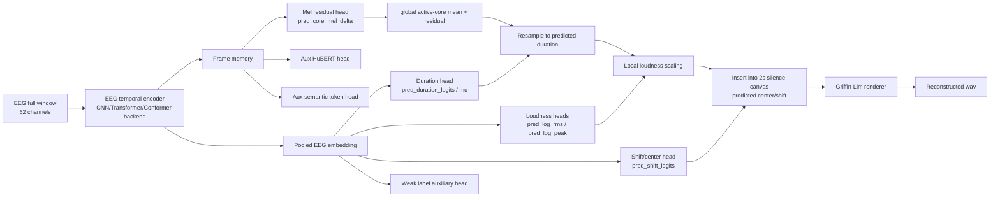

# KaraOne 语义辅助 EEG-to-Speech 当前模型技术说明

> 版本：2026-06-29  
> 范围：`karaone_overt_recon_bundle` 当前 v5 实现。  
> 当前主目标：未知 EEG -> 对应语音生成。推理时默认只输入 EEG，不使用真实 prompt label、真实 onset、真实 insert frame。  
> 当前主线：Temporal-Elastic Active Speech-Core EEG-to-Speech。

---

## 1. 当前结论

当前系统已经从早期路线：

```text
EEG -> EnCodec latent / acoustic flow -> waveform
```

逐步修正到当前 v5 路线：

```text
EEG full window
  -> EEG temporal encoder
  -> active speech-core Mel residual
  -> active duration / loudness / center prediction
  -> temporal-elastic active-core rendering
  -> Griffin-Lim wav
```

最重要的变化是：**不再把完整 2 秒 Mel 逐帧硬回归作为主目标**。KaraOne 的音频大部分是静音或非核心发声区域，且 EEG 相对声音存在生理滞后，因此严格原始时间轴对齐会误伤模型。v5 主要判断：

```text
有声片段整体形状是否像
active duration 是否合理
active loudness / peak 是否合理
best-shift envelope 是否接近
trial retrieval 是否超过 mean / zeroeeg
```

而不是只看：

```text
原始 2 秒时间轴逐帧 Mel-Corr / MCD / active_env_corr
```

当前 implementation 状态：

- v5 cache、训练、合成、shift-invariant evaluation、绘图脚本已接入。
- v5 runner 已修复 `ALIGN_ARGS[@]: unbound variable` 问题。
- v5 默认 **不启用 strict alignment objective**；如需 lag 诊断，可手动设置 `USE_ALIGNMENT=1`。
- speaking/overt_like 与 thinking 已有独立一键脚本。
- 旧 semantic-first、mel residual、env residual、v4.2.1 sh 入口已删除；根目录当前只保留 v5 runner。

---

## 2. 当前可运行入口

根目录当前保留的 shell 入口：

```text
run_karaone_v5_full_50.sh
run_karaone_v5_temporal_elastic.sh
run_karaone_v5_speaking_full_50.sh
run_karaone_v5_thinking_full_50.sh
```

### 2.1 Speaking / overt_like

```bash
cd /Users/samxie/Research/EEG-Voice/ref_github/speech_decoding/eeg2wave_server_bundle/karaone_overt_recon_bundle

DEVICE=mps \
EPOCHS=50 \
SPLIT=subject_test \
LIMIT=-1 \
bash run_karaone_v5_speaking_full_50.sh
```

等价完整形式：

```bash
DEVICE=mps \
EPOCHS=50 \
STAGES=overt_like \
SPLIT=subject_test \
LIMIT=-1 \
RUN_TAG=v5_speaking_50ep_$(date +%Y%m%d_%H%M%S) \
bash run_karaone_v5_full_50.sh
```

### 2.2 Thinking

```bash
cd /Users/samxie/Research/EEG-Voice/ref_github/speech_decoding/eeg2wave_server_bundle/karaone_overt_recon_bundle

DEVICE=mps \
EPOCHS=50 \
SPLIT=subject_test \
LIMIT=-1 \
bash run_karaone_v5_thinking_full_50.sh
```

等价完整形式：

```bash
DEVICE=mps \
EPOCHS=50 \
STAGES=thinking \
SPLIT=subject_test \
LIMIT=-1 \
RUN_TAG=v5_thinking_50ep_$(date +%Y%m%d_%H%M%S) \
bash run_karaone_v5_full_50.sh
```

每次完整运行会执行：

```text
1. 构建/复用 HuBERT、Mel、alignment、semantic token、v5 active-core cache
2. 训练 v5 temporal-elastic active-core model
3. 加载 best.pt 合成 wav
4. 生成 shift-invariant active-segment metrics
5. 绘制 original vs pred_active_local_scaled waveform 图
```

---

## 3. 数据与输入

`KaraOneTrialDataset` 仍以 `segments.csv` 和 subject NPZ 为 canonical source。

模型输入：

```text
eeg:           [B, 62, T_eeg]
eeg_valid_len: [B]
stage_idx:     [B]
subject_idx:   [B]  # API 兼容；生成路径不使用 subject identity
label_idx:     [B]  # 训练弱辅助/评估分组；final inference 不使用真实 label
```

当前 KaraOne NPZ 实际使用 **62 个 EEG 通道**。baseline encoder 的第一层会接收全部通道：

```text
Conv1d(62 -> d_model)
```

训练时：

```text
channel_dropout=0.15
channel_reliability soft gate enabled in v5 runner
```

含义：

- 训练中会随机屏蔽部分通道作为正则。
- 推理时 62 个通道都会进入模型。
- channel reliability 是 soft weighting 和诊断，不是手工通道筛选。
- 当前不应把“通道选择 benchmark”当主目标；核心目标仍是 EEG -> Speech Generation。

---

## 4. Cache 体系

### 4.1 原始音频/EEG 派生 cache

```text
artifacts/audio_targets/karaone_trial_hubert.npz
artifacts/audio_targets/karaone_trial_mel.npz
artifacts/alignment/karaone_overt_like_alignment.npz
```

用途：

- `karaone_trial_hubert.npz`：HuBERT continuous semantic auxiliary target。
- `karaone_trial_mel.npz`：full 2s Mel reference 与 Griffin-Lim oracle。
- `karaone_overt_like_alignment.npz`：lag/onset/peak/com 诊断；v5 默认不把它作为主训练对齐约束。

### 4.2 Train-only HuBERT semantic token cache

```text
artifacts/audio_targets/karaone_trial_hubert_tokens_k64_trainonly.npz
```

当前 metadata：

```text
codebook_split=train
codebook_train_template_ids_shape=(1352,)
K=64
```

用途：

- semantic token CE / CTC 辅助监督。
- semantic token edit distance 诊断。
- 不作为 final generation bottleneck。
- 不使用真实 label 生成语音。

### 4.3 v5 Temporal-Elastic Active-Core Cache

```text
artifacts/audio_targets/karaone_temporal_elastic_core_v5.npz
```

构建脚本：

```text
app/scripts/build_karaone_temporal_elastic_core_cache.py
```

构建逻辑：

```text
ignore_initial_sec = 0.10
smooth energy with 5 frames
active threshold = max(median + 2*MAD, 0.20*peak)
取 largest contiguous active component
pre_margin_sec = 0.06
post_margin_sec = 0.08
active segment resample 到 K=64 帧
真实 active_duration_frames 单独保存
active_rms / active_peak 单独保存
active_center_frame 单独保存
```

当前 cache 诊断：

```text
trials = 1913
core_shape = [64, 80]
full_target_steps = 122
audio_active_frame_rate_mean ≈ 0.158
duration_frames_median = 18
duration_sec_median ≈ 0.288s
active_center_median = 44 frames ≈ 0.704s
```

含义：KaraOne 真正有声核心区域很短，平均只有约 16% 的帧是 active。v5 因此不再让模型学习完整 2 秒静音画布，而是先学习 active speech-core。

---

## 5. 当前 v5 模型结构



### 5.1 主生成路径

v5 主路径是：

```text
EEG -> active-core Mel residual -> duration/loudness/center -> waveform
```

其中：

```text
pred_core_mel = global_active_core_mean + eeg_delta_mel
```

`global_active_core_mean` 只是稳定训练的无 label baseline，不包含真实 prompt label 信息。最终是否成功必须看 EEG prediction 是否超过：

```text
zeroeeg
mean active-core
```

### 5.2 辅助分支

v5 仍保留：

```text
HuBERT continuous regression
HuBERT semantic token CE / CTC
trial-level EEG-audio InfoNCE
weak label CE
channel reliability diagnostics
```

但它们都是辅助和诊断，不是生成主路径。

默认 label 权重：

```text
lambda_content_ce = 0.05
lambda_prompt_ctc = 0.0
lambda_label_supcon = 0.0
```

这避免模型退化成“先猜 KaraOne 11 类 label，再套模板”。

---

## 6. 当前训练目标

v5 主训练参数由 runner 自动打开：

```text
--speech-core-objective
--temporal-elastic-objective
--active-loudness-objective
--shift-supervision
--anti-collapse-objective
--local-loudness-synthesis
--speech-token-ctc
--trial-contrastive
--selection temporal_elastic_generation_v5
--channel-reliability
```

核心 loss：

```text
lambda_core_shape_corr = 1.0
lambda_core_cos = 1.0
lambda_core_softdtw = 0.8
lambda_envelope_shape = 0.8
lambda_duration = 0.6
lambda_loudness = 0.5
lambda_trial_infonce = 1.0
lambda_zeroeeg_margin = 0.5
lambda_semantic_token_ce = 0.5
lambda_speech_token_ctc = 0.3
lambda_hubert_aux = 0.5
lambda_hubert_clip = 0.5
lambda_content_ce = 0.05
```

解释：

- `core_shape_corr`：比较 resampled active-core Mel 的整体形状。
- `core_softdtw`：允许 active-core 内部局部速度差，不要求严格逐帧同步。
- `envelope_shape`：比较有声片段能量包络形状。
- `duration`：预测真实 active duration，避免生成段过长。
- `loudness`：预测 active RMS 和 peak，避免只生成很小声或过响模板。
- `trial_infonce`：EEG_i 应接近同 trial audio_i，远离 batch 内其他 trial。
- `zeroeeg_margin`：要求真实 EEG 输出优于 zero EEG 输出。

---

## 7. Alignment 当前策略

v5 重新定义时间问题：

```text
neural delay:
  EEG 反应相对声音滞后，只做诊断/插入估计，不作为主质量惩罚。

speech duration:
  有声段多长，单独预测。

active-core shape:
  有声段内部形状是否像，允许整体平移和局部速度差。
```

因此 v5 runner 当前默认：

```text
USE_ALIGNMENT=0
```

也就是说，训练默认不启用旧式：

```text
--alignment-objective
```

如需额外 lag 诊断或 ablation，可手动运行：

```bash
USE_ALIGNMENT=1 bash run_karaone_v5_full_50.sh
```

但正式主结果建议仍以 `USE_ALIGNMENT=0` 为准，尤其是 thinking，因为 thinking 的 EEG 与 overt waveform 不应被逐帧同步约束。

---

## 8. Synthesis 输出

v5 synthesis 默认输出：

```text
pred
pred_scaled
pred_env_scaled
pred_env_local_scaled
pred_active_local_scaled        # v5 推荐试听
pred_active_local_unshifted
zeroeeg
zeroeeg_scaled
zeroeeg_active_local_scaled
mean_latent
mean_active_core_scaled
oracle_griffinlim
oracle_shift_pred               # oracle diagnostic，不是 final result
```

推荐试听：

```text
pred_active_local_scaled
```

生成流程：

```text
pred_core_mel_norm
 -> denormalize
 -> resample to predicted active_duration_frames
 -> local loudness scaling using pred_log_rms / pred_log_peak
 -> insert into 2s silence canvas using predicted center/shift
 -> Griffin-Lim
```

注意：

- `oracle_shift_pred` 只用于诊断“如果插入位置正确，上限如何”。
- final result 只能看 EEG-only predicted shift/duration/loudness 的输出。
- 不使用真实 label 或真实 onset 参与最终生成。

---

## 9. Evaluation 与主指标

v5 每次合成会写：

```text
synth_metrics.json
shift_invariant_summary.json
waveform_compare/
```

主看指标：

```text
active_segment_shape_corr_mean
best_shift_full_env_corr_mean
pred_active_local_scaled_active_duration_ratio_mean
pred_active_local_scaled_voiced_rms_over_orig_mean
pred_active_local_scaled_peak_over_orig_mean
silence_leakage_wav_mean
```

训练 selection：

```text
temporal_elastic_generation_v5 =
  active shape gain over zeroeeg / mean
  softdtw gain over zeroeeg / mean
  trial retrieval gain
  semantic token edit gain
  duration score
  loudness score
  - pairwise collapse penalty
  - duration overstretch penalty
  - silence leakage penalty
```

不应作为主判断的指标：

```text
raw 2s timeline Mel-Corr
strict raw active_env_corr
raw lag MAE
label_top1 / label_top5
oracle_label_proto metrics
```

原因：EEG 相对声音有滞后，且 thinking 与 overt waveform 更不应被严格 frame-level 对齐。

---

## 10. 当前验证状态

已通过：

```text
python -m py_compile:
  data.py
  model.py
  losses.py
  eval.py
  train_karaone_recon.py
  synthesize_karaone.py
  build_karaone_temporal_elastic_core_cache.py
  eval_karaone_shift_invariant_wavs.py

bash -n:
  run_karaone_v5_temporal_elastic.sh
  run_karaone_v5_full_50.sh
  run_karaone_v5_speaking_full_50.sh
  run_karaone_v5_thinking_full_50.sh
```

Smoke 测试已通过：

```text
v5 cache build
1 epoch CPU train
LIMIT=2 subject_test synthesis
shift-invariant summary
waveform compare plot
```

Smoke 只说明代码路径可运行，不代表模型性能。

---

## 11. 当前风险与下一步判断

### 11.1 主要风险

1. **Thinking EEG 与 overt waveform 并非同步生成过程**
   - thinking 阶段应优先看 active-shape、retrieval、semantic token，而不是严格位置。

2. **KaraOne 样本量小**
   - 14 subjects、约 1913 trials。
   - 不能指望大型 codec/flow decoder 从小数据中直接学完整 waveform generation。

3. **Griffin-Lim renderer 上限有限**
   - Mel 好不等于 waveform 听感好。
   - 但 Griffin-Lim 离线、可控、可诊断，适合作为当前默认 renderer。

4. **Active-core mean baseline 很强**
   - 成功必须证明 EEG-specific prediction 超过 mean/zeroeeg。
   - 只输出漂亮模板不是成功。

5. **label 捷径风险**
   - label 只能作为弱辅助和诊断。
   - 如果 label_top1 高但 waveform 差，说明模型仍没有学到真正 EEG-to-audio generation。

### 11.2 下一步分析顺序

每次 50 epoch 训练后优先看：

```text
1. test_metrics.json / subject_test:
   pred_over_zero_active_shape_gain
   pred_over_mean_active_shape_gain
   pred_over_zero_softdtw_gain
   pred_over_mean_softdtw_gain
   pred_pairwise_corr_median
   pred_std_ratio_median
   trial retrieval top-k

2. synth_metrics.json:
   active_segment_shape_corr_mean
   best_shift_full_env_corr_mean
   active_duration_ratio
   voiced_rms_over_orig
   peak_over_orig
   silence_leakage

3. waveform_compare:
   只比较有声核心区域整体是否像
   不按原始 2s 起点逐帧否定模型
```

如果 speaking 好于 thinking，这是合理现象；thinking 应被视为更难的 semantic/audio generation 条件。

---

## 12. 当前项目定位

当前系统不是：

```text
EEG classification
label decoding
channel selection benchmark
speech recognition
```

当前系统是：

```text
EEG -> waveform-derived representation -> reconstructed speech
```

v5 的设计重点是把 EEG-to-speech 的时间问题拆开处理：

```text
内容 / 有声核心形状 / 时长 / 响度 / 插入位置
```

而不是强迫 EEG 和 audio 在原始 2 秒时间轴上逐帧同步。
