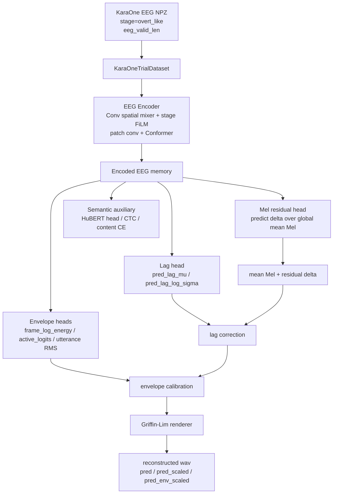

# KaraOne 语义优先 EEG-to-Speech 当前模型技术说明

> 版本：2026-06-28j  
> 范围：`karaone_overt_recon_bundle` 当前 v3 实现、50 epoch overt_like 最新运行结果、合成与 waveform 绘图结果。  
> 当前主目标：EEG -> Speech Generation。所有语义 token、Mel、lag、active envelope 设计都应服务于最终重建语音，而不是 EEG 分类或单纯检索。

---

## 1. 当前结论

当前代码已经从早期的 `EEG -> EnCodec/Flow direct latent`，推进到更合理的 v3 路线：

```text
EEG
  -> alignment-aware EEG representation
  -> semantic token / HuBERT auxiliary supervision
  -> lag-aware Mel residual reconstruction
  -> envelope calibration
  -> Griffin-Lim wav rendering
```

但是，**最新 v3 结果仍然不能算好**。它比 v2 更可诊断，也显示出少量有效信号，但在最重要的 `subject_test` 跨被试重建上仍明显输给 `mean_target`：

- `subject_test pred_over_mean_cos_gain = -0.0336`
- `subject_test pred_mel_corr_gain = -0.1136`
- `subject_test pred_mcd_gain = -8.3200`
- `subject_test pred_energy_corr_gain = -0.2737`
- `subject_test pred_pairwise_corr_median = 0.9095`
- `waveform pearson mean ≈ 0.0005`

这说明当前模型还没有稳定从 EEG 中恢复 trial-specific speech acoustic structure。它仍然偏向生成跨 trial 相似的模板化 Mel/wav，尤其是在 subject_test 上。

---

## 2. 最新运行记录

最新完整运行：

```text
RUN_TAG=v3_overt_50ep_20260628_192421
STAGES=overt_like
DEVICE=mps
SPLIT=subject_test
LIMIT=-1
```

主目录：

```text
artifacts/outputs_karaone/karaone_baseline_overt_like_v3_overt_50ep_20260628_192421_melalign
```

主要输出：

```text
checkpoints/best.pt
metrics/history.csv
metrics/test_metrics.json
wav_subject_test_20260628_193653/synth_metrics.json
wav_subject_test_20260628_193653/waveform_compare/
v3_full_run_summary.txt
```

semantic-token 诊断模型：

```text
artifacts/outputs_karaone/karaone_semantic_tokens_baseline_overt_like_v3_overt_50ep_20260628_192421_semtok
```

注意：脚本设置为 `EPOCHS=50`，但 Mel 主模型触发 early stopping：

```text
[early-stop] no val selection improvement for 15 epochs (best=-0.0469); stopping at epoch 35
```

因此 acoustic Mel aligned 主模型实际跑到 epoch 35；semantic-token 诊断模型完整写出 50 个 epoch。

---

## 3. 当前数据与 Cache

### 3.1 原始训练样本

`KaraOneTrialDataset` 仍以 `segments.csv` 和 subject NPZ 为 canonical source。

当前 `overt_like` 分割：

```text
train=1352
val=132
test=132
subject_test=297
subjects=14
labels=11
```

输入 EEG：

```text
eeg: [B, 62, 1280]
eeg_valid_len: [B]
stage_idx: [B]
subject_idx: [B]
label_idx: [B]
```

`eeg_valid_len` 当前用于：

- EEG instance normalization 的有效区间统计；
- Transformer/Conformer key padding mask；
- utterance pooling mask；
- diffusion/flow 或 regression encoder path；
- stage-aware / alignment-aware 训练中的样本有效长度记录。

### 3.2 Target Cache

当前 v3 依赖以下 cache：

```text
artifacts/audio_targets/karaone_trial_hubert.npz
artifacts/audio_targets/karaone_trial_mel.npz
artifacts/audio_targets/karaone_trial_hubert_tokens_k64.npz
artifacts/alignment/karaone_overt_like_alignment.npz
```

含义：

- `karaone_trial_hubert.npz`: HuBERT continuous sequence，用于 semantic auxiliary 和 semantic-token k-means source。
- `karaone_trial_hubert_tokens_k64.npz`: HuBERT sequence 的 K=64 k-means discrete semantic tokens。
- `karaone_trial_mel.npz`: 当前 acoustic reconstruction 主 target。
- `karaone_overt_like_alignment.npz`: 每个 overt trial 的 EEG-audio energy alignment diagnostic 和 lag target。

alignment cache 中默认 lag 定义：

```text
lag_sec = eeg_energy_com_t - audio_energy_com_t
positive lag = EEG response later than audio
```

训练不会移动 wav 或改写 target cache，只在 loss/eval/synthesis 中使用 lag。

---

## 4. 当前 v3 模型结构

### 4.1 总体结构



### 4.2 EEG Encoder

默认 `baseline` 使用 `KaraOneEEG2Codec` + Conformer EEG encoder：

```text
EEG [B, 62, 1280]
  -> optional instance norm over eeg_valid_len
  -> channel dropout
  -> Conv1d(62 -> d_model)
  -> stage FiLM conditioning
  -> temporal patch conv
  -> fixed target_steps pooling
  -> positional embedding
  -> Conformer blocks
  -> valid_len key padding mask
  -> encoded memory [B, d_model, T]
```

当前 MPS 修复：

- `encoder.py` 新增 MPS-safe `_temporal_pool_1d`。
- 当 `adaptive_avg_pool1d` 在 MPS 上遇到 input length 不能整除 target length 时，自动改用 linear interpolation。
- CPU/CUDA 路径仍保持原始 adaptive average pooling。

### 4.3 Semantic Token 诊断模型

训练入口：

```text
app/scripts/train_karaone_semantic_tokens.py
```

目标：

```text
EEG -> semantic_token_logits [B, T_sem, K=64]
```

loss 主要包含：

```text
semantic token CE
HuBERT continuous regression / cosine
prompt-token CTC
content label CE
EEG-HuBERT contrastive / retrieval objective
```

当前这个 semantic-token 模型只是诊断 EEG 是否含有语义信息，**尚未被接入 Mel decoder 作为条件输入**。这是当前 v3 的一个重要限制。

### 4.4 Mel Aligned 主模型

训练入口：

```text
app/scripts/train_karaone_recon.py
```

关键参数：

```text
--target mel
--residual-mean
--alignment-objective
--alignment-cache artifacts/alignment/karaone_overt_like_alignment.npz
--selection alignment_composite
```

主预测形式：

```text
prediction = global_mean_mel + predicted_residual_delta
```

alignment-aware loss 中会使用 predicted/oracle lag 做 shift-tolerant 比较：

```text
pred_audio_aligned = shift(pred_mel, -lag_frames)
loss(pred_audio_aligned, target_mel)
```

当前额外输出：

```text
pred_lag_mu
pred_lag_log_sigma
pred_frame_log_energy
pred_active_logits
pred_log_rms
pred_hubert
ctc_logits
content_logits
```

### 4.5 Synthesis

合成入口：

```text
app/scripts/synthesize_karaone.py
```

对 residual checkpoint 会自动识别：

```text
mode=residual_global_mean
```

v3 synthesis 默认做：

```text
raw_pred_mel
  -> add global mean if residual checkpoint
  -> inverse-lag correction using pred_lag_mu
  -> optional envelope calibration
  -> Griffin-Lim
```

当前输出 wav type：

```text
original
oracle_griffinlim
mean_latent
zeroeeg
zeroeeg_scaled
pred_unaligned
pred
pred_scaled
pred_env_scaled
```

默认推荐试听与画图版本：

```text
pred_env_scaled
```

但最新结果显示，`pred_env_scaled` 只是略改善 active voiced RMS/peak，仍没有解决 active envelope 对齐问题。

---

## 5. 最新结果评估

### 5.1 Semantic Token 诊断结果

`subject_test`：

```text
pred_recon_cos              = 0.3758
zeroeeg_recon_cos           = 0.3140
mean_recon_cos              = 0.5348
pred_over_zero_cos_gain     = +0.0619
pred_over_mean_cos_gain     = -0.1590
pred_pairwise_corr_median   = 0.7196

pred label top1             = 0.1380
zeroeeg label top1          = 0.0943
mean label top1             = 0.0909
pred label top5             = 0.3636
zeroeeg label top5          = 0.3569
mean label top5             = 0.3232
```

解读：

- EEG semantic token 模型确实比 zeroeeg/mean 多学到一点 label-level 语义信号。
- 但 trial retrieval 非常弱，且 HuBERT/token cosine 仍输给 mean target。
- 这说明 EEG 中有弱内容信号，但还不足以稳定恢复 trial-specific semantic sequence。

### 5.2 Mel Aligned 主模型结果

`subject_test` 核心指标：

```text
pred_recon_cos              = 0.5946
mean_recon_cos              = 0.6282
pred_over_mean_cos_gain     = -0.0336

pred_mel_corr               = 0.7067
mean_mel_corr               = 0.8203
pred_mel_corr_gain          = -0.1136

pred_mcd                    = 32.4804
mean_mcd                    = 24.1604
pred_mcd_gain               = -8.3200

pred_energy_corr            = 0.5665
mean_energy_corr            = 0.8403
pred_energy_corr_gain       = -0.2737

pred_active_recon_mse       = 2.7045
mean_active_recon_mse       = 3.1004
pred_active_recon_mse_gain  = +0.3959

pred_pairwise_corr_median   = 0.9095
lag_mae_sec                 = 0.2077
peak_error                  = 0.4041
active_onset_error          = 0.3767
```

aligned 指标：

```text
aligned_pred_mel_corr_gain       = -0.1237
aligned_pred_energy_corr_gain    = -0.1377
aligned_active_recon_mse_gain    = +0.4615

oracle_aligned_pred_active_energy_corr = 0.2836
oracle_aligned_mean_active_energy_corr = 0.0744
```

解读：

- lag-aware training 有一点作用：aligned energy corr 比 unaligned 高一些，active-frame MSE 也比 mean 好。
- 但这远远不够。Mel corr、MCD、energy corr 这些主指标仍明显输给 mean。
- `pairwise_corr_median=0.9095` 很高，说明不同 trial 的输出仍然过于相似，模板化问题没有解决。
- oracle alignment 下 active energy corr 能超过 mean，说明“时序对齐确实是问题”，但当前 predicted lag/decoder 还不能把这个潜力稳定转化为重建质量。

### 5.3 Rendered Wav 结果

`subject_test` synthesis：

```text
lag_corrected = True

pred_env_corr_mean                 = 0.1083
pred_env_scaled_env_corr_mean      = 0.0817
oracle_env_corr_mean               = 0.0952

pred_active_env_corr_mean          = -0.0788
pred_env_scaled_active_env_corr    = -0.0332
oracle_active_env_corr_mean        = 0.9384

pred_voiced_rms_over_orig_mean     = 0.3059
pred_env_scaled_voiced_rms_mean    = 0.3706
oracle_voiced_rms_over_orig_mean   = 0.9440

pred_peak_over_orig_mean           = 0.2169
pred_env_scaled_peak_over_orig     = 0.2356
oracle_peak_over_orig_mean         = 0.9203
```

Waveform comparison manifest：

```text
n = 297
pearson mean   ≈ 0.00055
pearson median ≈ 0.00015
rms_ratio mean ≈ 0.995
rms_ratio median ≈ 0.831
```

解读：

- waveform Pearson 接近 0 不意外，因为 Griffin-Lim 相位不可靠，不能单独作为主指标。
- 但 active envelope 指标为负，说明生成 wav 在真正发声区域仍没有跟原始语音对上。
- `pred_env_scaled` 把 voiced RMS 从 0.306 提到 0.371，把 peak ratio 从 0.217 提到 0.236，但仍离 oracle 的 0.94/0.92 很远。
- 当前 wav 可以作为 debugging artifact，不应被认为已经有可接受的语音重建质量。

---

## 6. 为什么当前结果不好

### 6.1 Mean baseline 非常强

KaraOne 是 prompted phoneme/word 小数据集，语音结构高度模板化。全局 mean Mel/semantic target 本身已经和 target 有很高相似度。模型如果不能恢复 trial-specific timing、energy 和 content，几乎必然输给 mean。

### 6.2 当前 semantic token 没有真正进入 acoustic renderer

v3 已经训练了 semantic-token diagnostic model，但 Mel aligned 主模型没有把 predicted semantic tokens 作为条件输入。结果是：

```text
semantic signal 被评估了，但没有显式控制 wav rendering。
```

这和老师最初说的“EEG token 与 waveform/speech token 对齐后生成 waveform”还有距离。当前更像两条并行诊断线，不是完整 token-conditioned generation pipeline。

### 6.3 Lag head 有用但不够准

`subject_test lag_mae_sec=0.2077`。对 KaraOne 的短 phoneme/word 语音来说，200 ms 误差已经很大。active onset error 和 peak error 也仍在 0.38-0.40 s 量级。

这会直接导致：

```text
Mel frame 看起来有能量，但 active/voiced 区域错位；
wav 里有声音，但不是在原始语音真正发声的位置。
```

### 6.4 模型仍然模板化

`subject_test pred_pairwise_corr_median=0.9095` 太高。即使 RMS 变正常，输出也很可能只是“带一点变化的平均模板”，不是 trial-specific reconstruction。

### 6.5 Cross-subject generalization 是主要失败点

val/test 上有一些正 gain，但 subject_test 上主指标变负。这说明当前模型可能学到了一些 within-subject 或 dataset-level regularity，但没有学到足够稳健的跨被试 EEG-to-speech 映射。

---

## 7. 当前代码入口

完整 v3 一键运行：

```bash
cd /Users/samxie/Research/EEG-Voice/ref_github/speech_decoding/eeg2wave_server_bundle/karaone_overt_recon_bundle

DEVICE=mps \
EPOCHS=50 \
STAGES=overt_like \
SPLIT=subject_test \
LIMIT=-1 \
RUN_TAG=v3_overt_50ep_$(date +%Y%m%d_%H%M%S) \
bash run_karaone_v3_full_50.sh
```

只跑 Mel aligned 主线、跳过 semantic-token 诊断：

```bash
RUN_SEMANTIC=0 DEVICE=mps EPOCHS=50 STAGES=overt_like SPLIT=subject_test LIMIT=-1 \
bash run_karaone_v3_full_50.sh
```

单独 phase：

```bash
bash run_karaone_v3_alignment.sh cache
bash run_karaone_v3_alignment.sh semantic_tokens 50 baseline semtok_overt_v3
bash run_karaone_v3_alignment.sh mel_aligned 50 baseline melalign_overt_v3
CKPT=artifacts/outputs_karaone/<run>/checkpoints/best.pt bash run_karaone_v3_alignment.sh synth subject_test -1
```

重新画 waveform 对比：

```bash
/opt/anaconda3/bin/python app/scripts/plot_karaone_waveform_compare.py \
  --wav-dir artifacts/outputs_karaone/<run>/wav_subject_test_<timestamp> \
  --original-type original \
  --reconstruction-type pred_env_scaled
```

---

## 8. 下一步建议

当前不建议继续优先加 MoE、Mamba、Flow 或更大 encoder。更应该先解决目标和条件链路：

### 8.1 从 global mean residual 改成 label-conditioned prototype residual

当前 mean baseline 太强，但 global mean 不区分 prompt label。下一步应加入：

```text
label_mean_mel[label] 或 semantic_cluster_mean_mel[token]
prediction = label/semantic prototype + EEG residual
```

训练时可做两套：

1. oracle label prototype：验证上限；
2. predicted semantic/label prototype：模拟真实 EEG-only 推理。

如果 oracle label prototype 都显著提升，说明当前主要瓶颈是 content conditioning 没接入 acoustic renderer。

### 8.2 把 semantic-token model 接入 Mel decoder

不要只训练 semantic-token diagnostic。应实现：

```text
EEG encoder
  -> semantic token logits
  -> semantic token embedding / soft token embedding
  -> Mel residual decoder cross-attention
```

训练阶段：

- teacher-forced GT semantic token embedding；
- predicted soft token embedding；
- scheduled sampling；
- 对比两者差距。

推理阶段：

```text
EEG -> predicted semantic tokens -> semantic-conditioned Mel residual -> wav
```

### 8.3 Lag 不要完全从零学，先用 subject/label/stage prior

当前 lag MAE 约 0.21 s。下一步应评估：

```text
lag = global median
lag = subject median
lag = label median
lag = model residual over median prior
```

模型预测 residual lag，而不是直接预测绝对 lag。对 subject_test 可用 train-subject/global prior，不能用 held-out subject label leakage。

### 8.4 Selection score 要更严格惩罚模板化

当前 best val score 仍为负，但 checkpoint 仍会被保存。下一轮 selection 建议更重视：

```text
subject_test-like validation split
pairwise_corr penalty
semantic retrieval gain
active_env_corr gain
Mel corr / MCD 同时超过 mean
```

如果 `pred_pairwise_corr_median > 0.85`，即使 val cosine gain 为正，也不应视为成功。

### 8.5 先不要把 Flow 重新放回主线

Flow/refiner 只有在 deterministic Mel 已经超过 mean baseline 后才值得做。当前 deterministic Mel 在 subject_test 上还没过 mean，因此 Flow 很可能只会生成更自然但不正确的声音。

---

## 9. 当前验收状态

| 项目 | 状态 | 说明 |
|---|---:|---|
| v3 cache | 通过 | HuBERT、Mel、semantic token、alignment cache 已可自动生成 |
| v3 training runner | 通过 | `run_karaone_v3_full_50.sh` 可完整串联 cache/train/synth/plot |
| MPS training | 通过 | 修复 adaptive pooling 与 CTC loss MPS 限制 |
| semantic token 诊断 | 部分通过 | 比 zeroeeg 有弱 label/retrieval 信号，但输给 mean |
| Mel aligned reconstruction | 未通过 | subject_test Mel corr/MCD/energy 仍输给 mean |
| rendered wav | 未通过 | active envelope 仍差，waveform pearson 约 0 |
| 是否可作为当前最佳主线 | 只能作为诊断主线 | 不应宣称已经实现可用 EEG-to-speech reconstruction |

---

## 10. 简短判断

你的判断是对的：**当前结果确实不好**。  

但 v3 的价值在于它把失败原因暴露得更清楚了：问题不再是“波形音量太低”或“Flow 没调好”，而是：

```text
跨被试 EEG semantic signal 弱
+ speech/Mel timing lag 不稳定
+ semantic token 没真正控制 acoustic rendering
+ 输出仍然过度接近模板/mean
```

下一轮应从 `semantic-conditioned prototype/residual Mel` 入手，而不是继续加复杂生成器。
