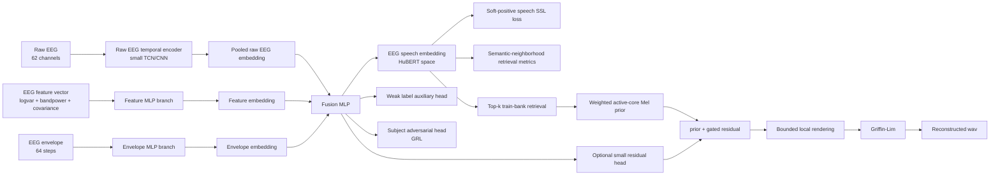

# KaraOne 语义辅助 EEG-to-Speech 当前模型技术说明

> 版本：2026-06-30  
> 范围：`karaone_overt_recon_bundle` 当前 v8 实现，v7/v6.1/v5 作为历史 baseline 保留。  
> 当前主目标：未知 EEG -> 对应语音生成。推理时默认只输入 EEG，不使用真实 prompt label、真实 onset、真实 insert frame、真实 target audio。  
> 当前主线：v8 Soft-Positive Cross-Subject EEG-to-Speech。

---

## 1. 目标是否改变

没有改变。v8 仍然服务于唯一核心目标：

```text
未知 EEG -> 对应语音 / wav
```

v8 不是 EEG 分类任务，不是 label decoding，也不是 channel selection benchmark。它只是针对 v7 暴露的问题做了更合理的训练目标修正：

```text
v7 问题：
  strict same-trial InfoNCE 太苛刻
  subject leakage 很高
  thinking/overt 在 subject-holdout 上不稳定

v8 修正：
  用 speech SSL 相似度构造 soft positives
  用 semantic neighborhood retrieval 评价 EEG 是否靠近语义相近音频
  加强 subject shortcut 抑制
  弱化 covariance/feature branch 的 subject 依赖
```

最终推理路径仍然是 EEG-only：

```text
EEG
  -> raw EEG branch + EEG feature branch + EEG envelope branch
  -> subject-robust EEG speech embedding
  -> retrieve train-subject speech active-core prior
  -> optional bounded small residual
  -> Griffin-Lim wav
```

label 只允许作为：

```text
弱辅助监督
分组评估
oracle/diagnostic 解释
```

不允许作为：

```text
生成入口
prototype selector
checkpoint 主指标
未知 EEG 合成时的输入
```

---

## 2. 当前结论

v7 的结果显示：训练 loss 和 within/trial-split 指标可以下降，但 `subject_val` 上：

```text
top3_gain ≈ 0 附近抖动
same_label_cross_subject_gain 长期为负
subject leakage 很高
selection 为负
```

这说明模型仍可能学到 subject/session shortcut，而不是可迁移的 speech-bearing EEG representation。

v8 的核心变化不是继续加 decoder，而是把 representation learning 改成更适合 KaraOne 小样本和重复 prompt 的形式：

```text
EEG_i 不只被迫对齐同 trial audio_i
EEG_i 也允许靠近 speech-SSL 空间中语义/声学相近的 audio_j
```

也就是说，v8 的关键判断从：

```text
是否精确检索同一个 held-out trial
```

扩展为：

```text
是否进入正确的 speech SSL semantic neighborhood
```

这更符合当前目标：未知 EEG 生成未知音频，而不是闭集 label 或 exact-trial 模板匹配。

当前 implementation 状态：

- v8 runner 已新增：`run_karaone_v8_soft_align.sh`。
- v8 复用 v7 model class、feature cache、synthesis，但训练目标和 selection 已切到 soft-positive。
- v8 修正了 v7 的 gradient reversal 双乘问题。
- v8 接入 feature dropout / feature noise，削弱 covariance/feature branch 的 subject shortcut。
- v8 输出目录使用 `karaone_v8_soft_align_...`，不会混入 v7 目录。
- 静态检查已通过；未执行 smoke run。

---

## 3. 当前可运行入口

当前 v8 主入口：

```text
run_karaone_v8_soft_align.sh
```

历史 baseline 入口：

```text
run_karaone_v7_cross_subject.sh
run_karaone_v61_retrieval_first.sh
run_karaone_v61_full_50.sh
run_karaone_v5_full_50.sh
run_karaone_v5_temporal_elastic.sh
```

### 3.1 Thinking v8 训练与合成

```bash
cd /Users/samxie/Research/EEG-Voice/ref_github/speech_decoding/eeg2wave_server_bundle/karaone_overt_recon_bundle

RUN_TAG=v8_thinking_50ep_$(date +%Y%m%d_%H%M%S)

DEVICE=mps \
STAGES=thinking \
bash run_karaone_v8_soft_align.sh embed_thinking 50 baseline "$RUN_TAG"

CKPT=artifacts/outputs_karaone/karaone_v8_soft_align_baseline_thinking_${RUN_TAG}/checkpoints/best.pt \
DEVICE=mps \
bash run_karaone_v8_soft_align.sh synth_thinking subject_test -1
```

### 3.2 Speaking / overt_like v8 训练与合成

```bash
cd /Users/samxie/Research/EEG-Voice/ref_github/speech_decoding/eeg2wave_server_bundle/karaone_overt_recon_bundle

RUN_TAG=v8_overt_50ep_$(date +%Y%m%d_%H%M%S)

DEVICE=mps \
STAGES=overt_like \
bash run_karaone_v8_soft_align.sh embed_overt 50 baseline "$RUN_TAG"

CKPT=artifacts/outputs_karaone/karaone_v8_soft_align_baseline_overt_like_${RUN_TAG}/checkpoints/best.pt \
DEVICE=mps \
bash run_karaone_v8_soft_align.sh synth_overt subject_test -1
```

### 3.3 绘图

```bash
bash run_karaone_v8_soft_align.sh plot artifacts/outputs_karaone/<run>/wav_v7_subject_test_<timestamp>
```

注意：v8 synthesis 复用 `synthesize_karaone_v7_cross_subject.py`，所以 wav 目录名仍可能是 `wav_v7_...`。这只是合成脚本复用导致的命名问题，不代表跑的是 v7 模型。判断版本应看 checkpoint 中：

```text
model_kind = cross_subject_v8_soft_align
selection  = v8_soft_subject_generalization
```

### 3.4 分步命令

```bash
# 构建/复用 HuBERT、active-core、EEG feature cache
bash run_karaone_v8_soft_align.sh cache

# EEG signal / split / train-bank 审计
STAGES=overt_like DEVICE=cpu \
bash run_karaone_v8_soft_align.sh audit_signal 1 baseline audit_v8

# overt_like v8 soft-positive 训练
STAGES=overt_like DEVICE=mps \
bash run_karaone_v8_soft_align.sh embed_overt 50 baseline v8_overt

# thinking v8 soft-positive 训练
STAGES=thinking DEVICE=mps \
bash run_karaone_v8_soft_align.sh embed_thinking 50 baseline v8_thinking
```

---

## 4. 数据与输入

`KaraOneTrialDataset` 仍以 `segments.csv` 和 subject NPZ 为 canonical source。

v8 每个样本输入：

```text
raw EEG:        [B, 62, T_eeg]
eeg_valid_len:  [B]
stage_idx:      [B]
eeg_feature:    [B, feature_dim]
eeg_envelope:   [B, 64]
subject_idx:    [B]  # split/eval/subject-adversarial 诊断
label_idx:      [B]  # 弱辅助 CE / report
```

当前 KaraOne NPZ 实际使用 **62 个 EEG 通道**。v8 不做手工通道筛选：

```text
raw EEG branch: Conv/TCN encoder receives all 62 channels
channel_dropout = 0.2
channel_reliability soft gate enabled
```

推理时 62 个通道都会进入模型。channel gate 只用于 soft weighting 和诊断，不是主目标。

---

## 5. EEG Feature Cache

v8 复用 v7 EEG 特征 cache：

```text
artifacts/audio_targets/karaone_eeg_features_v7_<stage>.npz
```

构建脚本：

```text
app/scripts/build_karaone_eeg_features_v7.py
```

每个 trial/stage 保存：

```text
feature_vectors:
  per-channel log variance
  delta/theta/alpha/beta/gamma bandpower
  normalized covariance upper triangle

envelopes:
  64-step low-frequency EEG activity envelope

metadata:
  subject_id
  label
  stage
  trial_index
  valid_length
```

v8 新增 feature regularization：

```text
FEATURE_DROPOUT_PROB = 0.35
FEATURE_NOISE_STD    = 0.03
```

含义：

- 训练时随机置零部分样本的 feature/envelope branch。
- 对 feature/envelope 加轻微噪声。
- 迫使模型不能完全依赖 covariance/logvar 等容易携带 subject identity 的特征。
- raw EEG branch 仍然保留，避免完全丢失时序信息。

---

## 6. Split 与评估协议

v8 继续使用 subject-holdout selection。默认：

```text
SUBJECT_VAL  = P02
SUBJECT_TEST = MM21
```

协议：

```text
train:
  不包含 subject_val 和 subject_test。

subject_val:
  用于 checkpoint selection。
  目标是选择能跨被试泛化的 EEG speech embedding。

subject_test:
  只做最终报告。
  不参与训练、不参与 selection、不进入 train speech bank。

普通 val/test:
  主要用于观察 trial split 过拟合。
```

v8 的主判断不再只看 exact same-trial retrieval，也看 semantic-neighborhood retrieval：

```text
subject_val / subject_test semantic_top3_gain
subject_val / subject_test semantic_mrr_gain
subject_val / subject_test HuBERT cosine gain
subject leakage score
active-shape gain
```

---

## 7. Speech Cache 与 Acoustic Prior

v8 继续使用：

```text
artifacts/audio_targets/karaone_trial_hubert.npz
artifacts/audio_targets/karaone_trial_mel.npz
artifacts/audio_targets/karaone_temporal_elastic_core_v5.npz
```

用途：

- `karaone_trial_hubert.npz`：speech SSL / HuBERT summary，是 EEG embedding 对齐目标。
- `karaone_trial_mel.npz`：full 2s Mel reference 与 oracle/renderer diagnostic。
- `karaone_temporal_elastic_core_v5.npz`：active-core Mel bank，用作 retrieval acoustic prior。

v8 生成路径：

```text
EEG embedding -> retrieve top-k train-bank HuBERT/audio embeddings
              -> weighted active-core Mel prior
              -> optional bounded residual
              -> wav
```

subject_test audio 不进入 train bank。subject_test 原始 wav 只用于最终评价和绘图。

---

## 8. 当前 v8 模型结构

v8 复用 v7 cross-subject model class：

```text
app/src/karaone_recon/cross_subject_v7.py
```

结构：



---

## 9. v8 训练目标

v8 runner 默认：

```text
LAMBDA_TRIAL_INFONCE     = 0.3
LAMBDA_SOFT_INFONCE      = 1.0
SOFT_TARGET_TEMPERATURE  = 0.08
LAMBDA_HUBERT_COS        = 0.8
LAMBDA_VICREG_VARIANCE   = 0.3
LAMBDA_VICREG_COVARIANCE = 0.1
LAMBDA_HARD_NEG          = 0.2
LAMBDA_CONTENT_CE        = 0.05
LAMBDA_SUBJECT_ADV       = 0.2
LAMBDA_MEL_RESIDUAL      = 0.0
FEATURE_DROPOUT_PROB     = 0.35
FEATURE_NOISE_STD        = 0.03
```

### 9.1 Soft-positive speech SSL contrastive

v7 的 strict InfoNCE：

```text
EEG_i 只把 audio_i 当正样本
其它 audio_j 全部当负样本
```

v8 新增 soft-positive loss：

```text
audio_i 与 audio_j 在 HuBERT space 中越相似，
audio_j 对 EEG_i 的 soft-positive 权重越高。
```

这样更适合 KaraOne：

- 重复 prompt 多，同 label/相似发音之间不应全部被当作强负样本。
- thinking 的 trial-specific waveform 对齐更不稳定，exact trial retrieval 过于苛刻。
- 目标仍来自 waveform-derived HuBERT，不来自 label。

### 9.2 Gradient reversal 修正

v7 中 GRL 强度实际被 `lambda_subject_adv` 乘了两次，encoder 侧 subject-adversarial 梯度偏弱。v8 修正为：

```text
GRL schedule in [0, 1]
loss side 使用 lambda_subject_adv
```

这使 subject leakage suppression 真正作用到 EEG embedding。

### 9.3 Feature shortcut 抑制

v8 加入：

```text
feature dropout
feature noise
```

目的：避免 covariance/logvar/bandpower branch 过度携带 subject identity。

---

## 10. Selection 与 Gate

v8 selection：

```text
v8_soft_subject_generalization =
  1.2 * pred_semantic_top3_gain
+ 1.0 * pred_semantic_mrr_gain
+ 0.6 * pred_pair_trial_top3_gain
+ 0.8 * pred_hubert_cos_gain
+ 0.5 * same_label_cross_subject_gain
- 0.8 * subject_leakage_score
- 0.3 * max(0, pred_pairwise_corr_median - 0.85)
```

v8 gate：

```text
pred_semantic_top3_gain > 0
pred_hubert_cos_gain > 0
```

和 v7 的区别：

```text
v7 gate:
  exact pair top3 gain > 0
  HuBERT cos gain > 0

v8 gate:
  speech-SSL semantic-neighborhood top3 gain > 0
  HuBERT cos gain > 0
```

这并不是降低目标，而是把“未知 EEG 生成未知音频”的中间验证从 exact-trial matching 改成更合理的 speech representation matching。

不包含：

```text
label_top1
label_top5
oracle_label_proto
duration/loudness 单项
visual waveform alignment
```

---

## 11. Synthesis 输出

v8 synthesis 复用：

```text
app/scripts/synthesize_karaone_v7_cross_subject.py
```

默认输出目录目前仍可能显示：

```text
wav_v7_<split>_<timestamp>
```

这是脚本复用命名，不代表 v7。实际版本以 checkpoint 为准：

```text
model_kind = cross_subject_v8_soft_align
selection  = v8_soft_subject_generalization
```

常见 wav 类型：

```text
original
pred_v7                  # v8 checkpoint 下代表 v8 prediction
pred_v7_retrieved_prior  # v8 retrieval prior
mean_train_core
oracle_griffinlim
```

解释规则：

```text
gate_passed = true:
  pred_v7 可以作为 EEG-only generation 结果分析。

gate_passed = false:
  residual_scale 自动归零。
  pred_v7 主要等价于 retrieval prior diagnostic，不应宣称 EEG 生成成功。
```

---

## 12. Evaluation 与主指标

训练阶段重点看：

```text
subject_val:
  pred_semantic_top3_gain
  pred_semantic_mrr_gain
  pred_pair_trial_top3_gain
  pred_hubert_cos_gain
  same_label_cross_subject_gain
  subject_leakage_score
  selection_score_v8
  gate_passed

subject_test:
  pred_semantic_top3_gain
  pred_semantic_mrr_gain
  pred_pair_trial_top3_gain
  pred_hubert_cos_gain
  pred_over_zero_active_shape_gain
  pred_over_mean_active_shape_gain
  pred_pairwise_corr_median
  pred_std_ratio_median
```

合成阶段看：

```text
pred_v7_active_segment_shape_corr_mean
pred_v7_best_shift_full_env_corr_mean
pred_v7_active_env_corr_mean
pred_v7_voiced_rms_over_orig_mean
pred_v7_peak_over_orig_mean
pred_v7_active_duration_ratio_mean
pred_v7_silence_leakage_mean
pred_v7_loudness_in_bounds_mean
```

其中最关键的是：

```text
subject-holdout semantic-neighborhood retrieval > zeroeeg / mean / shuffled
HuBERT cosine gain > 0
subject leakage score 下降
active-shape gain > mean
loudness bounded
pairwise collapse 降低
```

`best_shift_full_env_corr` 只能说明允许时间平移后 envelope 接近，不能单独证明 EEG-to-Speech 成功。

---

## 13. v5、v6.1、v7、v8 的关系

### v5

解决 active speech-core 和时间评价问题：

```text
EEG -> temporal-elastic active-core Mel -> wav
```

贡献：

```text
active-core cache
duration/loudness/center
shift-invariant evaluation
local loudness synthesis
```

问题：subject_test 上仍容易输出 mean/template，不能稳定证明 EEG-specific speech information。

### v6.1

把优先级前移到 retrieval-first：

```text
EEG embedding -> HuBERT/speech SSL retrieval -> active-core prior -> wav
```

贡献：

```text
subject-holdout retrieval gate
zeroeeg/mean/shuffled baselines
retrieved-prior + optional residual
```

问题：仍可能在 trial split 上好、subject-holdout 上接近 chance。

### v7

引入 cross-subject EEG representation：

```text
raw EEG branch + EEG feature branch + envelope branch
 -> subject-robust EEG speech embedding
 -> train-bank retrieval
 -> bounded wav synthesis
```

贡献：

```text
EEG feature cache
subject-balanced sampler
subject adversarial head
hard negatives
bounded loudness synthesis
```

问题：strict same-trial InfoNCE 对 KaraOne/thinking 太苛刻；subject leakage 仍高。

### v8

当前主线：

```text
v7 architecture
+ soft-positive speech SSL contrastive
+ semantic-neighborhood retrieval metrics
+ stronger subject leakage suppression
+ feature dropout/noise
```

v8 的判断标准是：如果 overt_like/thinking 的 subject-holdout semantic-neighborhood retrieval 仍不成立，就不应继续堆 acoustic generator；应该继续修 EEG preprocessing、subject normalization、split protocol 和 representation learning。

---

## 14. 当前验证状态

已通过静态检查：

```text
bash -n:
  run_karaone_v8_soft_align.sh
  run_karaone_v7_cross_subject.sh

py_compile:
  app/scripts/train_karaone_v7_cross_subject.py
  app/scripts/synthesize_karaone_v7_cross_subject.py
  app/scripts/build_karaone_eeg_features_v7.py
  app/src/karaone_recon/cross_subject_v7.py
```

未执行 smoke run。

---

## 15. 当前风险与下一步判断

### 15.1 主要风险

1. **跨被试 EEG representation 仍可能不成立**

   如果 `subject_val/subject_test semantic_top3_gain` 和 `HuBERT cos gain` 不为正，说明 EEG->speech representation 尚未过关。

2. **soft-positive 可能过软**

   如果 semantic-neighborhood retrieval 好但 exact-pair retrieval 完全不动，说明模型可能只学到粗内容，不足以生成 trial-specific speech detail。

3. **feature branch 仍可能携带 subject shortcut**

   v8 加入 feature dropout/noise 和更强 subject adversarial，但仍需观察 `subject_leakage_score`。

4. **thinking 不应先强行 acoustic synthesis**

   thinking 阶段没有同步 overt acoustic event。应先看 semantic/content retrieval，再做 acoustic transfer。

5. **renderer 不是当前首要瓶颈**

   Griffin-Lim 听感有限，但当前更核心的问题是 EEG representation 是否能跨被试对齐 speech SSL space。

### 15.2 每次训练后的判断顺序

```text
1. subject_val gate:
   pred_semantic_top3_gain > 0
   pred_hubert_cos_gain > 0

2. subject_test generalization:
   semantic_top3 / semantic_mrr 是否超过 zeroeeg / mean / shuffled
   HuBERT cos gain 是否为正

3. anti-shortcut:
   subject_leakage_score 是否下降
   same_label_cross_subject_gain 是否改善
   pairwise_corr_median 是否不过高

4. generation:
   pred_v7 是否超过 retrieved_prior / mean_train_core
   active_shape_corr 是否超过 mean
   RMS/peak 是否在 [0.6, 1.4] 附近
   silence_leakage 是否低
```

如果 overt_like 不过 gate，thinking 的 wav 不能作为正式 EEG-to-Speech 结果，只能作为 diagnostic。

---

## 16. 当前项目定位

当前系统不是：

```text
EEG classification
label decoding
channel selection benchmark
speech recognition
```

当前系统是：

```text
EEG -> waveform-derived speech representation -> retrieved/generated speech
```

v8 的定位是：

```text
EEG-to-Speech Generation 的 soft-positive cross-subject representation-first 版本
```

目标仍然是 EEG-only speech generation。v8 只是把“是否真的从 EEG 中学到可迁移 speech information”的中间验证从 exact-trial retrieval 改成更适合 KaraOne 的 speech-SSL semantic-neighborhood retrieval，避免把模板、subject shortcut 或 label shortcut 误认为 EEG 生成语音。
