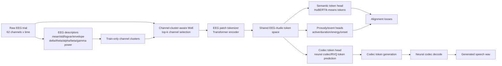

# KaraOne v11 Tokenized Neural Speech Generation 技术说明

更新时间：2026-07-01

## 1. 研究目标

KaraOne v11 将 EEG-to-Speech 从“EEG 回归一个全局语音 latent”的问题，重新定义为“基于 token 的神经语音生成”问题。模型不再把 `EEG -> global HuBERT summary latent` 作为主路线，而是从通道感知的 EEG token 出发，逐步预测结构化的 audio semantic tokens、prosody/event tokens 和 neural codec tokens，最后通过 codec token 解码得到语音波形。

v11 的核心研究假设是：真正可泛化的 EEG-to-Speech generation，必须先建立跨被试 EEG 与 Audio token 的共享表示空间。语音不是静态向量，它同时包含 speech content、prosody、duration/onset、energy、timbre 以及 speaker-related acoustic characteristics。因此，模型不能只学习“像不像某个训练语音 latent”，而要学习“EEG token 如何对应到语音 token 序列”，再学习 EEG-conditioned codec-token generation。

Retrieval 在 v11 中只保留为 diagnostic baseline，用于检查表示学习质量。即使 retrieval wav 听起来很像，也不能作为 EEG-to-Speech generation 成功的证据。真正的生成结果必须来自 `generated_codec`，也就是 EEG 条件下预测 codec tokens 后解码出的语音。

## 2. v11 相比 v10 的核心变化

v10 的主线仍然偏向 semantic/prosody latent alignment，再用 retrieval 或 diagnostic codec 输出帮助分析。v11 做了三个关键改变：

1. 表示空间 token-first  
   EEG 和 audio 都被转成序列 token，不再只对齐全局 summary latent。

2. EEG encoder 更强调通道结构  
   62 个 EEG channel 不再等权输入，而是先通过 Channel-MoE 做稀疏选择，并引入 train-only channel clustering。模型会输出 channel gate 和 channel importance，便于分析哪些通道更有用。

3. 生成目标改成 codec-token generation  
   模型训练目标从“找相似语音”转向“预测 codec token 序列”。最终语音来自 neural codec decoder，而不是从训练集中检索来的 reference 音频。

## 3. 整体 Pipeline



Pipeline 运行顺序：

1. 构建 train-only cluster bank  
   只使用 `subject_train` 拟合 EEG cluster、speech cluster、cross-modal cluster。默认 heldout 为 `subject_val=P02`、`subject_test=MM21`。

2. 构建 v11 token bank  
   只用 train subjects 拟合 codec codebook 和 channel clusters。heldout subject 只做 assignment，不参与任何统计拟合。

3. EEG token alignment training  
   EEG tokens 预测 semantic tokens、prosody/event tokens，并在跨被试条件下与 audio tokens 对齐。

4. Codec-token generation training  
   用 EEG 条件预测 codec tokens，并输出 generated codec wav。

5. 诊断输出  
   同时输出 reference、retrieval diagnostic 和 generated codec，方便听感和图像对比，但报告必须区分 retrieval 与 generation。

## 4. 数据与 Token 表示

### 4.1 EEG tokens

v11 的 EEG 表示包含三类信息：

- raw temporal patch tokens：从 EEG 时间序列切 patch 后输入 Transformer。
- spectral band tokens：Channel-MoE 与 channel clustering 使用 EEG 频段描述符，包括 delta、theta、alpha、beta、gamma log-bandpower。
- channel descriptor tokens：每个通道的 mean、std、logvar、absolute envelope-like mean、前后半段 slope、diff energy。

这些 token 的目的不是简单增加特征，而是让模型知道“哪些 EEG 通道在当前 trial 中更可靠、哪些通道更像一组功能通道、哪些频段可能携带 speech-related signal”。

### 4.2 Audio semantic tokens

Audio semantic tokens 来自 HuBERT/k-means token cache，用于表达 speech content 的离散序列结构。v11 不只用 HuBERT summary，而是显式预测 semantic token sequence，并用 token CE、CTC、contrastive 和 OT loss 约束。

### 4.3 Prosody/event tokens

Prosody/event 目标包括：

- active speech mask
- duration
- energy
- onset

这些目标用于避免模型只预测“语义类别”，却完全丢失语音何时发生、强度如何变化和片段边界是否连续。

### 4.4 Codec tokens

Codec tokens 来自 neural codec latent 的 train-only k-means/RVQ-style 离散化。当前实现使用 train-only codec codebook，将 codec latent frame 分配为 codec token ids，再训练模型从 EEG 条件预测这些 token。生成 wav 时，预测 token 会映射回 codec latent/codebook 向量，再调用本地 codec backend 解码为波形。

## 5. Channel-Cluster-Aware MoE EEG Encoder

v11 的 EEG encoder 在输入端加入 Channel-MoE。它解决的问题是：KaraOne 有 62 个 EEG channel，但跨被试 EEG 信号噪声大、通道可靠性不一致，不应该假设每个通道对 speech decoding 都同等重要。

Channel-MoE 的输入包括：

- 每个通道的统计描述符
- delta/theta/alpha/beta/gamma log-bandpower
- learned channel embedding
- train-only channel cluster embedding

MoE 做两件事：

1. sparse top-k channel gate  
   默认 `top_k=16`，鼓励模型从 62 个通道中选择当前 trial 更有用的通道。

2. expert assignment  
   默认 6 个 channel experts，每个 expert 学习一组功能通道模式。expert 输出再进入 EEG patch tokenizer 和 Transformer encoder。

正则项包括：

- gate sparsity
- expert load balance
- channel dropout
- gate entropy floor
- same-label / same-cluster 条件下的 channel gate consistency

可解释性输出包括：

- `channel_gate_summary.csv`
- `channel_importance_by_stage.csv`
- `channel_importance_by_label.csv`
- `top_channels_report.md`
- `figures/channel_gate_top_channels.png`

这些输出用于回答老师提出的问题：不是先硬删 channel，而是让模型软选择通道，再通过 gate 和 ablation/importance 分析哪些通道稳定有用。

## 6. Alignment 方法

v11 支持多种 aligner：

```text
ALIGNER=mlp|clip|ctc|ot|perceiver|hybrid
```

默认使用：

```text
ALIGNER=hybrid
```

hybrid 由多种目标组合：

- semantic token CE：预测 HuBERT/k-means semantic tokens。
- semantic token CTC：处理 EEG 与 audio token 长度不完全对齐的问题。
- CLIP-style token contrastive：让 EEG token summary 与 audio token summary 在共享空间靠近。
- monotonic soft-OT：鼓励 EEG token 与 audio token 形成时间单调的软对齐。
- prompt CE / balanced CE / prompt CTC：提高 label/prompt 层面的可解码性。
- prosody/event loss：预测 active、duration、energy、onset。
- cross-subject positive contrastive：same label 或 same speech-token neighborhood 下，不同 subject 作为正样本。
- hard negatives：same EEG cluster different label、same label different EEG cluster、mean-prior token negative。
- anti-collapse losses：pairwise decorrelation、variance/correlation gate、zero/mean prior margin。

这里的训练重点是证明 EEG prediction 比 zero prior、mean prior 和 train speech prior 更有信息，而不是只学到训练语音分布。

## 7. Codec-Token Generation

v11 的 generation 分为两步：

1. EEG tokens -> semantic/prosody tokens  
   先验证跨被试 token alignment 是否成立。

2. EEG-conditioned semantic/prosody representation -> codec tokens -> wav  
   再训练 codec token head，输出 `generated_codec` wav。

输出目录中三类音频含义固定：

```text
reference/
  原始目标语音，仅用于对比。

retrieval_diagnostic/
  从训练集中按表示相似度检索到的语音，只是 diagnostic baseline。
  不能用于声明生成成功。

generated_codec/
  EEG-conditioned codec-token generation 产生的语音。
  这是 v11 真正要优化的生成输出。
```

每个样本还会被整理到：

```text
wavs/grouped_wavs/<sample_id>/
  01_original_reference.wav
  02_retrieval_diagnostic.wav
  03_generated_codec.wav
```

这样可以直接听同一个样本的 reference、retrieval 和 generated codec。

## 8. Evaluation Gate

v11 明确区分 alignment gate 与 generation gate。

### 8.1 Alignment gate

subject_val 需要满足：

```text
semantic_token_top3_gain_over_prior > 0.02
same_label_cross_subject_gain >= 0
prompt_acc >= 0.13
token_retrieval_cross_subject_gain > 0
pred_token_entropy not collapsed
channel_gate_entropy not collapsed
```

subject_test 方向也不能反向。

### 8.2 Generation gate

需要证明 generated codec wav 优于 zero/mean-prior codec baseline，并报告：

```text
mel/STFT distance
envelope correlation
codec token accuracy
prompt consistency
waveform Pearson
subject_val and subject_test direction consistency
```

只有 alignment gate 和 generation gate 同时通过，才允许写：

```text
EEG-to-Speech generation success
```

否则只能写：

```text
diagnostic generated codec attempt
```

## 9. 当前实现文件

主要代码：

```text
app/src/karaone_v11/data.py
app/src/karaone_v11/model.py
app/src/karaone_v11/losses.py
app/src/karaone_v11/eval.py
app/scripts/build_karaone_v11_tokens.py
app/scripts/train_karaone_v11.py
app/scripts/synthesize_karaone_v11.py
app/scripts/plot_karaone_v11_training.py
app/scripts/summarize_karaone_v11_run.py
run_karaone_v11.sh
```

配置文件：

```text
app/configs/karaone_v11.yaml
```

测试：

```text
app/tests/test_karaone_v11_smoke.py
```

## 10. 一键运行命令

### 10.1 本地 MPS thinking

```bash
cd /Users/samxie/Research/EEG-Voice/ref_github/speech_decoding/eeg2wave_server_bundle/karaone_overt_recon_bundle

mkdir -p artifacts/outputs_karaone/logs

PIPELINE_TAG="v11_thinking_hybrid_mps_$(date +%Y%m%d_%H%M%S)"

nohup env \
PYTHONUNBUFFERED=1 \
DISABLE_TQDM=1 \
VERBOSE=1 \
LOG_INTERVAL=10 \
DEVICE=mps \
ALIGNER=hybrid \
EEG_TOKENIZER=hybrid \
AUDIO_TOKENIZER=hybrid \
PRETRAIN_EPOCHS=0 \
CODEC_EPOCHS=10 \
SYNTH_SPLIT=all \
SYNTH_LIMIT=0 \
LOG_FILE="artifacts/outputs_karaone/logs/${PIPELINE_TAG}.log" \
./shell_scripts/run_karaone_v11.sh full thinking 50 "$PIPELINE_TAG" \
> "artifacts/outputs_karaone/logs/${PIPELINE_TAG}.nohup.log" 2>&1 &
```

### 10.2 本地 MPS stimulate

```bash
cd /Users/samxie/Research/EEG-Voice/ref_github/speech_decoding/eeg2wave_server_bundle/karaone_overt_recon_bundle

mkdir -p artifacts/outputs_karaone/logs

PIPELINE_TAG="v11_stimulate_hybrid_mps_$(date +%Y%m%d_%H%M%S)"

nohup env \
PYTHONUNBUFFERED=1 \
DISABLE_TQDM=1 \
VERBOSE=1 \
LOG_INTERVAL=10 \
DEVICE=mps \
ALIGNER=hybrid \
EEG_TOKENIZER=hybrid \
AUDIO_TOKENIZER=hybrid \
PRETRAIN_EPOCHS=0 \
CODEC_EPOCHS=10 \
SYNTH_SPLIT=all \
SYNTH_LIMIT=0 \
LOG_FILE="artifacts/outputs_karaone/logs/${PIPELINE_TAG}.log" \
./shell_scripts/run_karaone_v11.sh full stimulate 50 "$PIPELINE_TAG" \
> "artifacts/outputs_karaone/logs/${PIPELINE_TAG}.nohup.log" 2>&1 &
```

### 10.3 CUDA 服务器 thinking

```bash
cd ~/aicloud-data/eeg2wave_server_bundle/eeg2wave_server_bundle/karaone_overt_recon_bundle

mkdir -p artifacts/outputs_karaone/logs

PIPELINE_TAG="v11_thinking_hybrid_cuda_$(date +%Y%m%d_%H%M%S)"

nohup env \
PYTHONUNBUFFERED=1 \
DISABLE_TQDM=1 \
VERBOSE=1 \
LOG_INTERVAL=10 \
DEVICE=cuda \
ALIGNER=hybrid \
EEG_TOKENIZER=hybrid \
AUDIO_TOKENIZER=hybrid \
PRETRAIN_EPOCHS=0 \
CODEC_EPOCHS=10 \
SYNTH_SPLIT=all \
SYNTH_LIMIT=0 \
LOG_FILE="artifacts/outputs_karaone/logs/${PIPELINE_TAG}.log" \
./shell_scripts/run_karaone_v11.sh full thinking 50 "$PIPELINE_TAG" \
> "artifacts/outputs_karaone/logs/${PIPELINE_TAG}.nohup.log" 2>&1 &
```

### 10.4 CUDA 服务器 stimulate

```bash
cd ~/aicloud-data/eeg2wave_server_bundle/eeg2wave_server_bundle/karaone_overt_recon_bundle

mkdir -p artifacts/outputs_karaone/logs

PIPELINE_TAG="v11_stimulate_hybrid_cuda_$(date +%Y%m%d_%H%M%S)"

nohup env \
PYTHONUNBUFFERED=1 \
DISABLE_TQDM=1 \
VERBOSE=1 \
LOG_INTERVAL=10 \
DEVICE=cuda \
ALIGNER=hybrid \
EEG_TOKENIZER=hybrid \
AUDIO_TOKENIZER=hybrid \
PRETRAIN_EPOCHS=0 \
CODEC_EPOCHS=10 \
SYNTH_SPLIT=all \
SYNTH_LIMIT=0 \
LOG_FILE="artifacts/outputs_karaone/logs/${PIPELINE_TAG}.log" \
./shell_scripts/run_karaone_v11.sh full stimulate 50 "$PIPELINE_TAG" \
> "artifacts/outputs_karaone/logs/${PIPELINE_TAG}.nohup.log" 2>&1 &
```

## 11. 输出结构

一次完整运行会输出到：

```text
artifacts/outputs_karaone/karaone_v11_tokenized_generation_codec_<stage>_<aligner>_<tag>_codec10/
```

核心文件：

```text
metrics/history.json
metrics/latest_metrics.json
figures/training_curves.png
figures/token_alignment_metrics.png
figures/gate_metrics.png
figures/codec_metrics.png
figures/channel_gate_top_channels.png
wavs/reference/
wavs/retrieval_diagnostic/
wavs/generated_codec/
wavs/generated_codec_latents/
wavs/grouped_wavs/
wavs/waveform_compare/
reports/v11_run_summary.md
```

其中：

- `token_alignment_metrics.png`：semantic token、prompt、cross-subject token retrieval 等指标。
- `channel_gate_top_channels.png`：Channel-MoE 选择出的高权重通道。
- `original_vs_retrieval_diagnostic` 图：只看 retrieval diagnostic baseline。
- `original_vs_generated_codec` 图：看真正 EEG-conditioned generated codec。

## 12. 已完成的最小验证

当前实现已通过：

```text
synthetic forward/backward
all aligner forward/backward
Channel-MoE forward/backward
codec-token generator forward/backward
train-only token builder smoke
real-data smoke: thinking, 1 epoch, limited steps
wav synthesis smoke: reference + retrieval_diagnostic + generated_codec
waveform comparison figure smoke
grouped wav organization smoke
```

真实数据 smoke 显示，1-step/1-epoch 模式下 gate 不会通过，这是预期结果。该 smoke 的目的只是验证代码链路完整，不代表研究结论。

## 13. 当前限制与下一步

当前 v11 已经完成架构骨架和一键 pipeline，但还不能直接宣称 EEG-to-Speech generation 成功。主要限制包括：

1. 完整 50 epoch 的 thinking/stimulate 结果还需要在 CUDA 上跑完并比较。
2. codec token 目前是 train-only k-means/codebook 近似，仍需更强的 neural codec/RVQ decoder ceiling 验证。
3. generation gate 还需要加入更严格的 zero/mean-prior codec baseline 对比。
4. channel importance 目前已有 gate summary，下一步应补 leave-channel-out 或 permutation importance。
5. 对 thinking 数据，必须先证明 semantic/prosody token alignment 过 gate，再讨论 waveform 成功。

因此 v11 的合理表述是：

```text
KaraOne v11 establishes a tokenized EEG-to-Speech generation pipeline with channel-aware EEG tokenization, train-only channel/audio clustering, cross-subject EEG-Audio token alignment, and EEG-conditioned codec-token generation. Current generated wav outputs are diagnostic unless both alignment and generation gates pass on heldout subjects.
```
