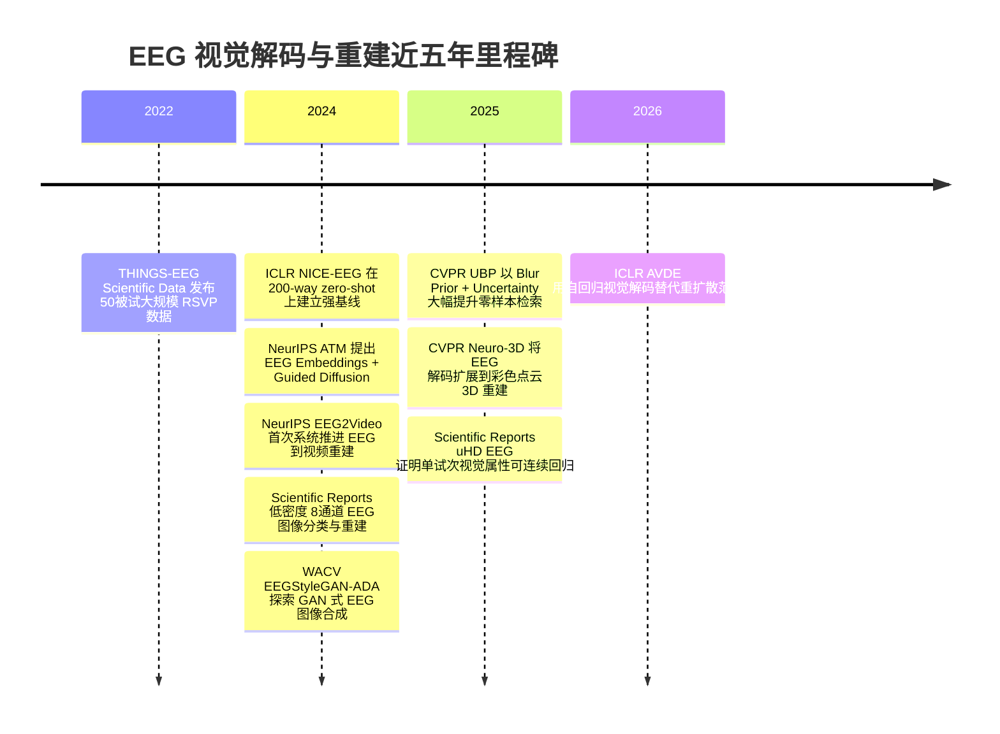

# 近五年基于 EEG 嵌入的视觉解码与重建研究进展报告

## 执行摘要

过去五年里，**“Visual Decoding and Reconstruction via EEG Embeddings”** 已经从“能否做类别识别”推进到“能否做跨模态对齐、零样本检索、图像重建，以及视频/三维对象重建”。在静态视觉任务上，代表性 CCF-A 工作从 ICLR 2024 的 NICE-EEG，把 200-way zero-shot 识别推到 **Top-1 15.6%、Top-5 42.8%**，发展到 NeurIPS 2024 的 ATM，在 THINGS-EEG 基准上实现 **200-way zero-shot 检索 Top-1 28.64%、Top-5 58.47%**，并把 Subject 8 的重建指标提升到 **PixCorr 0.160、SSIM 0.345、CLIP 0.786**；再到 CVPR 2025 的 UBP，把同一类 THINGS-EEG 零样本检索进一步提升到 **Top-1 50.9%、Top-5 79.7%**。这说明：**EEG 中可以稳定解出较强的语义级信息，且通过 CLIP 对齐、先验设计与生成模型后，能够得到“语义上可辨认”的重建结果**，但离真实像素级复原仍有明显距离。

如果把问题换成“现在到底能重建到什么程度”，结论应更谨慎。**当前最好结果主要体现为：类别、粗语义、主色调、主体形状、动态快慢、三维形体轮廓等可被重建；而细粒度纹理、精确颜色、人物脸部、对象数量、复杂背景与跨被试泛化仍较弱。**例如 EEG2Video 在完整 40 类视频数据集上报告 **SSIM 0.256**，并在子集任务上取得更高的语义识别率；Neuro-3D 则把 EEG 重建扩展到彩色点云，完整模型达到 **2-way Top-1 55.81、10-way Top-3 57.64、Chamfer Distance 5.35×10^-2、F1 77.01**。这些结果说明 EEG 的高时间分辨率确实有利于**动态视觉与三维知觉线索**，但其**空间分辨率与信噪比**仍然限制最终画面保真度。

从实验设计看，近期研究已形成几条比较清晰的路线。其一是 **大规模静态图像-EEG 配对数据集**，如 THINGS-EEG、EEG-ImageNet；其二是 **动态视频与三维对象数据集**，如 SEED-DV、EEG-3D；其三是 **高密度或超高密度 EEG** 与 **便携低密度 EEG** 两端同时推进。高密度方案能提高解码上限，低密度方案则探索真实世界可用性：例如 Scientific Reports 2024 的低密度研究在 **8 通道、250 Hz** 的便携设备上，20 类分类平均达到 **34.4%**，并在**已见过类别**的测试集上取得 **1000 trial 50-class Top-1 35.3%** 的重建识别率；而另一个 2025 年 Scientific Reports 工作用 **512 通道 occipital uHD EEG** 对单试次图像属性做回归解码，跨属性平均 **Pearson’s r = 0.50**，提示“更高电极密度”确实能显著抬高视觉信息可解码上限。

方法层面，当前主流并不是“直接从原始 EEG 生成图像”，而是**先把 EEG 映射到视觉嵌入空间**，再用生成模型做解码。常见技术路径包括：**对比学习对齐 EEG 与图像/文本嵌入**（NICE、ATM、UBP）、**扩散先验或扩散解码**（ATM、CognitionCapturer、low-density EEG、EEG2Video、Neuro-3D）、**不确定性感知先验**（UBP）、**自回归视觉 token/latent 生成**（AVDE）、以及 **GAN/StyleGAN-ADA**（WACV 2024）等。方法差异的本质，在于如何处理 EEG 的三大难点：**低信噪比、跨被试非平稳性、以及脑信号与视觉模态间的“信息鸿沟”**。从期刊/会议分布看，**CCF-A 主会场**已经出现一批直接面向 EEG 视觉重建的实质性工作，尤其是 **ICLR、NeurIPS、CVPR**；而在 **Nature/Science 体系** 中，近五年与该主题最直接相关的工作主要集中在 **Scientific Reports** 与 **Scientific Data**，分别承担“低密度/高密度方法验证”和“基础数据资源建设”的角色。基于本次针对 Nature、Science 及其子刊的检索结果，我**未在检索到的结果中发现近五年发表于 Nature 或 Science 主刊、并以 EEG 自然图像/视频重建为核心任务的直接对应原始论文**；当前该方向在 Nature/Science 家族中更像是“数据集、单试次视觉属性解码、方法可行性验证”阶段，而不是主刊级成熟范式。

## 研究范围与检索口径

本报告聚焦 **近五年** 的 EEG 视觉解码与重建研究，并在必要时向前补充少量基础数据集工作，以解释当前主流基准的来源与命名。检索优先级遵循你的要求：**原始论文、官方数据集主页、官方代码仓库** 优先；其次才是综述或媒体报道。重点覆盖的会议/期刊体系包括 **NeurIPS、ICLR、CVPR** 等 CCF-A 主会，以及 **Nature/Science 及其子刊**。

检索结果显示，这个方向的“高影响力直接成果”主要分布在两端：一端是 **CCF-A 的方法论文**，集中解决跨模态对齐、生成先验和评测协议；另一端是 **Scientific Data / Scientific Reports**，主要提供大规模公开数据集或用特殊硬件配置验证 EEG 视觉信息能否被单试次或低密度条件下解码。换言之，这一方向目前在学术生态里仍处于**“方法快速迭代 + 基准体系持续建设”**的阶段。

## 研究进展总览

静态图像方向，近年的指标提升最明显，但**必须区分三类任务**：**分类/检索**、**两两识别 two-way identification**、以及**真正意义的重建质量**。前两者更多反映“语义与嵌入对齐”，后者才更接近“画面复原”。在 THINGS-EEG 这一类零样本基准上，NICE-EEG 的最好结果是 **Top-1 15.6%、Top-5 42.8%**；ATM 在同类 200-way zero-shot 检索里达到 **Top-1 28.64%、Top-5 58.47%**；UBP 则把这一指标进一步推到 **Top-1 50.9%、Top-5 79.7%**。但跨被试设置仍显著下降：UBP 的 inter-subject 平均仅 **Top-1 12.4%、Top-5 33.4%**，AVDE 的 cross-subject 也只有 **Top-1 0.143、Top-5 0.329**。这说明当前 SOTA 强烈依赖**被试内训练**与**高 SNR 试次平均**。

在“重建质量”上，ATM 报告的 THINGS-EEG（Subject 8）指标从 NICE 的 **SSIM 0.276** 提高到 **0.345**，说明扩散先验与多路条件输入明显改善了结构相似度；在 EEG-ImageNet 上，原始 benchmark 报告**最佳模型约 60.88% 分类准确率**，以及**约 64.67% 的 two-way identification**；后续 AVDE 在 EEG-ImageNet 前 8 位被试上的重建结果进一步达到平均约 **PixCorr 0.098、SSIM 0.273、CLIP 0.513**。这些数字说明，**静态图像 EEG 重建已能达到“看得出大类语义”的水平，但离高保真像素复原仍有一段距离**。

动态视觉与三维视觉是近两年的明显扩展。NeurIPS 2024 的 EEG2Video 把任务从单帧图像推进到视频，构建了 **20 被试、1400 视频片段、40 概念** 的 SEED-DV，并报告在完整 40 类上 **15.9% 的语义级准确率** 与 **0.256 的 SSIM**；作者还指出 EEG 中能够解出**类别、颜色、动态快慢**，但对**对象数量、人物外观和面孔**仍然无力。CVPR 2025 的 Neuro-3D 则进一步把 EEG 解码扩展到**彩色点云 3D 重建**，完整模型在 3D 重建 benchmark 上达到 **2-way Top-1 55.81、10-way Top-3 57.64、CD 5.35、F1 77.01**。这表明 EEG 的优势并不只在“看到了什么”，还在于它能够更自然地刻画**动态变化**。

需要强调的是，**主观评估仍明显滞后于自动指标**。在本次重点检索的代表作中，绝大多数论文都以 **PixCorr、SSIM、Top-k、AlexNet/Inception/CLIP two-way identification、Chamfer、F1** 与可视化样例作为主评测；我没有在这些代表性论文中看到系统的大规模人类打分（如大样本 MOS）被常规化地纳入主结果表。换言之，当前社区对“语义正确”已有较成熟自动评测，但对“人看起来是否真的像原图/原视频”仍缺少统一基准。

## 实验数据采集与处理流程

先看**数据采集**。当前最常见的数据结构有三类。第一类是**静态自然图像**：THINGS-EEG 的 Scientific Data 版本记录了 **50 位被试** 对 **22,248 幅图像、1,854 个概念** 的 EEG 反应，采用 **10 Hz RSVP**，每张图 **50 ms 呈现 + 50 ms 空白**，并用 **BrainVision ActiChamp、64 电极、1000 Hz** 记录，事件通过**并口 trigger**发送；EEG-ImageNet 则是 **16 位被试、80 类、4000 张 ImageNet 图像**，使用 **62 通道、1000 Hz**，每轮为**类别提示—500 ms 注视—500 ms 图像**，由 **Scan NuAmps Express + 64-channel Quik-Cap** 采集并通过 **Curry8** 记录 trigger。第二类是**视频**：SEED-DV 记录 **20 位被试** 观看 **40 概念、1400 视频片段** 的 EEG，项目页给出 **62 通道、200 Hz** 的原始数据摘要，但设备型号、伦理审批和知情同意在当前可见页面中**未说明**。第三类是**三维视觉**：EEG-3D 记录 **12 位被试**，刺激来自 **72 类 Objaverse 对象**，同时包含**6 秒旋转视频、静态图像、静息态**，并明确说明取得了**书面知情同意**与伦理审批。

这里有一个非常重要、但经常被忽视的基准细节：**“THINGS-EEG”在近期论文中存在命名混用。**Scientific Data 2022 的 THINGS-EEG 是 **50 被试、22,248 图像、10 Hz RSVP** 的大规模资源；而 NICE/ATM/UBP/AVDE 等方法论文里使用的“THINGS-EEG zero-shot benchmark”则报告为 **10 位被试、1654 训练概念 + 200 测试概念、训练图像重复 4 次、测试图像重复 80 次**，并在训练/测试时常常对重复试次做平均以提高 SNR。阅读时如果不盯住**被试数、概念 split、重复次数**，很容易把两个“THINGS-EEG”误当成同一个设置。

再看**预处理**。不同论文差异很大，但主干流程高度一致：**重参考 → 带通/陷波 → 试次切分 → 伪迹/坏试次去除 → 特征提取或深度嵌入**。THINGS-EEG（Scientific Data）使用 **0.1–100 Hz FIR 滤波**、平均参考、下采样到 **250 Hz**，切成 **[-100, 1000] ms** epoch；EEG-ImageNet 则采用**离线双乳突参考**、**0.5–80 Hz 带通 + 50 Hz 去工频**、再去伪迹，并把 **40–440 ms** 段作为时域输入，或进一步提取 **DE 频域特征**；便携 8 通道 low-density EEG 使用**坏 trial 剔除**、**1–95 Hz 滤波 + 60 Hz notch**、通道 z-normalization、极值 clamping；而 THINGS 类零样本工作最关键的“预处理增强”反而是**重复试次平均**，这极大提升了可解码性，但也让结果与严格单试次场景不可直接类比。

**嵌入生成**的分化更能体现研究路线差异。NICE-EEG 直接从时域 EEG 学到和图像嵌入对齐的表征，并发现有效时间窗主要在 **100–600 ms**；ATM 用 **Adaptive Thinking Mapper** 做 EEG→CLIP embedding 投影，并报告最有效的窗口通常在**刺激后 200–250 ms**附近；EEG-ImageNet benchmark 同时支持**时域原波形**与**频域 DE 特征**，说明目前社区尚未在“原始时域 vs 手工频域”上形成统一答案；EEG2Video 则把 EEG 映射到**视频 latent**与**文本 embedding**，再通过 Seq2Seq 与 DANA 将快/慢动态显式注入解码过程；Neuro-3D 把 EEG 表征显式分成**几何特征**与**外观特征**，分别条件化形状扩散与颜色预测。

训练/验证划分上，**跨被试泛化依然明显落后于被试内训练**，因此很多数据集与论文仍偏好 intra-subject 评估。EEG-ImageNet 明确建议使用**每类前 30 张训练、后 20 张测试**，以避免时序偏差；low-density EEG 采用**按 recording session 划分 hold-out validation/test**；THINGS 类零样本工作则更常用**概念级完全未见测试类**，因此更接近“真正 zero-shot”，但又普遍借助**重复平均**来换取 SNR。换言之，当前不同论文的成功条件并不相同：**有的更难在类别泛化，有的更难在单试次，有的更难在设备可用性。

## 代表性论文对比

| 论文                                                                                                                   | 年份 / 会议期刊              | 数据集 / 被试数                                               | EEG 设备参数                                                                                          | 任务类型                    | 模型方法                                                                       | 主要定量结果                                                                                                                                                                                                               | 公开数据 / 代码                                                                                                                                               |
| ---------------------------------------------------------------------------------------------------------------------- | ---------------------------- | ------------------------------------------------------------- | ----------------------------------------------------------------------------------------------------- | --------------------------- | ------------------------------------------------------------------------------ | -------------------------------------------------------------------------------------------------------------------------------------------------------------------------------------------------------------------------- | ------------------------------------------------------------------------------------------------------------------------------------------------------------- |
| *Decoding Natural Images from EEG for Object Recognition*                                                            | 2024 / ICLR                  | THINGS-EEG zero-shot benchmark / 10 被试                      | 论文沿用 THINGS 类 benchmark；设备在论文页未重述                                                      | 200-way zero-shot 分类/检索 | 对比学习 + EEG encoder + image encoder；NICE-SA / NICE-GA                      | 最佳结果**Top-1 15.6%、Top-5 42.8%**；基础 NICE 为 13.8/39.5                                                                                                                                                         | 代码公开：GitHub，许可证**MIT**；数据为公开 benchmark。citeturn24view0turn26view4turn25search14                                               |
| *Visual Decoding and Reconstruction via EEG Embeddings with Guided Diffusion*                                        | 2024 / NeurIPS               | THINGS-EEG zero-shot benchmark / 10 被试                      | **64 通道、1000 Hz**；训练概念 16540 图像条件、测试 200 图像条件                                | 检索 + 图像重建             | ATM 脑编码器 + prior diffusion + blurry image + caption/semantic guidance      | within-subject**Top-1 28.64%、Top-5 58.47%**；THINGS-EEG（Subject 8）**PixCorr 0.160、SSIM 0.345、CLIP 0.786**                                                                                                 | 代码公开：GitHub，**Python，MIT**。citeturn13view3turn13view5turn14view0turn6search10                                                       |
| *EEG2Video: Towards Decoding Dynamic Visual Perception from EEG Signals*                                             | 2024 / NeurIPS               | SEED-DV /**20 被试**，**1400 视频**，40 概念      | 数据摘要：**62 通道、200 Hz**；设备型号未说明                                                   | 视频语义解码 + 视频重建     | Seq2Seq + semantic predictor + DANA + inflated Stable Diffusion / Tune-A-Video | 完整 40 类上**语义准确率 15.9%**、**SSIM 0.256**；项目页还给出小子集 **34.0%** 与 **SSIM 0.300**                                                                                                   | 数据公开但需申请，代码公开：GitHub，**Python**；许可证未说明。citeturn39view0turn4search1turn38view1                                          |
| *Image classification and reconstruction from low-density EEG*                                                       | 2024 /*Scientific Reports* | 自建 /**9 被试**（1 人排除）                            | **8 通道 g.tec Unicorn Hybrid Black，250 Hz，内置放大器**                                       | 20 类分类 + 图像重建        | EEGNet 等分类器 + EEG encoder 双条件 latent diffusion                          | 平均分类**34.4%**；基础测试集重建 **1000-trial 50-class Top-1 35.3%**；inter-trial control 仅 **4.5%**                                                                                                   | 代码公开：GitHub，**Jupyter Notebook / Python**；版权为 **MIT Media Lab 限制性版权**；数据需申请。citeturn41view0turn42view1turn44view0 |
| *Learning Robust Deep Visual Representations From EEG Brain Recordings*                                              | 2024 / WACV                  | EEGCVPR40、ThoughtViz 等                                      | 依赖公开旧数据集，设备参数不统一                                                                      | 表征学习 + EEG→图像合成    | EEGStyleGAN-ADA + EEGClip                                                      | 在 EEGCVPR40 / ThoughtViz 上分别报告**62.9% / 36.13%** 的合成质量提升（文中用 IS/FID/KID 比较）                                                                                                                      | 代码见论文页脚 GitHub；许可证未说明。citeturn45view0                                                                                                    |
| *EEG-ImageNet: An Electroencephalogram Dataset and Benchmarks with Image Visual Stimuli of Multi-Granularity Labels* | 2024 arXiv / 2025 ICLR 提交  | **16 被试**，**80 类**，4000 图像                 | **62 通道、1000 Hz**；Scan NuAmps Express + 64-channel Quik-Cap；Fixation 500 ms + Image 500 ms | 80-way 分类 + 图像重建基准  | benchmark paper；时域/DE 特征 + MLP/EEGNet/RGNN + Stable Diffusion 1.4         | 论文摘要给出最佳分类约**60.88%**、重建 **two-way identification 64.67%**；但论文与仓库对 EEG-image pair 数量存在 **63,850 vs 87,850** 报告差异                                                           | 官方仓库公开：**Python/Shell，MIT**；数据公开下载。citeturn22view0turn23view0turn23view3turn19view0                                         |
| *Bridging the Vision-Brain Gap with an Uncertainty-Aware Blur Prior*                                                 | 2025 / CVPR                  | THINGS-EEG zero-shot benchmark / 10 被试；THINGS-MEG / 4 被试 | THINGS-EEG 设定中训练图像 4 次重复、测试图像 80 次重复并平均                                          | zero-shot 脑到图像检索      | Blur Prior + uncertainty quantification + EEGProject/CLIP                      | THINGS-EEG intra-subject**Top-1 50.9%、Top-5 79.7%**；inter-subject **12.4%、33.4%**；THINGS-MEG intra-subject **26.7%、55.2%**                                                                          | 代码公开：GitHub；语言/许可证在当前检索页未说明。citeturn30view0turn31view1                                                                           |
| *Neuro-3D: Towards 3D Visual Decoding from EEG Signals*                                                              | 2025 / CVPR                  | EEG-3D /**12 被试**，72 类 Objaverse 3D 对象            | 当前可见论文页明确了任务与刺激，但设备型号/采样率在已检索页面中**未说明**                       | 3D 彩色点云重建             | Dynamic-Static EEG Fusion Encoder + 3D diffusion + color decoder               | 分类：对象**Top-1 5.91、Top-5 16.30**；颜色 **Top-1 39.93、Top-2 61.40**。重建：**2-way Top-1 55.81、10-way Top-3 57.64、CD 5.35、F1 77.01**                                                             | 代码公开情况在当前检索页未说明；数据集在论文中作为新资源提出。citeturn33view0turn34view5turn35view2                                                 |
| *Decoding of image properties from single-trial visual evoked potentials recorded by ultra-high-density EEG*         | 2025 /*Scientific Reports* | **4 被试**，**172 图像**                          | **512 通道 uHD EEG** 覆盖 occipital lobe                                                        | 单试次图像属性连续回归      | 线性 SVM 回归 + 交叉验证                                                       | 跨属性平均**Pearson’s r = 0.50**；最好的是**空间频率、对比度、饱和度**                                                                                                                                        | 数据/代码公开信息在当前页面未说明。citeturn47view0                                                                                                      |
| *Human EEG recordings for 1,854 concepts presented in rapid serial visual presentation streams*                      | 2022 /*Scientific Data*    | **50 被试**，**22,248 图像 / 1,854 概念**         | **BrainVision ActiChamp，64 电极，1000 Hz**                                                     | 大规模视觉对象 EEG 数据集   | RSVP 10 Hz，平行口 trigger，技术验证含 pairwise decoding / RDM                 | 200 张验证图像重复 12 次；技术验证显示解码在**100 ms** 左右出现第一峰值、**200 ms** 左右第二峰值                                                                                                               | 数据公开于**OpenNeuro / figshare / OSF**；代码公开于 **OSF**。citeturn16view0turn17view1turn17view4turn17view5                        |
| *Autoregressive Visual Decoding from EEG Signals*                                                                    | 2026 / ICLR 2026 Poster      | THINGS-EEG + EEG-ImageNet                                     | EEG-ImageNet 实验使用**62 通道、0.5–80 Hz、1000 Hz**                                           | 检索 + 图像重建             | 自回归视觉解码，替代重扩散范式                                                 | THINGS-EEG within-subject**Top-1 0.300、Top-5 0.582**；cross-subject **0.143、0.329**；EEG-ImageNet 8 被试平均重建约 **PixCorr 0.098、SSIM 0.273、CLIP 0.513**；并宣称参数量较扩散法下降约 **90%** | 代码公开情况在当前检索页未说明。citeturn28view4turn29view0turn28view5                                                                               |

## CCF-A与 Nature/Science 重点论文解读

**NICE-EEG，ICLR 2024。**这篇工作的重要性不在于“最终画面有多逼真”，而在于把 EEG 视觉解码主线从“分类器工程”推进成了**跨模态表征学习问题**。它使用 EEG encoder 与 image encoder 的对比学习对齐，在 200-way zero-shot 上达到 **15.6/42.8** 的最好结果，并系统分析了 EEG 的时间、空间、频谱和语义因素，结论是**100–600 ms** 是关键时窗，图像语义确实可在 EEG 中被解出。它是后续 ATM、UBP、AVDE 这类工作在 THINGS 类 benchmark 上继续提分的直接起点。

Visual Decoding and Reconstruction via EEG Embeddings with Guided Diffusion 这篇论文是“EEG→CLIP embedding→扩散重建”范式的标志性工作。其核心是 ATM 脑编码器与“两阶段多管线重建”：先把 EEG 投到 CLIP 空间，再用 prior diffusion 细化，并额外通过模糊图像与 caption 信息维持低层和语义信息。它不仅在 200-way zero-shot retrieval 上把 within-subject 推到 **28.64/58.47**，还把 THINGS-EEG（Subject 8）的重建提升到 **SSIM 0.345**。论文还报告：对所有嵌入，**最有效窗口大多落在刺激后 200–250 ms**；换言之，当前最有效的 EEG 视觉信号不是早期瞬时响应，而是稍后形成的、可与视觉嵌入空间对齐的表征。

**EEG2Video，NeurIPS 2024。**这篇工作把 EEG 视觉重建从静态图像正式推进到**动态视频**。它构建了新的 **SEED-DV** 数据集，并在 EEG-VP benchmark 上先验证 EEG 是否含有类别、颜色和动态速度等元信息，然后再用 **Seq2Seq + semantic predictor + DANA + inflated diffusion** 做视频重建。作者明确指出：EEG 中**能解出类别、颜色、动态信息**，但对**数量、人脸和人物外观**仍然很弱；在完整 40 类视频集上，EEG2Video 的**SSIM 为 0.256**，在较小类别子集上则达到更高的语义准确率和 **SSIM 0.300**。这篇论文的重要结论是：**EEG 的时间分辨率确实能带来视频级解码的独特优势，但模型要显式建模“快/慢动态”。

**Bridging the Vision-Brain Gap with an Uncertainty-Aware Blur Prior，CVPR 2025。**这篇论文没有直接把主要创新放在“更复杂的生成器”上，而是把重点放到**脑信号和视觉模态之间的系统性失配**：作者把它拆成 **System GAP** 与 **Random GAP**，并提出 **Blur Prior + uncertainty quantification** 去降低视觉高频细节与脑信号之间的落差。结果非常惊人：THINGS-EEG 上 intra-subject **Top-1 50.9%、Top-5 79.7%**，比前一代方法明显更高；但 inter-subject 仍只有 **12.4%、33.4%**。因此它的真正结论不是“问题解决了”，而是：**在 EEG 解码里，先把图像变得更接近人脑真实感知，再做跨模态对齐，往往比一味增加模型复杂度更有效。

**Neuro-3D，CVPR 2025。**这篇论文的贡献是把任务定义本身推前了一步：从“重建二维图像”转向“重建彩色三维对象”。它收集 **12 位被试**、**72 类对象** 的 EEG，并同时采集旋转视频、静态图像与静息态。方法上，作者用 **Dynamic-Static EEG Fusion Encoder** 融合稳定的静态信息与包含深度/几何变化的动态信息，再把 EEG 显式拆成**几何**与**外观**两个子空间，前者驱动 3D diffusion 生成点云，后者做颜色预测。实验结果显示，完整模型达到 **2-way Top-1 55.81、10-way Top-3 57.64、CD 5.35、F1 77.01**。这说明 EEG 虽然不擅长像素级纹理，但对**形体、主色调与三维几何线索**并非完全无能为力。

**THINGS-EEG，Scientific Data 2022。**在 Nature/Science 体系里，这篇论文更像是整个方向的“地基”。它的价值不在于直接做重建，而在于提供了**50 被试、22,248 图像、64 电极、1000 Hz、并口同步、开放获取**的大规模视觉 EEG 数据资源，并用 pairwise decoding 与 RDM 验证该资源确实含有丰富可解码的视觉语义信息。许多后续 EEG 视觉解码论文虽然使用的具体 split、被试数和 repeat 协议不同，但都受益于这类 THINGS 系数据资源推动了“从小样本类别分类走向更大规模跨模态对齐”。

**Image classification and reconstruction from low-density EEG，Scientific Reports 2024。**这篇 Nature 子刊论文的意义在于把问题拉回现实：如果只有**8 通道便携式 EEG**，还剩多少视觉信息可以用？作者设计了一个避免 block-level temporal confound 的新实验，采用**随机打乱图像顺序**与 **LSL 同步**，在 20 类自然图像上取得平均 **34.4%** 分类精度，并通过双条件 latent diffusion 在基础测试集上达到 **35.3% 的 1000-trial 50-class Top-1**。但其 advanced test set 与 inter-trial control 结果明显较差，说明当前**低密度 EEG 更适合“已知类别、有限语义空间”的近似重建**，而不适合开放世界高保真还原。

**Decoding of image properties from single-trial visual evoked potentials recorded by ultra-high-density EEG，Scientific Reports 2025。**这篇论文不是直接重建图像，但它对判断“EEG 重建上限”非常关键。作者用**512 通道、覆盖 occipital 的 uHD EEG**，在**单试次**上回归图像的**对比度、色调、亮度、饱和度、空间频率**，总体达到 **Pearson’s r = 0.50**，其中空间频率、对比度和饱和度最好。它说明：如果电极密度和空间采样足够高，EEG 中确实蕴含可连续解码的低层视觉属性；当前很多重建方法卡住，并不只是模型问题，也有硬件采样上限问题。

## 关键挑战与未来方向

首先是**噪声、非平稳性与可重复性**。THINGS 类高分结果常常建立在**重复试次平均**之上，而单试次、跨会话、跨被试情形会显著掉点。UBP、AVDE 等工作都在努力减轻这种问题，但 inter-subject 结果依然远低于 intra-subject；这意味着当前系统仍更像“被试专属解码器”，而不是“可泛化脑视觉接口”。

其次是**基准缺失与命名混乱**。本次检索中最典型的问题就是“THINGS-EEG”的命名重叠：Scientific Data 版本与后续零样本 benchmark 的被试数、split、重复策略并不一致；EEG-ImageNet 论文和官方仓库甚至对 EEG-image pair 总量给出了 **63,850** 与 **87,850** 两个不同数字。对一个仍在快速形成共识的方向来说，这类不一致会直接损害可比性与复现性。后续社区最需要的是：**统一数据卡、统一 split、统一是否允许试次平均、统一自动与人工评测协议。

再次是**评估指标与真实感受之间的落差**。当前论文大量采用 **Top-k、two-way identification、PixCorr、SSIM、CLIP、AlexNet/Inception 特征相似度**。这些指标对研究有价值，但也会带来错觉：**高 two-way identification 不等于看起来真的像原图**，高 CLIP 相似也不等于颜色、布局和细节都对。视频和 3D 任务同样如此，SSIM 或 Chamfer 只能覆盖部分方面。未来更合理的方案，应该是把**自动指标、下游识别、视觉问卷、人类偏好测试**联合起来。

再者是**实时性与系统复杂度**。扩散模型目前仍是主流，但其推理开销和多阶段训练流程与 EEG 的“高时间分辨率、适合实时 BCI”的天然优势并不匹配。AVDE 之所以值得关注，并不只是因为它在 EEG-ImageNet 上继续提升了重建指标，更因为它把参数量相对扩散法压低了约 **90%**。这提示未来一个清晰方向：**从“更强生成器”转向“更轻、更稳、更可在线运行”的生成器”。

最后是**伦理与隐私**。多篇数据集/实验论文都明确提到伦理审批、知情同意、匿名化与版权限制，这本身说明社区已经意识到 EEG 视觉数据并非普通机器学习数据。一旦 EEG 重建从“重建大类语义”进一步走向“重建个体所见内容”甚至“想象内容”，其隐私风险将迅速加大。未来公开数据与系统部署至少要同时回答三个问题：**被试是否知道其数据可用于重建？生成内容能否被反推回个人偏好或身份？模型是否会重建出从未真实出现、但具有误导性的假内容？这些问题在技术上尚未被系统回答。

**开放问题与局限。**本报告中，Neuro-3D 与 EEG2Video 的部分设备型号、采样细节或伦理信息，在当前可获得的官方页面中并未完整披露，因此已明确标为“未说明”；此外，Nature/Science 主刊层面是否存在极少数未被本轮检索命中的边缘相关工作，我不能据此做绝对否定，只能说**本次检索覆盖结果中未发现直接对应论文**。

## 优先参考链接

下表仅列“优先级最高、且最适合继续深读/复现”的资源。所有标题均可通过引文直接点击进入原页面。

| 资源                                                                                        | 作用                                  | 语言 / 许可证                                                     |
| ------------------------------------------------------------------------------------------- | ------------------------------------- | ----------------------------------------------------------------- |
| THINGS-EEG 数据集主页与开放仓储（OpenNeuro / figshare / OSF）                               | 大规模视觉对象 EEG 基础数据与技术验证 | 英文；仓储许可在当前页面未统一标出。                              |
| *Visual Decoding and Reconstruction via EEG Embeddings with Guided Diffusion* 官方 GitHub | ATM 方法复现                          | 英文；**Python，MIT**。                                     |
| EEG-ImageNet 官方 GitHub                                                                    | 数据下载、benchmark、代码             | 英文；**Python / Shell，MIT**。                             |
| EEG2Video 官方 GitHub 与项目页                                                              | 视频重建代码、SEED-DV 申请入口        | 英文；**Python**；代码许可证未说明，数据为申请制许可。      |
| NICE-EEG 官方 GitHub                                                                        | ICLR 2024 对比学习解码基线            | 英文；许可证**MIT**；代码语言在当前检索结果中未明确列出。   |
| MIT Media Lab low-density EEG 官方仓库                                                      | 8 通道低成本方案复现                  | 英文；**Jupyter Notebook / Python**；**限制性版权**。 |
| UBP 官方 GitHub                                                                             | CVPR 2025 UBP 方法                    | 英文；代码公开，语言/许可证在当前检索页未说明。                   |
