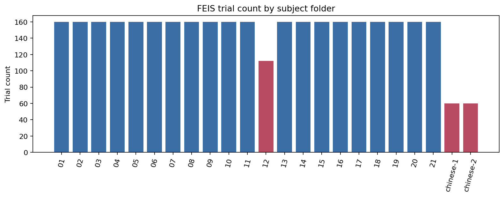
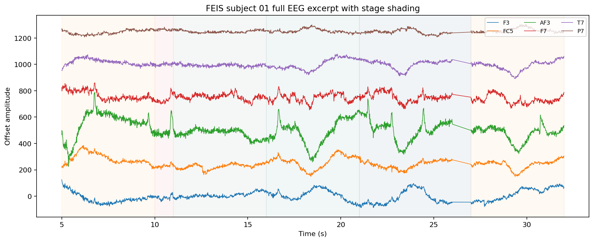
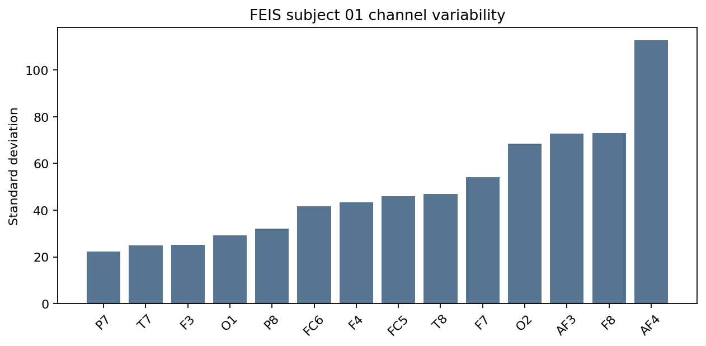
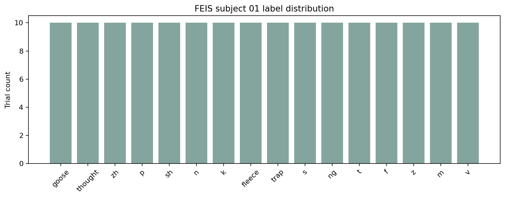

# FEIS 数据分析报告

## 数据集概览

- 数据路径：`/Users/samxie/Research/EEG-Voice/ref_github/speech_decoding/data/FEIS`
- 受试者文件夹数：`23`，其中编号英文被试 `21` 个，中文补充被试 `2` 个。
- 代表性被试：`01`
- 代表性被试 trial 数：`160`
- 每个阶段单 trial 时长：`5.0` 秒
- 通道：`F3, FC5, AF3, F7, T7, P7, O1, O2, P8, T8, F8, AF4, FC6, F4`

| Subject folder | Trial count | Unique labels | Has full_eeg |
| --- | --- | --- | --- |
| 01 | 160 | 16 | yes |
| 02 | 160 | 16 | yes |
| 03 | 160 | 16 | yes |
| 04 | 160 | 16 | yes |
| 05 | 160 | 16 | yes |
| 06 | 160 | 16 | yes |
| 07 | 160 | 16 | yes |
| 08 | 160 | 16 | yes |
| 09 | 160 | 16 | yes |
| 10 | 160 | 16 | yes |
| 11 | 160 | 16 | yes |
| 12 | 112 | 16 | yes |
| 13 | 160 | 16 | yes |
| 14 | 160 | 16 | yes |
| 15 | 160 | 16 | yes |
| 16 | 160 | 16 | yes |
| 17 | 160 | 16 | yes |
| 18 | 160 | 16 | yes |
| 19 | 160 | 16 | yes |
| 20 | 160 | 16 | yes |
| 21 | 160 | 16 | yes |
| chinese-1 | 60 | 0 | no |
| chinese-2 | 60 | 0 | no |

## 实验范式总结

直接从 `full_eeg.csv` 的 `Stage` 列可以恢复出稳定的 trial 流程：

1. `stimuli`：5 秒
2. `articulators`：1 秒
3. `thinking`：5 秒
4. `speaking`：5 秒
5. `resting`：5 秒

对代表性被试 `01` 来说，`full_eeg.csv` 中各阶段样本数为：

| Stage | Sample count |
| --- | --- |
| articulators | 40960 |
| resting | 204800 |
| speaking | 204800 |
| stimuli | 204800 |
| thinking | 204800 |

这说明 FEIS 当前下载版本并不是“原始 EEG + 独立事件文件”，而是已经按阶段切好、并把 `Epoch / Label / Stage` 写进每个时间点的 CSV 派生版。

## 单受试者分析结果

### 波形与通道

可以直接看到 `subject 01` 的 `full_eeg.csv` 在 5-32 秒区间内按阶段整齐切换，14 个通道都能连续观测到波形变化。

### Trial 与标签

- `subject 01` 共 `160` 个 trial
- `16` 个标签，每个标签 `10` 次
- 每个阶段文件中每个 epoch 长度固定为 `1280` 个采样点，即 `5.0` 秒

## 数据质量观察

- 每个英文被试大多有 160 个 trial，但 subject 12 只有 112 个 trial，是当前下载包里最明显的不规则个体。
- full_eeg.csv 的 Stage / Epoch / Label 列为每个时间点直接给出标签，对齐非常方便。
- 两个 chinese supplementary 文件夹使用了另一套列名（Channel 1-14, Event Id, Event Date, Event Duration），与英文主集 schema 不完全一致。
- 当前发布的是派生 CSV，而不是带 trigger 的原始 EEG 流；重新做更细粒度事件切分的自由度有限。

## 与研究目标的匹配度分析

| 研究任务 | 判断 |
| --- | --- |
| EEG → Phoneme Classification | Yes - strong fit |
| EEG → Word Classification | Weak - labels are mostly phoneme/syllable-level rather than a word vocabulary |
| EEG → Speech Decoding | Moderate for imagined-vs-spoken/phoneme-level decoding, weak for rich linguistic decoding |
| EEG → Speech Reconstruction | Weak foundation only |

### 结论

- **适合做 EEG → phoneme / articulatory-class classification**：标签直接写在 CSV 里，trial 切分非常干净。
- **不太适合做 word classification**：语料核心是音素/音节单位，不是词汇系统。
- **可做 imagined vs spoken decoding**：阶段边界非常明确。
- **不适合作为语音重建主数据集**：只有 14 通道、公开音频更像提示/实验资产，缺少高质量 trial-synchronous overt speech ground truth。

## 下一步研究建议

1. 先在 FEIS 上建立 imagined phoneme baseline。
2. 利用 `Stage` 和 `Epoch` 做 subject-dependent / LOSO 分类基线。
3. 不把 FEIS 作为主要语音重建数据，而把它作为模型筛选与快速迭代数据集。
