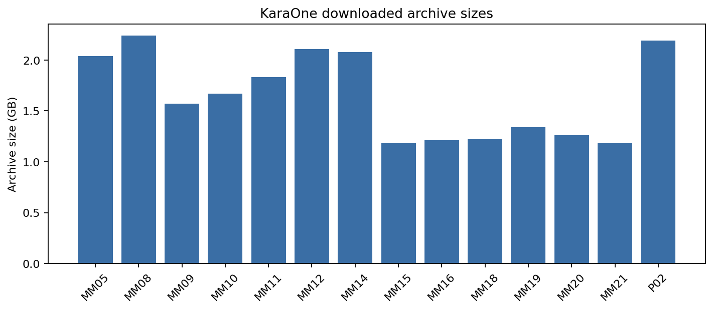
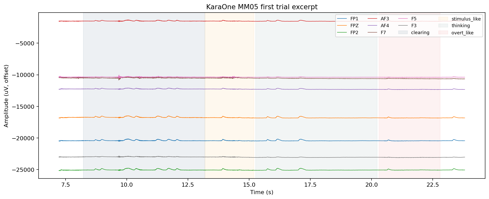
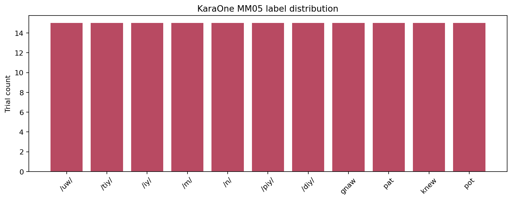
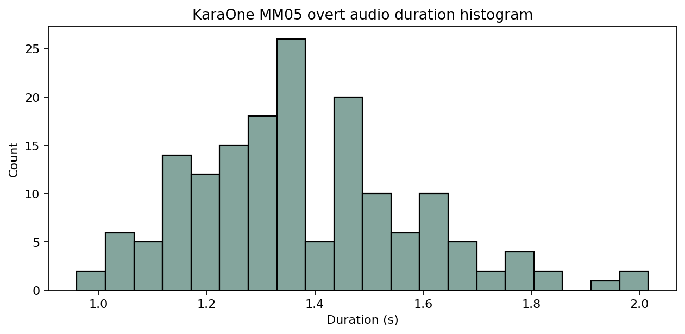

# KaraOne 数据分析报告

## 数据集概览

- 数据路径：`/Users/samxie/Research/EEG-Voice/ref_github/speech_decoding/data/KaraOne`
- 本地已下载受试者归档数：`14`
- 代表性受试者：`MM05`
- `cnt` 原始 EEG 通道数：`69`
- 采样率：`1000 Hz`
- 单受试者连续 EEG 时长：`41.29` 分钟
- 单受试者标签数：`165`
- 单受试者 overt 音频数：`165`

| Archive | Size (GB) |
| --- | --- |
| MM05 | 2.04 |
| MM08 | 2.24 |
| MM09 | 1.57 |
| MM10 | 1.67 |
| MM11 | 1.83 |
| MM12 | 2.11 |
| MM14 | 2.08 |
| MM15 | 1.18 |
| MM16 | 1.21 |
| MM18 | 1.22 |
| MM19 | 1.34 |
| MM20 | 1.26 |
| MM21 | 1.18 |
| P02 | 2.19 |

## 实验范式总结

从本地数据本身可以恢复出下面这些关键结构：

- `labels.txt`：`165` 个 trial 标签
- `epoch_inds.mat`：
  - `clearing_inds`：`165` 段，平均 `5.0` 秒左右
  - `thinking_inds`：`165` 段，平均 `4.95` 秒左右
  - `speaking_inds`：`330` 段
- `kinect_data/*.wav`：`165` 段 overt speech 音频

一个非常重要的直接数据观察是：`speaking_inds` 的数量是 `330`，而 trial 标签只有 `165`。把 `speaking_inds` 按奇偶拆开后可以看到：

| Interval family | Count | Mean duration (s) |
| --- | --- | --- |
| clearing | 165 | 4.978 |
| thinking | 165 | 4.950 |
| stimulus-like (odd speaking_inds) | 165 | 2.008 |
| overt-like (even speaking_inds) | 165 | 2.354 |

这说明数据自身支持这样一个强推断：每个 trial 至少包含一个较短的刺激/提示片段，以及一个更长的 overt speaking 片段，再加一个 imagined thinking 片段。

## 单受试者分析结果

### EEG 波形

图中展示了 `MM05` 第一个 trial 附近的连续 EEG，并按照 `epoch_inds.mat` 中的区间对 `clearing / stimulus-like / thinking / overt-like` 做了阴影标注。

### 标签与音频

| Label | Count |
| --- | --- |
| /diy/ | 15 |
| /iy/ | 15 |
| /m/ | 15 |
| /n/ | 15 |
| /piy/ | 15 |
| /tiy/ | 15 |
| /uw/ | 15 |
| gnaw | 15 |
| knew | 15 |
| pat | 15 |
| pot | 15 |

- `11` 个唯一标签
- 每个标签在 `MM05` 中都是 `15` 次
- 单条 overt 音频平均时长约 `1-2` 秒量级，具体均值 `"1.375"` 秒

## 事件与标签分析

- `labels.txt` 和 `MM05_p.txt` / `MM05.txt` 能把每个 trial 对应到具体 prompt。
- `epoch_inds.mat` 能把 trial 精确对齐到连续 EEG 的样本索引。
- **原始 Trigger 通道并不可靠**：MNE 读取 `.cnt` 后 `Trigger` 基本是常数，不能直接用它恢复事件。

这意味着：

1. **每个 trial 对应什么内容？**  
   可以，`labels.txt` / `MM05.txt` 已明确给出。
2. **是否能够定位到具体刺激？**  
   可以，用 `epoch_inds.mat` 可以定位 thinking / stimulus-like / overt-like 区段。
3. **EEG 与标签是否能够准确对应？**  
   可以，但关键依赖 `epoch_inds.mat`，而不是 `Trigger` 通道。

## 数据质量观察

- epoch_inds.mat 是真正可用于 trial 对齐的关键信息源；MNE 读出的 Trigger 通道基本为常数，不能直接拿来做事件恢复。
- 单受试者同时具备原始 EEG、预处理特征、overt audio、face animation units，模态丰富度明显强于 FEIS。
- speaking_inds 数量是 330，而 labels 只有 165；数据自身显示每个 trial 对应两个 speaking-like 片段，较短者接近刺激呈现，较长者更像 overt speaking。

## 与研究目标的匹配度分析

| 研究任务 | 判断 |
| --- | --- |
| EEG → Phoneme Classification | Yes - strong fit at phonological/syllabic prompt level |
| EEG → Word Classification | Moderate - includes four words but vocabulary is small |
| EEG → Speech Decoding | Yes - better than FEIS because EEG/audio/face are aligned per trial |
| EEG → Speech Reconstruction | Moderate foundation only |

### 结论

- **很适合做 EEG → phonological / syllabic prompt classification**：标签结构清楚，trial 对齐信息强。
- **可以做有限词汇的 word classification**：数据里确实有词级 prompt，但词表很小。
- **比 FEIS 更适合做 speech decoding**：因为它同时有连续 EEG、overt audio、面部动画和样本级区间索引。
- **具备进一步探索语音重建的基础，但不是终局数据集**：有 overt audio，能支持 overt EEG → acoustic representation；但词表小、受试者规模仍有限，真实自然语音重建上限不高。

## 下一步研究建议

1. 先把 `epoch_inds.mat + labels.txt + wav` 对齐成统一 trial 表。
2. 优先做 imagined / overt prompt classification 与 overt-to-imagined transfer。
3. 如要做声学监督，先从 log-mel / SSL speech embedding 开始，而不是直接做 waveform reconstruction。
